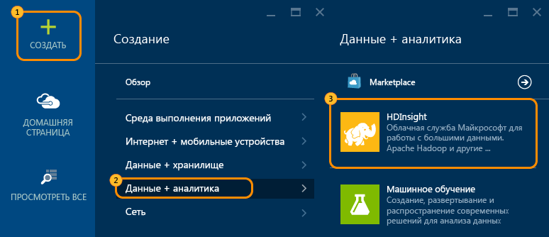
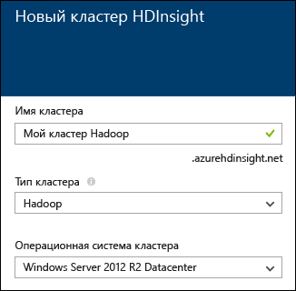

<properties
   pageTitle="Учебник по Hadoop: начало работы с Hadoop в Windows"
   description="Начало работы с Hadoop в HDInsight. Узнайте, как создавать кластеры Hadoop в Windows, выполнять запросы Hive с данными и анализировать выходные данные в Excel."
   keywords="руководство по hadoop, hadoop в windows, кластер hadoop, изучение hadoop, запрос hive"
   services="hdinsight"
   documentationCenter=""
   authors="nitinme"
   manager="paulettm"
   editor="cgronlun"
   tags="azure-portal"/>

<tags
   ms.service="hdinsight"
   ms.devlang="na"
   ms.topic="article"
   ms.tgt_pltfrm="na"
   ms.workload="big-data"
   ms.date="03/07/2016"
   ms.author="nitinme"/>

# Руководство по Hadoop: приступая к работе с Hadoop в HDInsight на платформе Windows

> [AZURE.SELECTOR]
- [На основе Windows](../hdinsight-hadoop-tutorial-get-started-windows.md)
- [На основе Linux](../hdinsight-hadoop-linux-tutorial-get-started.md)

Чтобы вы смогли понять, что такое Hadoop в Windows, и начать работу с HDInsight, в этом учебнике показано, как выполнять запрос Hive на неструктурированных данных в кластере Hadoop, а затем анализировать результаты в Microsoft Excel.

>[AZURE.NOTE] Информация, приведенная в этом документе, относится только к кластерам HDInsight под управлением Windows. Сведения о кластерах под управлением Linux см. в статье [Руководство по Hadoop. Начало работы с Hadoop в HDInsight на платформе Linux](hdinsight-hadoop-linux-tutorial-get-started.md).

Предположим, у вас есть большой набор неструктурированных данных, и необходимо выполнить запрос Hive для извлечения из них значимой информации. Именно этим мы и собираемся заняться в этом руководстве. Вот как это можно осуществить:

   ![Руководство по Hadoop: создание учетной записи; создание кластера Hadoop; отправка запроса Hive; анализ данных в Excel.][image-hdi-getstarted-flow]

Просмотрите демонстрационный видеоролик из этого учебника, чтобы узнать о кластерах Hadoop для HDInsight:

![Видео первого учебника Hadoop: отправка запроса Hive в кластере Hadoop и анализ результатов в Excel.][img-hdi-getstarted-video]

**[Просмотр учебника по Hadoop для HDInsight на YouTube](https://www.youtube.com/watch?v=Y4aNjnoeaHA&list=PLDrz-Fkcb9WWdY-Yp6D4fTC1ll_3lU-QS)**

Наряду с выпуском общедоступной версии Azure HDInsight корпорация Майкрософт выпустила также эмулятор HDInsight для Azure, ранее известный как *Microsoft HDInsight Developer Preview*. Этот продукт предназначен для сценариев разработки и поэтому поддерживает только развертывания на одном узле. Дополнительную информацию об использовании эмулятора HDInsight см. в статье [Приступая к работе с эмулятором HDInsight][hdinsight-emulator].

[AZURE.INCLUDE [delete-cluster-warning](../../includes/hdinsight-delete-cluster-warning.md)]

### Предварительные требования

Перед началом работы с этим учебником необходимо иметь следующее:

- **Подписка Azure.**. См. [Бесплатная пробная версия Azure](https://azure.microsoft.com/documentation/videos/get-azure-free-trial-for-testing-hadoop-in-hdinsight/).
- **Рабочая станция** с Office 2013 профессиональный плюс, Office 365 профессиональный плюс, Excel 2013 автономный или Office 2010 профессиональный плюс.

##Создание кластеров Hadoop

При создании кластера происходит создание вычислительных ресурсов Azure, содержащих Hadoop и соответствующие приложения. Этот раздел поможет вам создать кластер HDInsight версии 3.2. Вы также можете создать кластеры Hadoop для других версий. Инструкции см. в статье [Создание кластеров Hadoop в HDInsight][hdinsight-provision]. Дополнительную информацию о различных версиях HDInsight и их соглашениях об уровне обслуживания см. в статье [Версии компонентов НDInsight](hdinsight-component-versioning.md).

**Создание кластера Hadoop**

1. Войдите на [портал Azure](https://ms.portal.azure.com/).
2. Щелкните **Создать**, **Анализ данных**, а затем — **HDInsight**. На портале откроется колонка **Новый кластер HDInsight**.

    

3. Введите или выберите следующие значения:

	
	
	|Имя поля| Значение|
	|----------|------|
	|Имя кластера,| Уникальное имя для определения кластера|
	|Тип кластера| Для работы с этим руководством выберите **Hadoop**. |
	|Операционная система кластера| Для работы с этим руководством выберите **Windows Server 2012 R2 Datacenter**.|
	|Версия HDInsight| Для работы с этим руководством установите последнюю версию.|
	|Подписка| Выберите подписку Azure, которая будет использоваться для кластера.|
	|Группа ресурсов | Выберите существующую группу ресурсов Azure или создайте новую. Базовый кластер HDInsight содержит кластер и соответствующую учетную запись хранения, используемую по умолчанию. Их можно объединить в группу ресурсов для простоты управления.|
	|Учетные данные| Введите имя пользователя для входа в кластер и пароль. Кластер на платформе Windows может включать две учетные записи. Пользователь кластера (или пользователь HTTP) отвечает за управление кластером и отправку заданий. Дополнительно можно создать учетную запись пользователя удаленного рабочего стола (RDP) для удаленного подключения к кластеру. Если вы решили использовать удаленный рабочий стол, следует создать учетную запись пользователя RDP.|
	|Источник данных| Чтобы создать новую учетную запись хранения, используемую по умолчанию, щелкните «Создать». В качестве имени контейнера, используемого по умолчанию, используйте имя кластера. В каждом кластере HDinsight есть контейнер больших двоичных объектов, используемый по умолчанию. Он расположен в учетной записи хранения Azure. Расположение учетной записи хранения Azure, используемой по умолчанию, определяет расположение кластера HDInsight.|
	|Ценовые категории узлов| Для этого руководства используйте один или два рабочих узла (один из них является рабочим узлом по умолчанию) и ценовую категорию головного узла.|
	|Дополнительная настройка| Пропустите этот раздел.|

9. В колонке **Новый кластер HDInsight** обязательно выберите параметр **Закрепить на начальной панели**, а затем нажмите кнопку **Создать**. После этого кластер будет создан, а на начальную панель портала Azure будет добавлена его плитка. Значок указывает, что выполняется создание кластера. После завершения создания вместо него будет отображаться значок HDInsight.

	| Во время создания | Создание завершено |
	| ------------------ | --------------------- |
	|  |  |

	> [AZURE.NOTE] Обычно создание кластера занимает около 15 минут. Вы можете отслеживать процесс создания с помощью элемента на начальной панели или записи **Уведомления** в левой части страницы.

10. После завершения создания щелкните элемент кластера на начальной панели, чтобы открыть колонку кластера.

## Выполнение запроса Hive на портале
Теперь, когда вы создали кластер HDInsight, мы выполним задание Hive для запроса примера таблицы Hive. Мы используем таблицу *hivesampletable*, которая поставляется с кластерами HDInsight. Эта таблица содержит данные о производителях мобильных устройств, платформах и моделях. Запрос Hive в этой таблице извлекает данные для мобильных устройств определенного производителя.

> [AZURE.NOTE] Инструменты HDInsight для Visual Studio поставляются с пакетом SDK для Azure для .NET версии 2.5 или более поздней. Используя инструменты Visual Studio, вы можете подключить кластер HDInsight, создать таблицы Hive и выполнить Hive-запросы. Дополнительную информацию см. в статье [Начало работы со средствами HDInsight Hadoop для Visual Studio][1].

**Выполнение задания Hive с панели мониторинга кластера**

1. Войдите на [портал Azure](https://ms.portal.azure.com/).
2. Нажмите кнопку **Просмотреть все**, а затем щелкните **Кластеры HDInsight**. Вы увидите список кластеров, включая кластер, который вы только что создали (см. предыдущий раздел).
3. Щелкните имя кластера, в котором необходимо запустить задание Hive, а затем нажмите кнопку **Панель мониторинга** в верхней части колонки.
4. В новой вкладке браузера откроется веб-страница. Введите учетную запись и пароль пользователя Hadoop. Имя по умолчанию — **admin**; пароль тот же, который вы ввели при подготовке кластера.
5. На панели мониторинга щелкните вкладку **Редактор Hive**. Откроется следующая веб-страница.

	![Вкладка «Редактор Hive» на панели мониторинга кластера HDInsight.][img-hdi-dashboard]

	В верхней части страницы содержится несколько вкладок: вкладка по умолчанию — **Редактор Hive** и остальные вкладки — **Журнал заданий** и **Браузер файлов**. С помощью панели мониторинга можно отправлять запросы Hive, проверять журналы заданий Hadoop и просматривать файлы в хранилище.

	> [AZURE.NOTE] Обратите внимание, что у веб-страницы следующий URL-адрес: *&lt;имя\_кластера&gt;.azurehdinsight.net*. Таким образом, вместо открывания панели мониторинга на портале, можно открыть ее в веб-браузере, используя этот URL-адрес.

6. На вкладке **Редактор Hive** в поле **Имя запроса**ведите **HTC20**. Имя запроса представляет собой название задания. На панели запросов введите запрос Hive, как показано на рисунке:

	![Запрос, введенный в области запроса на вкладке "Редактор Hive".][img-hdi-dashboard-query-select]

4. Нажмите кнопку **Submit** (Отправить). На получение результатов уходит несколько минут. Экран обновляется каждые 30 секунд. Чтобы обновить экран, можно также нажать кнопку **Обновить**.

    ![Результаты запроса Hive, указанные в нижней части панели инструментов кластера.][img-hdi-dashboard-query-select-result]

5. Когда состояние покажет, что задание завершено, щелкните имя запроса на экране, чтобы просмотреть выходные данные. Отметьте **Время запуска задания (формат UTC)**. Оно понадобится вам позднее.

    ![Строка "Время запуска задания", указанная на вкладке "Журнал заданий" на панели мониторинга кластера HDInsight.][img-hdi-dashboard-query-select-result-output]

    На странице также отображаются **Выходные данные задания** и **Журнал заданий**. Кроме этого, можно также загрузить выходной файл (\_stdout) и файл журнала (\_stderr).

**Переход к выходному файлу**

1. На панели мониторинга кластера щелкните **Браузер файлов**.
2. Последовательно щелкните имя учетной записи, имя контейнера (совпадает с именем кластера) и **пользователь**.
3. Щелкните **admin**, а затем щелкните GUID, время последнего изменения которого немного позднее ранее отмеченного времени запуска задания. Скопируйте этот GUID. Он понадобится в следующем разделе.

   	![GUID выходного файла запроса Hive, указанный на вкладке "Браузер файлов".][img-hdi-dashboard-query-browse-output]

##Подключение к средствам бизнес-аналитики Microsoft для Excel

С помощью надстройки Power Query для Microsoft Excel можно импортировать выходные данные задания из HDInsight в Excel, где для дальнейшего анализа результатов могут использоваться инструменты бизнес-аналитики Microsoft.

Для выполнения действий из этой части учебника требуется Excel 2013 или Excel 2010.

**Скачивание Microsoft Power Query для Excel**

- Загрузите Microsoft Power Query для Excel из [Центра загрузки Майкрософт](http://www.microsoft.com/download/details.aspx?id=39379) и установите.

**Импорт данных HDInsight**

1. Откройте Excel и создайте новую книгу.
3. Щелкните меню **Power Query**, выберите **Из других источников**, а затем щелкните **Из Microsoft Azure HDInsight**.

	![Меню "Импорт" в Power Query для Excel, открытое для Azure HDInsight.][image-hdi-gettingstarted-powerquery-importdata]

3. В поле **Имя учетной записи** введите имя учетной записи хранилища больших двоичных объектов Azure, связанной с вашим кластером, и нажмите кнопку **ОК**. (Это учетная запись хранения, которую вы ранее создали в этом учебнике.)
4. В поле **Ключ учетной записи** введите ключ для учетной записи хранилища больших двоичных объектов Azure, а затем нажмите кнопку **Сохранить**.
5. В области справа дважды щелкните имя большого двоичного объекта. По умолчанию имя большого двоичного объекта совпадает с именем кластера.

6. Найдите **stdout** в столбце **Имя**. Проверьте, чтобы GUID в соответствующем столбце **Путь к папке** совпадал с GUID, который вы скопировали ранее. Совпадение предполагает, что выходные данные соответствуют отправленному заданию. Щелкните **Двоичный** в столбце слева от **stdout**.

	![Поиск выходных данных в списке содержимого по GUID.][image-hdi-gettingstarted-powerquery-importdata2]

9. В верхнем левом углу щелкните **Закрыть и загрузить** для импорта результатов задания Hive в Excel.

##Выполнение примеров

Кластер HDInsight предоставляет консоль запросов, содержащую коллекцию материалов для начала работы. Она предназначена для запуска примеров непосредственно с портала. Образцы могут использоваться для обучения работе с HDInsight путем пошагового прохождения некоторых базовых сценариев. Эти образцы поставляются вместе со всеми необходимыми компонентами, такими как данные для анализа и запросы для их запуска на основе этих данных. Дополнительную информацию о примерах в коллекции материалов для начала работы см. в статье [Изучение Hadoop с помощью коллекции материалов для начала работы с HDInsight](hdinsight-learn-hadoop-use-sample-gallery.md).

**Запуск образца**

1. На начальной панели портала Azure щелкните плитку кластера, который вы только что создали.
 
2. В колонке нового кластера щелкните **Панель мониторинга**. При появлении запроса введите имя и пароль администратора для кластера.

	
 
3. На открывшейся веб-странице выберите вкладку **Коллекция для начала работы**, а затем в категории **Решения с примерами данных** щелкните пример, который нужно выполнить. Следуйте инструкциям на веб-странице, чтобы завершить выполнение примера. В следующей таблице содержится несколько примеров, а также дополнительная информация о функциях каждого из них.

Образец | Функция
------ | ---------------
[Анализ данных датчика][hdinsight-sensor-data-sample] | С помощью этого примера можно узнать об использовании HDInsight для обработки исторических данных, полученных системами отопления, вентиляции и кондиционирования воздуха, чтобы определить системы, которые не в состоянии надежно поддерживать заданную температуру.
[Анализ журнала веб-сайта][hdinsight-weblogs-sample] | С помощью этого примера можно узнать об использовании HDInsight для анализа файлов журнала веб-сайта, позволяющего получить представление о дневной частоте посещений веб-сайта с внешних сайтов, а также сводку об ошибках веб-сайта, с которыми столкнулись пользователи.
[Анализ тенденций Twitter](hdinsight-analyze-twitter-data.md) | С помощью этого примера можно узнать об использовании HDInsight для анализа тенденций в Twitter.

##Удаление кластера

[AZURE.INCLUDE [delete-cluster-warning](../../includes/hdinsight-delete-cluster-warning.md)]

##Дальнейшие действия
Из этого руководства по Hadoop вы узнали, как создать кластер Hadoop в Windows с помощью HDInsight, выполнить запрос Hive с данными и импортировать результаты в Excel для дальнейшей обработки и графического отображения с использованием инструментов бизнес-аналитики. Дополнительную информацию см. в следующих учебниках:

- [Приступая к работе с инструментами HDInsight Hadoop для Visual Studio][1]
- [Приступая к работе с эмулятором HDInsight][hdinsight-emulator]
- [Использование хранилища больших двоичных объектов Azure с HDInsight][hdinsight-storage]
- [Администрирование HDInsight с использованием PowerShell][hdinsight-admin-powershell]
- [Отправка данных в HDInsight][hdinsight-upload-data]
- [Использование MapReduce с HDInsight][hdinsight-use-mapreduce]
- [Использование Hive с HDInsight][hdinsight-use-hive]
- [Использование Pig с HDInsight][hdinsight-use-pig]
- [Использование Oozie с HDInsight][hdinsight-use-oozie]
- [Разработка программ потоковой передачи Hadoop на C# для HDInsight][hdinsight-develop-streaming]
- [Разработка программ MapReduce на Java для HDInsight][hdinsight-develop-mapreduce]

[1]: ../HDInsight/hdinsight-hadoop-visual-studio-tools-get-started.md

[hdinsight-versions]: hdinsight-component-versioning.md

[hdinsight-provision]: hdinsight-provision-clusters.md
[hdinsight-admin-powershell]: hdinsight-administer-use-powershell.md
[hdinsight-upload-data]: hdinsight-upload-data.md
[hdinsight-use-mapreduce]: hdinsight-use-mapreduce.md
[hdinsight-use-hive]: hdinsight-use-hive.md
[hdinsight-use-pig]: hdinsight-use-pig.md
[hdinsight-use-oozie]: hdinsight-use-oozie.md
[hdinsight-storage]: hdinsight-hadoop-use-blob-storage.md
[hdinsight-emulator]: hdinsight-hadoop-emulator-get-started.md
[hdinsight-develop-streaming]: hdinsight-hadoop-develop-deploy-streaming-jobs.md
[hdinsight-develop-mapreduce]: hdinsight-develop-deploy-java-mapreduce.md
[hadoop-hdinsight-intro]: hdinsight-hadoop-introduction.md
[hdinsight-weblogs-sample]: hdinsight-hive-analyze-website-log.md
[hdinsight-sensor-data-sample]: hdinsight-hive-analyze-sensor-data.md

[azure-purchase-options]: http://azure.microsoft.com/pricing/purchase-options/
[azure-member-offers]: http://azure.microsoft.com/pricing/member-offers/
[azure-free-trial]: http://azure.microsoft.com/pricing/free-trial/
[azure-management-portal]: https://ms.portal.azure.com/
[azure-create-storageaccount]: ../storage-create-storage-account.md

[apache-hadoop]: http://go.microsoft.com/fwlink/?LinkId=510084
[apache-hive]: http://go.microsoft.com/fwlink/?LinkId=510085
[apache-mapreduce]: http://go.microsoft.com/fwlink/?LinkId=510086
[apache-hdfs]: http://go.microsoft.com/fwlink/?LinkId=510087
[hdinsight-hbase-custom-provision]: hdinsight-hbase-tutorial-get-started.md

[powershell-download]: http://go.microsoft.com/fwlink/p/?linkid=320376&clcid=0x409
[powershell-install-configure]: powershell-install-configure.md
[powershell-open]: powershell-install-configure.md#step-1-install

[img-hdi-dashboard]: ./media/hdinsight-hadoop-tutorial-get-started-windows/HDI.dashboard.png
[img-hdi-dashboard-query-select]: ./media/hdinsight-hadoop-tutorial-get-started-windows/HDI.dashboard.query.select.png
[img-hdi-dashboard-query-select-result]: ./media/hdinsight-hadoop-tutorial-get-started-windows/HDI.dashboard.query.select.result.png
[img-hdi-dashboard-query-select-result-output]: ./media/hdinsight-hadoop-tutorial-get-started-windows/HDI.dashboard.query.select.result.output.png
[img-hdi-dashboard-query-browse-output]: ./media/hdinsight-hadoop-tutorial-get-started-windows/HDI.dashboard.query.browse.output.png

[img-hdi-getstarted-video]: ./media/hdinsight-hadoop-tutorial-get-started-windows/hdi-get-started-video.png

[image-hdi-storageaccount-quickcreate]: ./media/hdinsight-hadoop-tutorial-get-started-windows/HDI.StorageAccount.QuickCreate.png
[image-hdi-clusterstatus]: ./media/hdinsight-hadoop-tutorial-get-started-windows/HDI.ClusterStatus.png
[image-hdi-quickcreatecluster]: ./media/hdinsight-hadoop-tutorial-get-started-windows/HDI.QuickCreateCluster.png
[image-hdi-getstarted-flow]: ./media/hdinsight-hadoop-tutorial-get-started-windows/HDI.GetStartedFlow.png

[image-hdi-gettingstarted-powerquery-importdata]: ./media/hdinsight-hadoop-tutorial-get-started-windows/HDI.GettingStarted.PowerQuery.ImportData.png
[image-hdi-gettingstarted-powerquery-importdata2]: ./media/hdinsight-hadoop-tutorial-get-started-windows/HDI.GettingStarted.PowerQuery.ImportData2.png
 

<!----HONumber=AcomDC_0316_2016-->