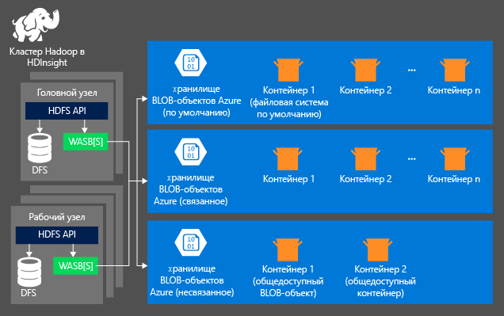
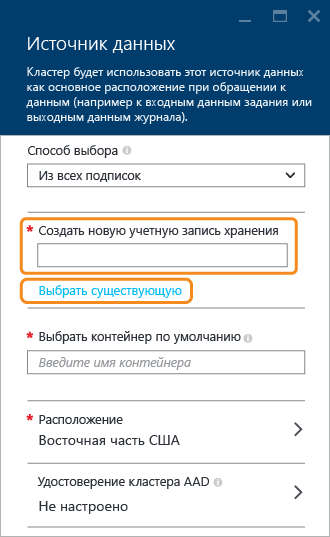

# Использование службы хранилища Azure с кластерами Azure HDInsight

Для анализа данных в кластере HDInsight можно сохранить данные в службе хранилища Azure, Azure Data Lake Store или в обоих этих хранилищах. Оба варианта хранилища позволяют безопасно и без потери пользовательских данных удалять используемые для расчетов кластеры HDInsight.

В Hadoop поддерживается концепция файловой системы по умолчанию. Файловая система по умолчанию подразумевает использование центра сертификации и схемы по умолчанию. Она также может использоваться для разрешения относительных путей. При создании кластера HDInsight в качестве файловой системы по умолчанию можно указать контейнер больших двоичных объектов в службе хранилища Azure, а в случае использования HDInsight 3.5 можно выбрать службу хранилища Azure или Azure Data Lake Store с несколькими исключениями. Дополнительные сведения о поддержке Data Lake Store в качестве связанного хранилища и хранилища по умолчанию см. в разделе [сведений о доступности для кластеров HDInsight](./hdinsight-hadoop-use-data-lake-store.md#availabilities-for-hdinsight-clusters).

Из этой статьи вы узнаете, как служба хранилища Azure работает с кластерами HDInsight. Чтобы узнать, как Data Lake Store работает с кластерами HDInsight, см. статью [Use Azure Data Lake Store with Azure HDInsight clusters](hdinsight-hadoop-use-data-lake-store.md) (Использование Azure Data Lake Store с кластерами Azure HDInsight). Дополнительные сведения о создании кластера HDInsight см. в статье [Создание кластеров Hadoop в HDInsight](hdinsight-hadoop-provision-linux-clusters.md).

Служба хранилища Azure — это надежное, универсальное решение, которое полностью интегрируется с HDInsight. HDInsight может использовать контейнер больших двоичных объектов в службе хранилища Azure в качестве файловой системы по умолчанию для кластера. С помощью интерфейса распределенной файловой системы Hadoop все компоненты HDInsight могут напрямую взаимодействовать со структурированными или неструктурированными данными, хранимыми в виде больших двоичных объектов.

> [!WARNING]
> При создании учетной записи хранения Azure доступно несколько параметров. Следующая таблица содержит сведения о параметрах, поддерживаемых для HDInsight.
> 
> | Тип учетной записи хранения | Уровень хранилища | Поддерживается HDInsight |
> | ------- | ------- | ------- |
> | Учетная запись хранения общего назначения | Стандартная | __Да__ |
> | &nbsp; | Премиум | Нет  |
> | Учетная запись хранения больших двоичных объектов | Горячий | Нет  |
> | &nbsp; | Холодный | Нет  |

Применяемый по умолчанию контейнер больших двоичных объектов не рекомендуется использовать для хранения бизнес-данных. Чтобы сократить затраты на хранение, контейнер больших двоичных объектов по умолчанию рекомендуется удалять после каждого использования. Обратите внимание, что контейнер по умолчанию содержит журналы приложений и системный журнал. Обязательно извлеките эти журналы перед удалением контейнера.

Совместное использование одного контейнера больших двоичных объектов для нескольких кластеров не поддерживается.

## Архитектура хранилища HDInsight
Следующая схема является абстрактным представлением архитектуры хранилища HDInsight с использованием службы хранилища Azure.

HDInsight предоставляет доступ к распределенной файловой системе, которая локально присоединена к вычислительным узлам. Доступ к этой файловой системе может осуществляться с использованием полного универсального кода ресурса (URI), например:

    hdfs://<namenodehost>/<path>

Кроме того, HDInsight позволяет получить доступ к данным, содержащимся в службе хранилища Azure. Синтаксис:

    wasb[s]://<containername>@<accountname>.blob.core.windows.net/<path>

Ниже приведены некоторые рекомендации для использования учетной записи хранения Azure с кластерами HDInsight.

* **Контейнеры в учетных записях хранения, подключенные к кластеру.** Поскольку имя учетной записи и ключ связываются с кластером во время создания, вы получаете полный доступ к BLOB-объектам в этих контейнерах.

* **Общедоступные контейнеры или общедоступные BLOB-объекты в учетных записях хранения, НЕ подключенные к кластеру.** Вы получаете разрешение только на чтение BLOB-объектов в контейнерах.
  
  > [!NOTE]
  > Общедоступные контейнеры позволяют получить список всех доступных в этом контейнере BLOB-объектов, а также метаданные контейнера. Общедоступные BLOB-объекты позволяют получить доступ к BLOB-объектам только при условии, что вам известен точный URL-адрес. Дополнительные сведения см. в разделе <a href="http://msdn.microsoft.com/library/windowsazure/dd179354.aspx">Ограничение доступа к контейнерам и BLOB-объектам</a>.
  > 
  > 
* **Частные контейнеры в учетных записях хранения, НЕ подключенные к кластеру.** Вы не можете получить доступ к большим двоичным объектам в контейнерах, пока не определите учетную запись хранения при отправке заданий WebHCat. Это объясняется далее в статье.

Определенные на этапе создания учетные записи хранения и их ключи хранятся в файле %HADOOP_HOME%/conf/core-site.xml на узлах кластера. По умолчанию HDInsight будет использовать учетные записи хранения, описанные в файле core-site.xml. Этот параметр можно изменить с помощью [Ambari](./hdinsight-hadoop-manage-ambari.md).

Несколько заданий WebHCat, включая Hive, MapReduce, потоковую передачу Hadoop и Pig, могут переносить описание учетных записей хранения и метаданные вместе с ними. (В настоящее время эта функция работает для Pig с учетными записями хранения, но не с метаданными). Дополнительные сведения см. в разделе [Использование кластера HDInsight с дополнительными учетными записями хранения и метахранилищами](http://social.technet.microsoft.com/wiki/contents/articles/23256.using-an-hdinsight-cluster-with-alternate-storage-accounts-and-metastores.aspx).

Большие двоичные объекты могут использоваться для хранения как структурированных, так и неструктурированных данных. В контейнерах больших двоичных объектов данные хранятся в виде пар "ключ — значение" и отсутствует иерархия каталогов. Тем не менее, в имени ключа может использоваться знак косой черты "/", чтобы оно выглядело так, будто файл хранится в структуре каталогов. Например, ключ BLOB-объекта может выглядеть следующим образом: *input/log1.txt*. На самом деле никакого каталога *input* не существует, но из-за наличия знака косой черты "/" имя ключа выглядит как путь к файлу.

## Преимущества службы хранилища Azure
Предполагаемые рабочие затраты из-за отсутствия совмещенных вычислительных ресурсов и ресурсов хранения снижаются за счет того, что создание вычислительных кластеров происходит в непосредственной близости от ресурсов учетных записей хранения в регионе Azure, в котором высокоскоростная сеть обеспечивает вычислительным узлам эффективный доступ к данным в службе хранилища Azure.

Ниже перечислены некоторые преимущества, связанные с хранением данных в службе хранилища Azure (вместо HDFS).

* **Повторное использование данных и общий доступ к данным.** Данные в файловой системе HDFS расположены внутри вычислительного кластера. Только приложения, имеющие доступ к вычислительному кластеру, могут использовать данные через API HDFS. Доступ к данным в службе хранилища Azure может осуществляться через интерфейсы API HDFS или через [интерфейсы REST API хранилища BLOB-объектов][blob-storage-restAPI]. Таким образом, для создания и использования данных можно применять больший набор приложений (включая другие кластеры HDInsight) и средств.
* **Архивация данных.** Хранение данных в службе хранилища Azure позволяет безопасно (без потери пользовательских данных) удалять используемые для расчетов кластеры HDInsight.
* **Затраты на хранение данных.** Хранение данных в файловой системе DFS в долгосрочной перспективе является более затратным, чем хранение данных в службе хранилища Azure, так как стоимость вычислительного кластера превышает стоимость службы хранилища Azure. Кроме того, поскольку данные не требуется повторно загружать при создании каждого вычислительного кластера, вы экономите также на загрузке данных.
* **Гибкое масштабирование.** Хотя HDFS и представляет собой масштабируемую файловую систему, масштаб определяется количеством узлов, создаваемых для кластера. Изменение масштаба может оказаться более сложным процессом, чем использование гибких возможностей масштабирования службы хранилища Azure, которые вы получаете автоматически.
* **Репликация.** Доступна функция георепликации службы хранилища Azure. Хотя это обеспечивает возможность географического восстановления и избыточность данных, переход в расположение геореплицированных данных при отработке отказа заметно сказывается на производительности, что может привести к дополнительным затратам. Поэтому мы рекомендуем взвешенно подходить к выбору георепликации и выбирать ее только в том случае, если ценность данных окупит дополнительные затраты.

Определенные задания и пакеты MapReduce могут создавать промежуточные результаты, которые нет нужды хранить в службе хранилища Azure. В таком случае можно выбрать хранение данных в локальной системе HDFS. На деле HDInsight использует DFS для некоторых таких промежуточных результатов в заданиях Hive и других процессах.

> [!NOTE]
> Большинство команд HDFS (например, <b>ls</b>, <b>copyFromLocal</b> и <b>mkdir</b>) по-прежнему работают приавильно. В службе хранилища Azure будет отличаться поведение только тех команд, которые относятся к стандартной реализации HDFS (под названием DFS), например <b>fschk</b> и <b>dfsadmin</b>.
> 
> 

## Создание контейнеров BLOB-объектов
Чтобы использовать большие двоичные объекты, сначала создайте [учетную запись службы хранилища Azure][azure-storage-create]. В рамках этого процесса укажите регион Azure, в котором создается учетная запись хранения. Кластер и учетная запись хранения должны размещаться в одном регионе. База данных SQL Server метахранилища Hive и база данных SQL Server метахранилища Oozie также должны располагаться в одном регионе.

Где бы ни находился созданный BLOB-объект, он принадлежит контейнеру в вашей учетной записи хранения Azure. Этим контейнером может быть существующий контейнер хранилища BLOB-объектов, созданный вне HDInsight, или контейнер, созданный для кластера HDInsight.

Стандартный контейнер больших двоичных объектов хранит сведения о кластере, включая журналы заданий. Не используйте стандартный контейнер BLOB-объектов с несколькими кластерами HDInsight. Это может привести к искажению истории заданий. С разными кластерами рекомендуется использовать разные контейнеры, размещая общие данные в связанной учетной записи хранения, которая указывается при развертывании всех соответствующих кластеров. Использовать учетную запись хранения по умолчанию не рекомендуется. Дополнительные сведения о настройке связанных учетных записей хранения см. в статье [Создание кластеров HDInsight][hdinsight-creation]. Тем не менее, вы можете повторно использовать контейнер хранения по умолчанию после удаления исходного кластера HDInsight. Для кластеров HBase можно фактически сохранить все данные и схемы таблицы HBase, создав кластер HBase с помощью контейнера больших двоичных объектов по умолчанию, который используется удаленным кластером HBase.

[!INCLUDE [secure-transfer-enabled-storage-account](../../includes/hdinsight-secure-transfer.md)]

### Использование портала Azure
При создании кластера HDInsight с помощью портала можно указать (как показано ниже) сведения об учетной записи хранения. Вы также можете указать, требуется ли дополнительная учетная запись хранения, связанная с кластером, и если требуется, то выберите тип дополнительного хранилища (Data Lake Store или еще одно хранилище Azure Storage Blob).

> [!WARNING]
> Использование дополнительной учетной записи хранения, местоположение которой отличается от местоположения кластера HDInsight, не поддерживается.

### Использование Azure PowerShell
Если у вас [установлен и настроен модуль Azure PowerShell][powershell-install], вы можете создать учетную запись хранения и контейнер, выполнив следующие действия в командной строке Azure PowerShell:

[!INCLUDE [upgrade-powershell](../../includes/hdinsight-use-latest-powershell.md)]

    $SubscriptionID = "<Your Azure Subscription ID>"
    $ResourceGroupName = "<New Azure Resource Group Name>"
    $Location = "EAST US 2"

    $StorageAccountName = "<New Azure Storage Account Name>"
    $containerName = "<New Azure Blob Container Name>"

    Connect-AzureRmAccount
    Select-AzureRmSubscription -SubscriptionId $SubscriptionID

    # Create resource group
    New-AzureRmResourceGroup -name $ResourceGroupName -Location $Location

    # Create default storage account
    New-AzureRmStorageAccount -ResourceGroupName $ResourceGroupName -Name $StorageAccountName -Location $Location -Type Standard_LRS 

    # Create default blob containers
    $storageAccountKey = (Get-AzureRmStorageAccountKey -ResourceGroupName $resourceGroupName -StorageAccountName $StorageAccountName)[0].Value
    $destContext = New-AzureStorageContext -StorageAccountName $storageAccountName -StorageAccountKey $storageAccountKey  
    New-AzureStorageContainer -Name $containerName -Context $destContext

### Использование интерфейса командной строки Azure

[!INCLUDE [use-latest-version](../../includes/hdinsight-use-latest-cli.md)]

Если у вас уже [установлен и настроен интерфейс командной строки Azure CLI](../cli-install-nodejs.md), можно использовать следующую команду для учетной записи хранения и контейнера.

    azure storage account create <storageaccountname> --type LRS

> [!NOTE]
> Параметр `--type` указывает, как будут реплицированы учетные записи хранения. Дополнительные сведения см. в статье [Репликация службы хранилища Azure](../storage/storage-redundancy.md). Не используйте хранилище, избыточное в пределах зоны (ZRS), так как оно не поддерживает страничные BLOB-объекты, файлы, таблицы и очереди.
> 
> 

Вам будет предложено указать географический регион, в котором будет создана учетная запись хранения. Вам следует создать учетную запись хранения в том же регионе, в котором планируется создание кластера HDInsight.

После создания учетной записи хранения используйте следующую команду, чтобы получить ключи учетной записи хранения:

    azure storage account keys list <storageaccountname>

Чтобы создать контейнер, используйте следующую команду:

    azure storage container create <containername> --account-name <storageaccountname> --account-key <storageaccountkey>

## Обращение к файлам в службе хранилища Azure
Схема URI для доступа к файлам в службе хранилища Azure из HDInsight:

    wasb[s]://<BlobStorageContainerName>@<StorageAccountName>.blob.core.windows.net/<path>

Эта схема URI предоставляет как незашифрованный доступ с префиксом *wasb:*, так и доступ с использованием SSL-шифрования с *wasbs*. Мы рекомендуем использовать *wasbs* всегда, когда это возможно, даже при обращении к данным, которые хранятся в том же регионе Azure.

Параметр &lt;BlobStorageContainerName&gt; определяет имя контейнера больших двоичных объектов в службе хранилища Azure.
&lt;StorageAccountName&gt; определяет имя учетной записи хранения Azure. Обязательно использовать полное доменное имя (FQDN).

Если ни &lt;BlobStorageContainerName&gt;, ни &lt;StorageAccountName&gt; не заданы, то используется файловая система по умолчанию. Для файлов в файловой системе по умолчанию можно использовать относительный или абсолютный путь. Например, для ссылки на файл *hadoop-mapreduce-examples.jar* , который поставляется с кластерами HDInsight, можно использовать один из следующих вариантов:

    wasb://mycontainer@myaccount.blob.core.windows.net/example/jars/hadoop-mapreduce-examples.jar
    wasb:///example/jars/hadoop-mapreduce-examples.jar
    /example/jars/hadoop-mapreduce-examples.jar

> [!NOTE]
> В кластерах HDInsight версий 2.1 и 1.6 файл называется <i>hadoop-examples.jar</i>.
> 
> 

&lt;path&gt; — это имя пути к файлу или каталогу HDFS. Так как контейнеры службы хранилища Azure содержат данные типа "ключ — значение", подлинная иерархическая файловая система в них отсутствует. Знак косой черты "/" в ключе BLOB-объекта интерпретируется как разделитель каталогов. Например, имя BLOB-объекта для файла *hadoop-mapreduce-examples.jar* выглядит следующим образом:

    example/jars/hadoop-mapreduce-examples.jar

> [!NOTE]
> При работе с большими двоичными объектами вне HDInsight большинство программ не распознают формат WASB и вместо этого ожидают формат базового пути, например `example/jars/hadoop-mapreduce-examples.jar`.
> 
> 

## Доступ к большим двоичным объектам 

###  С помощью Azure PowerShell
> [!NOTE]
> Команды в этом разделе показывают простой пример использования PowerShell для доступа к данным, которые хранятся в BLOB-объектах. Более полный пример, с настройкой для работы с HDInsight, находится в разделе [Средства HDInsight](https://github.com/Blackmist/hdinsight-tools).
> 
> 

Чтобы просмотреть список командлетов, связанных с BLOB-объектом, используйте следующую команду:

    Get-Command *blob*

![Список связанных с BLOB-объектами командлетов PowerShell.][img-hdi-powershell-blobcommands]

#### Отправка файлов
Ознакомьтесь со статьей [Отправка данных в HDInsight][hdinsight-upload-data].

#### Скачивание файлов
В приведенном ниже скрипте блочный BLOB-объект скачивается в текущую папку. Перед выполнением сценария измените каталог на папку, для которой у вас есть разрешения на запись.

    $resourceGroupName = "<AzureResourceGroupName>"
    $storageAccountName = "<AzureStorageAccountName>"   # The storage account used for the default file system specified at creation.
    $containerName = "<BlobStorageContainerName>"  # The default file system container has the same name as the cluster.
    $blob = "example/data/sample.log" # The name of the blob to be downloaded.

    # Use Add-AzureAccount if you haven't connected to your Azure subscription
    Connect-AzureRmAccount 
    Select-AzureRmSubscription -SubscriptionID "<Your Azure Subscription ID>"

    Write-Host "Create a context object ... " -ForegroundColor Green
    $storageAccountKey = (Get-AzureRmStorageAccountKey -ResourceGroupName $resourceGroupName -Name $storageAccountName)[0].Value
    $storageContext = New-AzureStorageContext -StorageAccountName $storageAccountName -StorageAccountKey $storageAccountKey  

    Write-Host "Download the blob ..." -ForegroundColor Green
    Get-AzureStorageBlobContent -Container $ContainerName -Blob $blob -Context $storageContext -Force

    Write-Host "List the downloaded file ..." -ForegroundColor Green
    cat "./$blob"

Указав имя группы ресурсов и имя кластера, можно использовать следующий код:

    $resourceGroupName = "<AzureResourceGroupName>"
    $clusterName = "<HDInsightClusterName>"
    $blob = "example/data/sample.log" # The name of the blob to be downloaded.

    $cluster = Get-AzureRmHDInsightCluster -ResourceGroupName $resourceGroupName -ClusterName $clusterName
    $defaultStorageAccount = $cluster.DefaultStorageAccount -replace '.blob.core.windows.net'
    $defaultStorageAccountKey = (Get-AzureRmStorageAccountKey -ResourceGroupName $resourceGroupName -Name $defaultStorageAccount)[0].Value
    $defaultStorageContainer = $cluster.DefaultStorageContainer
    $storageContext = New-AzureStorageContext -StorageAccountName $defaultStorageAccount -StorageAccountKey $defaultStorageAccountKey 

    Write-Host "Download the blob ..." -ForegroundColor Green
    Get-AzureStorageBlobContent -Container $defaultStorageContainer -Blob $blob -Context $storageContext -Force

#### Удаление файлов
    Remove-AzureStorageBlob -Container $containerName -Context $storageContext -blob $blob

#### Перечень файлов
    Get-AzureStorageBlob -Container $containerName -Context $storageContext -prefix "example/data/"

#### Выполнение запросов Hive с использованием неопределенной учетной записи хранения
В этом пример показано, как получить список папки из учетной записи хранения, которая не была задана при создании.
$clusterName = "<HDInsightClusterName>"

    $undefinedStorageAccount = "<UnboundedStorageAccountUnderTheSameSubscription>"
    $undefinedContainer = "<UnboundedBlobContainerAssociatedWithTheStorageAccount>"

    $undefinedStorageKey = Get-AzureStorageKey $undefinedStorageAccount | %{ $_.Primary }

    Use-AzureRmHDInsightCluster $clusterName

    $defines = @{}
    $defines.Add("fs.azure.account.key.$undefinedStorageAccount.blob.core.windows.net", $undefinedStorageKey)

    Invoke-AzureRmHDInsightHiveJob -Defines $defines -Query "dfs -ls wasb://$undefinedContainer@$undefinedStorageAccount.blob.core.windows.net/;"

### Использование интерфейса командной строки Azure
Чтобы просмотреть список команд, связанных с BLOB-объектом, используйте следующую команду:

    azure storage blob

**Пример использования Azure CLI для отправки файла**

    azure storage blob upload <sourcefilename> <containername> <blobname> --account-name <storageaccountname> --account-key <storageaccountkey>

**Пример использования Azure CLI для скачивания файла**

    azure storage blob download <containername> <blobname> <destinationfilename> --account-name <storageaccountname> --account-key <storageaccountkey>

**Пример использования Azure CLI для удаления файла**

    azure storage blob delete <containername> <blobname> --account-name <storageaccountname> --account-key <storageaccountkey>

**Пример использования Azure CLI для просмотра списка файлов**

    azure storage blob list <containername> <blobname|prefix> --account-name <storageaccountname> --account-key <storageaccountkey>

## Использование дополнительных учетных записей хранения

При создании кластера HDInsight укажите учетную запись хранения Azure, которую необходимо с ним связать. Помимо этой учетной записи хранения в процессе создания или после создания кластера можно добавить дополнительные учетные записи хранения из той же или других подписок Azure. Инструкции по добавлению дополнительных учетных записей хранения см. в статье [Создание кластеров Hadoop в HDInsight](hdinsight-hadoop-provision-linux-clusters.md).

> [!WARNING]
> Использование дополнительной учетной записи хранения, местоположение которой отличается от местоположения кластера HDInsight, не поддерживается.

## Дополнительная информация
Из этой статьи вы узнали, как использовать HDFS-совместимую службу хранилища Azure с HDInsight. Это позволяет создавать масштабируемые, долгосрочные решения для получения данных архивирования, а также использовать HDInsight для разблокирования информации внутри хранимых структурированных и неструктурированных данных.

Дополнительные сведения можно найти в разделе 

* [Руководство по Hadoop. Начало работы с Hadoop в HDInsight на платформе Linux][hdinsight-get-started]
* [Начало работы с Azure Data Lake Store с помощью портала Azure](../data-lake-store/data-lake-store-get-started-portal.md)
* [Отправка данных в HDInsight][hdinsight-upload-data]
* [Использование Hive с HDInsight][hdinsight-use-hive]
* [Использование Pig с HDInsight][hdinsight-use-pig]
* [Использование подписанных URL-адресов хранилища Azure для ограничения доступа к данным с помощью HDInsight][hdinsight-use-sas]

[hdinsight-use-sas]: hdinsight-storage-sharedaccesssignature-permissions.md
[powershell-install]: /powershell/azureps-cmdlets-docs
[hdinsight-creation]: hdinsight-hadoop-provision-linux-clusters.md
[hdinsight-get-started]:hadoop/apache-hadoop-linux-tutorial-get-started.md
[hdinsight-upload-data]: hdinsight-upload-data.md
[hdinsight-use-hive]:hadoop/hdinsight-use-hive.md
[hdinsight-use-pig]:hadoop/hdinsight-use-pig.md

[blob-storage-restAPI]: http://msdn.microsoft.com/library/windowsazure/dd135733.aspx
[azure-storage-create]:../storage/common/storage-create-storage-account.md

[img-hdi-powershell-blobcommands]: ./media/hdinsight-hadoop-use-blob-storage/HDI.PowerShell.BlobCommands.png
[img-hdi-quick-create]: ./media/hdinsight-hadoop-use-blob-storage/HDI.QuickCreateCluster.png
[img-hdi-custom-create-storage-account]: ./media/hdinsight-hadoop-use-blob-storage/HDI.CustomCreateStorageAccount.png  
