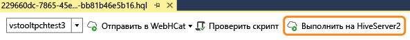
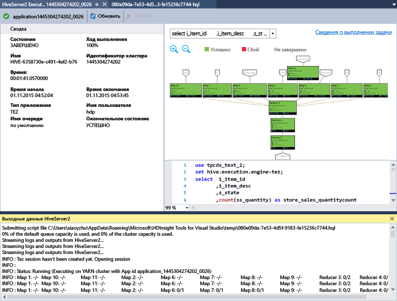

# Приступая к работе с инструментами Azure Data Lake (в HDInsight) для Visual Studio для выполнения запроса Hive
Узнайте, как использовать инструменты Data Lake (в HDInsight) для Visual Studio, чтобы подключаться к кластерам HDInsight и отправлять запросы Hive. Дополнительные сведения об использовании HDInsight см. в статьях [Введение в HDInsight][hdinsight.introduction] и [Приступая к работе с HDInsight][hdinsight.get.started]. Дополнительные сведения о подключении к кластеру Storm см. в статье [Разработка топологий для Apache Storm в HDInsight на C# с помощью Visual Studio][hdinsight.storm.visual.studio.tools].

Инструменты Data Lake для Visual Studio можно использовать как для доступа к Data Lake Analytics, так и к HDInsight.  Дополнительные сведения см. в статье [Разработка скриптов U-SQL с помощью средств Data Lake для Visual Studio](../data-lake-analytics/data-lake-analytics-data-lake-tools-get-started.md).

**Предварительные требования**

Для работы с этим руководством и использования инструментов Data Lake в Visual Studio потребуется следующее:

* Кластер Azure HDInsight. Сведения о создании кластера см. в статье [Руководство по Hadoop. Приступая к работе с Hadoop в HDInsight](hdinsight-hadoop-linux-tutorial-get-started.md).
* Рабочая станция со следующим ПО:
  
  * Windows 10, Windows 8.1, Windows 8 или Windows 7.
  * Visual Studio 2013, 2015, 2017.
    
    > [!NOTE]
    > Сейчас доступна только английская версия инструментов Data Lake для Visual Studio.
    > 
    > 

## Установка инструментов Data Lake для Visual Studio

Инструменты Data Lake устанавливаются по умолчанию для Visual Studio 2017. Вы можете установить их с помощью [установщика веб-платформы](https://www.microsoft.com/web/downloads/). Необходимо выбрать установщик, который соответствует вашей версии Visual Studio. Если на вашем компьютере не установлена программа Visual Studio, вы можете установить последние версии Visual Studio Community и пакета Azure SDK с помощью [установщика веб-платформы](https://www.microsoft.com/web/downloads/).

![Установщик веб-платформы инструментов Data Lake для Visual Studio.][1]

## Подключение к подпискам Azure
Инструменты Data Lake для Visual Studio позволяют подключаться к кластерам HDInsight, осуществлять некоторые базовые операции управления и выполнять запросы Hive.

> [!NOTE]
> Дополнительные сведения о подключении к универсальному кластеру Hadoop см. в записи блога [How to write and submit Hive queries using Visual Studio](http://blogs.msdn.com/b/xiaoyong/archive/2015/05/04/how-to-write-and-submit-hive-queries-using-visual-studio.aspx) (Создание и отправка запросов Hive с помощью Visual Studio).
> 
> 

**Подключение к подписке Azure**

1. Откройте Visual Studio.
2. В меню **Вид** выберите **Обозреватель сервера**, чтобы открыть окно обозревателя сервера.
3. Разверните пункт **Azure**, а затем — **HDInsight**.
   
   > [!NOTE]
   > Должно открыться окно **Список задач HDInsight** . Если оно не открылось, в меню **Вид** щелкните пункт **Другие окна**, а затем — **HDInsight Task List Window** (Окно списка задач HDInsight).  
   > 
   > 
4. Введите учетные данные подписки Azure и нажмите кнопку **Войти**. Это необходимо, только если подключение к подписке Azure из Visual Studio на данной рабочей станции ранее не выполнялось.
5. В обозревателе сервера отобразится список существующих кластеров HDInsight. Если кластеров нет в наличии, их можно создать с помощью портала Azure, оболочки Azure PowerShell или пакета SDK для HDInsight. Дополнительные сведения см. в статье о [создании кластеров HDInsight][hdinsight-create-clusters].
   
   ![Список кластеров в обозревателе сервера для инструментов Data Lake для Visual Studio][5]
6. Разверните кластер HDInsight. Отобразятся **базы данных Hive**, учетная запись хранения по умолчанию, связанные учетные записи хранения и **журнал службы Hadoop**. Развертывание объектов можно продолжить.

После подключения к подписке Azure можно будет выполнить следующие задачи.

**Подключение к порталу Azure из Visual Studio**

* В обозревателе сервера разверните **Azure** > **HDInsight**, щелкните правой кнопкой мыши кластер HDInsight и выберите **Manage Cluster in Azure portal** (Управление кластером на портале Azure).

**Отправка вопросов и отзывов из Visual Studio**

* В меню **Сервис** выберите **HDInsight**, а затем щелкните **Форум MSDN** (чтобы задать вопрос) или **Оставить отзыв**.

## Переход на связанные ресурсы
В обозревателе сервера отобразятся учетная запись хранения по умолчанию и все связанные учетные записи хранения. Если развернуть учетную запись хранения по умолчанию, отобразятся контейнеры в учетной записи хранения. Учетная запись хранения по умолчанию и контейнер по умолчанию отмечены. Можно просмотреть содержимое любого контейнера, щелкнув его правой кнопкой мыши.

![Список кластеров в обозревателе сервера для инструментов Data Lake для Visual Studio][2]

Когда контейнер откроется, с помощью следующих кнопок вы сможете передавать, удалять и скачивать большие двоичные объекты.

## Выполнение запроса Hive
[Apache Hive][apache.hive] — это инфраструктура хранилища данных, созданная на основе Hadoop и обеспечивающая формирование сводных данных, запросов и анализа. Инструменты Data Lake для Visual Studio поддерживают выполнение запросов Hive из Visual Studio. Дополнительные сведения о Hive см. в статье [Использование Hive с HDInsight][hdinsight.hive].

Тестирование сценария Hive для кластера HDInsight занимает много времени. Оно может длиться несколько минут или более. Инструменты Data Lake для Visual Studio могут проверить скрипт Hive локально без подключения к кластеру в оперативном режиме.

Инструменты Data Lake для Visual Studio также позволяют пользователям видеть, что находится внутри задания Hive, собирая и отображая журналы YARN определенных заданий Hive.

### Просмотр таблицы **hivesampletable**
Все кластеры HDInsight поставляются с примером таблицы Hive, которая называется *hivesampletable*. Эта таблица будет использоваться для отображения списка таблиц Hive, просмотра схемы таблиц и списка строк в таблице Hive.

**Создание списка таблиц Hive и просмотр схемы таблицы Hive**

1. В **обозревателе сервера** разверните **Azure** > **HDInsight** > кластер на ваш выбор > **Базы данных Hive** > **По умолчанию** > **hivesampletable**, чтобы просмотреть схему таблицы.
2. Щелкните **hivesampletable** правой кнопкой мыши, а затем выберите **Просмотреть первые 100 строк**. Это эквивалентно выполнению следующего запроса Hive с помощью драйвера Hive ODBC:
   
     SELECT * FROM hivesampletable LIMIT 100
   
   Подсчет строк можно настроить.
   
   ![Инструменты Data Lake. Запрос схемы Hive в HDInsight для Visual Studio][6]

### Создание таблиц Hive
Таблицу Hive можно создать с помощью графического интерфейса пользователя (GUI) или запросов Hive. Дополнительные сведения об использовании запросов Hive см. в разделе [Выполнение запросов Hive](#run.queries).

**Создание таблицы Hive**

1. В **обозревателе сервера** разверните **Azure** > **Кластеры HDInsight** > кластер HDInsight > **Базы данных Hive**, щелкните правой кнопкой мыши **По умолчанию** и выберите **Создать таблицу**.
2. Настройка таблицы.
3. Щелкните **Создать таблицу** , чтобы отправить задание для создания новой таблицы Hive.
   
    ![Инструменты Data Lake. Создание таблицы Hive с помощью инструментов HDInsight для Visual Studio][7]

### Проверка и выполнение запросов Hive
Существует два способа создания и выполнения запросов Hive:

* Создание ad-hoc-запросов
* Создание приложения Hive

**Создание, проверка и выполнение ad-hoc-запросов**

1. В **обозревателе сервера** разверните **Azure**, а затем — **Кластеры HDInsight**.
2. Правой кнопкой мыши щелкните кластер, в котором вы хотите выполнить запрос, и выберите **Написать запрос Hive**.
3. Введите запросы Hive. Обратите внимание, что редактор Hive поддерживает технологию IntelliSense. Теперь инструменты Data Lake для Visual Studio поддерживают загрузку удаленных метаданных при редактировании скрипта Hive. Например, если ввести "SELECT * FROM", IntelliSense отобразит все предлагаемые имена таблиц. Если указано имя таблицы, IntelliSense выведет список имен столбцов. Эти инструменты поддерживают почти все инструкции, подзапросы и встроенные определяемые пользователем функции Hive DML.
   
    ![Инструменты Data Lake. Intellisense в инструментах HDInsight для Visual Studio][13]
   
    ![Инструменты Data Lake. Intellisense в инструментах HDInsight для Visual Studio][14]
   
   > [!NOTE]
   > Предлагаются только метаданные кластеров, выбранных на панели инструментов HDInsight.
   > 
   > 
4. (Необязательно.) Щелкните **Проверить сценарий** , чтобы проверить сценарий на синтаксические ошибки.
   
    ![Инструменты Data Lake. Локальная проверка в инструментах Data Lake для Visual Studio][10]
5. Просто щелкните **Отправить** или выполните **расширенную отправку**. С помощью расширенной отправки можно настроить **имя задания**, **аргументы**, **дополнительные конфигурации** и **каталог состояния** скрипта.
   
    ![Запрос Hadoop Hive в HDInsight][9]
   
    После отправки задания отобразится окно **Сводка для задания Hive** .
   
    ![Сводка запроса Hadoop Hive в HDInsight][8]
6. Используйте кнопку **Обновить**, чтобы обновлять состояние задания, пока оно не сменится на **Завершено**.
7. Перейдите по ссылкам внизу, чтобы просмотреть **запрос задания**, **выходные данные задания**, **журнал задания** или **журнал YARN**.

**Создание и запуск решения Hive**

1. В меню **Файл** выберите команду **Создать**, а затем — **Проект**.
2. Выберите **HDInsight** в левой области окна, **Приложение Hive** в средней области, введите свойства и нажмите кнопку **ОК**.
   
    ![Инструменты Data Lake. Создание проекта Hive с помощью инструментов HDInsight для Visual Studio][11]
3. В **обозревателе решений** дважды щелкните файл **Script.hql**, чтобы открыть его.
4. Для проверки скрипта Hive можно нажать кнопку **Validate Script** (Проверить скрипт) или щелкнуть правой кнопкой мыши скрипт в редакторе Hive и выбрать пункт **Validate Script** (Проверить скрипт) в контекстном меню.

### Просмотр заданий Hive
Для заданий Hive можно просмотреть запросы задания, выходные данные задания, журнал задания и журналы YARN. Дополнительную информацию см. на предыдущем снимке экрана.

Самая последняя версия средств позволяет увидеть, что находится внутри заданий Hive, собирая и отображая журналы YARN. Журнал YARN может помочь исследовать проблемы производительности. Дополнительные сведения о том, как HDInsight собирает журналы YARN, см. в статье [Программный доступ к журналам приложений HDInsight][hdinsight.access.application.logs].

**Просмотр заданий Hive**

1. В **обозревателе сервера** разверните **Azure**, а затем — **HDInsight**.
2. Щелкните кластер HDInsight правой кнопкой мыши, а затем выберите пункт **Отобразить задания**. Появится список заданий Hive, запущенных на кластере.
3. Выберите задание из списка заданий, а затем используйте окно **Hive Job Summary** (Сводка по заданию Hive), чтобы открыть **запрос задания**, **выходные данные задания**, **журнал задания** или **журнал YARN**.
   
    ![Инструменты Data Lake. Просмотр заданий Hive с помощью инструментов HDInsight для Visual Studio][12]

### Быстрый путь выполнения Hive с помощью HiveServer2
> [!NOTE]
> Эта функция работает только с кластером HDInsight 3.2 и более поздних версий.
> 
> 

Инструменты Data Lake используются для отправки заданий Hive через интерфейс [WebHCat](https://cwiki.apache.org/confluence/display/Hive/WebHCat) (также известен как Templeton). Возврат сведений о задании и сведений об ошибках занимает много времени.
Чтобы решить эту проблему производительности, инструменты Data Lake выполняют задания Hive непосредственно в кластере через HiveServer2, что позволяет обходить RDP/SSH.
Помимо повышения производительности пользователи также могут просматривать диаграммы выполнения задач Hive в Tez, а также сведения о задаче.

При использовании кластера HDInsight 3.2 или более поздней версии будет отображена кнопка **Execute via HiveServer2** (Выполнить через HiveServer2):

Кроме того, вы можете просматривать журналы, отображаемые в режиме реального времени, а также графики задания при выполнении запроса Hive в Tez.

**Разница между выполнением запросов через HiveServer2 и отправкой запросов через WebHCat**

Выполнение запросов через HiveServer2 имеет множество преимуществ в отношении производительности, однако есть и ряд ограничений. Некоторые ограничения делают невозможным использование этой функции в рабочей среде. Различия показаны в следующей таблице.

|  | Выполнение через HiveServer2 | Отправка через WebHCat |
| --- | --- | --- |
| Выполнение запросов |Устраняет временные затраты на сервере WebHCat (который запускает задание MapReduce с именем TempletonControllerJob). |Так как запрос выполняется через WebHCat, WebHCat запускает задание MapReduce, что вызывает дополнительную задержку. |
| Потоковая передача журналов |Практически в режиме реального времени. |Журналы выполнения заданий доступны, только если задание завершено. |
| Просмотр журнала заданий |Если запрос выполняется через HiveServer2, его журнал заданий (выходные данные заданий) не сохраняется. Приложение можно просмотреть в пользовательском интерфейсе YARN с ограниченными сведениями. |Если запрос выполняется через WebHCat, его журнал заданий (выходные данные задания) сохраняется. Его можно просматривать с помощью Visual Studio, SDK HDInsight или PowerShell. |
| Закрытие окна |Выполнение через HiveServer2 является синхронной операцией, поэтому окна должны оставаться открытыми. Если закрыть окна, выполнение запроса будет отменено. |Отправка через WebHCat является асинхронной операцией, поэтому вы можете отправить запрос через WebHCat и закрыть Visual Studio. Вы можете вернуться и просмотреть результаты в любое время. |

### Диаграмма выполнения задания Tez Hive
Инструменты Data Lake поддерживают отображение графиков производительности для заданий Hive, выполняемых механизмом выполнения Tez. Сведения о том, как включить Tez, см. в статье об [использовании Hive в HDInsight][hdinsight.hive]. После отправки в Visual Studio задания Hive Visual Studio отобразит диаграмму по завершении задания.  Возможно, вам потребуется нажать кнопку **Обновить**, чтобы получить последние сведения о состоянии задания.

> [!NOTE]
> Эта функция доступна для кластеров HDInsight начиная с версии 3.2.4.593. Она работает только для выполненных заданий (если задание отправлено через WebHCat). Показанная ниже диаграмма будет отображаться, если запрос выполняется через HiveServer2. Она работает для кластеров под управлением Windows и Linux.
> 
> 

Функция просмотра операторов Hive добавлена в этот выпуск, что позволит упростить понимание запросов Hive. Чтобы увидеть все операторы для вершины графика, просто дважды щелкните вершину графика задания. Чтобы просмотреть подробную информацию о конкретном операторе, наведите на него указатель.

### Представление выполнения задачи для заданий Hive в Tez
Представление выполнения задачи для заданий Hive в Tez позволяет просматривать подробные и структурированные сведения о заданиях Hive. При наличии проблем с производительностью представление позволяет получить подробную информацию. Например, вы можете узнать, как обрабатывается каждая задача, а также получить подробные сведения о каждой задаче (чтение и запись данных, время запланированного запуска и завершения и т. д.). Эти наглядные сведения помогут вам изменить конфигурацию задания или архитектуру системы.

## Запуск сценариев Pig
Инструменты Data Lake для Visual Studio поддерживают создание и отправку скриптов Pig в кластеры HDInsight. Пользователи могут создать проект Pig из шаблона и затем отправить сценарий в кластеры HDInsight.

## Отзывы и известные проблемы
* Сейчас результаты HiveServer2 отображаются как обычный текст, что не совсем удобно. Мы работаем над решением этой проблемы.
* Если результаты начинаются со значения NULL, они не отображаются. Мы исправили эту ошибку. Если наличие такой проблемы блокирует вашу работу, свяжитесь с нами по электронной почте или обратитесь в службу поддержки.
* Сценарий HQL, созданный Visual Studio, кодируется в зависимости от параметров региона пользователя. Он может выполняться неправильно, если пользователь отправит сценарий в кластер в виде двоичного файла.

## Дальнейшие действия
Из этой статьи вы узнали, как подключаться к кластерам HDInsight из Visual Studio, используя инструменты Data Lake (в HDInsight) и выполнять запросы Hive. Дополнительные сведения можно найти в разделе 

* [Использование Hive в HDInsight][hdinsight.hive]
* [Приступая к работе с Hadoop в HDInsight][hdinsight.get.started]
* [Отправка заданий Hadoop в HDInsight][hdinsight.submit.jobs]
* [Анализ данных Twitter с помощью Hadoop в HDInsight][hdinsight.analyze.twitter.data]

<!--Anchors-->
[Installation]: #installation
[Connect to your Azure subscription]: #connect-to-your-azure-subscription
[Navigate the linked resources]: #navigate-the-linked-resources
[Run Hive queries]: #run-hive-queries
[Next steps]: #next-steps

<!--Image references-->
[1]: ./media/hdinsight-hadoop-visual-studio-tools-get-started/hdinsight.visual.studio.tools.wpi.png
[2]: ./media/hdinsight-hadoop-visual-studio-tools-get-started/hdinsight.visual.studio.tools.linked.resources.png
[5]: ./media/hdinsight-hadoop-visual-studio-tools-get-started/hdinsight.visual.studio.tools.server.explorer.png
[6]: ./media/hdinsight-hadoop-visual-studio-tools-get-started/hdinsight.visual.studio.tools.hive.schema.png
[7]: ./media/hdinsight-hadoop-visual-studio-tools-get-started/hdinsight.visual.studio.tools.create.hive.table.png
[8]: ./media/hdinsight-hadoop-visual-studio-tools-get-started/hdinsight.visual.studio.tools.run.hive.job.summary.png
[9]: ./media/hdinsight-hadoop-visual-studio-tools-get-started/hdinsight.visual.studio.tools.submit.jobs.advanced.png
[10]: ./media/hdinsight-hadoop-visual-studio-tools-get-started/hdinsight.visual.studio.tools.validate.hive.script.png
[11]: ./media/hdinsight-hadoop-visual-studio-tools-get-started/hdinsight.visual.studio.tools.new.hive.project.png
[12]: ./media/hdinsight-hadoop-visual-studio-tools-get-started/hdinsight.visual.studio.tools.view.hive.jobs.png
[13]: ./media/hdinsight-hadoop-visual-studio-tools-get-started/hdinsight.visual.studio.tools.intellisense.table.names.png
[14]: ./media/hdinsight-hadoop-visual-studio-tools-get-started/hdinsight.visual.studio.tools.intellisense.column.names.png

<!--Link references-->
[hdinsight-create-clusters]: hdinsight-hadoop-provision-linux-clusters.md
[hdinsight.introduction]: hdinsight-hadoop-introduction.md
[hdinsight.get.started]: hdinsight-hadoop-linux-tutorial-get-started.md
[hdinsight.hive]: hdinsight-use-hive.md
[hdinsight.submit.jobs]: hdinsight-submit-hadoop-jobs-programmatically.md
[hdinsight.analyze.twitter.data]: hdinsight-analyze-twitter-data.md
[hdinsight.storm.visual.studio.tools]: hdinsight-storm-develop-csharp-visual-studio-topology.md
[hdinsight.access.application.logs]: hdinsight-hadoop-access-yarn-app-logs.md

[apache.hive]: http://hive.apache.org

