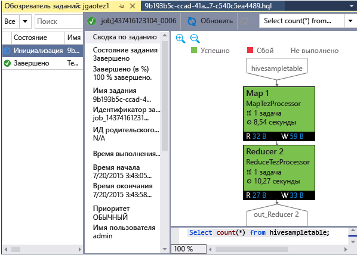

<properties
	pageTitle="Узнайте, как использовать инструменты Hadoop для Visual Studio для HDInsight | Microsoft Azure"
	description="Узнайте, как установить и использовать инструменты Hadoop для Visual Studio для HDInsight, чтобы подключиться к кластеру Hadoop и выполнить запрос Hive."
	services="HDInsight"
	documentationCenter=""
	authors="mumian"
	manager="paulettm"
	editor="cgronlun"/>

<tags
	ms.service="hdinsight"
	ms.devlang="na"
	ms.topic="get-started-article"
	ms.tgt_pltfrm="na"
	ms.workload="big-data"
	ms.date="07/21/2015"
	ms.author="jgao"/>

# Приступая к работе с инструментами Hadoop в Visual Studio для HDInsight для выполнения запроса Hive

Узнайте, как использовать средства HDInsight для Visual Studio, чтобы подключаться к кластерам HDInsight и отправлять запросы Hive. Дополнительную информацию об использовании HDInsight см. в разделах [Введение в HDInsight][hdinsight.introduction] и [Приступая к работе с HDInsight][hdinsight.get.started]. Дополнительную информацию о подключении к кластеру Storm см. в статье [Разработка топологий для Apache Storm в HDInsight на C# с помощью Visual Studio][hdinsight.storm.visual.studio.tools].

>[AZURE.NOTE]В последнем выпуске появились новые функции, например поддержка редактора Hive, локальная проверка сценариев Hive и доступ к журналам YARN.

## Предварительные требования

Для работы с этим учебником и использования инструментов Hadoop в Visual Studio потребуется следующее:

- Кластер Azure HDInsight: для выполнения инструкций этого раздела подойдет кластер под управлением Linux или Windows. Информация о создании кластера приведена в одном из следующих разделов.

	- [Приступая к работе с HDInsight под управлением Linux](hdinsight-hadoop-linux-tutorial-get-started.md)
	- [Приступая к работе с HDInsight под управлением Windows](hdinsight-hadoop-tutorial-get-started-windows.md)

- Рабочая станция со следующим ПО:

	- Windows 8.1, Windows 8 или Windows 7;
	- Одна из следующих версий Visual Studio:
		- Visual Studio 2012 Professional, Premium или Ultimate с [обновлением 4](http://www.microsoft.com/download/details.aspx?id=39305);
		- Visual Studio 2013 Community, Professional, Premium или Ultimate с [обновлением 4](https://www.microsoft.com/download/details.aspx?id=44921);
		- Visual Studio 2015 (Community/Enterprise)

	>[AZURE.NOTE]Сейчас доступна только английская версия инструментов HDInsight для Visual Studio.

## Установка средств HDInsight для Visual Studio

Инструменты HDInsight для Visual Studio поставляются с пакетом SDK для Microsoft Azure для .NET версии 2.5.1 или более поздней. Их можно установить с помощью [установщика веб-платформы](http://go.microsoft.com/fwlink/?LinkId=255386). Необходимо выбрать установщик, который соответствует вашей версии Visual Studio. При установке пакета инструментов Hadoop будет установлен драйвер Microsoft Hive ODBC (32-разрядный и 64-разрядный).

![Инструменты Hadoop: установщик веб-платформы инструментов HDInsight для Visual Studio.][1]

>[AZURE.NOTE]Если у вас установлено приложение Visual Studio 2015 или 2012 и пакет SDK для Azure 2.5, необходимо вручную удалить старую версию перед установкой самой новой версии. Visual Studio 2013 поддерживает прямое обновление.

## Подключение к подпискам Azure
Средства HDInsight для Visual Studio позволяют подключаться к кластерам HDInsight, осуществлять некоторые базовые операции управления и выполнять запросы Hive.

>[AZURE.NOTE]Дополнительную информацию об использовании эмулятора HDInsight см. в разделе [Приступая к работе с эмулятором HDInsight](../hdinsight-get-started-emulator.md/#vstools).

>[AZURE.NOTE]Дополнительную информацию о подключении к универсальному кластеру Hadoop (предварительная версия) см. в разделе [Создание и отправка запросов Hive с помощью Visual Studio](http://blogs.msdn.com/b/xiaoyong/archive/2015/05/04/how-to-write-and-submit-hive-queries-using-visual-studio.aspx).

**Подключение к подписке Azure**

1.	Откройте Visual Studio.
2.	В меню **Вид** выберите **Обозреватель сервера**, чтобы открыть окно обозревателя сервера.
3.	Разверните пункт **Azure**, а затем — **HDInsight**.

	>[AZURE.NOTE]Должно открыться окно **Список задач HDInsight**. Если окно не открылось, щелкните **Другие окна** в меню **Вид** и выберите **Окно списка задач HDInsight**.  
4.	Введите учетные данные подписки Azure и нажмите кнопку **Войти**. Это необходимо, только если подключение к подписке Azure из Visual Studio на данной рабочей станции ранее не выполнялось.
5.	В обозревателе серверов будет представлен список существующих кластеров HDInsight. Если кластеров нет в наличии, их можно подготовить с помощью портала Azure, Azure PowerShell или пакета SDK для HDInsight. Дополнительную информацию см. в разделе [Подготовка кластеров HDInsight][hdinsight-provision].

	![Инструменты Hadoop: список кластеров в обозревателе сервера для инструментов HDInsight для Visual Studio][5]
6.	Разверните кластер HDInsight. Отобразятся **базы данных Hive**, учетная запись хранения по умолчанию, связанные учетные записи хранения и **журнал службы Hadoop**. Развертывание объектов можно продолжить.

После подключения к подписке Azure можно будет выполнить следующее:

**Подключение к порталу Azure из Visual Studio**

- В обозревателе сервера разверните **Azure** > **HDInsight**, правой кнопкой мыши щелкните кластер HDInsight и выберите **Управление кластером на портале Azure**.

**Отправка вопросов и отзывов из Visual Studio**

- В меню **Сервис** выберите **HDInsight** и затем щелкните **Форум MSDN** (чтобы задать вопрос) или **Оставить отзыв**.

## Переход на связанные ресурсы

В обозревателе сервера отобразятся учетная запись хранения по умолчанию и все связанные учетные записи хранения. Если развернуть учетную запись хранения по умолчанию, отобразятся контейнеры в учетной записи хранения. Учетная запись хранения по умолчанию и контейнер по умолчанию отмечены. Можно просмотреть содержимое любого контейнера, щелкнув его правой кнопкой мыши.

![Список кластеров в обозревателе сервера для инструментов HDInsight для Visual Studio][2]

## Выполнение запроса Hive
[Apache Hive][apache.hive] — это инфраструктура хранилища данных, созданная на основе Hadoop и обеспечивающая формирование сводных данных, запросов и анализа. Средства HDInsight для Visual Studio поддерживают выполнение запросов Hive из Visual Studio. Дополнительные сведения о Hive см. в разделе [Использование Hive с HDInsight][hdinsight.hive].

Тестирование сценария Hive для кластера HDInsight занимает много времени. Оно может длиться несколько минут или более. Инструменты HDInsight для Visual Studio могут проверить сценарий Hive локально без подключения к кластеру в оперативном режиме.

Инструменты HDInsight для Visual Studio также позволяют пользователям видеть, что находится внутри задания Hive, собирая и отображая журналы YARN определенных заданий Hive.

###Просмотр таблицы **hivesampletable**
Все кластеры HDInsight поставляются с примером таблицы Hive, которая называется *hivesampletable*. Данная таблица будет использоваться для отображения списка таблиц Hive, просмотра схемы таблиц и списка строк в таблице Hive.

**Создание списка таблиц Hive и просмотр схемы таблицы Hive**

1.	В **обозревателе сервера** разверните **Azure** > **HDInsight** > кластер на ваш выбор > **Базы данных Hive** > **По умолчанию** > **hivesampletable**, чтобы просмотреть схему таблицы.
4.	Щелкните **hivesampletable** правой кнопкой мыши, а затем — **Просмотреть первые 100 строк** для просмотра строк. Это эквивалентно выполнению следующего запроса Hive с помощью драйвера Hive ODBC:

		SELECT * FROM hivesampletable LIMIT 100

	Подсчет строк можно настроить.

	![Инструменты Hadoop: запрос схемы Hive в HDInsight для Visual Studio][6]

###Создание таблиц Hive

Таблицу Hive можно создать с помощью графического интерфейса пользователя (GUI) или запросов Hive. Дополнительную информацию об использовании запросов Hive см. в разделе [Выполнение запросов Hive](#run.queries).

**Создание таблицы Hive**

1. В **обозревателе сервера** разверните **Azure** > **Кластеры HDInsight** > кластер HDInsight > **Базы данных Hive**, щелкните правой кнопкой мыши **По умолчанию**, а затем щелкните **Создать таблицу**.
2. Настройка таблицы.
3. Щелкните **Создать таблицу**, чтобы отправить задание для создания новой таблицы Hive.

	![Инструменты Hadoop: создание таблицы Hive с помощью инструментов HDInsight для Visual Studio][7]

###Проверка и выполнение запросов Hive
Существует два способа создания и выполнения запросов Hive:

- Создание ad-hoc-запросов
- Создание приложения Hive

**Создание, проверка и выполнение ad-hoc-запросов**

1. В **обозревателе сервера** разверните **Azure**, а затем — **Кластеры HDInsight**.
2. Правой кнопкой мыши щелкните кластер, в котором вы хотите выполнить запрос, и выберите **Написать запрос Hive**.
3. Введите запросы Hive. Обратите внимание, что редактор Hive поддерживает технологию IntelliSense. Теперь инструменты HDInsight для Visual Studio поддерживают загрузку удаленных метаданных при редактировании сценария Hive. Например при вводе «SELECT * FROM» IntelliSense отображает все предлагаемые имена таблиц. Если указано имя таблицы, IntelliSense выведет список имен столбцов. Средство поддерживает почти все инструкции, подзапросы и встроенные определяемые пользователем функции Hive DML. 

	![Инструменты Hadoop: Intellisense в инструментах HDInsight для Visual Studio][13]

	![Инструменты Hadoop: Intellisense в инструментах HDInsight для Visual Studio][14]

	> [AZURE.NOTE]Предлагаются только метаданные кластеров, выбранных на панели инструментов HDInsight.
4. (Необязательно.) Щелкните **Проверить сценарий**, чтобы проверить сценарий на синтаксические ошибки.

	![Инструменты Hadoop: локальная проверка в инструментах HDInsight для Visual Studio][10]

4. Щелкните **Отправка** или **Отправка (расширенная)**. С помощью расширенной отправки можно настроить **Имя задания**, **Аргументы**, **Дополнительные конфигурации** и **Каталог состояния** сценария:

	![Запрос Hadoop Hive в HDInsight][9]

	После отправки задания появится окно **Сводка по заданию Hive**.

	![Сводка запроса Hadoop Hive в HDInsight][8]
5. Используйте кнопку **Обновить**, чтобы обновлять состояние задания, пока оно не сменится на **Завершено**.
6. Перейдите по ссылкам внизу, чтобы просмотреть **запрос задания**, **выходные данные задания**, **журнал задания** или **журнал YARN**.

**Создание и запуск решения Hive**

1. В меню **ФАЙЛ** выберите команду **Создать**, а затем — **Проект**.
2. Выберите **HDInsight** в левой области окна, **Приложение Hive** в средней области, введите свойства и нажмите кнопку **ОК**.

	![Инструменты Hadoop: создание проекта Hive с помощью инструментов HDInsight для Visual Studio][11]
3. В **обозревателе решений** дважды щелкните файл **Script.hql**, чтобы открыть его.
4. Для проверки сценария Hive можно нажать кнопку **Проверить сценарий** или щелкнуть правой кнопкой мыши сценарий в редакторе Hive и выбрать пункт **Проверить сценарий** в контекстном меню.

###Просмотр заданий Hive
Для заданий Hive можно просмотреть запросы задания, выходные данные задания, журнал задания и журналы YARN. Дополнительную информацию см. на предыдущем снимке экрана.

Самая последняя версия инструмента позволяет увидеть, что находится внутри заданий Hive, собирая и отображая журналы YARN. Журнал YARN может помочь исследовать проблемы производительности. Дополнительная информация о том, как HDInsight собирает журналы YARN, см. в статье [Программный доступ к журналам приложений HDInsight][hdinsight.access.application.logs].

**Просмотр заданий Hive**

1. В **обозревателе сервера** разверните **Azure**, а затем — **HDInsight**.
2. Щелкните правой кнопкой мыши кластер HDInsight, а затем — **Просмотр заданий Hive**. Появится список заданий Hive, запущенных на кластере.
3. Выберите задание из списка заданий, а затем используйте окно **Сводка по заданию Hive**, чтобы открыть **запрос задания**, **выходные данные задания**, **журнал задания** или **журнал YARN**.

	![Инструменты Hadoop: просмотр заданий Hive с помощью инструментов HDInsight для Visual Studio][12]

### Диаграмма выполнения задания Tez Hive

Средства Visual Studio HDInsight поддерживают отображение диаграмм производительности для заданий Hive, выполняемых механизмом выполнения Tez. Сведения о включении Tez см. в статье [Использование Hive в HDInsight][hdinsight.hive]. После отправки в Visual Studio задания Hive Visual Studio отобразит диаграмму по завершении задания. Может потребоваться нажать кнопку обновления для получения последнего состояния задания.

> [AZURE.NOTE]Эта функция доступна только для кластера HDInsight версии выше 3.2.4.593 и может работать только для выполненных заданий. Она работает для кластеров на основе Windows и на основе Linux.

## Запуск сценариев Pig

Средства HDInsight для Visual Studio поддерживают создание и отправку сценариев Pig в кластеры HDInsight. Пользователи могут создать проект Pig из шаблона и затем отправить сценарий в кластеры HDInsight.

## Дальнейшие действия
В этой статье вы узнали, как подключаться к кластерам HDInsight из Visual Studio, использовать пакет инструментов Hadoop и выполнять запросы Hive. Дополнительные сведения см. в разделе:

- [Использование Hive в HDInsight][hdinsight.hive]
- [Приступая к работе с Hadoop в HDInsight][hdinsight.get.started]
- [Отправка заданий Hadoop в HDInsight][hdinsight.submit.jobs]
- [Анализ данных Twitter с помощью Hadoop в HDInsight][hdinsight.analyze.twitter.data]

<!--Anchors-->
[Installation]: #installation
[Connect to your Azure subscription]: #connect-to-your-azure-subscription
[Navigate the linked resources]: #navigate-the-linked-resources
[Run Hive queries]: #run-hive-queries
[Next steps]: #next-steps

<!--Image references-->
[1]: ./media/hdinsight-hadoop-visual-studio-tools-get-started/hdinsight.visual.studio.tools.wpi.png
[2]: ./media/hdinsight-hadoop-visual-studio-tools-get-started/hdinsight.visual.studio.tools.linked.resources.png
[5]: ./media/hdinsight-hadoop-visual-studio-tools-get-started/hdinsight.visual.studio.tools.server.explorer.png
[6]: ./media/hdinsight-hadoop-visual-studio-tools-get-started/hdinsight.visual.studio.tools.hive.schema.png
[7]: ./media/hdinsight-hadoop-visual-studio-tools-get-started/hdinsight.visual.studio.tools.create.hive.table.png
[8]: ./media/hdinsight-hadoop-visual-studio-tools-get-started/hdinsight.visual.studio.tools.run.hive.job.summary.png
[9]: ./media/hdinsight-hadoop-visual-studio-tools-get-started/hdinsight.visual.studio.tools.submit.jobs.advanced.png
[10]: ./media/hdinsight-hadoop-visual-studio-tools-get-started/hdinsight.visual.studio.tools.validate.hive.script.png
[11]: ./media/hdinsight-hadoop-visual-studio-tools-get-started/hdinsight.visual.studio.tools.new.hive.project.png
[12]: ./media/hdinsight-hadoop-visual-studio-tools-get-started/hdinsight.visual.studio.tools.view.hive.jobs.png
[13]: ./media/hdinsight-hadoop-visual-studio-tools-get-started/hdinsight.visual.studio.tools.intellisense.table.names.png
[14]: ./media/hdinsight-hadoop-visual-studio-tools-get-started/hdinsight.visual.studio.tools.intellisense.column.names.png

<!--Link references-->
[hdinsight-provision]: ../hdinsight/hdinsight-provision-clusters.md
[hdinsight.introduction]: ../hdinsight-introduction.md
[hdinsight.get.started]: ../hdinsight-get-started.md
[hdinsight.hive]: ../hdinsight/hdinsight-use-hive.md
[hdinsight.submit.jobs]: ../hdinsight/hdinsight-submit-hadoop-jobs-programmatically.md
[hdinsight.analyze.twitter.data]: ../hdinsight/hdinsight-analyze-twitter-data.md
[hdinsight.storm.visual.studio.tools]: ../hdinsight/hdinsight-storm-develop-csharp-visual-studio-topology.md
[hdinsight.access.application.logs]: ../hdinsight/hdinsight-hadoop-access-yarn-app-logs.md

[apache.hive]: http://hive.apache.org

<!---HONumber=August15_HO6-->