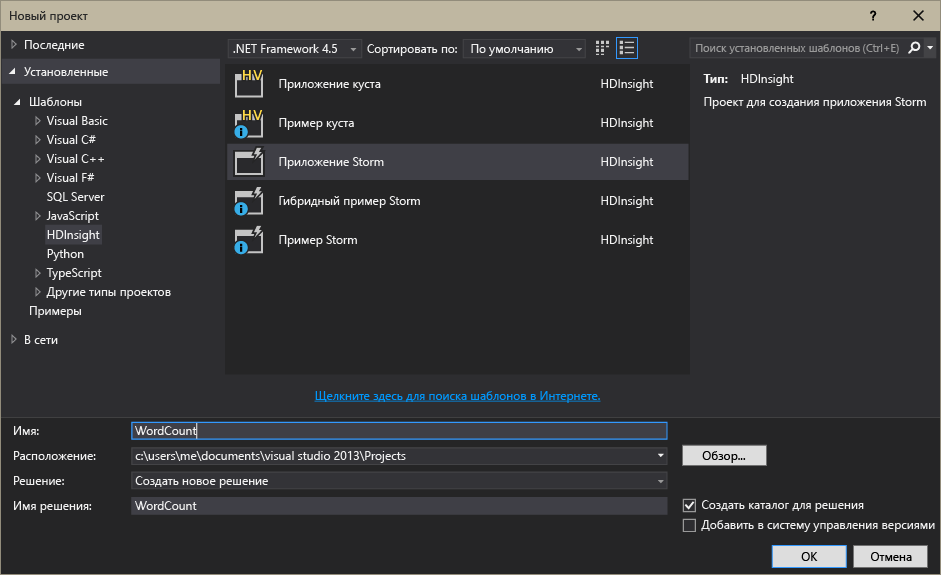

# Основные сведения об Apache Storm в службе HDInsight. Аналитика в реальном времени для Hadoop
Apache Storm в службе HDInsight позволяет создавать в среде Azure распределенные решения для анализа данных в реальном времени. Для этих целей используется [Apache Hadoop](http://hadoop.apache.org).

## Что такое Apache Storm
Apache Storm — это распределенная отказоустойчивая вычислительная система с открытым исходным кодом, предназначенная для обработки данных в реальном времени с использованием Hadoop. Решения Storm могут также обеспечить гарантированную обработку данных и возможность воспроизвести те данные, которые не прошли удачную обработку в первый раз.

## Преимущества Apache Storm в HDInsight
Apache Storm в HDInsight представляет собой управляемый кластер, интегрированный в среду Azure. Такое решение имеет ряд основных преимуществ.

* Работа в виде управляемой службы, которая гарантировано доступна 99,9 % времени.
* Выбор языков программирования: поддерживаются компоненты Storm, написанные на языках **Java**, **C#** и **Python**.
  
  * Поддержка смешанных языков: можно считывать данные с помощью Java, а затем обрабатывать их с помощью C#.#
    
    > [!NOTE]
    > Топологии C# поддерживаются только в кластерах HDInsight под управлением Windows.
    > 
    > 
  * Использование Java-интерфейса **Trident** для создания топологий Storm, поддерживающих ровно одну обработку сообщений, постоянное «транзакционное» хранилище данных и набор общих операций Stream Analytics.
* Встроенные возможности увеличения и уменьшения масштаба: масштабирование кластера HDInsight не влияет на запущенные топологии Storm.
* Интеграция с другими службами Azure, включая концентратор событий, виртуальную сеть Azure, базу данных SQL, хранилище BLOB-объектов и DocumentDB.
  
  * Объединение возможностей несколько кластеров HDInsight с помощью виртуальной сети Azure: создание конвейеров аналитики, использующих кластеры HDInsight, HBase или Hadoop.

Список компаний, использующих Apache Storm в качестве решения для анализа данных в реальном времени, см. в статье [Companies Using Apache Storm](https://storm.apache.org/documentation/Powered-By.html) (Компании, использующие Apache Storm).

Сведения для начала работы с системой Storm см. в статье [Начало работы со Storm в HDInsight][gettingstarted].

### Простота подготовки
Новый кластер Storm в HDInsight можно подготовить за считанные минуты. Просто укажите имя кластера, размер, учетную запись администратора и учетную запись хранения, и служба Azure создаст кластер с примерами топологий и веб-сайтом панели мониторинга.

> [!NOTE]
> Кластеры Storm также можно подготавливать к работе с помощью [Azure CLI](../xplat-cli-install.md) или [Azure PowerShell](/powershell/azureps-cmdlets-docs).
> 
> 

В течение 15 минут после отправки запроса у вас будет новый работающий кластер Storm, полностью готовый для первого конвейера аналитики в реальном времени.

### Простота использования
**Для Storm под управлением Linux в кластерах HDInsight** можно подключиться к кластеру с помощью SSH и использовать команду `storm` для запуска топологий и управления ими. Кроме того, можно использовать Ambari для отслеживания службы Storm и пользовательский интерфейс Storm — для отслеживания запущенных топологий и управления ими.

Дополнительные сведения о работе с кластерами Storm под управлением Linux можно найти в разделе [Приступая к работе с Apache Storm в HDInsight под управлением Linux](hdinsight-apache-storm-tutorial-get-started-linux.md).

**Для Storm под управлением Windows в кластерах HDInsight**средства HDInsight для Visual Studio позволяют создавать однотипные (C#) и гибридные (C#/Java) топологии и отправлять их в кластер Storm в HDInsight.  

В средствах HDInsight для Visual Studio также предусмотрен интерфейс, который позволяет отслеживать и контролировать топологии Storm в кластере.

Пример создания приложения Storm с помощью средств HDInsight см. в статье [Разработка топологий для Apache Storm в HDInsight на C# с помощью средств Hadoop для Visual Studio](hdinsight-storm-develop-csharp-visual-studio-topology.md).

Дополнительные сведения о средствах HDInsight для Visual Studio см. в статье [Приступая к работе с инструментами Hadoop в Visual Studio для HDInsight для выполнения запроса Hive](hdinsight-hadoop-visual-studio-tools-get-started.md).

У каждого кластера Storm в HDInsight есть веб-панель мониторинга Storm, которая позволяет отправлять, отслеживать и контролировать работающие в кластере топологии Storm.

Дополнительные сведения об использовании панели мониторинга Storm см. в статье [Развертывание топологий Apache Storm в HDInsight под управлением Windows и управление ими](hdinsight-storm-deploy-monitor-topology.md).

В Storm в HDInsight также предусмотрена простая интеграция со службой концентраторов событий Azure через **воронку концентратора событий**. Последнюю версию этого компонента можно найти здесь: [https://github.com/hdinsight/hdinsight-storm-examples/tree/master/lib/eventhubs](https://github.com/hdinsight/hdinsight-storm-examples/tree/master/lib/eventhubs). Дополнительные сведения об использовании этого компонента см. в следующих документах.

* [Разработка топологии C#, использующей концентраторы событий Azure;](hdinsight-storm-develop-csharp-event-hub-topology.md)
* [Разработка топологии Java, использующей концентраторы событий Azure.](hdinsight-storm-develop-java-event-hub-topology.md)

### Надежность
Система Apache Storm гарантирует, что каждое входящее сообщение будет полностью обработано даже в том случае, когда анализ данных распределен между сотнями узлов.

Функциональные возможности **узла Nimbus** схожи с возможностями службы Hadoop JobTracker. Через **Zookeeper** этот узел назначает задачи другим узлам в кластере. Узлы Zookeeper обеспечивают координацию кластера и упрощают взаимодействие между узлом Nimbus и процессом **контролера** на рабочих узлах. Если один узел обработки выходит из строя, узел Nimbus узнает об этом и назначает задачу и связанные данные другому узлу.

По умолчанию для Apache Storm используется только один узел Nimbus, но кластер Storm в HDInsight работает на двух. При сбое основного узла кластер HDInsight переключится на вторичный на время восстановления основного узла.

### Масштаб
Количество узлов указывается во время создания кластера. Тем не менее рабочая нагрузка может меняться, и тогда возникает необходимость увеличить или уменьшить размер кластера. Все кластеры HDInsight позволяют изменять количество узлов в кластере даже во время обработки данных.

> [!NOTE]
> Чтобы воспользоваться преимуществами новых узлов, добавленных с помощью масштабирования, необходимо будет повторно сбалансировать топологии, запущенные до увеличения размера кластера.
> 
> 

### Поддержка
Для кластеров Storm в HDInsight круглосуточно действует полная поддержка корпоративного уровня. Коме того, для кластеров Storm в HDInsight заявлена гарантированная доступность в течение 99,9 % времени. Это означает, что мы гарантируем возможность подключения к кластеру извне в течение как минимум 99,9 % времени.

## Распространенные варианты использования аналитики в реальном времени
Ниже приведены несколько распространенных ситуаций, в которых вам может помочь кластер Apache Storm в HDInsight. Сценарии из реальной жизни см. в статье о том, [как компании используют Storm](https://storm.apache.org/documentation/Powered-By.html).

* Интернет вещей.
* Обнаружение мошенничества.
* Социальная аналитика.
* Извлечение, преобразование и загрузка.
* Мониторинг сетей.
* Поиск
* Взаимодействие через мобильные устройства.

## Как происходит обработка данных в HDInsight Storm
Apache Storm работает с **топологиями** , а не задания MapReduce, с которыми вы, вероятно, знакомы по HDInsight или Hadoop. Кластер Storm в HDInsight имеет два типа узлов: головные узлы, на которых работает **Nimbus**, и рабочие узлы, на которых работает **контролер**.

* **Nimbus.** Как и служба JobTracker в Hadoop, этот узел отвечает за распределение кода в кластере, назначение задач виртуальным машинам и отслеживание сбоев. Служба HDInsight имеет два узла Nimbus, поэтому в кластере Storm в HDInsight нет единой точки отказа.
* **Контролер.** Контролер для каждого рабочего узла, отвечающий за начало и остановку **рабочих процессов** на узле.
* **Рабочий процесс.** Выполняет подмножество **топологии**. Выполняемая топология распределяется по многим рабочим процессам кластера.
* **Топология.** Определяет граф вычислений, которые обрабатывают **потоки** данных. В отличие от заданий MapReduce топология выполняется до тех пор, пока ее остановят.
* **Поток.** Несвязанный набор **кортежей**. Потоки создаются со стороны **воронок** и **сит** и направляются в **сита**.
* **Кортеж.** Именованный список динамически вводимых значений.
* **Воронка.** Потребляет данные из источника данных и отправляет один или несколько **потоков**.
  
  > [!NOTE]
  > Во многих случаях данные считываются из очереди (например, Kafka, очереди служебной шины Azure или концентраторы событий). Очередь отвечает за сохраняемость данных в случае сбоя.
  > 
  > 
* **Сито.** Принимает **потоки**, выполняет обработку **кортежей** и может отправлять **потоки**. Сито также отвечает за запись данных во внешние хранилища, такие как HDInsight, HBase, хранилища очередей, BLOB-объектов и другие хранилища данных.
* **Apache Thrift.** Программная платформа для разработки масштабируемых служб на разных языках. Она позволяет собирать службы, работающие переключаясь между языками C++, Java, Python, PHP, Ruby, Erlang, Perl, Haskell, C#, Cocoa, JavaScript, Node.js, Smalltalk и др.
  
  * **Nimbus** — это служба Thrift, а **топология** — определение Thrift. Таким образом вы можете разрабатывать топологии, используя различные языки программирования.

Дополнительные сведения о компонентах Storm см. в [руководстве по Storm][apachetutorial] на сайте apache.org.

## Какие языки программирования я могу использовать?
Кластер Storm в HDInsight поддерживает языки C#, Java и Python.

### C&#35;
Средства HDInsight для Visual Studio позволяют разработчикам .NET проектировать и реализовывать топологии на языке C#. Вы также можете создавать гибридные топологии, в которых используются компоненты Java и C#.

Дополнительные сведения см. в статье [Разработка топологий для Apache Storm в HDInsight на C# с помощью средств Hadoop для Visual Studio](hdinsight-storm-develop-csharp-visual-studio-topology.md).

### Java
Большинство примеров Java, с которыми вам доведется иметь дело, будут созданы с использованием либо только Java, либо Trident. Trident — это высокоуровневая абстракция, которая облегчает такие операции, как объединение, агрегирование, группирование, фильтрация. Тем не менее Trident работает с пакетами кортежей, тогда как решение, созданное только на языке Java, будет обрабатывать в потоке по одному кортежу за раз.

Дополнительные сведения о Trident см. в [руководстве по Trident](https://storm.apache.org/documentation/Trident-tutorial.html) на сайте apache.org.

Примеры топологий Java и Trident можно найти в [списке примеров топологий Storm](hdinsight-storm-example-topology.md) или в примерах storm-starter в вашем кластере HDInsight.

Примеры storm-starter расположены в каталоге ** /usr/hdp/current/storm-client/contrib/storm-starter** в кластерах под управлением Linux и в каталоге **%storm_home%\contrib\storm-starter** в кластерах под управлением Windows.

## Некоторые типичные шаблоны разработки
### Гарантированная обработка сообщений
Storm может обеспечить различные уровни гарантированной обработки сообщений. Например, простое приложение Storm гарантирует как минимум одну обработку, в то время как Trident может гарантировать ровно одну обработку.

Дополнительные сведения см. в статье о [гарантированной обработке данных](https://storm.apache.org/about/guarantees-data-processing.html) на сайте apache.org.

### IBasicBolt
Шаблон чтения входного кортежа, отправки кортежей (0 или больше) и подтверждения входного кортежа сразу же в конце метода execute очень распространен. Для автоматизации этого шаблона в системе Storm присутствует интерфейс [IBasicBolt](https://storm.apache.org/apidocs/backtype/storm/topology/IBasicBolt.html).

### Соединения
Объединение двух потоков на данных двух приложениях будет различаться. Например, вы можете объединять все кортежи с нескольких потоков в один новый поток или объединять только пакеты кортежей для отдельного окна. В любом случае, объединение может завершиться с помощью [fieldsGrouping](http://javadox.com/org.apache.storm/storm-core/0.9.1-incubating/backtype/storm/topology/InputDeclarer.html#fieldsGrouping%28java.lang.String,%20backtype.storm.tuple.Fields%29), который является способом определения того, как кортежи перенаправляются к bolts.

В приведенном ниже примере Java используется fieldsGrouping для перенаправления кортежей из компонентов "1", "2" и "3" в сито **MyJoiner** .

    builder.setBolt("join", new MyJoiner(), parallelism) .fieldsGrouping("1", new Fields("joinfield1", "joinfield2")) .fieldsGrouping("2", new Fields("joinfield1", "joinfield2")) .fieldsGrouping("3", new Fields("joinfield1", "joinfield2"));

### Пакетная обработка
Пакетную обработку можно выполнить несколькими способами. С простой топологией Storm Java вы можете использовать простой счетчик для объединения в пакеты n-го числа кортежей до их отправки или внутренний временной механизм, известный как временной кортеж, для отправки одного пакета один раз за n-е количество секунд.

Пример использования временного кортежа см. в статье [Анализ полученных с датчиков данных с использованием Apache Storm, концентратора событий и базы данных HBase в службе HDInsight (Hadoop)](hdinsight-storm-sensor-data-analysis.md).

Если вы пользуетесь Trident, он основан на обработке потоков кортежей.

### Caching
Для ускорения обработки часто используется кэширование в памяти, при котором в памяти сохраняются часто используемые ресурсы. Так как топология распределяется между несколькими узлами и несколькими процессами в пределах каждого узла, рекомендуем использовать [fieldsGrouping](http://javadox.com/org.apache.storm/storm-core/0.9.1-incubating/backtype/storm/topology/InputDeclarer.html#fieldsGrouping%28java.lang.String,%20backtype.storm.tuple.Fields%29) (группирование полей). Благодаря этому кортежи с полями, которые используются для поиска данных в кэше, будут всегда перенаправляться к одному и тому же процессу. Это избавит от дублирования записей кэша в процессах.

### Максимальное количество потоков (top N)
Когда ваша топология зависит от расчета значения «Топ Х», например топ 5 трендов в Twitter, это значение нужно рассчитывать параллельно, а затем объединять результат расчетов в глобальное значение. Это можно сделать с помощью [fieldsGrouping](http://javadox.com/org.apache.storm/storm-core/0.9.1-incubating/backtype/storm/topology/InputDeclarer.html#fieldsGrouping%28java.lang.String,%20backtype.storm.tuple.Fields%29) , направив отдельные поля в параллельные сита (таким образом данные будут разделены по значениям полей), а затем — в сито, которое определяет глобальное значение «Топ Х».

Смотрите следующий пример [RollingTopWords](https://github.com/nathanmarz/storm-starter/blob/master/src/jvm/storm/starter/RollingTopWords.java) .

## Какой тип ведения журналов используется в Storm?
Storm использует Apache Log4j для записи информации в журнал. По умолчанию в журнал записывается большой объем данных, и разобраться в этой информации может быть трудно. Чтобы управлять ведением журналов, включите файл конфигурации ведения журналов в топологию Storm.

Пример топологии, в котором показано, как настроить ведение журнала, см. в примере Storm в HDInsight в статье [Разработка топологий на основе Java для базовых приложений подсчета слов с помощью Apache Storm и Maven в HDInsight](hdinsight-storm-develop-java-topology.md).

## Дальнейшие действия
Ниже приведены статьи, в которых можно найти дополнительные сведения о решениях для анализа данных в реальном времени с помощью Apache Storm в HDInsight.

* [Начало работы с кластером Storm в HDInsight][gettingstarted]
* [Примеры топологий для Storm в HDInsight](hdinsight-storm-example-topology.md)

[stormtrident]: https://storm.apache.org/documentation/Trident-API-Overview.html
[samoa]: http://yahooeng.tumblr.com/post/65453012905/introducing-samoa-an-open-source-platform-for-mining
[apachetutorial]: https://storm.apache.org/documentation/Tutorial.html
[gettingstarted]: hdinsight-apache-storm-tutorial-get-started-linux.md

<!--HONumber=Dec16_HO2-->

