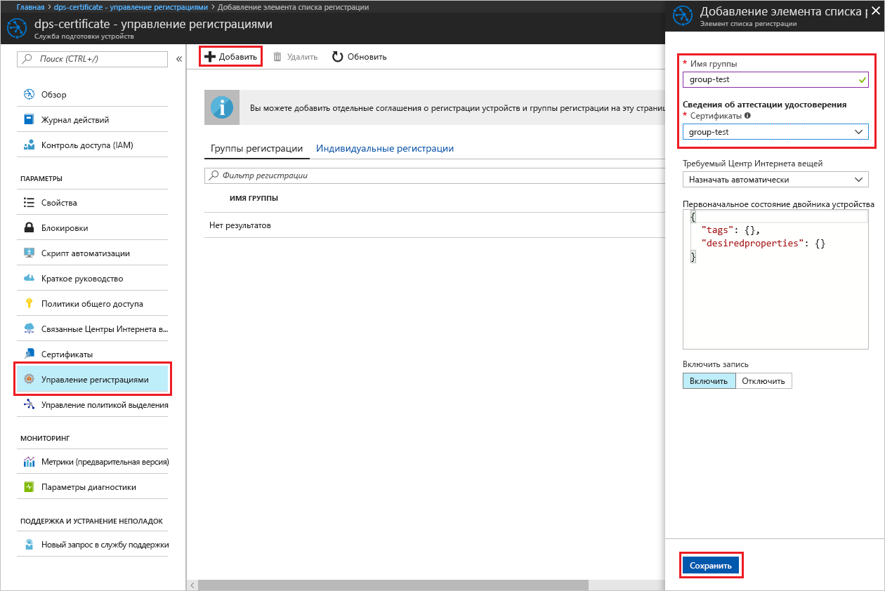

# <a name="create-and-provision-an-x509-simulated-device-using-nodejs-device-sdk-for-iot-hub-device-provisioning-service"></a>Создание и подготовка имитированного устройства X.509 с помощью пакета SDK для устройства Node.js для службы подготовки устройств к добавлению в Центр Интернета вещей
[!INCLUDE [iot-dps-selector-quick-create-simulated-device-x509](../../includes/iot-dps-selector-quick-create-simulated-device-x509.md)]

Служба подготовки устройств к добавлению в Центр Интернета вещей — это вспомогательная служба, предоставляющая полностью автоматическую подготовку устройства в Центре Интернета вещей. Она дает возможность подготавливать миллионы устройств с высоким уровнем безопасности и масштабируемости.

Подготовка устройства состоит из двух этапов. На первом этапе создается соответствующая запись регистрации в службе подготовки устройств на основе определенных требований решения.  На втором этапе устанавливается соединение между устройством и службой подготовки устройств, а также выполняется регистрация устройства в Центре Интернета вещей. Устройство будет полностью подготовлено после завершения обоих этапов. Служба подготовки устройств автоматизирует оба этапа для обеспечения эффективной подготовки устройства. Дополнительные сведения см. в статье [Понятия службы подготовки устройств для Центра Интернета вещей](https://docs.microsoft.com/en-us/azure/iot-dps/concepts-service).

В этом руководстве показано, как создавать запись регистрации в службе подготовки устройств, имитировать устройство X.509 на компьютере разработки, подключать имитированное устройство к службе подготовки устройств, а также регистрировать устройство в Центре Интернета вещей с помощью [пакета SDK для устройств Node.js для Центра Интернета вещей Azure](https://github.com/Azure/azure-iot-sdk-node).

[!INCLUDE [IoT DPS basic](../../includes/iot-dps-basic.md)]

## <a name="prepare-the-environment"></a>Подготовка среды 

1. Прежде чем продолжить, выполните инструкции по [настройке службы подготовки устройств к добавлению в Центр Интернета вещей на портале Azure](./quick-setup-auto-provision.md).

1. Убедитесь, что на вашем компьютере установлена платформа [Node.js 4.0 или более поздней версии](https://nodejs.org).

1. Установите на компьютер систему [Git](https://git-scm.com/download/) и добавьте ее в переменные среды, доступные в командном окне. 

1. Установите на компьютер систему [OpenSSL](https://www.openssl.org/) и добавьте ее в переменные среды, доступные в командном окне. Библиотеку можно либо создать и установить из источника, либо скачать и установить из [сторонних ресурсов](https://wiki.openssl.org/index.php/Binaries), например [из этого](https://sourceforge.net/projects/openssl/). 

    > [!NOTE]
    > Если вы уже создали _корневые_, _промежуточные_ и/или _конечные_ сертификаты X.509, пропустите этот и все последующие шаги по созданию сертификата.
    >


## <a name="create-an-enrollment-entry"></a>Создание записи регистрации

Регистрация — это запись устройств или групп устройств, которые можно зарегистрировать в определенный момент и сохранить в службе подготовки устройств. Запись регистрации содержит сведения об устройстве или группе устройств, в том числе сведения о сертификате X.509, и дополнительную регистрационную информацию. Служба подготовки устройств поддерживает два типа регистраций: _индивидуальную регистрацию_ и _группу регистраций_. Дополнительные сведения см. в разделе [Регистрация](https://docs.microsoft.com/en-us/azure/iot-dps/concepts-service#enrollment).

Если вы создаете собственные тестовые сертификаты X.509, см. сведения о сертификатах, которые нужны для вашего решения, в разделе [Сертификаты X.509](https://docs.microsoft.com/en-us/azure/iot-dps/concepts-security#x509-certificates). Сведения о реализации см. в разделе о [средствах для работы с пакетом SDK для службы подготовки устройств Интернета вещей Azure для Node.js](https://github.com/azure/azure-iot-sdk-node/tree/master/provisioning/tools).

1. Откройте окно командной строки. Клонируйте репозиторий GitHub, чтобы получить примеры кода.
    
    ```cmd/sh
    git clone https://github.com/Azure/azure-iot-sdk-node.git --recursive
    ```

1. Перейдите к скрипту генератора сертификатов и выполните сборку этого проекта. 

    ```cmd/sh
    cd azure-iot-sdk-node/provisioning/tools
    npm install
    ```

1. Создайте сведения о регистрации одним из следующих способов, в зависимости от используемой схемы работы.

    - **Индивидуальная регистрация**.

        1. Создайте _конечный_ сертификат: выполните скрипт, указав _нужное имя сертификата_. Обратите внимание, что общее имя конечного сертификата становится [идентификатором регистрации](https://docs.microsoft.com/en-us/azure/iot-dps/concepts-device#registration-id), поэтому обязательно используйте строчные буквенные символы и дефисы.

        ```cmd/sh
        node create_test_cert.js device {certificate-name}
        ```
         
        1. На портале **Azure** откройте колонку сводки для **службы подготовки устройств**. Выберите вкладку **Управление регистрациями**, затем **Индивидуальные регистрации** и сверху нажмите кнопку **Добавить**. 

        1. В разделе **Добавление записи в список регистрации**, введите следующее:
            - Выберите **X.509** как *механизм* аттестации удостоверения.
            - В поле *PEM-файл или CER-файл сертификата* выберите созданный ранее файл сертификата **_{имя_сертификата}\_cert.pem_**, используя мини-приложение *Проводник*.
            - При необходимости можно указать следующие сведения:
                - Выберите Центр Интернета вещей, связанный с вашей службой подготовки.
                - Укажите уникальный идентификатор устройства. Убедитесь, что при назначении имен устройства не используются конфиденциальные данные. 
                - Обновите **начальное состояние двойника устройства**, используя требуемую начальную конфигурацию для устройства.
            - Затем нажмите кнопку **Сохранить**. 

          

    После успешной регистрации устройство X.509 отобразится как **{имя_сертификата}** в столбце *Идентификатор регистрации* на вкладке *Индивидуальные регистрации*. Это значение необходимо для дальнейшей работы.

    - **Группы регистрации**. 

        1. Создайте _корневой_ сертификат: выполните скрипт, указав _нужное имя корня_.

        ```cmd/sh
        node create_test_cert.js root {root-name}
        ```

        1. На портале **Azure** откройте колонку сводки для **службы подготовки устройств**. Выберите **Сертификаты** и вверху нажмите кнопку **Добавить**.

        1. В разделе **Добавление сертификата** введите следующие данные.
            - Введите уникальное имя сертификата.
            - Выберите созданный ранее файл **_{имя_корня}\_cert.pem_**.
            - Затем нажмите кнопку **Сохранить**.

        

        1. Выберите только что созданный сертификат.
            - Щелкните **Создать код проверки**. Скопируйте созданный код.
            - Создайте сертификат _для проверки_. Введите _код проверки_ или щелкните правой кнопкой мыши в открытом окне скрипта Node.js, чтобы вставить код с помощью следующей команды.

                ```cmd/sh
                node create_test_cert.js verification {rootname_cert} {verification code}
                ```

            - В поле *PEM-файл или CER-файл сертификата для проверки* выберите созданный ранее файл сертификата **_verification_cert.pem_**, используя мини-приложение *Проводник*. Нажмите кнопку **Проверка**.

            

        1. Выберите **Управление регистрациями**. Выберите вкладку **Группы регистрации** и нажмите кнопку **Добавить** вверху.
            - Введите уникальное имя группы.
            - Выберите уникальное имя созданного ранее сертификата.
            - При необходимости можно указать следующие сведения:
                - Выберите Центр Интернета вещей, связанный с вашей службой подготовки.
                - Обновите **начальное состояние двойника устройства**, используя требуемую начальную конфигурацию для устройства.

        

        После успешной регистрации группа устройств X.509 отображается в столбце *Имя группы* на вкладке *Группы регистрации*. Это значение необходимо для дальнейшей работы.

        1. Создайте _конечный_ сертификат: выполните скрипт, указав _имя сертификата_ и _имя корня_, которое вы использовали ранее. Общее имя конечного сертификата становится [идентификатором регистрации](https://docs.microsoft.com/en-us/azure/iot-dps/concepts-device#registration-id), поэтому обязательно используйте строчные буквенные символы и дефисы.

            ```cmd/sh
            node create_test_cert.js device {certificate-name} {root-name}
            ```

        > [!NOTE]
        > Кроме того, с помощью команды `node create_test_cert.js intermediate {certificate-name} {parent-name}` можно создать _промежуточный_ сертификат. _Конечный_ сертификат нужно создавать последним, используя _промежуточный_ сертификат в качестве корня или родителя. Дополнительные сведения см. в разделе [Управление доступом устройств к службе подготовки с использованием сертификатов X.509](https://docs.microsoft.com/en-us/azure/iot-dps/concepts-security#controlling-device-access-to-the-provisioning-service-with-x509-certificates).
        >


## <a name="simulate-the-device"></a>Имитация устройства

С помощью [пакета SDK для устройств Node.js для Центра Интернета вещей Azure](https://github.com/Azure/azure-iot-sdk-node) можно легко сымитировать устройство. Дополнительные сведения см. в статье [Понятия устройства в контексте подготовки устройств в Центре Интернета вещей](https://docs.microsoft.com/en-us/azure/iot-dps/concepts-device).

1. На портале Azure выберите колонку **Обзор** службы подготовки устройств и запишите значения для **_глобальной конечной точки устройства_** и **_области идентификатора_**.

     

1. Скопируйте _сертификат_ и _ключ_ в пример папки.

    ```cmd/sh
    copy .\{certificate-name}_cert.pem ..\device\samples\{certificate-name}_cert.pem
    copy .\{certificate-name}_key.pem ..\device\samples\{certificate-name}_key.pem
    ```

1. Перейдите к тестовому скрипту устройства и создайте проект. 

    ```cmd/sh
    cd ..\device\samples
    npm install
    ```

1. Измените файл **register\_x509.js**. После внесения следующих изменений сохраните файл.
    - Замените `provisioning host` значением **_глобальной конечной точки устройства_** из **шага 1** выше.
    - Замените `id scope` значением **_области идентификатора_** из **шага 1** выше. 
    - Замените `reigstration id` значением **_идентификатора регистрации_** или **_имени группы_** из предыдущего раздела.
    - Замените `cert filename` и `key filename` файлами, которые вы скопировали в **шаге 2** выше. 

1. Выполните скрипт и проверьте, успешно ли подготовлено устройство.

    ```cmd/sh
    node register_x509.js
    ```   

1. На портале перейдите в Центр Интернета вещей, связанный со службой подготовки, и откройте колонку **Устройства IoT**. Когда имитированное устройство X.509 будет подготовлено для центра, в колонке **Устройства IoT** появится идентификатор этого устройства со значением **Включено** в столбце *Состояние*. Если вы уже открывали колонку, прежде чем запустить пример приложения для устройства, возможно, потребуется нажать кнопку **Обновить** вверху. 

     

    Если в записи регистрации для своего устройства вы изменили значение по умолчанию для *начального состояния двойника устройства*, требуемое состояние двойника будет извлечено из концентратора с последующим выполнением соответствующих действий. См. [общие сведения о двойниках устройств и их использовании в Центре Интернета вещей](../iot-hub/iot-hub-devguide-device-twins.md).


## <a name="clean-up-resources"></a>Очистка ресурсов

Если вы планируете продолжить работу с примером клиентского устройства, не удаляйте ресурсы, созданные в ходе работы с этим руководством. Если вы не планируете продолжать работу, следуйте инструкциям ниже, чтобы удалить все созданные ресурсы.

1. Закройте окно выходных данных примера клиентского устройства на компьютере.
1. В меню слева на портале Azure щелкните **Все ресурсы** и откройте службу подготовки устройств. Откройте колонку **Управление регистрациями** для службы, затем откройте вкладку **Индивидуальные регистрации** или **Группы регистраций**. Выберите *идентификатор регистрации* или *имя группы* устройства, которое вы зарегистрировали в процессе работы с этим руководством, и нажмите кнопку **Удалить** вверху. 
1. В меню слева на портале Azure нажмите кнопку **Все ресурсы** и выберите свой Центр Интернета вещей. Откройте колонку **Устройства Интернета вещей** для нужного концентратора, выберите *идентификатор устройства*, зарегистрированного в процессе работы с руководством, и нажмите кнопку **Удалить** вверху.


## <a name="next-steps"></a>Дополнительная информация

В этом кратком руководстве вы создали имитированное устройство X.509 и подготовили это устройство для Центра Интернета вещей с помощью службы подготовки устройств к добавлению в Центр Интернета вещей на портале. Чтобы узнать, как выполнить программную регистрацию устройства X.509, изучите соответствующее краткое руководство. 

> [!div class="nextstepaction"]
> [Краткое руководство Azure. Регистрация устройств X.509 в службе подготовки устройств Центра Интернета вещей](quick-enroll-device-x509-node.md)
