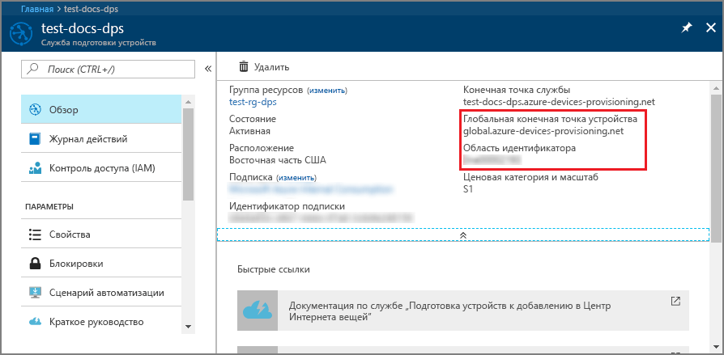
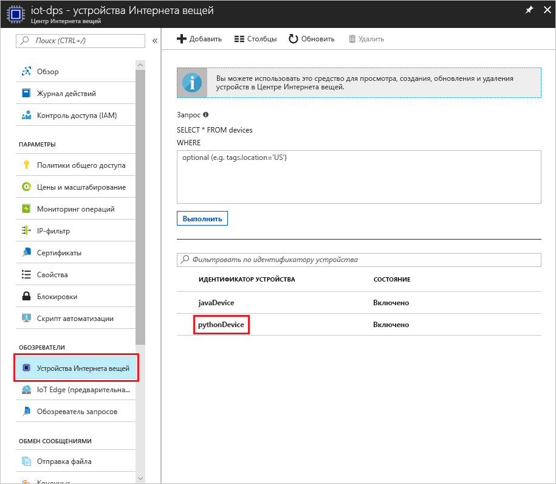

# <a name="create-and-provision-a-simulated-x509-device-using-python-device-sdk-for-iot-hub-device-provisioning-service"></a>Создание и подготовка имитированного устройства X.509 с помощью пакета SDK службы устройства Python для службы подготовки устройств Центра Интернета вещей
[!INCLUDE [iot-dps-selector-quick-create-simulated-device-x509](../../includes/iot-dps-selector-quick-create-simulated-device-x509.md)]

В этом руководстве показано, как имитировать устройство X.509 на компьютере разработки под управлением ОС Windows, а также как с помощью примера кода Python подключить имитированное устройство к службе подготовки устройств и Центру Интернета вещей. 

Прежде чем продолжить, выполните инструкции по [настройке службы подготовки устройств Центра Интернета вещей на портале Azure](./quick-setup-auto-provision.md).

[!INCLUDE [IoT DPS basic](../../includes/iot-dps-basic.md)]

## <a name="prepare-the-environment"></a>Подготовка среды 

1. Установите на компьютер [Visual Studio 2015](https://www.visualstudio.com/vs/older-downloads/) или [Visual Studio 2017](https://www.visualstudio.com/vs/). Для установки Visual Studio требуется включить рабочую нагрузку разработки классических приложений с помощью C++.

1. Скачайте и установите [систему сборки CMake](https://cmake.org/download/).

1. Установите на компьютер систему `git` и добавьте ее в переменные среды, доступные в командном окне. Последнюю версию средств `git` для установки, которая включает **Git Bash**, приложение командной строки для взаимодействия с локальным репозиторием Git, можно найти на [этой странице](https://git-scm.com/download/). 

1. Откройте окно командной строки или Git Bash. Клонируйте из репозитория GitHub пример кода для имитации устройства.
    
    ```cmd/sh
    git clone https://github.com/Azure/azure-iot-sdk-python.git --recursive
    ```

1. Создайте папку в локальной копии этого репозитория GitHub для процесса сборки CMake. 

    ```cmd/sh
    cd azure-iot-sdk-python/c
    mkdir cmake
    cd cmake
    ```

1. Чтобы создать решение Visual Studio для клиента подготовки, выполните следующую команду.

    ```cmd/sh
    cmake -Duse_prov_client:BOOL=ON ..
    ```


## <a name="create-a-device-enrollment-entry"></a>Создание записи о регистрации устройства

1. Откройте решение `azure_iot_sdks.sln`, созданное в папке *cmake*, и соберите его в Visual Studio.

1. В папке **Provision\_Tools** щелкните правой кнопкой мыши проект **dice\_device\_enrollment** и выберите пункт **Назначить запускаемым проектом**. Запустите решение. В окне вывода введите `i` (индивидуальная регистрация), когда появится запрос. В окне вывода отобразится локально созданный сертификат X.509 для имитированного устройства. Скопируйте в буфер обмена выходные данные со строки *-----BEGIN CERTIFICATE-----* до строки *-----END CERTIFICATE-----* включительно. 

    
 
1. На компьютере с ОС Windows создайте файл **_X509testcertificate.pem_**, откройте его в любом редакторе и скопируйте в него содержимое из буфера обмена. Сохраните файл. 

1. Войдите на портал Azure, нажмите кнопку **Все ресурсы** в меню слева и откройте службу подготовки.

1. В колонке сводки службы подготовки устройств выберите **Управление регистрациями**. На вкладке **Отдельные регистрации** и нажмите кнопку **Добавить** сверху. 

1. В разделе **Добавление записи в список регистрации**, введите следующее:
    - Выберите **X.509** как *механизм* аттестации удостоверения.
    - В поле *PEM-файл или CER-файл сертификата* выберите созданный ранее файл сертификата **_X509testcertificate.pem_**, используя мини-приложение *Проводник*.
    - При необходимости можно указать следующие сведения:
        - Выберите Центр Интернета вещей, связанный с вашей службой подготовки.
        - Укажите уникальный идентификатор устройства. Убедитесь, что при назначении имен устройства не используются конфиденциальные данные. 
        - Обновите **начальное состояние двойника устройства**, используя требуемую начальную конфигурацию для устройства.
    - Затем нажмите кнопку **Сохранить**. 

      

   После успешной регистрации устройство X.509 отобразится как **riot-device-cert** в столбце *Идентификатор регистрации* на вкладке *Индивидуальные регистрации*. 


## <a name="simulate-the-device"></a>Имитация устройства

1. В колонке сводки для службы подготовки устройств выберите **Обзор**. Запишите значения параметров _Область идентификатора_ и _Global Service Endpoint_ (Конечная точка глобальной службы).

    

1. Скачайте и установите [Python 2.x или 3.x](https://www.python.org/downloads/). Обязательно используйте 32-разрядную или 64-разрядную версию установки согласно требованиям программы настройки. При появлении запроса во время установки обязательно добавьте Python в переменную среды соответствующей платформы. Если вы используете Python 2.x, может потребоваться [установка или обновление *pip* — системы управления пакетами Python](https://pip.pypa.io/en/stable/installing/).
    - Если вы работаете с ОС Windows, потребуется [распространяемый пакет Visual C++](http://www.microsoft.com/download/confirmation.aspx?id=48145), чтобы разрешить использовать собственные библиотеки DLL из Python.

1. Следуйте [этим инструкциям](https://github.com/Azure/azure-iot-sdk-python/blob/master/doc/python-devbox-setup.md) по созданию пакетов Python.

    > [!NOTE]
        > При использовании `pip` обязательно установите пакет `azure-iot-provisioning-device-client`.

1. Перейдите к папке с примерами.

    ```cmd/sh
    cd azure-iot-sdk-python/provisioning_device_client/samples
    ```

1. Используя интегрированную среду разработки для Python, измените скрипт Python с именем **provisioning\_device\_client\_sample.py**. Замените значения переменных _GLOBAL\_PROV\_URI_ и _ID\_SCOPE_ на значения, записанные ранее.

    ```python
    GLOBAL_PROV_URI = "{globalServiceEndpoint}"
    ID_SCOPE = "{idScope}"
    SECURITY_DEVICE_TYPE = ProvisioningSecurityDeviceType.X509
    PROTOCOL = ProvisioningTransportProvider.HTTP
    ```

1. Запустите пример. 

    ```cmd/sh
    python provisioning_device_client_sample.py
    ```

1. Приложение установит подключение, зарегистрирует устройство и выведет сообщение об успешной регистрации.

    

1. На портале перейдите в Центр Интернета вещей, связанный со службой подготовки, и откройте колонку **Обозреватель устройств**. Когда имитированное устройство X.509 будет успешно подготовлено для центра, в колонке **Обозреватель устройств** появится идентификатор этого устройства со значением **Включено** в столбце *Состояние*. Если вы уже открывали колонку, прежде чем запустить пример приложения для устройства, возможно, потребуется нажать кнопку **Обновить** вверху. 

     

> [!NOTE]
> Если в записи регистрации для своего устройства вы изменили значение по умолчанию для *начального состояния двойника устройства*, требуемое состояние двойника будет извлечено из концентратора с последующим выполнением соответствующих действий. См. [общие сведения о двойниках устройств и их использовании в Центре Интернета вещей](../iot-hub/iot-hub-devguide-device-twins.md).
>


## <a name="clean-up-resources"></a>Очистка ресурсов

Если вы планируете продолжить работу с примером клиентского устройства, не удаляйте ресурсы, созданные в ходе работы с этим руководством. Если вы не планируете продолжать работу, следуйте инструкциям ниже, чтобы удалить все созданные ресурсы.

1. Закройте окно выходных данных примера клиентского устройства на компьютере.
1. В меню слева на портале Azure щелкните **Все ресурсы** и откройте службу подготовки устройств. Откройте колонку **Управление регистрациями** для службы, затем откройте вкладку **Индивидуальные регистрации**. Выберите *идентификатор регистрации* устройства, которое вы зарегистрировали в процессе работы с этим руководством, и нажмите кнопку **Удалить** вверху. 
1. В меню слева на портале Azure нажмите кнопку **Все ресурсы** и выберите свой Центр Интернета вещей. Откройте колонку **Устройства Интернета вещей** для нужного концентратора, выберите *идентификатор устройства*, зарегистрированного в процессе работы с руководством, и нажмите кнопку **Удалить** вверху.

## <a name="next-steps"></a>Дополнительная информация

В этом кратком руководстве вы создали имитированное устройство X.509 на компьютере Windows и подготовили его для Центра Интернета вещей с помощью службы подготовки устройств Центра Интернета вещей Azure на портале. Чтобы узнать, как выполнить программную регистрацию устройства X.509, изучите соответствующее краткое руководство. 

> [!div class="nextstepaction"]
> [Краткое руководство Azure. Регистрация устройств X.509 в службе подготовки устройств Центра Интернета вещей](quick-enroll-device-x509-java.md)
