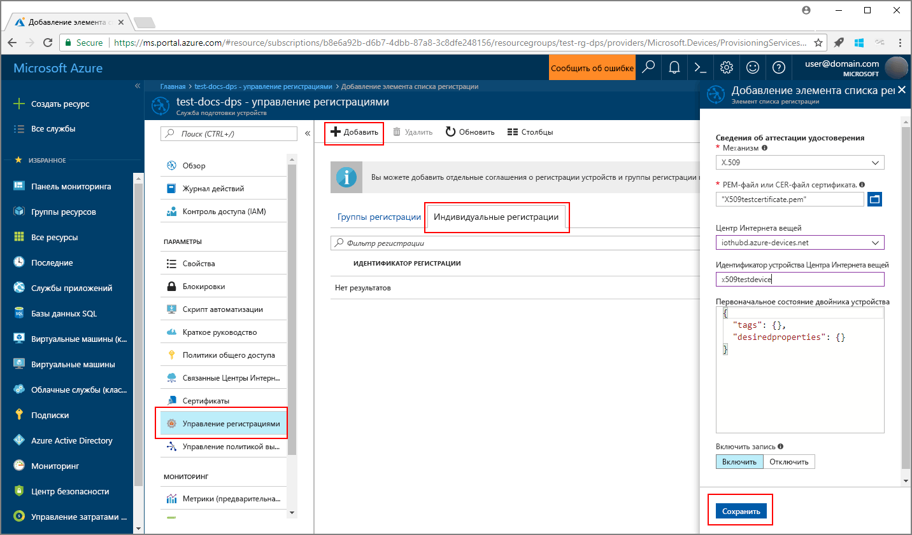

# <a name="create-and-provision-an-x509-simulated-device-using-iot-hub-device-provisioning-service"></a>Создание и подготовка имитированного устройства X.509 с помощью службы подготовки устройств Центра Интернета вещей
> [!div class="op_single_selector"]
> * [TPM](quick-create-simulated-device.md)
> * [X.509](quick-create-simulated-device-x509.md)

В этом руководстве показано, как имитировать устройство X.509 на компьютере разработки под управлением ОС Windows, а также как с помощью примера кода подключить имитированное устройство к службе подготовки устройств и Центру Интернета вещей. 

Прежде чем продолжить, выполните инструкции по [настройке службы подготовки устройств Центра Интернета вещей на портале Azure](./quick-setup-auto-provision.md).

<a id="setupdevbox"></a>
## <a name="prepare-the-development-environment"></a>Подготовка среды разработки 

1. Установите на компьютер Visual Studio 2015 или [Visual Studio 2017](https://www.visualstudio.com/vs/). Для установки Visual Studio требуется включить рабочую нагрузку разработки классических приложений с помощью C++.

2. Скачайте и установите [систему сборки CMake](https://cmake.org/download/).

3. Установите на компьютер систему `git` и добавьте ее в переменные среды, доступные в командном окне. Последнюю версию средств `git` для установки, которая включает **Git Bash**, приложение командной строки для взаимодействия с локальным репозиторием Git, можно найти на [этой странице](https://git-scm.com/download/). 

4. Откройте окно командной строки или Git Bash. Клонируйте репозиторий GitHub для примера кода виртуального устройства:
    
    ```cmd/sh
    git clone https://github.com/Azure/azure-iot-sdk-c.git --recursive
    ```

5. Создайте папку в локальной копии этого репозитория GitHub для процесса сборки CMake. 

    ```cmd/sh
    cd azure-iot-sdk-c
    mkdir cmake
    cd cmake
    ```

6. Чтобы создать решение Visual Studio для клиента подготовки, выполните следующую команду.

    ```cmd/sh
    cmake -Duse_prov_client:BOOL=ON ..
    ```


## <a name="create-a-device-enrollment-entry-in-the-device-provisioning-service"></a>Создание записи регистрации устройства в службе подготовки устройств

1. Откройте решение `azure_iot_sdks.sln`, созданное в папке *cmake*, и соберите его в Visual Studio.

2. В папке **Provision\_Samples** щелкните правой кнопкой мыши проект **dice\_device\_enrollment** и выберите пункт **Назначить запускаемым проектом**. Запустите решение. В окне вывода введите `i` (индивидуальная регистрация), когда появится запрос. В окне вывода отобразится локально созданный сертификат X.509 для имитированного устройства. Скопируйте в буфер обмена выходные данные начиная со строки *-----BEGIN CERTIFICATE-----* и заканчивая строкой *-----END PUBLIC KEY-----*. Не забудьте скопировать и эти две строки. 
 
3. На компьютере с ОС Windows создайте файл **_X509testcertificate.pem_**, откройте его в любом редакторе и скопируйте в него содержимое из буфера обмена. Сохраните файл. 

4. Войдите на портал Azure, нажмите кнопку **Все ресурсы** в меню слева и откройте службу подготовки.

4. В колонке сводки службы подготовки устройств выберите **Управление регистрациями**. На вкладке **Отдельные регистрации** и нажмите кнопку **Добавить** сверху. 

5. В разделе **Добавление записи в список регистрации**, введите следующее:
    - Выберите **X.509** как *механизм* аттестации удостоверения.
    - В поле *PEM-файл или CER-файл сертификата* выберите созданный ранее файл сертификата **_X509testcertificate.pem_**, используя мини-приложение *Проводник*.
    - При необходимости можно указать следующие сведения:
        - Выберите Центр Интернета вещей, связанный с вашей службой подготовки.
        - Укажите уникальный идентификатор устройства. Убедитесь, что при назначении имен устройства не используются конфиденциальные данные. 
        - Обновите **начальное состояние двойника устройства**, используя требуемую начальную конфигурацию для устройства.
    - Затем нажмите кнопку **Сохранить**. 

      

   После успешной регистрации устройство X.509 отобразится как **riot-device-cert** в столбце *Идентификатор регистрации* на вкладке *Индивидуальные регистрации*. 


<a id="firstbootsequence"></a>
## <a name="simulate-first-boot-sequence-for-the-device"></a>Имитация последовательности первой загрузки для устройства

1. На портале Azure выберите колонку **Обзор** службы подготовки устройств и запишите значение **_области идентификатора_**.

     

2. На своем компьютере в Visual Studio перейдите к примеру проекта с именем **prov\_dev\_client\_sample** в папке **Provision\_Samples** и откройте файл **prov\_dev\_client\_sample.c**.

3. Присвойте значение _области идентификатора_ переменной `scope_id`. 

    ```c
    static const char* scope_id = "[ID Scope]";
    ```

4. Щелкните проект **prov\_dev\_client\_sample** правой кнопкой мыши и выберите пункт **Назначить запускаемым проектом**. Запустите пример. Обратите внимание на сообщения, которые имитируют загрузку устройства и его подключение к службе подготовки устройств для получения информации Центра Интернета вещей. Найдите сообщение об успешной регистрации в Центре: *Registration Information received from service: yourhuburl!* (Сведения о регистрации получены из службы: URL-адрес_центра). Закройте окно, когда появится запрос.

5. На портале перейдите в Центр Интернета вещей, связанный со службой подготовки, и откройте колонку **Обозреватель устройств**. Когда имитированное устройство X.509 будет успешно подготовлено для центра, в колонке **Обозреватель устройств** появится идентификатор этого устройства со значением **Включено** в столбце *Состояние*. Обратите внимание, что может потребоваться нажать кнопку **Обновить** в верхней части окна, если вы уже открывали колонку, прежде чем запустить пример приложения для устройства. 

     

> [!NOTE]
> Если в записи регистрации для своего устройства вы изменили значение по умолчанию для *начального состояния двойника устройства*, требуемое состояние двойника будет извлечено из концентратора с последующим выполнением соответствующих действий. См. [общие сведения о двойниках устройств и их использовании в Центре Интернета вещей](../iot-hub/iot-hub-devguide-device-twins.md).
>


## <a name="clean-up-resources"></a>Очистка ресурсов

Если вы планируете продолжить работу с примером клиентского устройства, не удаляйте ресурсы, созданные в ходе работы с этим руководством. Если вы не планируете продолжать работу, следуйте инструкциям ниже, чтобы удалить все созданные ресурсы.

1. Закройте окно выходных данных примера клиентского устройства на компьютере.
1. В меню слева на портале Azure щелкните **Все ресурсы** и откройте службу подготовки устройств. В верхней части колонки **Все ресурсы** щелкните **Удалить**.  
1. В меню слева на портале Azure нажмите кнопку **Все ресурсы** и выберите свой Центр Интернета вещей. В верхней части колонки **Все ресурсы** щелкните **Удалить**.  

## <a name="next-steps"></a>Дальнейшие действия

В этом кратком руководстве вы создали имитированное устройство X.509 на компьютере Windows и подготовили это устройство для Центра Интернета вещей с помощью службы подготовки устройств Центра Интернета вещей Azure. Дополнительные сведения о подготовке устройств см. в руководстве по настройке службы подготовки устройств на портале Azure. 

> [!div class="nextstepaction"]
> [Руководства по службе подготовки устройств для Центра Интернета вещей Azure](./tutorial-set-up-cloud.md)
