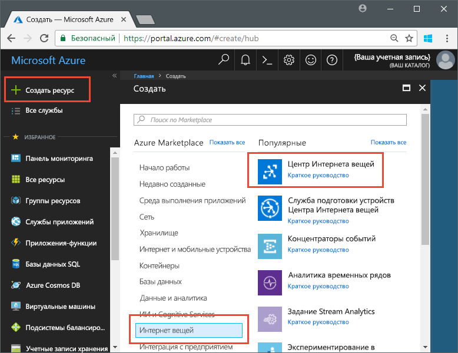
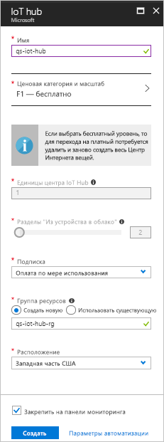

# <a name="send-telemetry-from-a-device-to-an-iot-hub-swift"></a>Отправка данных телеметрии с устройства в Центр Интернета вещей (Swift)

Центр Интернета вещей — это служба Azure, которая позволяет получать большие объемы телеметрии с ваших устройств Центра Интернета вещей в облаке на хранение или обработку. В этой статье телеметрия отправляется из приложения имитированного устройства в Центр Интернета вещей. Затем можно просмотреть данные из серверной части приложения. 

В этой статье используется предварительно написанное приложение Swift для отправки телеметрии и служебная программа CLI для чтения телеметрии из Центра Интернета вещей. 

[!INCLUDE [cloud-shell-try-it.md](../../includes/cloud-shell-try-it.md)]

Если у вас еще нет подписки Azure, [создайте бесплатную учетную запись Azure](https://azure.microsoft.com/free/?WT.mc_id=A261C142F), прежде чем начинать работу.

## <a name="prerequisites"></a>предварительным требованиям

- Скачать пример кода из [примеров Azure](https://github.com/Azure-Samples/azure-iot-samples-ios/archive/master.zip). 
- Последняя версия [XCode](https://developer.apple.com/xcode/), выполняющая последнюю версию пакета SDK для iOS. Это краткое руководство было протестировано с XCode 9.3 и iOS 11.3.
- Последняя версия [CocoaPods](https://guides.cocoapods.org/using/getting-started.html).
- Служебная программа iothub-explorer, читающая телеметрию из Центра Интернета вещей. Чтобы установить ее, сначала установите [Node.js](https://nodejs.org) версии 4.x.x или более поздней, а затем выполните команду: 

   ```sh
   sudo npm install -g iothub-explorer
   ```

## <a name="create-an-iot-hub"></a>Создание Центра Интернета вещей

Сначала нужно создать Центр Интернета вещей в подписке с помощью портала Azure. Центр Интернета вещей позволяет принимать большие объемы телеметрии в облако с разных устройств. Затем концентратор включает одну или несколько серверных служб, выполняемых в облаке, для чтения и обработки этой телеметрии.

1. Войдите на [портале Azure](http://portal.azure.com).

1. Выберите **Создать ресурс** > **Интернет вещей** > **Центр Интернета вещей**. 

   

1. Чтобы создать Центр Интернета вещей, используйте значения из следующей таблицы:

    | Параметр | Значение |
    | ------- | ----- |
    | ИМЯ | Уникальное имя концентратора |
    | Ценовая категория и категория масштабирования | Бесплатный F1 |
    | Единицы Центра Интернета вещей | 1 |
    | Разделы "Из устройства в облако" | 2 раздела |
    | Подписка | Вашу подписку Azure. |
    | Группа ресурсов | Создайте группу ресурсов и введите ее имя. |
    | Расположение | Ближайшее расположение. |
    | Закрепить на панели мониторинга | Yes |

1. Нажмите кнопку **Создать**.  

   

1. Запишите имена Центров Интернета вещей и групп ресурсов. Они потребуются вам далее в этом кратком руководстве.

## <a name="register-a-device"></a>Регистрация устройства

Устройство должно быть зарегистрировано в Центре Интернета вещей, прежде чем оно сможет подключиться. В этом кратком руководстве для регистрации имитируемого устройства используется Azure CLI.

1. Добавьте расширение CLI Центра Интернета вещей и создайте удостоверение устройства. Замените `{YourIoTHubName}` именем Центра Интернета вещей:

   ```azurecli-interactive
   az extension add --name azure-cli-iot-ext
   az iot hub device-identity create --hub-name {YourIoTHubName} --device-id myiOSdevice
   ```

1. Выполните следующую команду, чтобы получить _строку подключения устройства_ для зарегистрированного устройства:

   ```azurecli-interactive
   az iot hub device-identity show-connection-string --hub-name {YourIoTHubName} --device-id myiOSdevice --output table
   ```

   Запишите строку подключения устройства, которая выглядит как `Hostname=...=`. Это значение вам понадобится позже.

1. Кроме того, необходима _строка подключения службы_, чтобы разрешить серверным приложениям подключаться к Центру Интернета вещей и получать сообщения с устройства в облако. Следующая команда извлекает строку подключения службы для Центра Интернета вещей:

   ```azurecli-interactive
   az iot hub show-connection-string --hub-name {YourIoTHubName} --output table
   ```

   Запишите строку подключения службы, которая выглядит как `Hostname=...=`. Это значение вам понадобится позже.

## <a name="send-simulated-telemetry"></a>Отправка имитированной телеметрии

Тот же пример приложения выполняется на устройстве iOS, которое подключается к конечной точке конкретного устройства Центра Интернета вещей и отправляет имитированную телеметрию температуры и влажности. 

### <a name="install-cocoapods"></a>Установка CocoaPods

CocoaPods управляет зависимостями проектов iOS, которые используют сторонние библиотеки.

В окне терминала перейдите в папку Azure-IoT-Samples-iOS, скачанную на этапе подготовки. Перейдите к примеру проекта:

```sh
cd quickstart/sample-device
```

Убедитесь, что XCode закрыт, а затем выполните следующую команду, чтобы установить CocoaPods, объявленный в файле **podfile**:

```sh
pod install
```

Вместе с установкой модулей, необходимых для проекта, команда установки также создает файл рабочей области XCode, который уже настроен для использования pod для зависимостей. 

### <a name="run-the-sample-application"></a>Запуск примера приложения 

1. Откройте пример в рабочей области XCode.

   ```sh
   open "MQTT Client Sample.xcworkspace"
   ```

2. Разверните проект **Пример клиента MQTT**, а затем разверните папку с тем же именем.  
3. Откройте **ViewController.swift** для редактирования в XCode. 
4. Найдите переменную **connectionString** и обновите значение с помощью строки подключения устройства, записанной ранее.
5. Сохраните изменения. 
6. Выполните проект в эмуляторе устройства с помощью кнопки **Сборка и запуск** или клавиш **Command + R**. 

   

7. В открывшемся эмуляторе в примере приложения выберите **Запустить**.

На следующем снимке экрана показан пример выходных данных, когда приложение отправляет имитируемую телеметрию в Центр Интернета вещей:

   

## <a name="read-the-telemetry-from-your-hub"></a>Чтение данных телеметрии из концентратора

Пример приложения, выполняемого в эмуляторе XCode, показывает данные о сообщениях, отправленных с устройства. Вы также можете просматривать данные в Центре Интернета вещей по мере их получения. Служебная программа CLI `iothub-explorer` подключается к конечной точке **событий** на стороне сервера в Центре Интернета вещей. 

Откройте новое окно терминала. Выполните следующую команду, заменив {your hub service connection string} строкой подключения службы, полученной в начале этой статьи:

```sh
iothub-explorer monitor-events myiOSdevice --login "{your hub service connection string}"
```

На следующем снимке экрана показан тип телеметрии, используемый в окне терминала:


Если при выполнении команды iothub-explorer возникает сообщение об ошибке, еще раз убедитесь, что для Центра Интернета вещей используется *строка подключения службы*, а не *строка подключения устройства* для устройства Центра Интернета вещей. Обе строки подключения начинаются с **Hostname={iothubname}**, но строка подключения службы содержит свойство **SharedAccessKeyName**, тогда как строка подключения устройства содержит **DeviceID**. 

## <a name="clean-up-resources"></a>Очистка ресурсов

Если вы планируете продолжить тестирование Центра Интернета вещей с использованием других статей, оставьте группу ресурсов и Центр Интернета вещей, чтобы в дальнейшем повторно использовать их.

Если вам больше не требуется Центр Интернета вещей, удалите его и группу ресурсов на портале. Для этого выберите группу ресурсов, содержащую Центр Интернета вещей, и щелкните **Удалить**.

## <a name="next-steps"></a>Дополнительная информация

В этой статье вы настраивали Центр Интернета вещей, регистрировали устройство, отправляли имитируемую телеметрию в концентратор из устройства iOS, а также читали телеметрию из концентратора. 

Дополнительные сведения о принципах работы устройств iOS с Центром Интернета вещей см. в статье [Send cloud-to-device messages with IoT Hub (iOS)](iot-hub-ios-swift-c2d.md) (Отправка сообщений с устройства в облако с помощью iOS (Swift)).

<!-- Links -->
[lnk-process-d2c-tutorial]: iot-hub-csharp-csharp-process-d2c.md
[lnk-device-management]: iot-hub-node-node-device-management-get-started.md
[lnk-iot-edge]: ../iot-edge/tutorial-simulate-device-linux.md
[lnk-connect-device]: https://azure.microsoft.com/develop/iot/
