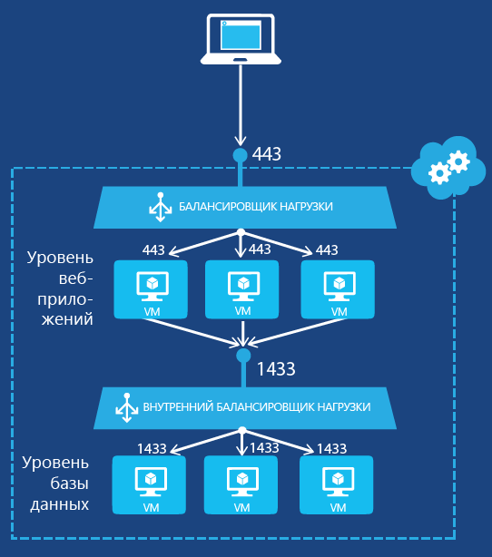

# <a name="get-started-creating-an-internal-load-balancer-classic-using-powershell"></a>Приступая к созданию внутреннего балансировщика нагрузки (классическая модель) с помощью PowerShell

> [!div class="op_single_selector"]
> * [PowerShell](../load-balancer/load-balancer-get-started-ilb-classic-ps.md)
> * [Интерфейс командной строки Azure](../load-balancer/load-balancer-get-started-ilb-classic-cli.md)
> * [Облачные службы](../load-balancer/load-balancer-get-started-ilb-classic-cloud.md)

[!INCLUDE [load-balancer-get-started-ilb-intro-include.md](../../includes/load-balancer-get-started-ilb-intro-include.md)]

> [!IMPORTANT]
> В Azure предлагаются две модели развертывания для создания ресурсов и работы с ними: [модель Resource Manager и классическая модель](../azure-resource-manager/resource-manager-deployment-model.md).  В этой статье рассматривается использование классической модели развертывания. Для большинства новых развертываний Майкрософт рекомендует использовать модель диспетчера ресурсов. Узнайте, как [выполнить эти действия с помощью модели Resource Manager](load-balancer-get-started-ilb-arm-ps.md).

[!INCLUDE [load-balancer-get-started-ilb-scenario-include.md](../../includes/load-balancer-get-started-ilb-scenario-include.md)]

[!INCLUDE [azure-ps-prerequisites-include.md](../../includes/azure-ps-prerequisites-include.md)]

## <a name="create-an-internal-load-balancer-set-for-virtual-machines"></a>Создание набора внутреннего балансировщика нагрузки для виртуальных машин

Чтобы создать набор внутреннего балансировщика нагрузки и серверы, которые будут направлять на него свой трафик, выполните следующее:

1. Создайте экземпляр внутренней балансировки нагрузки. Он будет служить конечной точкой для входящего трафика, который необходимо распределять по серверам в наборе балансировки нагрузки.
2. Добавьте конечные точки, соответствующие виртуальным машинам, которые будут принимать входящий трафик.
3. Настройте серверы, которые будут отправлять трафик для балансировки нагрузки, таким образом, чтобы они передавали трафик на виртуальный IP-адрес экземпляра внутренней балансировки нагрузки.

### <a name="step-1-create-an-internal-load-balancing-instance"></a>Шаг 1. Создание экземпляра внутренней балансировки нагрузки

Для существующей облачной службы или облачной службы, развернутой в региональной виртуальной сети, можно создать экземпляр внутренней балансировки нагрузки с помощью следующих команд Windows PowerShell:

```powershell
$svc="<Cloud Service Name>"
$ilb="<Name of your ILB instance>"
$subnet="<Name of the subnet within your virtual network>"
$IP="<The IPv4 address to use on the subnet-optional>"

Add-AzureInternalLoadBalancer -ServiceName $svc -InternalLoadBalancerName $ilb –SubnetName $subnet –StaticVNetIPAddress $IP
```

Обратите внимание, что здесь командлет [Add-AzureEndpoint](https://msdn.microsoft.com/library/dn495300.aspx) Windows PowerShell использует набор параметров DefaultProbe. Дополнительную информацию о дополнительных наборах параметров см. в документации [Add-AzureEndpoint](https://msdn.microsoft.com/library/dn495300.aspx).

### <a name="step-2-add-endpoints-to-the-internal-load-balancing-instance"></a>Шаг 2: Добавление конечных точек в экземпляр внутренней балансировки нагрузки

Вот пример: 

```powershell
$svc="mytestcloud"
$vmname="DB1"
$epname="TCP-1433-1433"
$lbsetname="lbset"
$prot="tcp"
$locport=1433
$pubport=1433
$ilb="ilbset"
Get-AzureVM –ServiceName $svc –Name $vmname | Add-AzureEndpoint -Name $epname -Lbset $lbsetname -Protocol $prot -LocalPort $locport -PublicPort $pubport –DefaultProbe -InternalLoadBalancerName $ilb | Update-AzureVM
```

### <a name="step-3-configure-your-servers-to-send-their-traffic-to-the-new-internal-load-balancing-endpoint"></a>Шаг 3. Настройка серверов для отправки трафика на новую конечную точку внутренней балансировки нагрузки

На серверах, трафик которых будет перераспределяться, необходимо настроить использование нового виртуального IP-адреса экземпляра внутренней балансировки нагрузки. Этот адрес прослушивается экземпляром внутренней балансировки нагрузки. В большинстве случаев достаточно просто добавить или изменить запись DNS для виртуального IP-адреса экземпляра внутренней балансировки нагрузки.

Если во время создания экземпляра внутренней балансировки нагрузки вы указали IP-адрес, то виртуальный IP-адрес у вас уже есть. В противном случае его можно получить с помощью следующих команд:

```powershell
$svc="<Cloud Service Name>"
Get-AzureService -ServiceName $svc | Get-AzureInternalLoadBalancer
```

Чтобы использовать эти команды, заполните значения и удалите символы < и >. Вот пример: 

```powershell
$svc="mytestcloud"
Get-AzureService -ServiceName $svc | Get-AzureInternalLoadBalancer
```

Обратите внимание на IP-адрес в результатах выполнения команды Get-AzureInternalLoadBalancer и внесите необходимые изменения в настройки серверов или записи DNS, чтобы обеспечить отправку трафика на виртуальный IP-адрес.

> [!NOTE]
> Для различных сценариев администрирования платформа Microsoft Azure использует статические общедоступные маршрутизируемые IPv4-адреса. IP-адрес — 168.63.129.16. Не блокируйте этот IP-адрес брандмауэрами, поскольку это может привести к непредвиденному поведению.
> Во внутренней подсистеме балансировки нагрузки Azure этот IP-адрес используется зондами мониторинга для определения состояния виртуальных машин в наборе балансировки нагрузки. Если группа безопасности сети используется для ограничения трафика, поступающего на виртуальные машины Azure во внутреннем наборе балансировки нагрузки, или если она применяется к подсети виртуальной сети, убедитесь, что правила сетевой безопасности разрешают поступление сетевого трафика с адреса 168.63.129.16.

## <a name="example-of-internal-load-balancing"></a>Пример внутренней балансировки нагрузки

Подробное описание создания набора балансировки нагрузки для двух примеров конфигурации см. в следующих разделах.

### <a name="an-internet-facing-multi-tier-application"></a>Многоуровневое приложение для Интернета

Вы хотите предоставить службу базы данных с балансировкой нагрузки для набора веб-серверов с выходом в Интернет. Оба набора серверов размещены в одной облачной службе Azure. Трафик веб-серверов для TCP-порта 1433 необходимо распределить среди двух виртуальных машин на уровне базы данных. На рис. 1 показана эта конфигурация.



Конфигурация состоит из следующих элементов:

* Существующая облачная служба, в которой размещены виртуальные машины, называется mytestcloud.
* Два существующих сервера базы данных называются DB1 и DB2.
* Веб-серверы на уровне Интернета подключаются к серверам базы данных на уровне базы данных, используя частный IP-адрес. Другой вариант — использовать собственный DNS-сервер для виртуальной сети и вручную зарегистрировать запись A для набора внутреннего балансировщика нагрузки.

Следующие команды позволяют настроить новый экземпляр внутренней балансировки нагрузки с именем **ILBset** и добавить конечные точки для виртуальных машин, соответствующие двум серверам базы данных:

```powershell
$svc="mytestcloud"
$ilb="ilbset"
Add-AzureInternalLoadBalancer -ServiceName $svc -InternalLoadBalancerName $ilb
$prot="tcp"
$locport=1433
$pubport=1433
$epname="TCP-1433-1433"
$lbsetname="lbset"
$vmname="DB1"
Get-AzureVM –ServiceName $svc –Name $vmname | Add-AzureEndpoint -Name $epname -LbSetName $lbsetname -Protocol $prot -LocalPort $locport -PublicPort $pubport –DefaultProbe -InternalLoadBalancerName $ilb | Update-AzureVM

$epname="TCP-1433-1433-2"
$vmname="DB2"
Get-AzureVM –ServiceName $svc –Name $vmname | Add-AzureEndpoint -Name $epname -LbSetName $lbsetname -Protocol $prot -LocalPort $locport -PublicPort $pubport –DefaultProbe -InternalLoadBalancerName $ilb | Update-AzureVM
```

## <a name="remove-an-internal-load-balancing-configuration"></a>Удаление конфигурации внутренней балансировки нагрузки

Чтобы удалить виртуальную машину как конечную точку из экземпляра внутреннего балансировщика нагрузки, выполните следующие команды:

```powershell
$svc="<Cloud service name>"
$vmname="<Name of the VM>"
$epname="<Name of the endpoint>"
Get-AzureVM -ServiceName $svc -Name $vmname | Remove-AzureEndpoint -Name $epname | Update-AzureVM
```

Чтобы использовать эти команды, заполните значения и удалите символы < и >.

Вот пример: 

```powershell
$svc="mytestcloud"
$vmname="DB1"
$epname="TCP-1433-1433"
Get-AzureVM -ServiceName $svc -Name $vmname | Remove-AzureEndpoint -Name $epname | Update-AzureVM
```

Чтобы удалить экземпляр внутреннего балансировщика нагрузки из облачной службы, выполните следующие команды:

```powershell
$svc="<Cloud service name>"
Remove-AzureInternalLoadBalancer -ServiceName $svc
```

Чтобы использовать эти команды, заполните значения и удалите символы < и >.

Вот пример: 

```powershell
$svc="mytestcloud"
Remove-AzureInternalLoadBalancer -ServiceName $svc
```

## <a name="additional-information-about-internal-load-balancer-cmdlets"></a>Дополнительная информация о командлетах для внутреннего балансировщика нагрузки

Чтобы получить дополнительную информацию о командлетах внутренней балансировки нагрузки, выполните следующие команды в командной строке Windows PowerShell:

```powershell
Get-Help New-AzureInternalLoadBalancerConfig -full
Get-Help Add-AzureInternalLoadBalancer -full
Get-Help Get-AzureInternalLoadbalancer -full
Get-Help Remove-AzureInternalLoadBalancer -full
```

## <a name="next-steps"></a>Дополнительная информация

[Настройка режима распределения балансировщика нагрузки с помощью соответствия исходному IP-адресу](load-balancer-distribution-mode.md)

[Настройка параметров времени ожидания простоя TCP для подсистемы балансировки нагрузки](load-balancer-tcp-idle-timeout.md)

