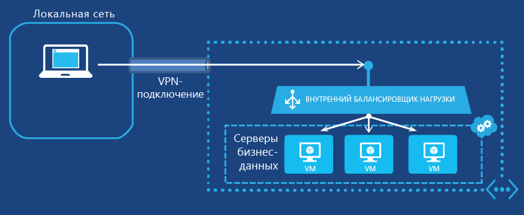

<properties
   pageTitle="Приступая к работе с внутренней подсистемой балансировки нагрузки | Microsoft Azure"
   description="Настройка внутренней подсистемы балансировки нагрузки и способы ее реализации для виртуальных машин и облачных развертываний"
   services="load-balancer"
   documentationCenter="na"
   authors="joaoma"
   manager="adinah"
   editor="tysonn" />
<tags
   ms.service="load-balancer"
   ms.devlang="na"
   ms.topic="get-started-article"
   ms.tgt_pltfrm="na"
   ms.workload="infrastructure-services"
   ms.date="06/15/2015"
   ms.author="joaoma" />

# Приступая к настройке внутренней подсистемы балансировки нагрузки

Внутренняя балансировка нагрузки Azure обеспечивает балансировку нагрузки между виртуальными машинами, которые размещены в облачной службе или региональной виртуальной сети. Информацию об использовании и настройке региональных виртуальных сетей см. в разделе [Региональные виртуальные сети](../regional-virtual-networks.md) в блоге Azure. В имеющихся виртуальных сетях, настроенных для территориальной группы, невозможно использовать внутреннюю балансировку нагрузки.

## Создание внутреннего набора балансировки нагрузки для виртуальных машин

Чтобы создать внутренний набор балансировки нагрузки Azure и серверы, которые будут направлять на него трафик, выполните следующее:

1. Создайте экземпляр внутренней балансировки нагрузки, который будет конечной точкой входящего трафика, который необходимо распределять по серверам набора балансировки нагрузки.

1. Добавьте конечные точки, соответствующие виртуальным машинам, которые будут принимать входящий трафик.

1. Настройте серверы, которые будут отправлять трафик для балансировки нагрузки, так, чтобы они передавали трафик на виртуальный IP-адрес экземпляра внутренней балансировки нагрузки.

### Шаг 1. Создание экземпляра внутренней балансировки нагрузки

Для существующей облачной службы или облачной службы, развернутой в региональной виртуальной сети, можно создать экземпляр внутренней балансировки нагрузки с помощью следующих команд Windows PowerShell:

	$svc="<Cloud Service Name>"
	$ilb="<Name of your ILB instance>"
	$subnet="<Name of the subnet within your virtual network>"
	$IP="<The IPv4 address to use on the subnet-optional>"

	Add-AzureInternalLoadBalancer -ServiceName $svc -InternalLoadBalancerName $ilb –SubnetName $subnet –StaticVNetIPAddress $IP

Чтобы использовать эти команды, заполните значения и удалите символы < and >. Пример:

	$svc="WebCloud-NY"
	$ilb="SQL-BE"
	$subnet="Farm1"
	$IP="192.168.98.10"
	Add-AzureInternalLoadBalancer -ServiceName $svc -InternalLoadBalancerName $ilb –SubnetName $subnet –StaticVNetIPAddress $IP

### Шаг 2. Добавление конечных точек в экземпляр внутренней балансировки нагрузки

Для имеющихся виртуальных машин можно добавить конечные точки в экземпляр внутренней балансировки нагрузки с помощью следующих команд:

	$svc="<Cloud service name>"
	$vmname="<Name of the VM>"
	$epname="<Name of the endpoint>"
	$lbsetname="<Name of the load balancer set>"
	$prot="tcp" or "udp"
	$locport=<local port number>
	$pubport=<public port number>
	$ilb="<Name of your ILB instance>"
	Get-AzureVM –ServiceName $svc –Name $vmname | Add-AzureEndpoint -Name $epname -LbsetName $lbsetname -Protocol $prot -LocalPort $locport -PublicPort $pubport –DefaultProbe -InternalLoadBalancerName $ilb | Update-AzureVM

Чтобы использовать эти команды, заполните значения и удалите символы < and >.

Обратите внимание, что здесь командлет [Add-AzureEndpoint](https://msdn.microsoft.com/library/dn495300.aspx) Windows PowerShell использует набор параметров DefaultProbe. Дополнительную информацию о дополнительных наборах параметров см. в разделе [Add-AzureEndpoint](https://msdn.microsoft.com/library/dn495300.aspx).

Пример:

	$svc="AZ-LOB1"
	$vmname="SQL-LOBAZ1"
	$epname="SQL1"
	$lbsetname="SQL-LB"
	$prot="tcp"
	$locport=1433
	$pubport=1433
	$ilb="SQL ILB"
	Get-AzureVM –ServiceName $svc –Name $vmname | Add-AzureEndpoint -Name $epname -Lbset $lbsetname -Protocol $prot -LocalPort $locport -PublicPort $pubport –DefaultProbe -InternalLoadBalancerName $ilb | Update-AzureVM

### Шаг 3. Настройка серверов для отправки трафика новой конечной точке внутренней балансировки нагрузки

Вам требуется настроить серверы, для трафика которых будет выполняться балансировка нагрузки, для использования нового виртуального IP-адреса экземпляра внутренней балансировки нагрузки. Это адрес, прослушиваемый экземпляром внутренней балансировки нагрузки. В большинстве случаев необходимо просто добавить или изменить запись DNS для виртуального IP-адреса экземпляра внутренней балансировки нагрузки.

Если вы указали IP-адрес во время создания экземпляра внутренней балансировки нагрузки, у вас уже есть виртуальный IP-адрес. В противном случае его можно получить с помощью следующих команд:

	$svc="<Cloud Service Name>"
	Get-AzureService -ServiceName $svc | Get-AzureInternalLoadBalancer

Чтобы использовать эти команды, заполните значения и удалите символы < and >. Пример:

	$svc="WebCloud-NY"
	Get-AzureService -ServiceName $svc | Get-AzureInternalLoadBalancer

Обратите внимание на IP-адрес в результатах выполнения команды Get-AzureInternalLoadBalancer и внесите необходимые изменения в настройки серверов или записи DNS, чтобы обеспечить отправку трафика на виртуальный IP-адрес.

>[AZURE.IMPORTANT]Для различных сценариев администрирования платформа Microsoft Azure использует статические общедоступные маршрутизируемые IPv4-адреса. IP-адрес — 168.63.129.16. Не блокируйте этот IP-адрес какими-либо брандмауэрами, поскольку это может привести к непредвиденному поведению. Во внутренней подсистеме балансировки нагрузки Azure этот IP-адрес используется зондами мониторинга для определения состояния виртуальных машин в наборе балансировки нагрузки. Если группа безопасности сети используется для ограничения трафика, поступающего на виртуальные машины Azure во внутреннем наборе балансировки нагрузки, или если она применяется к подсети виртуальной сети, убедитесь в наличии правила сетевой безопасности, разрешающего поступление сетевого трафика с адреса 168.63.129.16.

## Полные примеры внутренней балансировки нагрузки

Подробное описание создания набора балансировки нагрузки для двух примеров конфигурации см. в следующих разделах.

### Многоуровневое приложение, доступное в Интернете

Корпорации Contoso требуется реализовать балансировку нагрузки между набором веб-серверов, доступных в Интернете, и набором серверов баз данных. Оба набора серверов размещены в одной облачной службе Azure. Трафик веб-серверов для TCP-порта 1433 необходимо распределить среди трех виртуальных машин на уровне базы данных. На рис. 1 показана эта конфигурация.

Рис. 1. Пример многоуровневого приложения, доступного в Интернете

Конфигурация состоит из следующих элементов:

- имеющаяся облачная служба с именем Contoso-PartnerSite, в которой размещены виртуальные машины;

- три имеющихся сервера баз данных с именами PARTNER-SQL-1, PARTNER-SQL-2 и PARTNER-SQL-3;

- веб-серверы на веб-уровне, которые подключаются к серверам баз данных на уровне базы данных, используя DNS-имя partner-sql.external.contoso.com.

Следующие команды позволяют настроить новый экземпляр внутренней балансировки нагрузки с именем PARTNER-DBTIER и добавить конечные точки для виртуальных машин, соответствующие трем серверам баз данных:

	$svc="Contoso-PartnerSite"
	$ilb="PARTNER-DBTIER"
	Add-AzureInternalLoadBalancer -ServiceName $svc -InternalLoadBalancerName $ilb

	$prot="tcp"
	$locport=1433
	$pubport=1433
	$epname="DBTIER1"
	$lbsetname="SQL-LB"
	$vmname="PARTNER-SQL-1"
	Get-AzureVM –ServiceName $svc –Name $vmname | Add-AzureEndpoint -Name $epname -LbSetName $lbsetname -Protocol $prot -LocalPort $locport -PublicPort $pubport –DefaultProbe -InternalLoadBalancerName $ilb | Update-AzureVM

	$epname="DBTIER2"
	$vmname="PARTNER-SQL-2"
	Get-AzureVM –ServiceName $svc –Name $vmname | Add-AzureEndpoint -Name $epname -LbSetName $lbsetname -Protocol $prot -LocalPort $locport -PublicPort $pubport –DefaultProbe -InternalLoadBalancerName $ilb | Update-AzureVM

	$epname="DBTIER3"
	$vmname="PARTNER-SQL-3"
	Get-AzureVM –ServiceName $svc –Name $vmname | Add-AzureEndpoint -Name $epname -LbSetName $lbsetname -Protocol $prot -LocalPort $locport -PublicPort $pubport –DefaultProbe -InternalLoadBalancerName $ilb | Update-AzureVM

Затем компания Contoso определила виртуальный IP-адрес экземпляра внутренней балансировки нагрузки PARTNER-DBTIER с помощью следующей команды:

	Get-AzureService -ServiceName $svc | Get-AzureInternalLoadBalancer

В результатах выполнения команды компания Contoso отметила виртуальный IP-адрес 100.64.65.211 и настроила запись DNS-адреса (A) для имени partner-sql.external.contoso.com, чтобы использовать новый адрес.

### Бизнес-приложение, размещенное в Azure

Корпорации Contoso необходимо разместить бизнес-приложение в наборе веб-серверов в Azure. Для клиентского трафика, поступающего на TCP-порт 80, необходимо распределить нагрузку среди трех виртуальных машин в распределенной виртуальной сети. На рис. 2 показана эта конфигурация.

Рис. 2. Пример бизнес-приложения, размещенного в Azure

Конфигурация состоит из следующих элементов:

- имеющаяся облачная служба с именем Contoso-Legal, в которой размещены виртуальные машины;

- подсеть с именем LOB-LEGAL, в которой размещены серверы бизнес-приложений. Компания Contoso выбрала виртуальный IP-адрес 198.168.99.145 для внутренней подсистемы балансировки нагрузки;

- три имеющиеся сервера бизнес-приложений с именами LEGAL-1, LEGAL-2 и LEGAL-3;

- веб-клиенты из интрасети, которые подключаются к этим серверам с помощью DNS-имени legalnet.corp.contoso.com.

Следующие команды позволяют создать экземпляр внутренней балансировки нагрузки с именем LEGAL-ILB и добавить конечные точки для виртуальных машин, соответствующие трем серверам бизнес-приложений:

	$svc="Contoso-Legal"
	$ilb="LEGAL-ILB"
	$subnet="LOB-LEGAL"
	$IP="198.168.99.145"
	Add-AzureInternalLoadBalancer –ServiceName $svc -InternalLoadBalancerName $ilb –SubnetName $subnet –StaticVNetIPAddress $IP

	$prot="tcp"
	$locport=80
	$pubport=80
	$epname="LOB1"
	$lbsetname="LOB-LB"
	$vmname="LEGAL-1"
	Get-AzureVM –ServiceName $svc –Name $vmname | Add-AzureEndpoint -Name $epname-LbSetName $lbsetname -Protocol $prot -LocalPort $locport -PublicPort $pubport –DefaultProbe -InternalLoadBalancerName $ilb | Update-AzureVM

	$epname="LOB2"
	$vmname="LEGAL2"
	Get-AzureVM –ServiceName $svc –Name $vmname | Add-AzureEndpoint -Name $epname -LbSetName $lbsetname -Protocol $prot -LocalPort $locport -PublicPort $pubport –DefaultProbe -InternalLoadBalancerName $ilb | Update-AzureVM

	$epname="LOB3"
	$vmname="LEGAL3"
	Get-AzureVM –ServiceName $svc –Name $vmname | Add-AzureEndpoint -Name $epname -LbSetName $lbsetname -Protocol $prot -LocalPort $locport -PublicPort $pubport –DefaultProbe -InternalLoadBalancerName $ilb | Update-AzureVM

Затем компания Contoso настроила запись DNS A для имени legalnet.corp.contoso.com, чтобы использовать адрес 198.168.99.145.

## Добавление виртуальной машины для внутренней балансировки нагрузки

Чтобы добавить виртуальную машину в экземпляр внутренней балансировки нагрузки при его создании, можно воспользоваться командлетами New-AzureInternalLoadBalancerConfig и New-AzureVMConfig.

Пример:

	$svc="AZ-LOB1"
	$ilb="LOB-ILB"
	$vnet="LOBNet_Azure"
	$subnet="LOBServers"
	$vmname="LOB-WEB1"
	$adminuser="Lando"
	$adminpw="Platform327"
	$regionname="North Central US"

	$myilbconfig=New-AzureInternalLoadBalancerConfig -InternalLoadBalancerName $ilb -SubnetName $subnet
	$images = Get-AzureVMImage
	New-AzureVMConfig -Name $vmname -InstanceSize Small -ImageName $images[50].ImageName | Add-AzureProvisioningConfig -Windows -AdminUsername $adminuser -Password $adminpw | New-AzureVM -ServiceName $svc -InternalLoadBalancerConfig $myilbconfig -Location $regionname –VNetName $vnet

## Настройка внутренней балансировки нагрузки для облачных служб

Внутренняя балансировка нагрузки поддерживается для виртуальных машин и облачных служб. Доступ к конечной точке внутренней балансировки нагрузки, созданной в облачной службе за пределами региональной виртуальной сети, можно будет получить только в облачной службе.

Конфигурацию внутренней балансировки нагрузки необходимо настраивать во время создания первого развертывания в облачной службе, как показано в примере командлета ниже.

### Создание локального объекта внутренней балансировки нагрузки
	$myilbconfig = New-AzureInternalLoadBalancerConfig -InternalLoadBalancerName "MyILB"

### Добавление внутренней подсистемы балансировки нагрузки для новой службы

	New-AzureVMConfig -Name "Instance1" -InstanceSize Small -ImageName <imagename> | Add-AzureProvisioningConfig -Windows -AdminUsername <username> -Password <password> | New-AzureVM -ServiceName "Website2" -InternalLoadBalancerConfig $myilbconfig -Location "West US"

## Удаление конфигурации внутренней балансировки нагрузки

Чтобы удалить виртуальную машину как конечную точку из экземпляра внутренней балансировки нагрузки, выполните следующие команды:

	$svc="<Cloud service name>"
	$vmname="<Name of the VM>"
	$epname="<Name of the endpoint>"
	Get-AzureVM -ServiceName $svc -Name $vmname | Remove-AzureEndpoint -Name $epname | Update-AzureVM

Чтобы использовать эти команды, заполните значения и удалите символы < and >.

Пример:

	$svc="AZ-LOB1"
	$vmname="SQL-LOBAZ1"
	$epname="SQL1"
	Get-AzureVM -ServiceName $svc -Name $vmname | Remove-AzureEndpoint -Name $epname | Update-AzureVM

Чтобы удалить экземпляр внутренней балансировки нагрузки из облачной службы, выполните следующие команды:

	$svc="<Cloud service name>"
	Remove-AzureInternalLoadBalancer -ServiceName $svc

Чтобы использовать эти команды, заполните значение и удалите символы < and >.

Пример:

	$svc="AZ-LOB1"
	Remove-AzureInternalLoadBalancer -ServiceName $svc

## Дополнительная информация о командлетах внутренней балансировки нагрузки

Чтобы получить дополнительную информацию о командлетах внутренней балансировки нагрузки, выполните следующие команды в командной строке Azure Windows PowerShell:

- Get-help New-AzureInternalLoadBalancerConfig -full

- Get-help Add-AzureInternalLoadBalancer -full

- Get-help Get-AzureInternalLoadbalancer -full

- Get-help Remove-AzureInternalLoadBalancer -full

## См. также

[Настройка режима распределения подсистемы балансировки нагрузки](load-balancer-distribution-mode.md)

[Настройка параметров времени ожидания простоя TCP для подсистемы балансировки нагрузки](load-balancer-tcp-idle-timeout.md)
 

<!---HONumber=July15_HO2-->