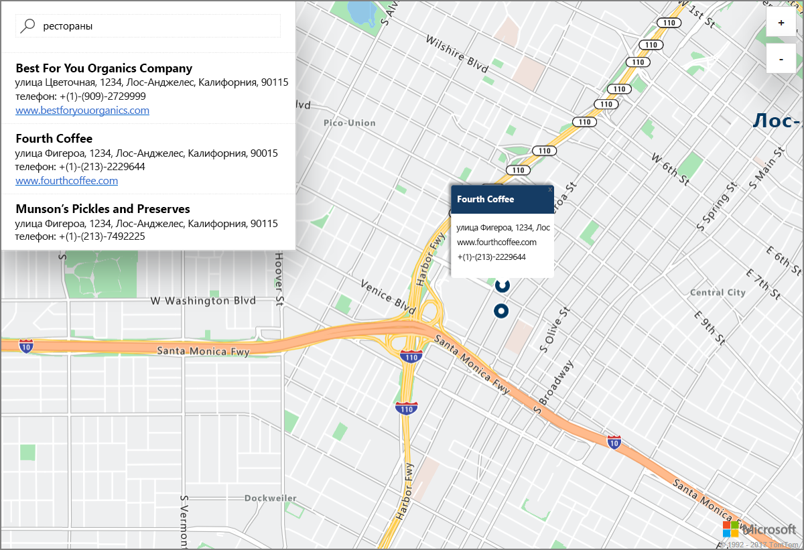

# Запуск демонстрационной версии службы поиска на карте с помощью Azure Location Based Services (предварительная версия)

В этой статье описаны возможности Azure Location Based Services (LBS) по выполнению интерактивного поиска. В ней также описываются основные действия по созданию учетной записи LBS и получению ключа учетной записи для использования в демонстрационной версии веб-приложения. 

Если у вас еще нет подписки Azure, [создайте бесплатную учетную запись Azure](https://azure.microsoft.com/free/?WT.mc_id=A261C142F), прежде чем начинать работу.

## Войдите на портал Azure.

Войдите на [портал Azure](https://portal.azure.com/).

## Создание учетной записи Location Based Services и получение ключа учетной записи

1. В верхнем левом углу [портала Azure](https://portal.azure.com) щелкните **Создать ресурс**.
2. В поле *Поиск по Marketplace* введите **location based services**.
3. В области *Результаты* щелкните **Location Based Services (preview)** (Location Based Services (предварительная версия)). Нажмите кнопку **Создать**, расположенную под картой. 
4. На странице **Создание учетной записи Location Based Services** введите *имя* новой учетной записи, выберите *подписку* и введите имя новой или существующей *группы ресурсов*. Выберите расположение группы ресурсов, примите *условия использования предварительной версии* и нажмите кнопку **Создать**.

    

5. После успешного создания учетной записи откройте ее и перейдите на ее страницу **Параметры**. Щелкните **Ключи**, чтобы получить первичный и вторичный ключи для своей учетной записи Azure Location Based Services. Скопируйте значение **Первичный ключ** в локальный буфер обмена, чтобы использовать его в следующем разделе. 

## Скачивание демонстрационной версии приложения

1. Скачайте файл [interactiveSearch.html](https://github.com/Azure-Samples/location-based-services-samples/blob/master/src/interactiveSearch.html) или скопируйте его содержимое.
2. Сохраните его локально как файл **AzureMapDemo.html** и откройте в текстовом редакторе.
3. Найдите строку `<insert-key>` и замените ее значением **первичного ключа**, полученным в предыдущем разделе. 

## Запуск демонстрационной версии приложения

1. Откройте файл **AzureMapDemo.html** в браузере на свой выбор.
2. Просмотрите карту Лос-Анджелеса. Город определяется по значению пары `[longitude, latitude]`, присваиваемому переменной JavaScript с именем **center** в файле *AzureMapDemo.html*. Эти координаты можно изменить на любой город на ваш выбор. Например, координаты Нью-Йорка: *[–74.0060, 40.7128]*.
3. В поле поиска в верхнем левом углу демонстрационной версии веб-приложения введите расположение любого типа или адрес, который требуется найти. 
4. Наведите указатель мыши на список адресов или расположений, который отображается под полем поиска, и обратите внимание на то, как над соответствующим маркером на карте всплывают сведения об этом расположении. Например, запуск этого веб-приложения и поиск по запросу *restaurants* приводит к следующему результату. Обратите внимание, что для обеспечения конфиденциальности частных компаний отображаются вымышленные названия и адреса. 

    

## Очистка ресурсов

В этих руководствах подробно описывается использование и настройка Azure Location Based Services для учетной записи. Если вы намерены перейти к их изучению, не удаляйте ресурсы, которые создали при работе с этим кратким руководством. Если вы не планируете продолжать работу, следуйте инструкциям ниже, чтобы удалить все созданные ресурсы.

1. Закройте браузер, в котором выполняется веб-приложение **AzureMapDemo.html**.
2. В меню слева на портале Azure щелкните **Все ресурсы** и выберите свою учетную запись LBS. В верхней части колонки **Все ресурсы** щелкните **Удалить**.

## Дополнительная информация

В этом кратком руководстве вы создали учетную запись Azure LBS и запустили демонстрационную версию приложения с ее помощью. Чтобы узнать, как создать собственное приложение с использованием интерфейсов API Azure Location Based Services, перейдите к следующему руководству.

> [!div class="nextstepaction"]
> [Руководство пользователя по службе карт и службе поиска Azure](./tutorial-search-location.md)
