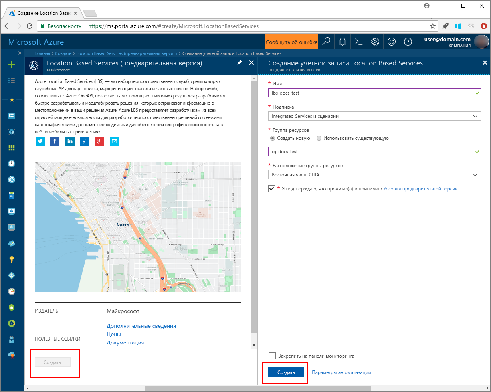

# <a name="search-nearby-points-of-interest-using-azure-location-based-services"></a>Поиск ближайших объектов с помощью Azure Location Based Services

В этом руководстве показано, как настроить учетную запись Azure Location Based Services, а затем использовать предоставленные API для поиска объекта. Из этого руководства вы узнаете, как выполнять такие задачи:

> [!div class="checklist"]
> * Создание учетной записи Azure Location Based Services
> * Получение первичного ключа для учетной записи Azure Location Based Services
> * Создание веб-страницы с помощью API Map Control
> * Использование Службы поиска для поиска ближайшего объекта

Если у вас еще нет подписки Azure, [создайте бесплатную учетную запись Azure](https://azure.microsoft.com/free/), прежде чем начинать работу.

## <a name="log-in-to-the-azure-portal"></a>Войдите на портал Azure.
Войдите на [портал Azure](https://portal.azure.com).

<a id="createaccount"></a>

## <a name="create-an-account-with-azure-location-based-services"></a>Создание учетной записи Azure Location Based Services

Выполните следующие действия, чтобы создать учетную запись Location Based Services.

1. В верхнем левом углу [портала Azure](https://portal.azure.com) щелкните **Создать ресурс**.
2. В поле *Поиск по Marketplace* введите **location based services**.
3. В области *Результаты* щелкните **Location Based Services (preview)** (Location Based Services (предварительная версия)). Нажмите кнопку **Создать**, расположенную под картой. 
4. На странице **Создание учетной записи Location Based Services** введите следующие значения.
    - *Имя* новой учетной записи. 
    - *Подписку*, которую необходимо использовать для этой учетной записи.
    - Имя *группы ресурсов* для этой учетной записи. Вы *создать новую* или *использовать существующую* группу ресурсов.
    - Выберите *расположение группы ресурсов*.
    - Прочитайте *условия использования предварительной версии* и установите флажок, чтобы принять их. 
    - Наконец, нажмите кнопку **Создать**.
   
    


<a id="getkey"></a>

## <a name="get-the-primary-key-for-your-account"></a>Получение первичного ключа для учетной записи

После успешного создания учетной записи Location Based Services выполните приведенные ниже действия, чтобы связать ее с интерфейсами API поиска на карте.

1. Откройте свою учетную запись Location Based Services на портале.
2. Перейдите к разделу **Параметры** своей учетной записи, а затем щелкните **Ключи**.
3. Скопируйте **первичный ключ** в буфер обмена. Сохраните на локальном компьютере для использования в предстоящих действиях. 

    


<a id="createmap"></a>

## <a name="create-new-web-page-using-azure-map-control-api"></a>Создание веб-страницы с помощью API Azure Map Control
API Azure Map Control — это удобная клиентская библиотека, которая позволяет легко интегрировать Azure Location Based Services в веб-приложение. Она скрывает сложность "чистых" вызовов службы REST и ускоряет работу с помощью компонентов, поддерживающих изменение стилей и настройку. Чтобы создать статическую HTML-страницу со встроенным API Map Control API Location Based Services, сделайте следующее. 

1. На локальном компьютере создайте файл **MapSearch.html**. 
2. Добавьте в него следующие компоненты HTML.

    ```HTML
    <!DOCTYPE html>
    <html lang="en">

    <head>
        <meta charset="utf-8" />
        <meta name="viewport" content="width=device-width, user-scalable=no" />
        <title>Map Search</title>

        <link rel="stylesheet" href="https://atlas.microsoft.com/sdk/css/atlas.min.css?api-version=1.0" type="text/css" />
        <script src="https://atlas.microsoft.com/sdk/js/atlas.min.js?api-version=1.0"></script>

        <style>
            html,
            body {
                width: 100%;
                height: 100%;
                padding: 0;
                margin: 0;
            }

            #map {
                width: 100%;
                height: 100%;
            }
        </style>
    </head>

    <body>
        <div id="map"></div>
        <script>
            // Embed Map Control JavaScript code here
        </script>
    </body>

    </html>
    ``` 
    Обратите внимание на то, что заголовок HTML содержит файлы ресурсов CSS и JavaScript, размещенные в библиотеке Azure Map Control. Обратите внимание на сегмент *script*, добавленный в блок *body* HTML-файла. Этот сегмент будет содержать внутренний код JavaScript для доступа к интерфейсам API Azure Location Based Services.
 
3.  Добавьте следующий код JavaScript в блок *script* HTML-файла. Используйте первичный ключ из учетной записи Location Based Services в скрипте. 

    ```JavaScript
    // Instantiate map to the div with id "map"
    var LBSAccountKey = "<_your account key_>";
    var map = new atlas.Map("map", {
        "subscription-key": LBSAccountKey
    });
    ```
    Этот сегмент инициирует API Map Control для ключа учетной записи Azure Location Based Services. **Atlas** — это пространство имен, которое содержит API Azure Map Control и связанные визуальные компоненты. **atlas.Map** предоставляет элемент управления для визуальной интерактивной веб-карты. Чтобы увидеть, как выглядит карта, откройте HTML-страницу в браузере. 

4. Добавьте следующий код JavaScript в блок *script*, чтобы добавить слой маркеров поиска в Map Control.

    ```JavaScript
    // Initialize the pin layer for search results to the map
    var searchLayerName = "search-results";
    map.addPins([], {
        name: searchLayerName,
        cluster: false,
        icon: "pin-round-darkblue"
    });
    ```

5. Сохраните файл на компьютере. 


<a id="usesearch"></a>

## <a name="use-search-service-to-find-nearby-point-of-interest"></a>Использование службы поиска для поиска ближайшего объекта.

В этом разделе показано, как использовать API службы поиска Azure Location Based Services для объекта на карте. Это RESTful API, предназначенный для разработчиков. Он позволяет находить адреса, объекты и другие географические сведения. Служба поиска назначает широту и долготу для определенного адреса. 

1. Откройте файл **MapSearch.html**, созданный в предыдущем разделе, и добавьте следующий код JavaScript в блок *script* для демонстрации работы службы поиска. 
    ```JavaScript
    // Perform a request to the search service and create a pin on the map for each result
    var xhttp = new XMLHttpRequest();
    xhttp.onreadystatechange = function () {
        var searchPins = [];

        if (this.readyState === 4 && this.status === 200) {
            var response = JSON.parse(this.responseText);

            var poiResults = response.results.filter((result) => { return result.type === "POI" }) || [];

            searchPins = poiResults.map((poiResult) => {
                var poiPosition = [poiResult.position.lon, poiResult.position.lat];
                return new atlas.data.Feature(new atlas.data.Point(poiPosition), {
                    name: poiResult.poi.name,
                    address: poiResult.address.freeformAddress,
                    position: poiResult.position.lat + ", " + poiResult.position.lon
                });
            });

            map.addPins(searchPins, {
                name: searchLayerName
            });

            var lons = searchPins.map((pin) => { return pin.geometry.coordinates[0] });
            var lats = searchPins.map((pin) => { return pin.geometry.coordinates[1] });

            var swLon = Math.min.apply(null, lons);
            var swLat = Math.min.apply(null, lats);
            var neLon = Math.max.apply(null, lons);
            var neLat = Math.max.apply(null, lats);

            map.setCameraBounds({
                bounds: [swLon, swLat, neLon, neLat],
                padding: 50
            });
        }
    };
    ```
    Этот фрагмент кода создает [XMLHttpRequest](https://xhr.spec.whatwg.org/) и добавляет обработчик событий для анализа входящего ответа. При получении успешного ответа он собирает сведения об адресах, именах, широте и долготе для каждого полученного места в переменной `searchPins`. Наконец, он добавляет коллекцию расположений в элемент управления `map` в виде маркеров. 

2. Добавьте следующий код в блок *script* для отправки XMLHttpRequest в службу поиска Azure Location Based Services.

    ```JavaScript
    var url = "https://atlas.microsoft.com/search/fuzzy/json?";
    url += "&api-version=1.0";
    url += "&query=gasoline%20station";
    url += "&subscription-key=" + LBSAccountKey;
    url += "&lat=47.6292";
    url += "&lon=-122.2337";
    url += "&radius=100000";

    xhttp.open("GET", url, true);
    xhttp.send();
    ``` 
    Этот фрагмент кода использует базовый API службы поиска, **Fuzzy Search**. Он обрабатывает нечеткие входные данные, принимая любое сочетание маркеров адреса или *объекта*. Он выполняет поиск ближайшей **бензозаправочной станции** для заданного адреса (широта и долгота) в пределах указанного радиуса. Он использует первичный ключ вашей учетной записи, ранее указанный в файле примера, в вызове к Location Based Services. Этот API возвращает результаты в виде пар широты и долготы найденных мест. Чтобы увидеть маркеры поиска, откройте HTML-страницу в браузере. 

3. Добавьте следующие строки в блок *script*, чтобы создать всплывающие элементы для объектов, возвращенных службой поиска.

    ```JavaScript
    // Add a popup to the map which will display some basic information about a search result on hover over a pin
    var popup = new atlas.Popup();
    map.addEventListener("mouseover", searchLayerName, (e) => {
        var popupContentElement = document.createElement("div");
        popupContentElement.style.padding = "5px";

        var popupNameElement = document.createElement("div");
        popupNameElement.innerText = e.features[0].properties.name;
        popupContentElement.appendChild(popupNameElement);

        var popupAddressElement = document.createElement("div");
        popupAddressElement.innerText = e.features[0].properties.address;
        popupContentElement.appendChild(popupAddressElement);

        var popupPositionElement = document.createElement("div");
        popupPositionElement.innerText = e.features[0].properties.position;
        popupContentElement.appendChild(popupPositionElement);

        popup.setPopupOptions({
            position: e.features[0].geometry.coordinates,
            content: popupContentElement
        });

        popup.open(map);
    });
    ```
    **atlas.Popup** API предоставляет информационное окно, которое можно привязать к нужной позиции на карте. Этот фрагмент кода задает содержимое и позицию всплывающего элемента, а также добавляет прослушиватель событий в элемент управления `map`, который ожидает наведения указателя _мыши_ на данный элемент. 

4. Сохраните файл **MapSearch.html**, а затем откройте его в веб-браузере по своему усмотрению и просмотрите результаты. На этом этапе на карте в браузере отображаются информационные всплывающие элементы при наведении указателя мыши на любой показанный маркер поиска (см. пример ниже). 

    


## <a name="next-steps"></a>Дополнительная информация
Из этого руководства вы узнали, как выполнить следующие задачи:

> [!div class="checklist"]
> * Создание учетной записи Azure Location Based Services
> * Получение первичного ключа для учетной записи
> * Создание веб-страницы с помощью API Map Control.
> * Использование службы поиска для поиска ближайшего объекта.

Перейдите к руководству [Поиск маршрута к объекту с помощью Azure Location Based Services](./tutorial-route-location.md), чтобы узнать, как использовать Azure Location Based Services для поиска маршрута к объекту. 
