<properties
    pageTitle="Начало работы со службой Log Analytics | Microsoft Azure"
    description="Настроить и запустить службу Log Analytics в Microsoft Operations Management Suite (OMS) можно всего за несколько минут."
    services="log-analytics"
    documentationCenter=""
    authors="bandersmsft"
    manager="jwhit"
    editor=""/>

<tags
    ms.service="log-analytics"
    ms.workload="na"
    ms.tgt_pltfrm="na"
    ms.devlang="na"
    ms.topic="get-started-article"
    ms.date="10/10/2016"
    ms.author="banders"/>

# Начало работы с Log Analytics

Настроить и запустить службу Log Analytics в Microsoft Operations Management Suite (OMS) можно всего за несколько минут. Вы можете выбрать один из двух способов создания рабочей области OMS, которая подобна учетной записи:

- Веб-сайт Microsoft Operations Management Suite
- Подписка на Microsoft Azure

Бесплатную рабочую область OMS можно создать с помощью веб-сайта OMS. Вы также можете использовать подписку на Microsoft Azure для создания рабочей области OMS. Обе рабочие области функционируют одинаково за тем исключением, что бесплатная рабочая область OMS может отправлять в службу OMS не более 500 МБ в день. Если применяется подписка на Azure, ее также можно использовать для доступа к другим службам Azure. Независимо от используемого метода создания рабочей области, применяется либо учетная запись Майкрософт, либо учетная запись организации.

Процесс описан ниже:

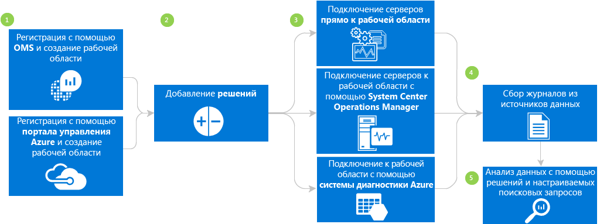

## Предварительные требования службы Log Analytics и рекомендации по развертыванию

- Платная подписка Microsoft Azure для полноценного использования службы Log Analytics. Если у вас нет подписки Azure, вы можете создать [бесплатную учетную запись](https://azure.microsoft.com/free/) , предоставляющую доступ ко всем службам Azure. Кроме того, вы можете создать бесплатную учетную запись OMS: откройте веб-сайт [Operations Management Suite](http://microsoft.com/oms) и нажмите кнопку **Бесплатное пробное использование**.
- Рабочая область OMS
- Windows Server 2008 SP1 или более новой версии на каждом компьютере с Windows, с которого нужно собирать данные.
- [брандмауэр](log-analytics-proxy-firewall.md) .
- Сервер (шлюз) [пересылки службы Log Analytics в OMS](https://blogs.technet.microsoft.com/msoms/2016/03/17/oms-log-analytics-forwarder) для переадресации трафика с серверов в OMS, если на этих компьютерах отсутствует доступ к Интернету.
- При использовании Operations Manager служба Log Analytics поддерживает Operations Manager 2012 SP1 UR6 и более новой версии, а также Operations Manager 2012 R2 UR2 и более новой версии. Поддержка прокси-сервера была добавлена в Operations Manager 2012 с пакетом обновления 1 (SP1) и накопительным пакетом обновления 7 (UR7) и в Operations Manager 2012 R2 с накопительным пакетом обновления 3 (UR3). Определите метод его интеграции с OMS.
- Определите, имеют ли компьютеры прямое подключение к Интернету. Если нет, для доступа к веб-сайтам OMS им потребуется сервер шлюза. Весь доступ осуществляется по протоколу HTTPS.
- Определите, какие технологии и серверы будут отправлять данные в OMS, например контроллеры домена, SQL Server и т. д.
- Предоставление разрешений пользователям в OMS и Azure.
- Если вас беспокоит использование данных, разверните каждое решение отдельно и проверьте его влияние на производительность, прежде чем добавлять другие решения.
- По мере добавления решений и функций в службу Log Analytics проверяйте использование данных и производительность. Сюда входят сбор событий, сбор журналов, сбор данных о производительности и т. д. Лучше всего начать со сбора минимальных данных и расширять их объем, пока не будет обнаружено влияние на использование данных или производительность.
- Убедитесь, что агентами Windows не управляет Operations Manager — в противном случае возможно дублирование данных. Это относится также к агентам на базе Azure с включенной диагностикой Azure.
- После установки агентов убедитесь, что агент работает правильно. Если это не так, убедитесь, что изоляция ключа API Cryptography следующего поколения (CNG) не отключена с помощью групповой политики.
- Некоторые решения службы Log Analytics имеют дополнительные требования.

## Регистрация в 3 этапа с помощью Operations Management Suite

1. Откройте веб-сайт [Operations Management Suite](http://microsoft.com/oms) и нажмите кнопку **Бесплатное пробное использование**. Войдите с помощью учетной записи Майкрософт, например Outlook.com, или организационной учетной записи, которую предоставила компания или образовательная организация для работы с Office 365 или другими службами Майкрософт.
2. Укажите уникальное имя рабочей области. Рабочая область — это логический контейнер, где хранятся данные управления. Он позволяет разбивать данные между разными группами в организации, поскольку данные принадлежат только к его рабочей области. Укажите адрес электронной почты и регион, в котором нужно хранить данные.  
    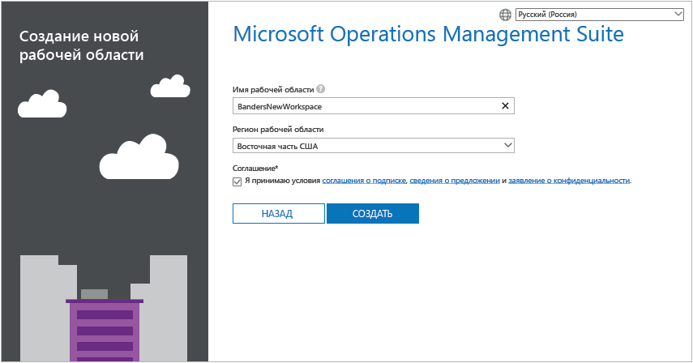
3. Затем можно создать новую подписку на Azure или ссылку на существующую. Если вы хотите продолжить использовать бесплатную пробную версию, нажмите кнопку **Не сейчас**.  
  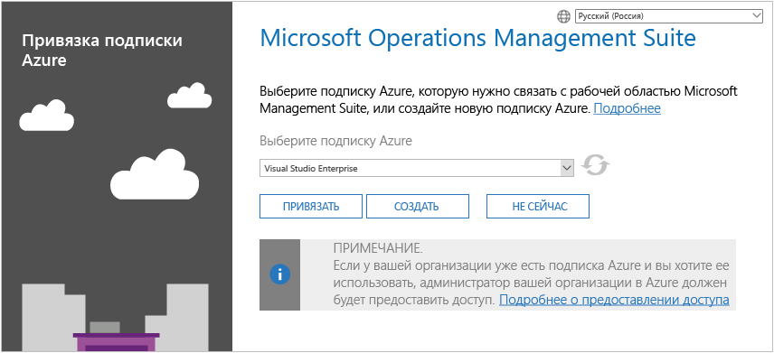

Вы готовы приступать к работе с порталом Operations Management Suite.

Дополнительные сведения о настройке рабочей области и связывании существующих учетных записей Azure с рабочими областями, созданными с помощью Operations Management Suite, приведены в статье [Управление доступом к Log Analytics](log-analytics-manage-access.md).

## Быстрая регистрация с помощью Microsoft Azure

1. Перейдите на [портал Azure](https://portal.azure.com) , выполните вход, найдите список служб и выберите **Log Analytics (OMS)**.  
    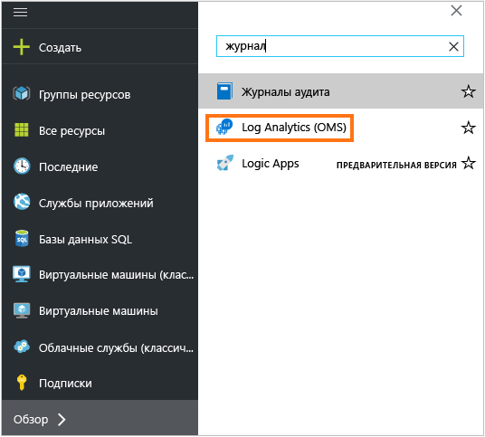
2. Щелкните **Добавить**и выберите параметры для следующих элементов.
    - **рабочей области OMS** 
    - **Подписка** : если у вас есть несколько подписок, выберите ту, которую нужно привязать к новой рабочей области.
    - **Группа ресурсов**
    - **Расположение**
    - **Ценовая категория**  
        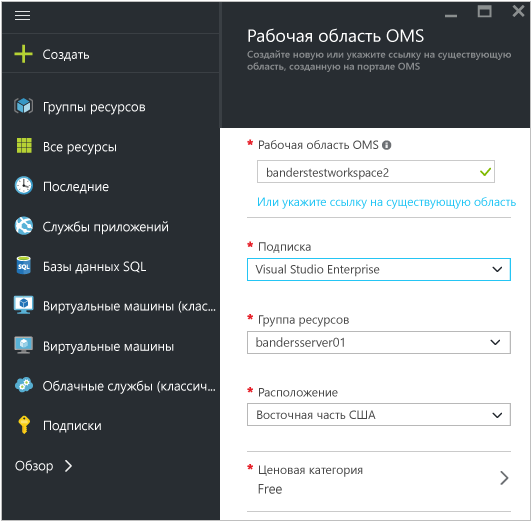
3. Щелкните **Создать** , и вы увидите сведения о рабочей области на портале Azure.       
    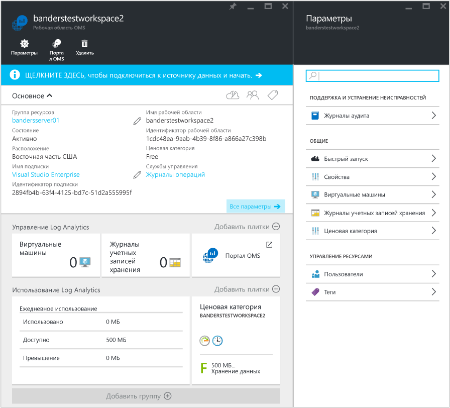         
4. Щелкните ссылку **портал OMS** , чтобы открыть веб-сайт Operations Management Suite с новой рабочей областью.

Вы готовы к работе с порталом Operations Management Suite.

Дополнительные сведения о настройке рабочей области и связывании подписок Azure с имеющимися рабочими областями, созданными с помощью Operations Management Suite, приведены в статье [Управление доступом к Log Analytics](log-analytics-manage-access.md).

## Начало работы с порталом Operations Management Suite
Чтобы выбрать решения и подключиться к серверам, которыми нужно управлять, щелкните элемент **Параметры** и следуйте указаниям в этом разделе.  

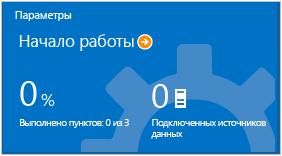  

1. **Добавьте решения.** Просмотрите установленные решения.  
    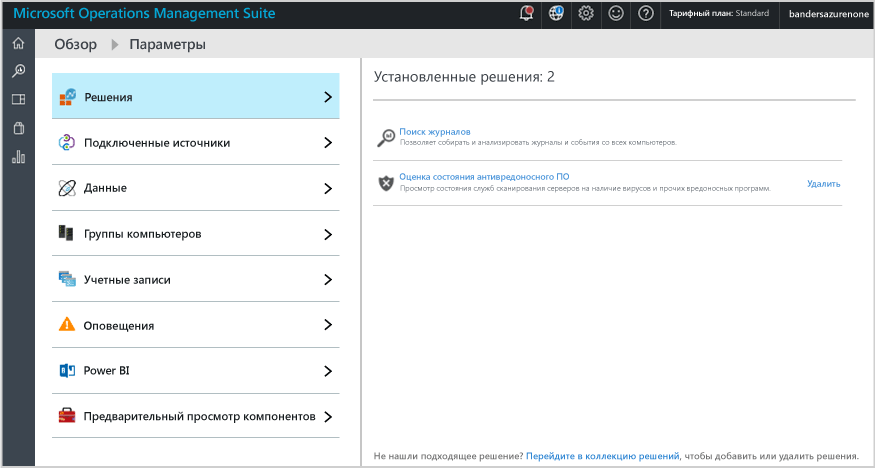  
    Щелкните **Посетить коллекцию**, чтобы добавить дополнительные решения.  
    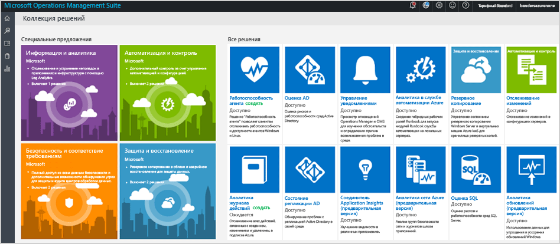  
    Выберите решение и нажмите кнопку **Добавить**.
2. **Подключитесь к источнику.** Выберите способ подключения к серверной среде для сбора данных:
    - Подключение сервера или клиента Windows Server напрямую путем установки агента.
    - подключение серверов Linux с помощью агента OMS для Linux;
    - Использование учетной записи хранения Azure, настроенной с помощью диагностического расширения виртуальных машин Azure для Windows или Linux.
    - Использование System Center Operations Manager для подключения групп управления ко всему развертыванию Operations Manager.
    - включение телеметрии Windows для использования Upgrade Analytics.
        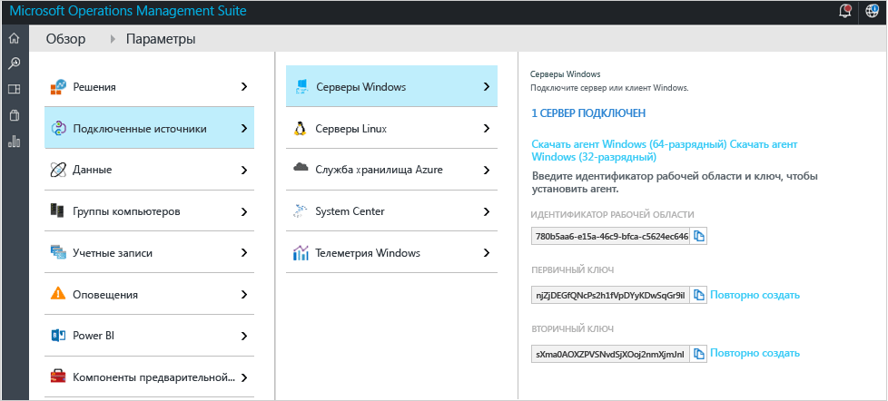    

3. **Соберите данные.** Настройте по крайней мере один источник данных для заполнения рабочей области данными. По завершении нажмите кнопку **Сохранить**.    

    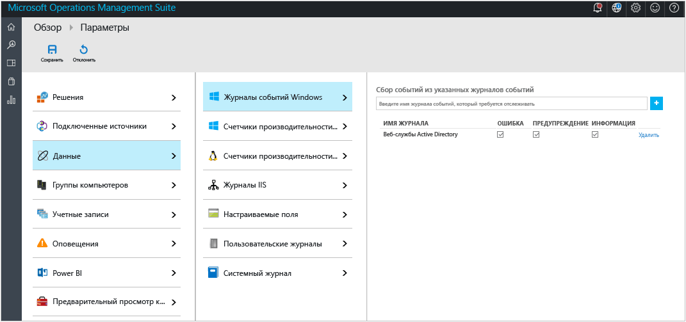    

## При желании вы можете подключит серверы непосредственно к Operations Management Suite, установив агент.

В следующем примере показано, как установить агент Windows.

1. Щелкните плитку **Параметры**, выберите вкладку **Подключенные источники**, щелкните вкладку с типом источника, который необходимо добавить, и скачайте агент или узнайте о том, как его включить. Например, щелкните **Скачать агент для Windows (64-разрядный)**. Агент Windows можно установить только в Windows Server 2008 с пакетом обновления 1 (SP1) или более поздней версии или Windows 7 с пакетом обновления 1 (SP1) или более поздней версии.
2. Установите агент на одном или нескольких серверах. Агенты можно устанавливать по одному или автоматически с помощью [настраиваемого скрипта](log-analytics-windows-agents.md). Кроме того, можно использовать имеющееся решение для распространения программного обеспечения, если оно у вас есть.
3. Приняв условия лицензионного соглашения и выбрав папку для установки, установите флажок **Connect the agent to Azure Log Analytics (OMS)** (Подключить агент к Azure Log Analytics (OMS)).   
    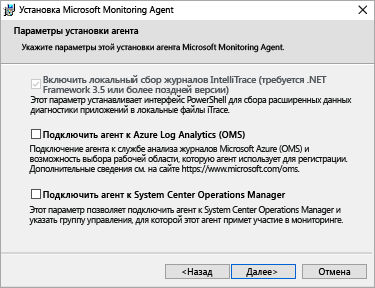

4. На следующей странице запрашиваются ваши идентификатор и ключ рабочей области. Идентификатор рабочей области и ключ отображаются на том же экране, в котором вы скачивали файл агента.  
    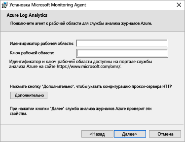  

    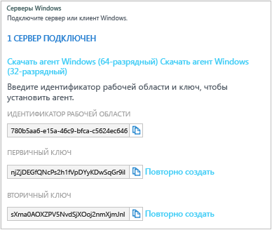
5. Во время установки можно нажать кнопку **Дополнительно** , чтобы настроить прокси-сервер и указать сведения для проверки подлинности. Нажмите кнопку **Next** (Далее), чтобы вернуться на экран сведений о рабочей области.
6. Нажмите кнопку **Далее** , чтобы проверить идентификатор рабочей области и ключ. Если обнаружены ошибки, вы можете нажать кнопку **Назад** и исправить их. После проверки идентификатора рабочей области и ключа нажмите кнопку **Установить** , чтобы завершить установку агента.
7. На панели управления выберите "Microsoft Monitoring Agent > Azure Log Analytics (OMS)". Когда агенты взаимодействуют со службой Operations Management Suite, отображается зеленый значок галочки. В первый раз это занимает около 5–10 минут.

>[AZURE.NOTE] В настоящий момент решения для управления емкостью и оценки конфигурации не поддерживаются серверами, подключенными непосредственно к Operations Management Suite.

Вы также можете подключить агент к System Center Operations Manager 2012 с пакетом обновления 1 (SP1) или более поздней версии. Для этого выберите **Подключить агент к System Center Operations Manager**. При выборе этой команды для отправки данных службе не требуется дополнительное оборудование или нагрузка на группы управления.

Дополнительные сведения о подключении агентов к Operations Management Suite см. в статье [Подключение компьютеров Windows к Log Analytics](log-analytics-windows-agents.md).

## При необходимости подключите серверы с помощью System Center Operations Manager

1. В консоли Operations Manager выберите **Администрирование**.
2. Разверните узел **Operational Insights** и выберите **Operational Insights Connection** (Подключение к Operational Insights).

  >[AZURE.NOTE] В зависимости от того, какая версия накопительного пакета обновления SCOM используется, отобразится узел *System Center Advisor*, *Operational Insights* или *Operations Management Suite*.

3. Щелкните ссылку **Регистрация в службе Operational Insights** в правом верхнем углу и следуйте указаниям.
4. Завершив регистрацию, щелкните ссылку **Добавить компьютер/группу** .
5. В диалоговом окне **Поиск компьютера** можно выполнить поиск компьютеров или групп, отслеживаемых с помощью Operations Manager. Выберите компьютеры или группы для подключения к службе Log Analytics, нажмите кнопку **Добавить**, а затем — **ОК**. Чтобы убедиться, что OMS получает данные, нажмите элемент **Использование** в портале Operations Management Suite. Данные должны появиться в течение 5–10 минут.

Дополнительные сведения о подключении Operations Manager к Operations Management Suite см. в статье [Подключение Operations Manager к Log Analytics](log-analytics-om-agents.md).

## При необходимости проанализируйте данные из облачных служб в Microsoft Azure

Operations Management Suite позволяет быстро искать облачные службы и виртуальные машины в журналах событий и IIS, включив диагностику для облачных служб Azure. Вы также можете получать дополнительные сведения для виртуальных машин Azure, установив агент мониторинга Майкрософт. Дополнительные сведения о настройке среды Azure для использования Operations Management Suite см. в статье [Подключение службы Azure к Log Analytics](log-analytics-azure-storage.md).

## Дальнейшие действия

- [добавьте решения Log Analytics из коллекции решений](log-analytics-add-solutions.md) .
- Подробные сведения, которые собирают решения, описаны в статье [про поиск по журналам](log-analytics-log-searches.md) .
- Используйте [панели мониторинга](log-analytics-dashboards.md) для сохранения и отображения настраиваемых систем поиска.

<!--HONumber=Oct16_HO2-->

