# Начало работы с рабочей областью Log Analytics
Вы можете быстро начать работу со службой Azure Log Analytics, позволяющей анализировать операционную аналитику, собранную из ИТ-инфраструктуры. С помощью сведений из этой статьи вы сможете легко приступить к изучению и анализу данных, собираемых *бесплатно*, а также к выполнению действий над ними.

В этой статье приведено краткое руководство по минимальному развертыванию решения Log Analytics в Azure, которое поможет вам приступить к работе с этой службой. Логический контейнер, где хранятся данные управления Azure, называется рабочей областью. После того как вы просмотрите эти сведения и выполните анализ, эту область можно удалить. Так как это руководство, здесь не описываются аспекты, касающиеся бизнес-требований, планирования и архитектуры.

>[!NOTE]
>При использовании облака Microsoft Azure для государственных организаций обратитесь к [документации по управлению и мониторингу Azure для государственных организаций](https://docs.microsoft.com/azure/azure-government/documentation-government-services-monitoringandmanagement#log-analytics).

Ниже приведен краткий обзор этапов начала работы с Log Analytics.

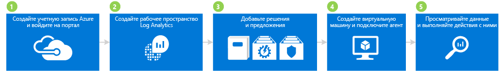

## 1. Создание учетной записи Azure и выполнение входа

Если у вас еще нет учетной записи Azure, создайте ее для использования Log Analytics. Вы можете создать [бесплатную учетную запись](https://azure.microsoft.com/free/), предоставляющую доступ ко всем службам Azure в течение 30 дней пробного периода.

### Создание бесплатной учетной записи Azure и выполнение входа
1. Выполните инструкции на странице [Создайте бесплатную учетную запись Azure уже сегодня](https://azure.microsoft.com/free/).
2. Перейдите на [портал Azure](https://portal.azure.com) и войдите в систему.

## 2. Создание рабочей области

Теперь необходимо создать рабочую область.

1. На портале Azure найдите в списке служб в Marketplace *Log Analytics*, введя **Log Analytics** в поле поиска.  
    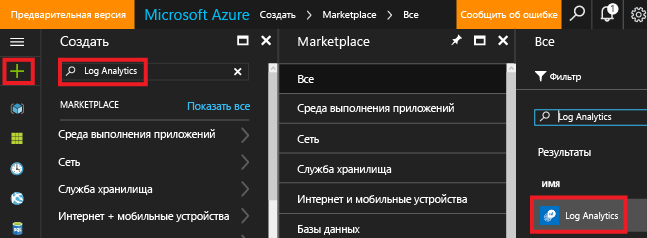
2. Щелкните **Создать** и задайте следующие параметры:
   * **OMS Workspace** (Рабочая область OMS): введите имя рабочей области.
   * **Подписка** : если у вас есть несколько подписок, выберите ту, которую нужно привязать к новой рабочей области.
   * **Группа ресурсов**
   * **Расположение**
   * **Ценовая категория**  
       
3. Нажмите кнопку **ОК**, чтобы перейти к списку рабочих областей.
4. Выберите рабочую область, чтобы просмотреть сведения о ней на портале Azure.       
             

## 3. Добавление решений и предложений

Далее мы добавим решения по управлению и предложения. Решения по управлению представляют собой коллекцию логики, визуализации и правил получения данных, предоставляющую метрики, связанные с определенной проблемной областью. Предложение — это набор решений по управлению.

Если вы добавите решение в рабочую область, Log Analytics сможет собирать различные типы данных из компьютеров, подключенных к рабочей области с помощью агентов. Сведения о подключении агентов приведены в одном из следующих разделов.

### Добавление решений и предложений

1. На портале Azure щелкните **Создать**, а затем в поле **Поиск по Marketplace** введите **Анализ журнала действий** и нажмите клавишу ВВОД.
2. В колонке "Все" выберите **Activity Log Analytics** (Анализ журнала действий) и нажмите кнопку **Создать**.  
    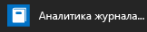  
3. В колонке *имя решения для управления* выберите рабочую область, в которую нужно добавить решение для управления.
4. Щелкните **Создать**.  
    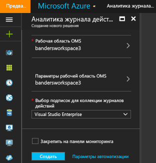  
5. Повторите шаги 1–4, чтобы добавить следующие предложения:
    - Служба **Безопасность и соответствие требованиям** с решением по оценке защиты от вредоносных программ, а также решениями для безопасности и аудита.
    - Служба **Автоматизация и контроль** с гибридной рабочей ролью службы автоматизации, а также решениями для отслеживания изменений и оценки системных обновлений (или управления обновлениями). Для добавления предложений необходимо создать учетную запись службы автоматизации.  
        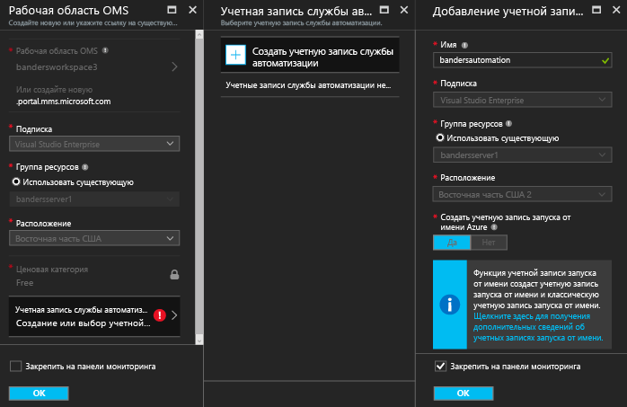  
6. Чтобы просмотреть решения по управлению, добавленные в рабочую область, выберите **Log Analytics** > **Подписки** > ***имя рабочей области*** > **Обзор**. После этого отобразятся плитки с добавленными решениями по управлению.  
    >[!NOTE]
    >Так как мы еще не подключали агенты к рабочей области, данные для добавленных решений не отображаются.  

    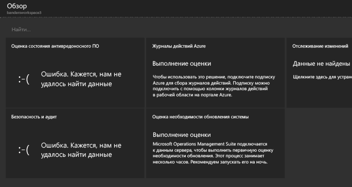

## 4. Создание виртуальной машины и подключение агента

Теперь нужно создать простую виртуальную машину в Azure. Затем мы подключим агент OMS, чтобы включить его. Как только агент будет включен, с виртуальной машины начнут собираться данные, которые будут отправляться в Log Analytics.

### Для создания виртуальной машины

- Выполните инструкции, приведенные в статье [Создание первой виртуальной машины Windows на портале Azure](../virtual-machines/virtual-machines-windows-hero-tutorial.md), и запустите новую виртуальную машину.

### Подключение виртуальных машин к службе Log Analytics

- Подключите виртуальную машину к Log Analytics с помощью портала Azure, следуя инструкциям, приведенным в [этой статье](log-analytics-azure-vm-extension.md).

## 5. Просмотр данных и выполнение действий над ними

Ранее вы включили решение для анализа журнала действий и предложения для безопасности и соответствия требованиям, а также для автоматизации и контроля. Далее мы просмотрим данные, собираемые решениями, и результаты поиска по журналам.

Для начала рассмотрим данные, отображаемые в решениях. Затем мы просмотрим некоторые запросы поиска по журналам, доступные в результатах поиска по журналам. Поиск по журналам позволяет объединять и сопоставлять любые данные о компьютерах из нескольких источников в вашей среде. Дополнительные сведения см. в статье [Поиск по журналам в Log Analytics](log-analytics-log-searches.md). Наконец, мы выполним действия над данными, собранными на портале OMS, который находится за пределами портала Azure.

### Просмотр данных по защите от вредоносных программ

1. На портале Azure перейдите к **Log analytics** > ***ваша рабочая область***.
2. В колонке для рабочей области в разделе **Общие** щелкните **Обзор**.  
    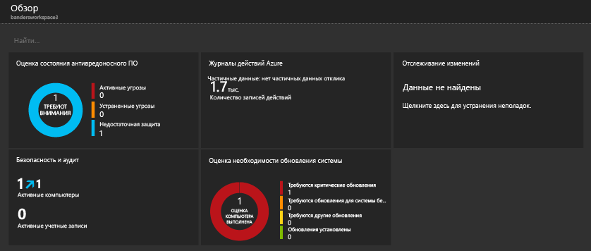
3. Щелкните плитку **Оценка защиты от вредоносных программ**. В этом примере видно, что на компьютере установлен Защитник Windows, но его подпись устарела.  
    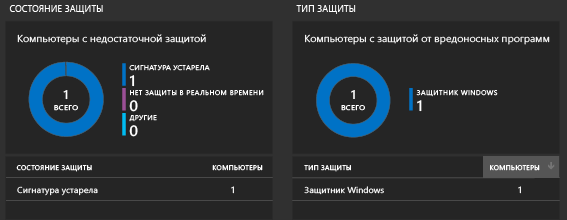
4. В этом примере в разделе **Состояние защиты** щелкните **Signature out of date** (Подпись устарела), чтобы открыть поиск по журналам и просмотреть подробные сведения о компьютерах с устаревшими подписями. Обратите внимание, что в этом примере компьютер называется *getstarted*. При наличии нескольких компьютеров с устаревшими подписями все они будут отображаться в результатах поиска по журналам.  
    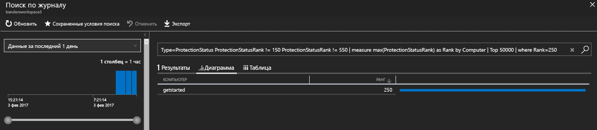

### Просмотр данных решения "Безопасность и аудит"

1. В колонке для рабочей области в разделе **Общие** щелкните **Обзор**.  
2. Щелкните плитку **Безопасность и аудит**. В этом примере видно, что существуют две важные проблемы: есть компьютер с недостающими критическими обновлениями и компьютер с недостаточной защитой.  
    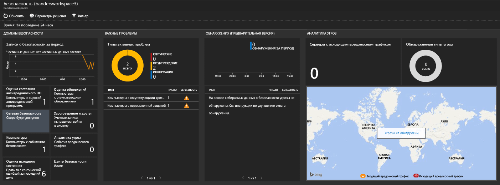
3. В этом примере в разделе **важных проблем** щелкните **Computers missing critical updates** (Есть компьютеры, на которых нет критических обновлений), чтобы открыть поиск по журналам и просмотреть подробные сведения о компьютерах, на которых отсутствуют критические обновления. В этом примере отсутствует одно критическое обновление и 63 других обновлений.  
    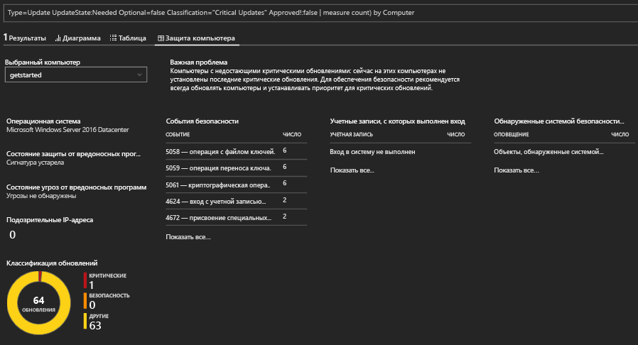

### Просмотр данных о системных обновлениях и выполнение действий с ними

1. В колонке для рабочей области в разделе **Общие** щелкните **Обзор**.  
2. Щелкните плитку **Оценка системных обновлений**. В этом примере видно, что на одном компьютере с Windows с именем *getstarted* отсутствуют критические обновления, а на втором — обновления определений.  
    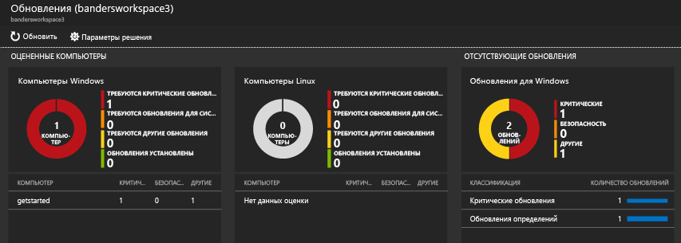
3. В этом примере в разделе **Missing Updates** (Отсутствующие обновления) щелкните **критические обновления**, чтобы открыть поиск по журналам и просмотреть подробные сведения о компьютерах, на которых отсутствуют критические обновления. В этом примере есть одно отсутствующее обновление и одно требуемое обновление.  
    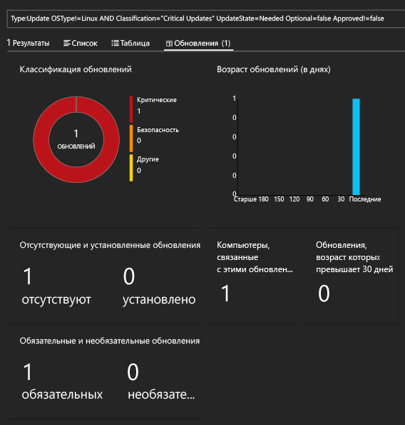
4. Откройте веб-сайт [Operations Management Suite](http://microsoft.com/oms) и войдите, используя учетную запись Azure. После входа обратите внимание, что сведения в решении аналогичны приведенным на портале Azure.  
    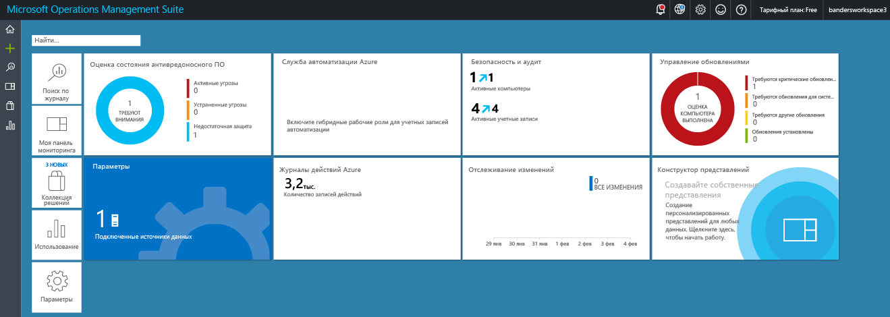
5. Щелкните плитку **Управление обновлениями**.
6. На панели мониторинга "Управление обновлениями" обратите внимание, что сведения об обновлениях аналогичны тем, которые вы уже видели на портале Azure. Вы также увидите новую плитку **Manage Update Deployments** (Управление развертываниями обновлений). Щелкните плитку **Manage Update Deployments** (Управление развертываниями обновлений).  
    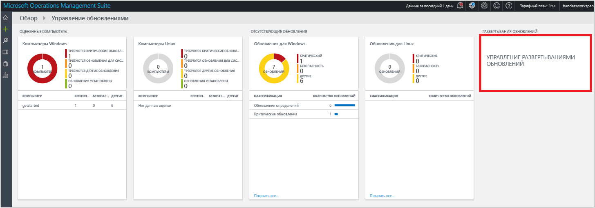
7. На странице **Update Deployments** (Развертывания обновлений) щелкните **Добавить**, чтобы создать *выполнение обновления*.  
    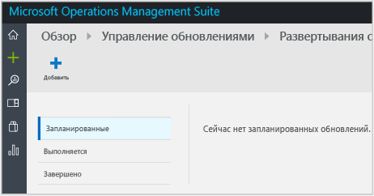 (Развертывания обновлений)
8.  На странице **New Update Deployment** (Новое развертывание обновления) введите имя для развертывания обновлений, выберите компьютеры, где нужно установить обновления (в этом примере *getstarted*), выберите расписание и нажмите кнопку **Сохранить**.  
    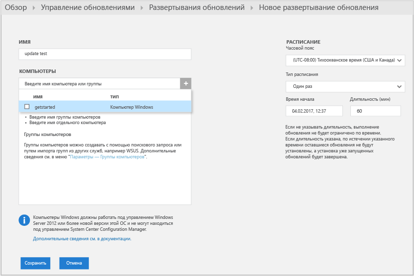  
    После сохранения развертывания обновления вы увидите запланированное обновление.  
    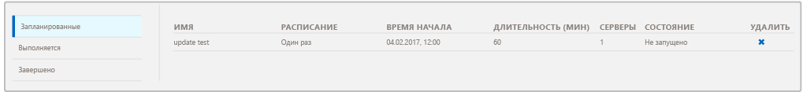  
    Когда выполнение обновления будет завершено, для него отобразится состояние **Завершено**.
    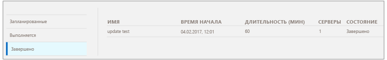
9. Когда выполнение обновления будет завершено, вы сможете просмотреть его результат и подробные сведения о том, какие обновления были применены и где.

## После анализа данных

В этом руководстве приведены сведения об установке агента на виртуальной машине и о том, как быстро приступить к работе с решением. Действия были простыми и не занимали много времени. Однако большинство крупных организаций и предприятий имеют сложные локальные ИТ-инфраструктуры. Поэтому сбор данных в этих сложных средах требует дополнительного планирования и усилий. В разделе "Дальнейшие действия" приведены ссылки на полезные статьи.

При необходимости можно удалить рабочую область, созданную при работе с этим руководством.

## Дальнейшие действия
* Дополнительные сведения о подключении [агентов Windows](log-analytics-windows-agents.md) к Log Analytics.
* Дополнительные сведения о подключении [агентов Operations Manager](log-analytics-om-agents.md) к Log Analytics.
* [добавьте решения Log Analytics из коллекции решений](log-analytics-add-solutions.md) .
* Подробная информация, которую собирают решения, описана в статье [о поиске по журналам](log-analytics-log-searches.md) .

