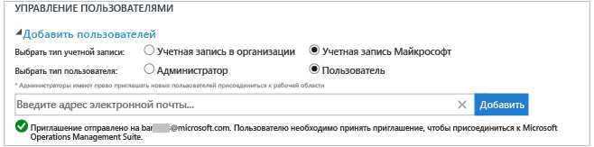
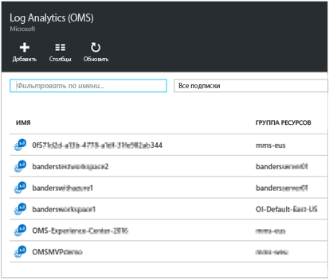
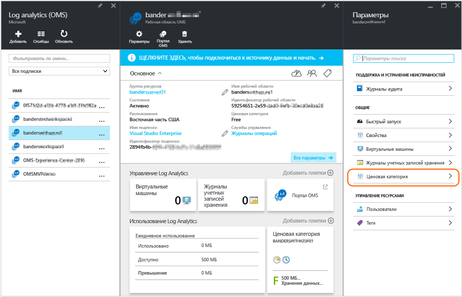

<properties
	pageTitle="Управление доступом к Log Analytics | Microsoft Azure"
	description="Управление доступом к Log Analytics с помощью разных административных задач, которые применяются к пользователям, учетным записям, рабочим областям OMS и учетным записям Azure."
	services="log-analytics"
	documentationCenter=""
	authors="bandersmsft"
	manager="jwhit"
	editor=""/>

<tags
	ms.service="log-analytics"
	ms.workload="na"
	ms.tgt_pltfrm="na"
	ms.devlang="na"
	ms.topic="article"
	ms.date="04/28/2016"
	ms.author="banders"/>

# Управление доступом к Log Analytics

Управление доступом к Log Analytics осуществляется с помощью разных административных задач, которые применяются к пользователям, учетным записям, рабочим областям OMS и учетным записям Azure. Чтобы создать новую рабочую область в Operations Management Suite (OMS), выберите имя рабочей области, свяжите его со своей учетной записью и выберите географическое расположение. Рабочая область — это контейнер, который содержит сведения об учетной записи и ее конфигурации. Вы или другие члены организации могут использовать несколько рабочих областей OMS для управления различными наборами данных, собранными из всех частей ИТ-инфраструктуры.

В статье [Get started with Log Analytics](log-analytics-get-started.md) (Начало работы с Log Analytics) показано, как быстро осуществить настройку и запуск, а также подробно описаны некоторые действия, которые потребуется завершить, чтобы управлять доступом к OMS.

В следующих разделах приводится описание всех основных задач по управлению, хотя изначально вам может и не потребоваться выполнять каждую из этих задач:

- Управление учетными записями и пользователями
- Добавление группы в существующую рабочую область
- Определение необходимого количества рабочих областей
- Связывание существующей рабочей области с подпиской Azure
- Обновление рабочей области до тарифного плана с оплатой
- Изменение типа тарифного плана
- Добавление организации Azure Active Directory в существующую рабочую область
- Контроль доступа к ресурсам Log Analytics в OMS
- Закрытие рабочей области OMS

## Управление учетными записями и пользователями
Управление учетными записями и пользователями осуществляется на вкладке **Учетные записи** страницы «Параметры». С ее помощью можно выполнять задачи, которые описываются в следующих разделах.

### Добавление пользователя в существующую рабочую область

Следуйте инструкциям ниже, чтобы добавить пользователя или группу в рабочую область OMS. Пользователь или группа смогут просматривать все предупреждения, связанные с этой рабочей областью, и действовать в соответствии с их содержанием.

>[AZURE.NOTE] Если необходимо добавить пользователя или группу из учетной записи организации Azure Active Directory, сначала убедитесь, что ваша учетная запись OMS связана с вашим доменом Active Directory. См. раздел [Добавление организации Azure Active Directory в существующую рабочую область](#add-an-azure-active-directory-organization-to-an-existing-workspace).

#### Добавление пользователя в существующую рабочую область
1. В OMS щелкните плитку **Параметры**.
2. Щелкните вкладку **Учетные записи**.
3. В разделе **Управление пользователями** выберите тип добавляемой учетной записи: **Учетная запись организации** или **Учетная запись Майкрософт**.
    - Если вы выбрали учетную запись Майкрософт, введите электронный адрес пользователя, связанного с этой учетной записью.
    - Если вы выбрали учетную запись организации, то можете ввести часть имени пользователя или группы либо псевдонима электронной почты, и появится список пользователей и групп. Выберите пользователя или группу.

    >[AZURE.NOTE] Для лучшей производительности ограничьте количество групп Active Directory, связанных с одной учетной записью OMS, до двух: одна — для администраторов и одна — для пользователей. Использование нескольких групп может повлиять на производительность Log Analytics.

7. Выберите тип добавляемого пользователя или группы: **Администратор** или **Пользователь**.
8. Щелкните **Добавить**.

  Если вы добавляете учетную запись Майкрософт, на электронный адрес, который вы указали, отправляется приглашение присоединиться к рабочей области. После того как пользователь выполнит указания в приглашении присоединиться к OMS, он сможет просматривать оповещения и сведения об этой учетной записи OMS. А вы сможете просматривать сведения о пользователе на вкладке **Учетные записи** страницы **Параметры**. Если вы добавите учетную запись организации, пользователь сможет мгновенно получить доступ к Log Analytics. 

### Изменение типа существующего пользователя

Вы можете изменить роль учетной записи пользователя, связанного с вашей учетной записью OMS. Доступны следующие роли.

 - *Администратор* — может управлять пользователями, просматривать все оповещения и реагировать на них, добавлять и удалять серверы.

 - *Пользователь* — может, просматривать все оповещения и действовать в соответствии с их содержанием, добавлять и удалять серверы.

#### Редактирование учетной записи
1. На странице **Параметры** на вкладке **Учетные записи** в OMS выберите роль пользователя, которого требуется изменить.
2. Нажмите кнопку **ОК**.

## Удаление пользователя из рабочей области OMS

Следуйте инструкциям ниже, чтобы удалить пользователя из рабочей области OMS. Обратите внимание, что эти действия не закроют рабочую область пользователя. Вместо этого они удалят связь между пользователем и рабочей областью. Если пользователь связан с несколькими рабочими областями, этот пользователь по-прежнему сможет входить в OMS.

### Удаление пользователя из рабочей области

1. На странице **Параметры** на вкладке **Учетные записи** в OMS щелкните "Удалить" рядом с именем пользователя, которого хотите удалить.
2. Нажмите кнопку **ОК**, чтобы подтвердить удаление пользователя.

## Добавление группы в существующую рабочую область

1.	Выполните шаги с 1 по 4 в разделе "Добавление пользователя в существующую рабочую область" выше.
2.	В разделе **Choose User/Group** (Выберите пользователя или группу) установите переключатель **Группа**. 
3.	Введите отображаемое имя или адрес электронной почты для группы, которую вы хотите добавить.
4.	Выберите группу в списке результатов и щелкните **Добавить**.

## Определение необходимого количества рабочих областей

Рабочая область считается ресурсом Azure на портале управления Azure.

Можно создать новую рабочую область или связать существующую рабочую область, которую вы могли открывать ранее для использования с System Center Operations Manager и которая еще не связана с подпиской Azure (необходимо для выставления счетов).

Рабочая область — это уровень, на котором данные собираются, группируются, анализируются и представляются на портале OMS. Можно выбрать несколько рабочих областей для выделения данных из различных сред и систем Каждую группу управления Operations Manager (и все ее агенты) или каждую виртуальную машину и/или агент можно подключить только к одной рабочей области.

Каждая рабочая область может иметь несколько связанных с ней учетных записей пользователей, и каждая учетная запись пользователя (учетная запись Майкрософт или учетная запись организации) может иметь доступ к нескольким рабочим областям OMS.

По умолчанию учетная запись Майкрософт или учетная запись организации, используемая для создания рабочей области, становится администратором рабочей области. Администратор может затем пригласить дополнительную учетную запись Майкрософт или выбрать пользователей из Azure Active Directory.

## Связывание существующей рабочей области с подпиской Azure

Рабочую область можно создать на веб-сайте [microsoft.com/oms](https://microsoft.com/oms). Для этих рабочих областей есть некоторые ограничения. Например, самым значительным является ограничение передачи данных до 500 МБ в день, если вы используете бесплатную учетную запись. Чтобы внести изменения в эту рабочую область, необходимо **связать существующую рабочую область с подпиской Azure**.

>[AZURE.IMPORTANT] Чтобы связать рабочую область с учетной записью Azure, учетная запись Azure уже должна иметь доступ к рабочей области, с которой ее нужно связать. Иными словами, учетная запись, используемая для доступа к порталу Azure, должна быть **той же самой** учетной записью, которая используется для доступа к рабочей области OMS. Если это не так, см. раздел [Добавление пользователя в существующую рабочую область](#add-a-user-to-an-existing-workspace).

1.	Войдите на [портал Azure](http://portal.azure.com).
2.	Найдите и выберите пункт **Log Analytics (OMS)**.
3.	Появится список существующих рабочих областей. Нажмите кнопку **Добавить**. 
4.	В разделе **OMS Workspace** (Рабочая область OMS) щелкните **Or link existing** (Связать существующую). 
5.	Щелкните **Настроить необходимые параметры**. 
6.	Появится список рабочих областей, которые еще не связаны с учетной записью Azure. Выберите рабочую область. 
7.	При необходимости вы можете изменить значения следующих элементов:
    - Подписка
    - Группа ресурсов
    - Расположение
    - ценовая категория. 
8.	Щелкните **Создать**. Теперь рабочая область связана с учетной записью Azure.

>[AZURE.NOTE] Если вы не видите рабочую область, которую хотите связать, это означает, что у вашей подписки Azure нет доступа к рабочей области OMS, созданной на веб-сайте OMS. Вам потребуется предоставить доступ к этой учетной записи из рабочей области OMS на веб-сайте OMS. Подробнее об этом см. в разделе [Добавление пользователя в существующую рабочую область](#add-a-user-to-an-existing-workspace).

## Обновление рабочей области до тарифного плана с оплатой

Существует три типа тарифных планов для OMS: **Бесплатный**, **Стандартный ** и **Премиум**. Если вы используете план *Free*, вы будете ограничены в использовании емкости данных до 500 МБ. Необходимо обновить рабочую область до тарифного плана **с оплатой по мере использования**, чтобы собирать данные, которые превышают этот предел. Тарифный план можно изменить в любое время. Дополнительные сведения о ценах на OMS см. в разделе [Цены на OMS](https://www.microsoft.com/ru-RU/server-cloud/operations-management-suite/pricing.aspx).

>[AZURE.IMPORTANT] Тарифный план рабочей области можно изменить, только если она *связана* с подпиской Azure. Если вы создали рабочую область в Azure или если вы *уже* связали свою рабочую область, вы можете проигнорировать это сообщение. Если вы создали рабочую область на [веб-сайте OMS](http://www.microsoft.com/oms), необходимо выполнить инструкции из раздела [Связывание существующей рабочей области с подпиской Azure](#link-an-existing-workspace-to-an-azure-subscription).

### Использование прав из надстройки OMS для System Center

Надстройка OMS для System Center предоставляет право на план "Премиум" для Log Analytics в OMS, описанное в разделе [Цены на OMS](https://www.microsoft.com/ru-RU/server-cloud/operations-management-suite/pricing.aspx).

Если вы приобретете надстройку OMS для System Center, служба технической поддержки учетных записей Майкрософт или торговый посредник свяжет надстройки OMS с вашим соглашением Enterprise, которое включает приобретение продуктов Azure. Надстройка OMS создает право на использование соглашения, которое можно применять в любой подписке Azure. Таким образом вы сможете, например, создать несколько рабочих областей OMS, которые используют право из надстройки OMS.

Чтобы использование рабочей области OMS основывалось на правах из надстройки OMS, потребуется сделать следующее:

1. Свяжите рабочую область OMS с подпиской Azure, которая является частью соглашения Enterprise, включающего как покупку надстройки OMS, так и использование подписки Azure.
2. Выберите план "Премиум" для рабочей области.

При просмотре сведений об использовании на портале Azure или OMS не отображается информация о правах из надстройки OMS. Однако их можно просмотреть на портале Enterprise Portal.

Если вам нужно изменить подписку Azure, с которой связана ваша рабочая область OMS, можно использовать командлет [Move-AzureRMResource](https://msdn.microsoft.com/library/mt652516.aspx) в среде Azure PowerShell.

### Использование подписки Azure в рамках соглашения Enterprise

Если вы выберете вариант отдельной оплаты компонентов OMS, плата будет взиматься за каждый компонент OMS по отдельности, а сведения об использовании будут отражены в счете Azure.

Если вы произвели предоплату за определенный объем ресурсов Azure в рамках соглашения Enterprise, при использовании OMS будет учитываться предоплаченный объем ресурсов. Чтобы цены на подписку Azure распространялись на Log Analytics в OMS, подписка, с которой связана рабочая область OMS, должна быть частью соглашения Enterprise для Azure.

Если вам нужно изменить подписку Azure, с которой связана рабочая область OMS, можно использовать командлет [Move-AzureRMResource](https://msdn.microsoft.com/library/mt652516.aspx) в среде Azure PowerShell.

### Изменение рабочей области до платного тарифного плана

1.	Войдите на [портал Azure](http://portal.azure.com).
2.	Найдите и выберите пункт **Log Analytics (OMS)**.
3.	Появится список существующих рабочих областей. Выберите рабочую область. 
4.	В разделе **Параметры** щелкните **Ценовая категория**. 
5.	В разделе **Ценовая категория** выберите тарифный план и нажмите кнопку **Выбрать**. 
6.	При обновлении представления на портале Azure для выбранного плана появится новое значение параметра **Ценовая категория.** 

Теперь вы можете собирать данные, превышая "бесплатный" максимальный объем.

## Добавление организации Azure Active Directory в существующую рабочую область

Вы можете связать рабочую область OMS с доменом Azure Active Directory. Это позволит вам добавлять пользователей из Active Directory непосредственно в рабочую область OMS без использования отдельной учетной записи Майкрософт.

### Добавление организации Azure Active Directory в существующую рабочую область

1. В OMS на странице "Параметры" выберите пункт **Учетные записи**, а затем — **Сведения о рабочей области**.  
2. Просмотрите сведения об учетной записи организации и нажмите кнопку **Add Organization** (Добавить организацию). 
3. Введите сведения об удостоверении для администратора домена Azure Active Directory. После этого появится сообщение с подтверждением того, что рабочая область связана с доменом Azure Active Directory. 

## Контроль доступа к ресурсам Log Analytics в OMS

Управление доступом пользователей к рабочей области OMS осуществляется в двух расположениях:

- Для доступа к порталу OMS управление осуществляется на портале OMS и не связано с доступом пользователей к подпискам Azure, в которых находятся ресурсы.
- Для доступа к PowerShell и прямого доступа к REST API управление происходит в Azure с помощью контроля доступа на основе ролей в Azure.

Если вы предоставили определенным пользователям доступ к порталу OMS, но не к связанной с ним подписке Azure, при входе на портал OMS на элементах службы автоматизации, архивации и Site Recovery не будут отображаться какие-либо данные для пользователей.

Чтобы разрешить всем пользователям видеть данные в этих решениях, предоставьте им по меньшей мере доступ **для чтения** к учетной записи службы автоматизации, хранилищу архивации и хранилищу Site Recovery, связанным с рабочей областью OMS.

## Закрытие рабочей области OMS

Если закрыть рабочую область OMS, все данные, относящиеся к рабочей области, удалятся из службы OMS спустя максимум 30 дней.

Если вы являетесь администратором и с рабочей областью связано несколько пользователей, связь между этими пользователями и рабочей областью тоже прекратится. Если пользователи связаны с другими рабочими областями, они смогут продолжить использовать службу OMS в этих рабочих областях. Но если они не связаны с другими рабочими областями, им необходимо создать новую рабочую область для использования OMS.

### Закрытие рабочей области OMS

1. В OMS на странице **Параметры** на вкладке **Учетные записи** щелкните **Закрыть рабочую область**.

2. Выберите одну из причин закрытия рабочей области или введите другую причину в текстовом поле.

3. Нажмите **Close Workspace** (Закрыть рабочую область).

## Дальнейшие действия

- Чтобы добавить агенты и реализовать сбор данных, [подключите компьютеры Windows к Log Analytics](log-analytics-windows-agents.md).
- Чтобы добавить функции и реализовать сбор данных, [добавьте решения Log Analytics из коллекции решений](log-analytics-add-solutions.md).
- Если ваша организация использует прокси-сервер или брандмауэр, [настройте прокси-сервер и брандмауэр в Log Analytics](log-analytics-proxy-firewall.md), чтобы агенты могли взаимодействовать со службой Log Analytics.

<!---HONumber=AcomDC_0504_2016-->