# Управление рабочими областями

Управление доступом к Log Analytics осуществляется с использованием разных задач администрирования, связанных с рабочими областями. Эта статья содержит рекомендации и инструкции по управлению рабочими областями. Рабочая область — это контейнер, который содержит сведения об учетной записи и ее конфигурации. Вы или другие члены организации могут использовать несколько рабочих областей для управления различными наборами данных, собранными из всех частей ИТ-инфраструктуры.

Чтобы создать рабочую область, вам понадобится:

1. Создать подписку Azure.
2. Выбрать имя рабочей области.
3. Связать рабочую область с подпиской.
4. Выбрать географическое расположение.

## Определение необходимого количества рабочих областей
Рабочая область — это ресурс Azure и контейнер, где данные собираются, группируются, анализируются и представляются на портале Azure.

Вы можете создать несколько рабочих областей в подписке Azure и иметь к ним доступ. Ранее можно было анализировать данные только в пределах текущей рабочей области. Это препятствовало выполнению запросов в нескольких рабочих областях, определенных вашей подпиской. Теперь вы можете [подавать запросы в несколько рабочих областей](https://docs.microsoft.com/azure/log-analytics/log-analytics-cross-workspace-search) и получать представление данных на уровне системы. В этом разделе описывается, в каких ситуациях может пригодиться создание более чем одной рабочей области.

В настоящее время рабочая область обеспечивает:

* географическое расположение для хранения данных;
* Детализация данных для выставления счетов
* Изоляция данных
* Область конфигурации

С учетом представленных выше характеристик необходимость в нескольких рабочих областях может возникнуть по следующим причинам.

* Вы являетесь глобальной компанией, и по причинам конфиденциальности или в соответствии с нормативными требованиями вам необходимо хранить данные в определенных регионах.
* Вы используете Azure и хотите избежать расходов на передачу исходящих данных, создав рабочую область в том же регионе, где находятся ресурсы Azure, которыми она управляет.
* Вам необходимо распределить расходы между различными отделами или бизнес-группами в зависимости от их использования. При создании рабочей области для каждого отдела или бизнес-группы в счетах и отчетах по использованию Azure расходы по каждой рабочей области будут отражаться отдельно.
* Вы являетесь поставщиком управляемой службы, и вам необходимо хранить данные службы Log Analytics по каждому клиенту отдельно от данных других клиентов.
* Вы управляете несколькими клиентами и хотите, чтобы каждый клиент, отдел или бизнес-группа видели только свои данные.

При использовании агентов для сбора данных [каждый агент можно настроить таким образом, чтобы он отправлял отчеты в одну или несколько рабочих областей](log-analytics-windows-agent.md).

При использовании System Center Operations Manager, каждую группу управления Operations Manager можно подключить только к одной рабочей области. Но агент Microsoft Monitoring Agent, установленный на компьютере, можно настроить для отправки отчетов и в Operations Manager, и в другую рабочую область Log Analytics.  

### Сведения о рабочей области

Сведения о рабочей области можно просмотреть на портале Azure. 

#### Просмотр сведений о рабочей области на портале Azure

1. Войдите на [портале Azure](https://portal.azure.com).
2. Щелкните **Все службы**.  В списке ресурсов введите **Log Analytics**. Как только вы начнете вводить символы, список отфильтруется соответствующим образом. Щелкните **Log Analytics**.  
    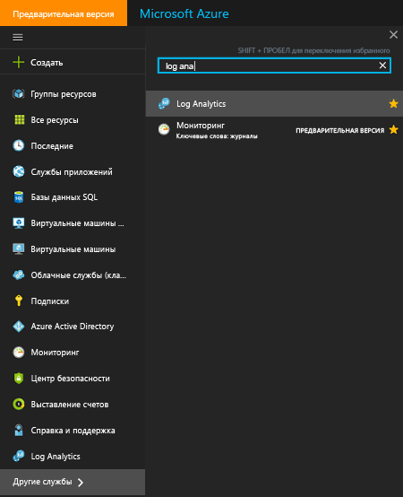  
3. На странице подписки Log Analytics выберите рабочую область.
4. На странице рабочей области отображаются сведения о рабочей области и ссылки на дополнительные сведения.  
    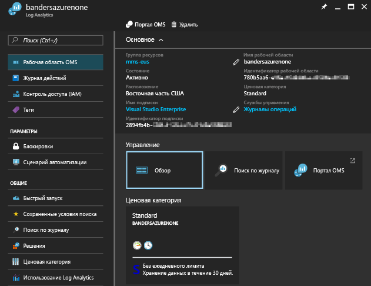  

## Управление учетными записями и пользователями
Каждая рабочая область может иметь несколько связанных с ней учетных записей, и каждая учетная запись (учетная запись Майкрософт или учетная запись организации) может иметь доступ к нескольким рабочим областям.

По умолчанию учетная запись Майкрософт или учетная запись организации, используемая для создания рабочей области, становится администратором рабочей области.

Существует две модели разрешений, которые позволяют управлять доступом к рабочей области Log Analytics:

1. Устаревшие роли пользователей в Log Analytics.
2. [Доступ на основе ролей Azure.](../role-based-access-control/role-assignments-portal.md)

В следующей таблице представлены права доступа, которые можно назначить с помощью каждой модели разрешений.

|                          | Портал Log Analytics | Портал Azure | API (включая PowerShell) |
|--------------------------|----------------------|--------------|----------------------------|
| Роли пользователей Log Analytics | Yes                  | Нет            | Нет                          |
| Доступ на основе ролей Azure  | Yes                  | Yes          | Yes                        |

> [!NOTE]
> Log Analytics переходит на использование доступа на основе ролей Azure в качестве модели разрешений вместо ролей пользователей Log Analytics.
>
>

Устаревшие роли пользователей Log Analytics управляют доступом только к действиям, выполняемым на [портале Log Analytics](https://mms.microsoft.com).

Разрешения Azure также требуются для следующих действий:

| Действие                                                          | Требуются разрешения Azure | Заметки |
|-----------------------------------------------------------------|--------------------------|-------|
| Добавление и удаление решений по управлению                        | `Microsoft.Resources/deployments/*`   `Microsoft.OperationalInsights/*`   `Microsoft.OperationsManagement/*`   `Microsoft.Automation/*`   `Microsoft.Resources/deployments/*/write` | |
| Изменение ценовой категории                                       | `Microsoft.OperationalInsights/workspaces/*/write` | |
| Просмотр данных на плитках *службы архивации* и *службы Site Recovery* | Администратор или соадминистратор | Имеет доступ к ресурсам, развернутым с использованием классической модели развертывания |
| Создание рабочей области на портале Azure                        | `Microsoft.Resources/deployments/*`   `Microsoft.OperationalInsights/workspaces/*` ||

### Управление доступом к службе Log Analytics с помощью разрешений Azure
Чтобы предоставить доступ к рабочей области Log Analytics с помощью разрешений Azure, следуйте указаниям в статье [Использование назначений ролей для управления доступом к ресурсам в подписке Azure](../role-based-access-control/role-assignments-portal.md).

В Azure доступны две встроенные роли пользователей для Log Analytics:
- читатель Log Analytics;
- участник Log Analytics.

Членам роли *Читатель Log Analytics* доступны следующие действия:
- просмотр и поиск всех данных мониторинга; 
- просмотр параметров мониторинга, в том числе просмотр конфигурации диагностики Azure на всех ресурсах Azure.

| type    | Разрешение | ОПИСАНИЕ |
| ------- | ---------- | ----------- |
| Действие | `*/read`   | Возможность просматривать все ресурсы и конфигурацию ресурсов. Включает просмотр следующих данных:   состояние расширения виртуальной машины;   конфигурация диагностики Azure на ресурсах;   все свойства и параметры всех ресурсов. |
| Действие | `Microsoft.OperationalInsights/workspaces/analytics/query/action` | Возможность выполнять запросы поиска по журналам версии 2. |
| Действие | `Microsoft.OperationalInsights/workspaces/search/action` | Возможность выполнять запросы поиска по журналам версии 1. |
| Действие | `Microsoft.Support/*` | Возможность создавать обращения в службу поддержки. |
|Запрет действия | `Microsoft.OperationalInsights/workspaces/sharedKeys/read` | Запрет на чтение ключа рабочей области, необходимого для использования API сбора данных и для установки агентов. |

Членам роли *Участник Log Analytics* доступны следующие действия:
- чтение всех данных мониторинга; 
- создание и настройка учетных записей службы автоматизации;
- Добавление и удаление решений по управлению
- чтение ключей учетной записи хранения; 
- настройка сбора журналов из службы хранилища Azure;
- изменение параметров мониторинга ресурсов Azure, в том числе:
  - добавление расширения виртуальных машин на виртуальные машины;
  - настройка диагностики Azure на всех ресурсах Azure.

> [!NOTE] 
> Можно добавить расширение виртуальной машины на виртуальную машину, чтобы получить полный контроль над ней.

| Разрешение | ОПИСАНИЕ |
| ---------- | ----------- |
| `*/read`     | Возможность просматривать все ресурсы и конфигурацию ресурсов. Включает просмотр следующих данных:   состояние расширения виртуальной машины;   конфигурация диагностики Azure на ресурсах;   все свойства и параметры всех ресурсов. |
| `Microsoft.Automation/automationAccounts/*` | Возможность создания и настройки учетных записей службы автоматизации Azure, в том числе добавление и изменение модулей Runbook. |
| `Microsoft.ClassicCompute/virtualMachines/extensions/*`   `Microsoft.Compute/virtualMachines/extensions/*` | Добавление, обновление и удаление расширений виртуальных машин, в том числе расширения Microsoft Monitoring Agent и агента OMS для расширения Linux. |
| `Microsoft.ClassicStorage/storageAccounts/listKeys/action`   `Microsoft.Storage/storageAccounts/listKeys/action` | Просмотр ключа учетной записи хранения. Эта возможность необходима для настройки в Log Analytics чтения журналов из учетных записей хранения Azure. |
| `Microsoft.Insights/alertRules/*` | Добавление, обновление и удаление правил генерации оповещений. |
| `Microsoft.Insights/diagnosticSettings/*` | Добавление, обновление и удаление параметров диагностики в ресурсах Azure. |
| `Microsoft.OperationalInsights/*` | Добавление, обновление и удаление конфигурации рабочих областей Log Analytics. |
| `Microsoft.OperationsManagement/*` | Добавление и удаление решений по управлению. |
| `Microsoft.Resources/deployments/*` | Создание и удаление развертываний. Требуется для добавления и удаления решений, рабочих областей и учетных записей службы автоматизации. |
| `Microsoft.Resources/subscriptions/resourcegroups/deployments/*` | Создание и удаление развертываний. Требуется для добавления и удаления решений, рабочих областей и учетных записей службы автоматизации. |

Чтобы добавить пользователей в роль или удалить их из нее, требуются разрешения `Microsoft.Authorization/*/Delete` и `Microsoft.Authorization/*/Write`.

С помощью этих ролей можно предоставлять пользователям доступ к различным областям:
- Подписка — доступ ко всем рабочим областям в подписке.
- Группа ресурсов — доступ ко всем рабочим областям в группе ресурсов.
- Ресурс — доступ к только указанной рабочей области.

Используйте [пользовательские роли](../role-based-access-control/custom-roles.md) для создания ролей с определенными разрешениями.

### Роли пользователей Azure и роли пользователей портала Log Analytics
Если у вас есть по крайней мере разрешение на чтение Azure в рабочей области Log Analytics, вы можете открыть портал OMS, щелкнув задачу **Портал OMS** при просмотре рабочей области Log Analytics.

При открытии портала OMS вы переключаетесь на использование устаревших ролей пользователей Log Analytics. Если у вас нет назначения роли на портале Log Analytics, то служба [проверяет имеющиеся разрешения Azure в рабочей области](https://docs.microsoft.com/rest/api/authorization/permissions#Permissions_ListForResource).
Назначение ролей на портале OMS определяется следующим образом.

| Условия                                                   | Назначенная роль пользователя Log Analytics | Заметки |
|--------------------------------------------------------------|----------------------------------|-------|
| Ваша учетная запись относится к устаревшей роли пользователя Log Analytics     | Указанная роль пользователя Log Analytics | |
| Ваша учетная запись не относится к устаревшей роли пользователя Log Analytics   Полные разрешения Azure для рабочей области (`*` разрешение1) | Администратор ||
| Ваша учетная запись не относится к устаревшей роли пользователя Log Analytics   Полные разрешения Azure для рабочей области (`*` разрешение1)   *Запрещенные действия:* `Microsoft.Authorization/*/Delete` и `Microsoft.Authorization/*/Write` | участник; ||
| Ваша учетная запись не относится к устаревшей роли пользователя Log Analytics   Разрешение на чтение Azure | Только чтение ||
| Ваша учетная запись не относится к устаревшей роли пользователя Log Analytics   Не удалось распознать разрешения Azure | Только чтение ||
| Для управляемых подписок поставщика облачных решений (CSP)   Учетная запись, используемая для входа в систему, находится в Azure Active Directory, привязанном к рабочей области | Администратор | Обычно это клиент CSP |
| Для управляемых подписок поставщика облачных решений (CSP)   Учетная запись, используемая для входа в систему, не находится в Azure Active Directory, привязанном к рабочей области | участник; | Обычно это CSP |

1 Дополнительные сведения об определении ролей см. в статье [Создание пользовательских ролей для управления доступом на основе ролей в Azure](../role-based-access-control/custom-roles.md). При оценке ролей действие `*` не эквивалентно действию `Microsoft.OperationalInsights/workspaces/*`.

Некоторые моменты в отношении портала Azure, которые следует учитывать:

* При входе на портал OMS по адресу http://mms.microsoft.com появится список **Select a workspace** (Выберите рабочую область). Этот список содержит только те рабочие области, для которых назначена роль пользователя Log Analytics. Чтобы просматривать рабочие области, к которым у вас есть доступ благодаря подпискам Azure, необходимо указать клиент как часть URL-адреса. Пример: `mms.microsoft.com/?tenant=contoso.com`. Чаще всего идентификатор клиента — это последняя часть адреса электронной почты, используемого для входа в систему.
* Если необходимо перейти непосредственно на портал, доступный вам за счет разрешений Azure, ресурс необходимо указать в составе URL-адреса. Этот URL-адрес можно получить с помощью PowerShell.

  Пример: `(Get-AzureRmOperationalInsightsWorkspace).PortalUrl`.

  URL-адрес выглядит следующим образом: `https://eus.mms.microsoft.com/?tenant=contoso.com&resource=%2fsubscriptions%2faaa5159e-dcf6-890a-a702-2d2fee51c102%2fresourcegroups%2fdb-resgroup%2fproviders%2fmicrosoft.operationalinsights%2fworkspaces%2fmydemo12`.

### Управление пользователями на портале OMS
Управление пользователями и группой осуществляется на вкладке **Управление пользователями**, которую можно открыть, выбрав вкладку **Учетные записи** на странице "Параметры".   

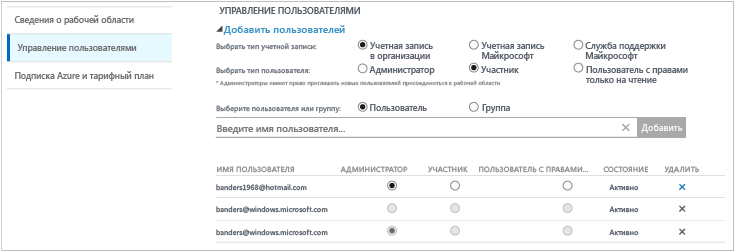

#### Добавление пользователя в существующую рабочую область
Следуйте инструкциям ниже, чтобы добавить пользователя или группу в рабочую область.

1. На портале OMS щелкните элемент **Параметры**.
2. Выберите вкладку **Учетные записи**, а затем — **Управление пользователями**.
3. В разделе **Управление пользователями** выберите тип добавляемой учетной записи: **Учетная запись организации**, **Учетная запись Майкрософт** или **Служба поддержки Майкрософт**.

   * Если вы выбрали учетную запись Майкрософт, введите электронный адрес пользователя, связанного с этой учетной записью.
   * Выбрав учетную запись организации, введите часть имени пользователя или группы либо псевдонима электронной почты, и появится раскрывающийся список пользователей и групп. Выберите пользователя или группу.
   * Через службу технической поддержки Майкрософт инженеру службы поддержки или сотруднику корпорации Майкрософт можно предоставить временный доступ к своей рабочей области для устранения неполадок.

     > [!NOTE]
     > Для лучшей производительности ограничьте количество групп Active Directory, связанных с одной учетной записью OMS, до трех: одна для администраторов, одна для участников и одна для пользователей (с доступом только для чтения). Использование нескольких групп может повлиять на производительность Log Analytics.
     >
     >
4. Выберите тип добавляемого пользователя или группы: **Администратор**, **Участник** или **Пользователь с доступом только для чтения**.  
5. Щелкните **Добавить**.

   Если вы добавляете учетную запись Майкрософт, на электронный адрес, который вы указали, отправляется приглашение присоединиться к рабочей области. Выполнив инструкции в приглашении присоединиться к OMS, пользователь сможет подключиться к рабочей области.
   Если вы добавите учетную запись организации, пользователь сможет мгновенно получить доступ к Log Analytics.  

#### Изменение типа существующего пользователя
Вы можете изменить роль учетной записи пользователя, связанного с вашей учетной записью OMS. Доступны следующие роли.

* *Администратор*— может управлять пользователями, просматривать все оповещения и реагировать на них, добавлять и удалять серверы.
* *Соавтор*— может просматривать все оповещения и действовать в соответствии с их содержанием, добавлять и удалять серверы.
* *Пользователь с доступом только для чтения.* Пользователи, которым назначена эта роль, не могут выполнять следующие действия:

  1. Добавлять и удалять решения. Коллекция решений скрыта.
  2. Добавлять, изменять и удалять плитки на странице **Моя панель мониторинга**.
  3. Просматривать страницы **Параметры**. Они скрыты.
  4. В представлении поиска задания "Конфигурация Power BI", "Сохраненные условия поиска" и "Оповещения" скрыты.

#### Редактирование учетной записи
1. На портале OMS щелкните элемент **Параметры**.
2. Выберите вкладку **Учетные записи**, а затем — **Управление пользователями**.
3. Выберите роль для пользователя, которого необходимо изменить.
4. В диалоговом окне подтверждения нажмите кнопку **Да**.

### Удаление пользователя из рабочей области
Следуйте инструкциям ниже, чтобы удалить пользователя из рабочей области. После удаления пользователя рабочая область останется открытой. Вместо этого они удалят связь между пользователем и рабочей областью. Если пользователь связан с несколькими рабочими областями, он по-прежнему сможет входить в OMS и просматривать другие рабочие области.

1. На портале OMS щелкните элемент **Параметры**.
2. Выберите вкладку **Учетные записи**, а затем — **Управление пользователями**.
3. Выберите **Удалить** рядом с именем пользователя, которого требуется удалить.
4. В диалоговом окне подтверждения нажмите кнопку **Да**.

### Добавление группы в существующую рабочую область
1. Выполните шаги с 1 по 4 в разделе "Добавление пользователя в существующую рабочую область" выше.
2. В разделе **Выберите группу или пользователя** выберите **Группа**.  
   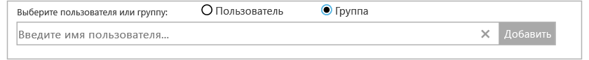
3. Введите отображаемое имя или адрес электронной почты для группы, которую вы хотите добавить.
4. Выберите группу в списке результатов и щелкните **Добавить**.

## Связывание существующей рабочей области с подпиской Azure
Все рабочие области, созданные после 26 сентября 2016 года, должны быть связаны с подпиской Azure во время создания, Рабочие области, созданные до этой даты, должны быть связаны с подпиской во время входа. Когда вы создаете рабочую область на портале Azure или связываете рабочую область с подпиской Azure, Azure Active Directory связывается в качестве учетной записи организации.

### Связывание рабочей области с подпиской Azure на портале OMS

- При входе на портал OMS вам будет предложено выбрать подписку Azure. Выберите подписку, которую вы хотите связать с рабочей областью, и нажмите кнопку **Связать**.  
    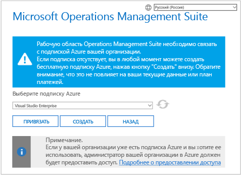

    > [!IMPORTANT]
    > Чтобы связать рабочую область с учетной записью Azure, учетная запись Azure уже должна иметь доступ к рабочей области, с которой ее нужно связать.  Иными словами, учетная запись, используемая для доступа к порталу Azure, должна быть **той же самой** учетной записью, которая используется для доступа к рабочей области. Дополнительные сведения об этом см. в разделе [Добавление пользователя в существующую рабочую область](#add-a-user-to-an-existing-workspace).

### Связывание рабочей области с подпиской Azure на портале Azure
1. Войдите на [портал Azure](http://portal.azure.com).
2. Найдите и выберите пункт **Log Analytics**.
3. Появится список имеющихся рабочих областей. Щелкните **Добавить**.  
   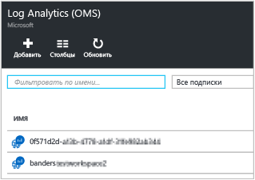
4. В разделе **OMS Workspace** (Рабочая область OMS) щелкните **Or link existing** (Связать существующую).  
   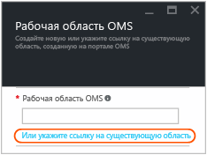
5. Щелкните **Настроить необходимые параметры**.  
   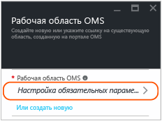
6. Появится список рабочих областей, не связанных с учетной записью Azure. Выберите рабочую область.  
   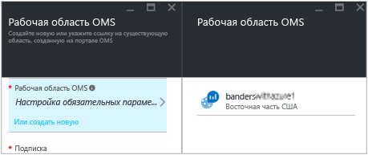
7. При необходимости вы можете изменить значения следующих элементов:
   * Подписка
   * Группа ресурсов
   * Расположение
   * Ценовой уровень  
     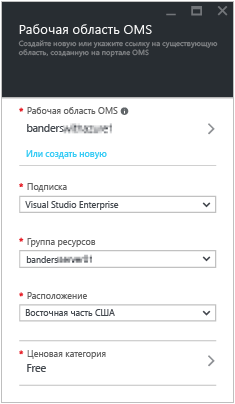
8. Последовательно выберите **ОК**. Теперь рабочая область связана с учетной записью Azure.

> [!NOTE]
> Если рабочая область, которую необходимо связать, не отображается, у подписки Azure нет прав доступа к рабочей области, созданной на портале OMS.  Чтобы предоставить доступ к этой учетной записи на портале OMS, см. раздел [Добавление пользователя в существующую рабочую область](#add-a-user-to-an-existing-workspace).
>
>

## Изменение организации Azure Active Directory для рабочей области

Организацию Azure Active Directory для рабочей области можно изменить. Изменив организацию Azure Active Directory, вы сможете добавлять пользователей и группы из этого каталога в рабочую область.

### Изменение организации Azure Active Directory для рабочей области

1. На портале OMS на странице "Параметры" щелкните **Учетные записи**, а затем выберите вкладку **Управление пользователями**.  
2. Просмотрите сведения об учетной записи организации и нажмите кнопку **Изменить организацию**.  
    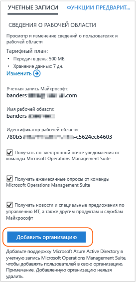
3. Введите сведения об удостоверении для администратора домена Azure Active Directory. После этого появится сообщение с подтверждением того, что рабочая область связана с доменом Azure Active Directory.  
    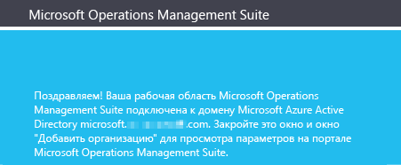

## Дополнительная информация
* Сведения о том, как анализировать объем данных, собранных с помощью решений и отправленных с компьютеров, см. в статье [Анализ использования данных в службе Log Analytics](log-analytics-usage.md).
* Сведения о добавлении функций и сборе данных см. в статье [Добавление решений для управления Azure Log Analytics в рабочую область](log-analytics-add-solutions.md).
