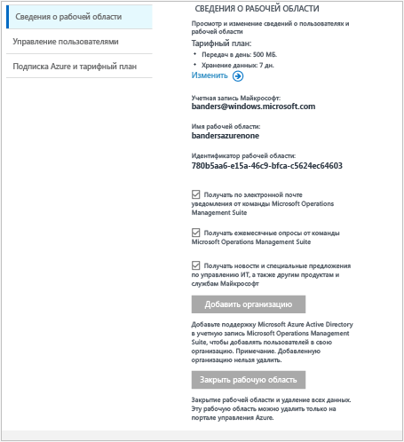

# Управление доступом к Log Analytics
Управление доступом к Log Analytics осуществляется с помощью разных административных задач, которые применяются к пользователям, учетным записям, рабочим областям OMS и учетным записям Azure. Чтобы создать новую рабочую область в Operations Management Suite (OMS), выберите имя рабочей области, свяжите его со своей учетной записью и выберите географическое расположение. Рабочая область — это контейнер, который содержит сведения об учетной записи и ее конфигурации. Вы или другие члены организации могут использовать несколько рабочих областей OMS для управления различными наборами данных, собранными из всех частей ИТ-инфраструктуры.

В статье [Get started with Log Analytics](log-analytics-get-started.md) (Начало работы с Log Analytics) показано, как быстро осуществить настройку и запуск, а также подробно описаны некоторые действия, которые потребуется завершить, чтобы управлять доступом к OMS.

В следующих разделах приводится описание всех основных задач по управлению, хотя изначально вам может и не потребоваться выполнять каждую из этих задач:

* Определение необходимого количества рабочих областей
* Управление учетными записями и пользователями
* Добавление группы в существующую рабочую область
* Связывание существующей рабочей области с подпиской Azure
* Обновление рабочей области до тарифного плана с оплатой
* Изменение типа тарифного плана
* Добавление организации Azure Active Directory в существующую рабочую область
* Закрытие рабочей области OMS

## Определение необходимого количества рабочих областей
Рабочая область — это ресурс Azure и контейнер, где данные собираются, группируются, анализируются и представляются на портале OMS.

Рабочих областей службы OMS Log Analytics может быть несколько, а пользователи могут иметь доступ к одной или нескольким рабочим областям. Число рабочих областей должно быть минимальным — это позволит запрашивать и сопоставлять большинство данных. В этом разделе описывается, в каких ситуациях может пригодиться создание более чем одной рабочей области.

На сегодняшний день рабочая область службы Log Analytics предоставляет следующее:

* географическое расположение для хранения данных;
* Детализация данных для выставления счетов
* Изоляция данных

С учетом представленных выше характеристик необходимость в нескольких рабочих областях может возникнуть по следующим причинам.

* Вы являетесь глобальной компанией, и по причинам конфиденциальности или в соответствии с нормативными требованиями вам необходимо хранить данные в определенных регионах.
* Вы используете Azure и хотите избежать расходов на передачу исходящих данных, создав рабочую область службы Log Analytics в том же регионе, где находятся ресурсы Azure, которыми она управляет.
* Вам необходимо распределить расходы между различными отделами или бизнес-группами в зависимости от их использования. При создании рабочей области для каждого отдела или бизнес-группы в счетах и отчетах по использованию Azure расходы по каждой рабочей области будут отражаться отдельно.
* Вы являетесь поставщиком управляемой службы, и вам необходимо хранить данные службы Log Analytics по каждому клиенту отдельно от данных других клиентов.
* Вы управляете несколькими клиентами и хотите, чтобы каждый клиент, отдел или бизнес-группа видели свои данные и не видели данные других клиентов, отделов и бизнес-групп.

При использовании агентов для сбора данных каждый агент можно настроить таким образом, чтобы он отправлял отчеты в необходимую рабочую область.

Если вы используете System Center Operations Manager, каждую группу управления Operations Manager можно подключить только к одной рабочей области. Microsoft Monitoring Agent можно установить на компьютеры под управлением Operations Manager и настроить его таким образом, чтобы он отправлял отчеты и в Operations Manager, и в другую рабочую область Log Analytics.

### Сведения о рабочей области
На портале OMS можно просмотреть сведения о рабочей области и выбрать, нужно ли получать сведения от корпорации Майкрософт.

#### Просмотр сведений о рабочей области
1. В OMS щелкните элемент **Параметры** .
2. Щелкните вкладку **Учетные записи** .
3. Щелкните вкладку **Сведения о рабочей области**.  
   

## Управление учетными записями и пользователями
Каждая рабочая область может иметь несколько связанных с ней учетных записей пользователей, и каждая учетная запись пользователя (учетная запись Майкрософт или учетная запись организации) может иметь доступ к нескольким рабочим областям OMS.

По умолчанию учетная запись Майкрософт или учетная запись организации, используемая для создания рабочей области, становится администратором рабочей области. Администратор может затем пригласить дополнительных пользователей учетных записей Майкрософт или выбрать пользователей из Azure Active Directory.

Управление доступом пользователей к рабочей области OMS осуществляется в двух расположениях:

* В Azure с помощью управления доступом на основе ролей можно предоставлять доступ к подписке Azure и соответствующим ресурсам Azure. Его также можно использовать для доступа к PowerShell и API REST.
* На портале OMS можно управлять доступом только к порталу OMS, но не к соответствующей подписке Azure.

Если вы предоставили определенным пользователям доступ к порталу OMS, но не к связанной с ним подписке Azure, при входе на портал OMS на плитках службы автоматизации, службы архивации и службы Site Recovery не будут отображаться какие-либо данные для пользователей.

Чтобы разрешить всем пользователям видеть данные в этих решениях, предоставьте им по меньшей мере доступ **для чтения** к учетной записи службы автоматизации, хранилищу службы архивации и хранилищу Site Recovery, связанным с рабочей областью OMS.   

### Управление доступом к службе Log Analytics с помощью портала Azure
Если вы предоставляете сотрудникам доступ к рабочей области Log Analytics, используя разрешения Azure (например, на портале Azure), эти пользователи смогут также получить доступ к порталу Log Analytics. Если пользователи находятся на портале Azure, они могут перейти на портал OMS, щелкнув задачу **OMS Portal** ("Портал OMS") при просмотре ресурсов рабочей области Log Analytics.

Некоторые моменты в отношении портала Azure, которые следует учитывать:

* Это не *управление доступом на основе ролей*. Если на портале Azure у вас есть разрешение на доступ к рабочей области Log Analytics с правами *читателя*, изменения можно вносить на портале OMS. На портале OMS используются понятия "Администратор", "Участник" и "Пользователь только для чтения". Если учетная запись, в которую вы выполнили вход, находится в Azure Active Directory, привязанном к рабочей области, на портале OMS вы будете администратором, а если нет, то участником.
* При входе на портал OMS по адресу http://mms.microsoft.com по умолчанию появится список **Выберите рабочую область**. Он содержит только рабочие области, добавленные через портал OMS. Чтобы просматривать рабочие области, к которым у вас есть доступ благодаря подпискам Azure, необходимо указать клиент как часть URL-адреса. Например:
  
  `mms.microsoft.com/?tenant=contoso.com` Идентификатор клиента чаще всего является последней частью адреса электронной почты, используемого для входа.
* Если учетная запись, под которой выполняется вход, находится в Azure Active Directory клиента (обычно это так, если вы не выполняете вход как CSP), на портале OMS вы будете *администратором*. Если ваша учетная запись не находится в Azure Active Directory клиента, на портале OMS вы будете *пользователем*.
* Если необходимо перейти непосредственно на портал, доступный вам за счет разрешений Azure, ресурс необходимо указать в составе URL-адреса. Этот URL-адрес можно получить с помощью PowerShell.
  
  Например, `(Get-AzureRmOperationalInsightsWorkspace).PortalUrl`.
  
  URL-адрес будет выглядеть следующим образом: `https://eus.mms.microsoft.com/?tenant=contoso.com&resource=%2fsubscriptions%2faaa5159e-dcf6-890a-a702-2d2fee51c102%2fresourcegroups%2fdb-resgroup%2fproviders%2fmicrosoft.operationalinsights%2fworkspaces%2fmydemo12`.

### Управление пользователями на портале OMS
Управление пользователями и группой осуществляется на вкладке **Управление пользователями**, которую можно открыть, выбрав вкладку **Учетные записи** на странице "Параметры". С ее помощью можно выполнять задачи, которые описываются в следующих разделах.  

#### Добавление пользователя в существующую рабочую область
Следуйте инструкциям ниже, чтобы добавить пользователя или группу в рабочую область OMS. Пользователь или группа смогут просматривать все предупреждения, связанные с этой рабочей областью, и действовать в соответствии с их содержанием.

> [!NOTE]
> Если необходимо добавить пользователя или группу из учетной записи организации Azure Active Directory, сначала убедитесь, что ваша учетная запись OMS связана с вашим доменом Active Directory. Чтобы добавить агенты и реализовать сбор данных, [Добавление организации Azure Active Directory в существующую рабочую область](#add-an-azure-active-directory-organization-to-an-existing-workspace).
> 
> 

1. В OMS щелкните элемент **Параметры** .
2. Выберите вкладку **Учетные записи**, а затем — **Управление пользователями**.
3. В разделе **Управление пользователями** выберите тип добавляемой учетной записи: **Учетная запись организации**, **Учетная запись Майкрософт** или **Служба поддержки Майкрософт**.
   
   * Если вы выбрали учетную запись Майкрософт, введите электронный адрес пользователя, связанного с этой учетной записью.
   * Если вы выбрали учетную запись организации, то можете ввести часть имени пользователя или группы либо псевдонима электронной почты, и появится список пользователей и групп. Выберите пользователя или группу.
   * Через службу технической поддержки Майкрософт вы можете предоставить инженеру службы поддержки Майкрософт временный доступ к своей рабочей области для устранения неполадок.
     
     > [!NOTE]
     > Для лучшей производительности ограничьте количество групп Active Directory, связанных с одной учетной записью OMS, до трех: одна для администраторов, одна для участников и одна для пользователей (с доступом только для чтения). Использование нескольких групп может повлиять на производительность Log Analytics.
     > 
     > 
4. Выберите тип добавляемого пользователя или группы: **Администратор**, **Участник** или **Пользователь с доступом только для чтения**.  
5. Щелкните **Добавить**.
   
   Если вы добавляете учетную запись Майкрософт, на электронный адрес, который вы указали, отправляется приглашение присоединиться к рабочей области. После того как пользователь выполнит инструкции в приглашении присоединиться к OMS, он сможет просматривать оповещения и сведения об этой учетной записи OMS, а вы сможете просматривать сведения о пользователе на вкладке **Учетные записи** страницы **Параметры**.
   Если вы добавите учетную запись организации, пользователь сможет мгновенно получить доступ к Log Analytics.  
   

#### Изменение типа существующего пользователя
Вы можете изменить роль учетной записи пользователя, связанного с вашей учетной записью OMS. Доступны следующие роли.

* *Администратор*— может управлять пользователями, просматривать все оповещения и реагировать на них, добавлять и удалять серверы.
* *Соавтор*— может просматривать все оповещения и действовать в соответствии с их содержанием, добавлять и удалять серверы.
* *Пользователь только для чтения*: пользователи, отмеченные как доступные только для чтения, не смогут выполнить следующие действия:
  
  1. Добавлять и удалять решения. Коллекция решений скрыта.
  2. Добавлять, изменять и удалять плитки на странице **Моя панель мониторинга**.
  3. Просматривать страницы **Параметры**. Они скрыты.
  4. В представлении поиска задания "Конфигурация Power BI", "Сохраненные условия поиска" и "Оповещения" скрыты.

#### Редактирование учетной записи
1. В OMS щелкните элемент **Параметры** .
2. Выберите вкладку **Учетные записи**, а затем — **Управление пользователями**.
3. Выберите роль для пользователя, которого необходимо изменить.
4. В диалоговом окне подтверждения нажмите кнопку **Да**.

### Удаление пользователя из рабочей области OMS
Следуйте инструкциям ниже, чтобы удалить пользователя из рабочей области OMS. Обратите внимание, что эти действия не закроют рабочую область пользователя. Вместо этого они удалят связь между пользователем и рабочей областью. Если пользователь связан с несколькими рабочими областями, он по-прежнему сможет входить в OMS и просматривать другие рабочие области.

1. В OMS щелкните элемент **Параметры** .
2. Выберите вкладку **Учетные записи**, а затем — **Управление пользователями**.
3. Выберите **Удалить** рядом с именем пользователя, которого требуется удалить.
4. В диалоговом окне подтверждения нажмите кнопку **Да**.

### Добавление группы в существующую рабочую область
1. Выполните шаги с 1 по 4 в разделе "Добавление пользователя в существующую рабочую область" выше.
2. В разделе **Выберите группу или пользователя** выберите **Группа**.
   
3. Введите отображаемое имя или адрес электронной почты для группы, которую вы хотите добавить.
4. Выберите группу в списке результатов и щелкните **Добавить**.

## Связывание существующей рабочей области с подпиской Azure
Рабочую область можно создать на веб-сайте [microsoft.com/oms](https://microsoft.com/oms).  Для этих рабочих областей есть некоторые ограничения. Например, самым значительным является ограничение передачи данных до 500 МБ в день, если вы используете бесплатную учетную запись. Для внесения изменений в эту рабочую область понадобится *связать существующую рабочую область с подпиской Azure*.

> [!IMPORTANT]
> Чтобы связать рабочую область с учетной записью Azure, учетная запись Azure уже должна иметь доступ к рабочей области, с которой ее нужно связать.  Иными словами, учетная запись, используемая для доступа к порталу Azure, должна быть **той же самой** учетной записью, которая используется для доступа к рабочей области OMS. Если это не так, см. раздел [Добавление пользователя в существующую рабочую область](#add-a-user-to-an-existing-workspace).
> 
> 

### Связывание рабочей области с подпиской Azure на портале OMS
Чтобы связать рабочую область с подпиской Azure на портале OMS, у выполнившего вход пользователя должна быть платная учетная запись Azure. Рабочая область, которая активно используется, связывается с учетной записью Azure.

1. В OMS щелкните элемент **Параметры** .
2. Выберите вкладку **Учетные записи**, а затем — **Azure Subscription & Data Plan** (Подписка Azure и тарифный план).
3. Выберите тарифный план, который необходимо использовать.
4. Щелкните **Сохранить**.  
   

Новый тарифный план отображается на ленте портала OMS в верхней части веб-страницы.

### Связывание рабочей области с подпиской Azure на портале Azure
1. Войдите на [портал Azure](http://portal.azure.com).
2. Найдите и выберите пункт **Log Analytics (OMS)** .
3. Появится список существующих рабочих областей. Щелкните **Добавить**.  
   
4. В разделе **OMS Workspace** (Рабочая область OMS) щелкните **Or link existing** (Связать существующую).  
   
5. Щелкните **Настроить необходимые параметры**.  
   
6. Появится список рабочих областей, которые еще не связаны с учетной записью Azure. Выберите рабочую область.  
   
7. При необходимости вы можете изменить значения следующих элементов:
   * Подписка
   * Группа ресурсов
   * Расположение
   * Ценовая категория   
       
8. Щелкните **Создать**. Теперь рабочая область связана с учетной записью Azure.

> [!NOTE]
> Если рабочая область, которую необходимо связать, не отображается, у подписки Azure нет прав доступа к рабочей области OMS, созданной на веб-сайте OMS.  Вам потребуется предоставить доступ к этой учетной записи из рабочей области OMS на веб-сайте OMS. Подробнее об этом см. в разделе [Добавление пользователя в существующую рабочую область](#add-a-user-to-an-existing-workspace).
> 
> 

## Обновление рабочей области до тарифного плана с оплатой
Есть три типа тарифных планов рабочей области для OMS: **Бесплатный**, **Стандартный** и **Премиум**.  Если вы используете план *Бесплатный*, он предусматривает ограничение емкости данных в 500 МБ.  Необходимо обновить рабочую область до тарифного плана ***с оплатой по мере использования***, чтобы собирать данные, которые превышают этот предел. Тарифный план можно изменить в любое время.  Дополнительные сведения о ценах на OMS см. [здесь](https://www.microsoft.com/en-us/server-cloud/operations-management-suite/pricing.aspx).

> [!IMPORTANT]
> Тарифный план рабочей области можно изменить, только если она *связана* с подпиской Azure.  Если вы создали рабочую область в Azure или если вы *уже* связали свою рабочую область, вы можете проигнорировать это сообщение.  Если вы создали рабочую область с помощью [веб-сайта OMS](http://www.microsoft.com/oms), необходимо выполнить действия, описанные в разделе [Связывание существующей рабочей области с подпиской Azure](#link-an-existing-workspace-to-an-azure-subscription).
> 
> 

### Использование прав из надстройки OMS для System Center
Надстройка OMS для System Center предоставляет право на план "Премиум" для Log Analytics в OMS, описанное на странице с [ценами на OMS](https://www.microsoft.com/en-us/server-cloud/operations-management-suite/pricing.aspx).

При покупке надстройки OMS для System Center она добавляется в соглашение System Center как отдельное право. Это право может использоваться подпиской Azure, созданной по этому соглашению. Таким образом вы сможете, например, создать несколько рабочих областей OMS, которые используют право из надстройки OMS.

Чтобы использование рабочей области OMS основывалось на правах из надстройки OMS, потребуется сделать следующее:

1. Свяжите рабочую область OMS с подпиской Azure, которая является частью соглашения Enterprise, включающего как покупку надстройки OMS, так и использование подписки Azure.
2. Выберите план "Премиум" для рабочей области.

При просмотре сведений об использовании на портале Azure или OMS не отображается информация о правах из надстройки OMS. Однако их можно просмотреть на портале Enterprise Portal.  

Если вам нужно изменить подписку Azure, с которой связана ваша рабочая область OMS, можно использовать командлет [Move-AzureRmResource](https://msdn.microsoft.com/library/mt652516.aspx) в среде Azure PowerShell.

### Использование подписки Azure в рамках соглашения Enterprise
Если вы выберете вариант отдельной оплаты компонентов OMS, плата будет взиматься за каждый компонент OMS по отдельности, а сведения об использовании будут отражены в счете Azure.

Если у вас есть денежные обязательства Azure в отношении соглашения о регистрации Enterprise, с которым связаны ваши подписки Azure, любое использование службы Log Analytics будет идти в зачет этих обязательств.

Если вам нужно изменить подписку Azure, с которой связана рабочая область OMS, можно использовать командлет [Move-AzureRmResource](https://msdn.microsoft.com/library/mt652516.aspx) в среде Azure PowerShell.  

### Изменение рабочей области до платного тарифного плана
1. Войдите на [портал Azure](http://portal.azure.com).
2. Найдите и выберите пункт **Log Analytics (OMS)** .
3. Появится список существующих рабочих областей. Выберите рабочую область.  
   
4. В разделе **Параметры** щелкните **Ценовая категория**.  
   
5. В разделе **Ценовая категория** выберите тарифный план и нажмите кнопку **Выбрать**.  
   
6. При обновлении представления на портале Azure для выбранного плана появится новое значение параметра **Ценовая категория**.  
   

Теперь вы можете собирать данные, превышая "бесплатный" максимальный объем.

## Добавление организации Azure Active Directory в существующую рабочую область
Вы можете связать рабочую область службы Log Analytics (OMS) с доменом Azure Active Directory. Это позволит вам добавлять пользователей из Active Directory непосредственно в рабочую область OMS без использования отдельной учетной записи Майкрософт.

Когда вы создаете рабочую область на портале Azure или привязываете рабочую область к подписке Azure, Azure Active Directory привязывается как учетная запись организации.

При создании рабочей области на портале OMS вам будет предложено связать подписку Azure и учетную запись организации.

### Добавление организации Azure Active Directory в существующую рабочую область
1. В OMS на странице "Параметры" выберите **Учетные записи**, а затем щелкните вкладку **Сведения о рабочей области**.  
2. Просмотрите сведения об учетной записи организации и нажмите кнопку **Add Organization**(Добавить организацию).  
    
3. Введите сведения об удостоверении для администратора домена Azure Active Directory. После этого появится сообщение с подтверждением того, что рабочая область связана с доменом Azure Active Directory.
    

> [!NOTE]
> Если ваша учетная запись связана с учетной записью организации, удалить или изменить эту связь нельзя.
> 
> 

## Закрытие рабочей области OMS
Если закрыть рабочую область OMS, все данные, относящиеся к рабочей области, удалятся из службы OMS в течение 30 дней.

Если вы являетесь администратором и с рабочей областью связано несколько пользователей, связь между этими пользователями и рабочей областью тоже прекратится. Если пользователи связаны с другими рабочими областями, они смогут продолжить использовать службу OMS в этих рабочих областях. Но если они не связаны с другими рабочими областями, им необходимо создать новую рабочую область для использования OMS.

### Закрытие рабочей области OMS
1. В OMS щелкните элемент **Параметры** .
2. Выберите вкладку **Учетные записи**, а затем — **Сведения о рабочей области**.
3. Щелкните **Закрыть рабочую область**.
4. Выберите одну из причин закрытия рабочей области или введите другую причину в текстовом поле.
5. Нажмите **Close Workspace**(Закрыть рабочую область).

## Дальнейшие действия
* Чтобы добавить агенты и реализовать сбор данных, [подключите компьютеры с Windows к Log Analytics](log-analytics-windows-agents.md) .
* [добавьте решения Log Analytics из коллекции решений](log-analytics-add-solutions.md) .
* [Настройка параметров прокси-сервера и брандмауэра в службе Log Analytics](log-analytics-proxy-firewall.md) , чтобы агенты могли взаимодействовать со службой Log Analytics.

<!--HONumber=Oct16_HO2-->

