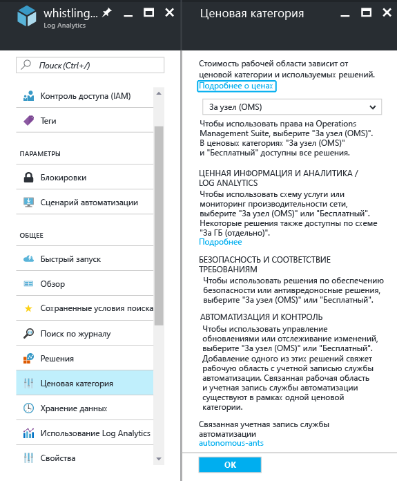
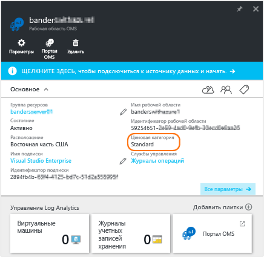
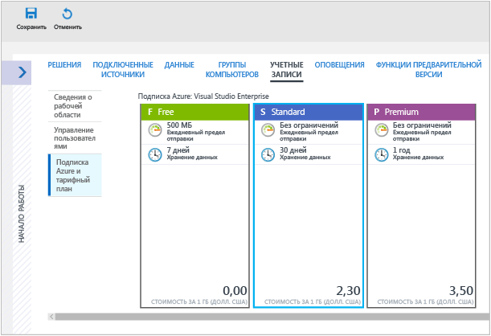
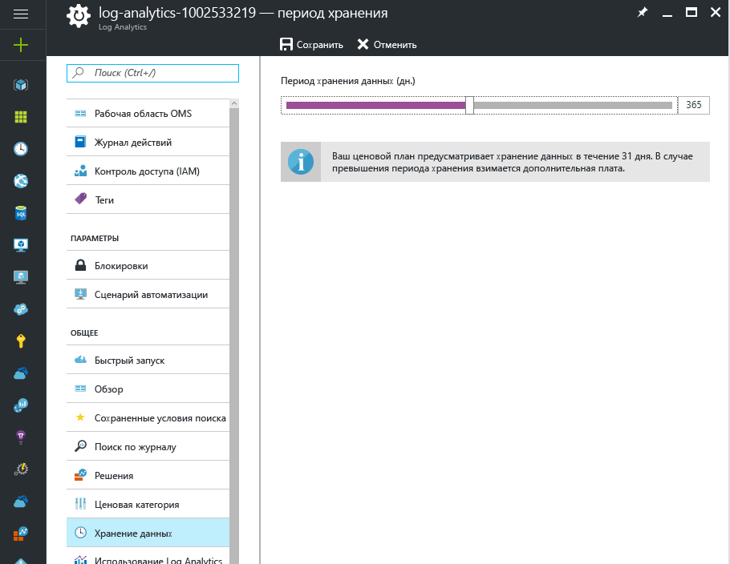
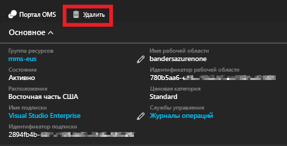

# Управление рабочими областями

Управление доступом к Log Analytics осуществляется с использованием разных задач администрирования, связанных с рабочими областями. Эта статья содержит рекомендации и инструкции по управлению рабочими областями. Рабочая область — это контейнер, который содержит сведения об учетной записи и ее конфигурации. Вы или другие члены организации могут использовать несколько рабочих областей для управления различными наборами данных, собранными из всех частей ИТ-инфраструктуры.

Чтобы создать рабочую область, вам понадобится:

1. Создать подписку Azure.
2. Выбрать имя рабочей области.
3. Связать рабочую область с подпиской.
4. Выбрать географическое расположение.

## Определение необходимого количества рабочих областей
Рабочая область — это ресурс Azure и контейнер, где данные собираются, группируются, анализируются и представляются на портале Azure.

Рабочих областей службы может быть несколько, а пользователи могут иметь доступ к одной или нескольким рабочим областям. Минимальное число рабочих областей позволит запрашивать и сопоставлять большинство данных. В этом разделе описывается, в каких ситуациях может пригодиться создание более чем одной рабочей области.

В настоящее время рабочая область обеспечивает:

* географическое расположение для хранения данных;
* Детализация данных для выставления счетов
* Изоляция данных
* Область конфигурации

С учетом представленных выше характеристик необходимость в нескольких рабочих областях может возникнуть по следующим причинам.

* Вы являетесь глобальной компанией, и по причинам конфиденциальности или в соответствии с нормативными требованиями вам необходимо хранить данные в определенных регионах.
* Вы используете Azure и хотите избежать расходов на передачу исходящих данных, создав рабочую область в том же регионе, где находятся ресурсы Azure, которыми она управляет.
* Вам необходимо распределить расходы между различными отделами или бизнес-группами в зависимости от их использования. При создании рабочей области для каждого отдела или бизнес-группы в счетах и отчетах по использованию Azure расходы по каждой рабочей области будут отражаться отдельно.
* Вы являетесь поставщиком управляемой службы, и вам необходимо хранить данные службы Log Analytics по каждому клиенту отдельно от данных других клиентов.
* Вы управляете несколькими клиентами и хотите, чтобы каждый клиент, отдел или бизнес-группа видели только свои данные.

При использовании агентов для сбора данных каждый агент можно настроить таким образом, чтобы он отправлял отчеты в одну или несколько рабочих областей.

При использовании System Center Operations Manager, каждую группу управления Operations Manager можно подключить только к одной рабочей области. Microsoft Monitoring Agent можно установить на компьютеры под управлением Operations Manager и настроить его таким образом, чтобы он отправлял отчеты и в Operations Manager, и в другую рабочую область Log Analytics.

### Сведения о рабочей области

Сведения о рабочей области можно просмотреть на портале Azure. Их также можно просмотреть на портале OMS.

#### Просмотр сведений о рабочей области на портале Azure

1. Войдите на [портал Azure](https://portal.azure.com), используя подписку Azure, если вы еще этого не сделали.
2. В меню **концентратора** щелкните **Больше служб**, а затем в списке ресурсов введите **Log Analytics**. Как только вы начнете вводить символы, список отфильтруется соответствующим образом. Щелкните **Log Analytics**.  
      
3. В колонке подписки Log Analytics выберите рабочую область.
4. В колонке рабочей области отображаются сведения о рабочей области и ссылки на дополнительные сведения.  
      

## Управление учетными записями и пользователями
Каждая рабочая область может иметь несколько связанных с ней учетных записей пользователей, и каждая учетная запись пользователя (учетная запись Майкрософт или учетная запись организации) может иметь доступ к нескольким рабочим областям.

По умолчанию учетная запись Майкрософт или учетная запись организации, используемая для создания рабочей области, становится администратором рабочей области. Администратор может затем пригласить дополнительных пользователей учетных записей Майкрософт или выбрать пользователей из Azure Active Directory.

Управление доступом пользователей к рабочей области осуществляется в двух расположениях:

* В Azure с помощью управления доступом на основе ролей можно предоставлять доступ к подписке Azure и соответствующим ресурсам Azure. (эти разрешения также можно использовать для доступа к PowerShell и REST API);
* На портале OMS можно управлять доступом только к порталу OMS, но не к соответствующей подписке Azure.

Чтобы просмотреть данные на плитках решения службы архивации и Site Recovery, требуется разрешение администратора или соадминистратора для подписки Azure, с которой связана рабочая область.   

### Управление доступом к службе Log Analytics с помощью портала Azure
Если вы предоставляете сотрудникам доступ к рабочей области Log Analytics, используя разрешения Azure (например, на портале Azure), эти пользователи смогут также получить доступ к порталу Log Analytics. Если пользователи находятся на портале Azure, они могут перейти на портал OMS, щелкнув задачу **OMS Portal** ("Портал OMS") при просмотре ресурсов рабочей области Log Analytics.

Некоторые моменты в отношении портала Azure, которые следует учитывать:

* Это не *управление доступом на основе ролей*. Если на портале Azure у вас есть разрешение на доступ к рабочей области Log Analytics с правами *читателя*, изменения можно вносить на портале OMS. На портале OMS используются понятия "Администратор", "Участник" и "Пользователь только для чтения". Если учетная запись, используемая для входа в систему, находится в Azure Active Directory, привязанном к рабочей области, пользователю на портале OMS предоставляются права администратора, а если нет — участника.
* При входе на портал OMS по адресу http://mms.microsoft.com по умолчанию появится список **Выберите рабочую область**. Он содержит только рабочие области, добавленные через портал OMS. Чтобы просматривать рабочие области, к которым у вас есть доступ благодаря подпискам Azure, необходимо указать клиент как часть URL-адреса. Например:

  `mms.microsoft.com/?tenant=contoso.com`. Чаще всего идентификатор клиента — это последняя часть адреса электронной почты, используемого для входа в систему.
* Если учетная запись, под которой выполняется вход, находится в Azure Active Directory клиента, пользователю на портале OMS предоставляются права *администратора*. Обычно это так, если пользователь не входит в систему как поставщик служб шифрования (CSP).  Если учетная запись не находится в Azure Active Directory клиента, на портале OMS вам будут предоставлены права *пользователя*.
* Если необходимо перейти непосредственно на портал, доступный вам за счет разрешений Azure, ресурс необходимо указать в составе URL-адреса. Этот URL-адрес можно получить с помощью PowerShell.

  Пример: `(Get-AzureRmOperationalInsightsWorkspace).PortalUrl`.

  URL-адрес выглядит следующим образом: `https://eus.mms.microsoft.com/?tenant=contoso.com&resource=%2fsubscriptions%2faaa5159e-dcf6-890a-a702-2d2fee51c102%2fresourcegroups%2fdb-resgroup%2fproviders%2fmicrosoft.operationalinsights%2fworkspaces%2fmydemo12`.

Например, чтобы добавить или удалить решения по управлению, при использовании портала Azure пользователь должен быть администратором или участником подписки Azure. Кроме того, пользователю должна быть назначена роль участника или администратора рабочей области OMS на портале OMS.

### Управление пользователями на портале OMS
Управление пользователями и группой осуществляется на вкладке **Управление пользователями**, которую можно открыть, выбрав вкладку **Учетные записи** на странице "Параметры".   

#### Добавление пользователя в существующую рабочую область
Следуйте инструкциям ниже, чтобы добавить пользователя или группу в рабочую область.

1. На портале OMS щелкните элемент **Параметры**.
2. Выберите вкладку **Учетные записи**, а затем — **Управление пользователями**.
3. В разделе **Управление пользователями** выберите тип добавляемой учетной записи: **Учетная запись организации**, **Учетная запись Майкрософт** или **Служба поддержки Майкрософт**.

   * Если вы выбрали учетную запись Майкрософт, введите электронный адрес пользователя, связанного с этой учетной записью.
   * Выбрав учетную запись организации, можно ввести часть имени пользователя или группы либо псевдонима электронной почты, и появится раскрывающийся список пользователей и групп. Выберите пользователя или группу.
   * Через службу технической поддержки Майкрософт инженеру службы поддержки или сотруднику корпорации Майкрософт можно предоставить временный доступ к своей рабочей области для устранения неполадок.

     > [!NOTE]
     > Для лучшей производительности ограничьте количество групп Active Directory, связанных с одной учетной записью OMS, до трех: одна для администраторов, одна для участников и одна для пользователей (с доступом только для чтения). Использование нескольких групп может повлиять на производительность Log Analytics.
     >
     >
4. Выберите тип добавляемого пользователя или группы: **Администратор**, **Участник** или **Пользователь с доступом только для чтения**.  
5. Щелкните **Добавить**.

   Если вы добавляете учетную запись Майкрософт, на электронный адрес, который вы указали, отправляется приглашение присоединиться к рабочей области. Выполнив инструкции в приглашении присоединиться к OMS, пользователь сможет подключиться к рабочей области.
   Если вы добавите учетную запись организации, пользователь сможет мгновенно получить доступ к Log Analytics.  

#### Изменение типа существующего пользователя
Вы можете изменить роль учетной записи пользователя, связанного с вашей учетной записью OMS. Доступны следующие роли.

* *Администратор*— может управлять пользователями, просматривать все оповещения и реагировать на них, добавлять и удалять серверы.
* *Соавтор*— может просматривать все оповещения и действовать в соответствии с их содержанием, добавлять и удалять серверы.
* *Пользователь с доступом только для чтения.* Пользователи, которым назначена эта роль, не могут выполнять следующие действия:

  1. Добавлять и удалять решения. Коллекция решений скрыта.
  2. Добавлять, изменять и удалять плитки на странице **Моя панель мониторинга**.
  3. Просматривать страницы **Параметры**. Они скрыты.
  4. В представлении поиска задания "Конфигурация Power BI", "Сохраненные условия поиска" и "Оповещения" скрыты.

#### Редактирование учетной записи
1. На портале OMS щелкните элемент **Параметры**.
2. Выберите вкладку **Учетные записи**, а затем — **Управление пользователями**.
3. Выберите роль для пользователя, которого необходимо изменить.
4. В диалоговом окне подтверждения нажмите кнопку **Да**.

### Удаление пользователя из рабочей области
Следуйте инструкциям ниже, чтобы удалить пользователя из рабочей области. После удаления пользователя рабочая область останется открытой. Вместо этого они удалят связь между пользователем и рабочей областью. Если пользователь связан с несколькими рабочими областями, он по-прежнему сможет входить в OMS и просматривать другие рабочие области.

1. На портале OMS щелкните элемент **Параметры**.
2. Выберите вкладку **Учетные записи**, а затем — **Управление пользователями**.
3. Выберите **Удалить** рядом с именем пользователя, которого требуется удалить.
4. В диалоговом окне подтверждения нажмите кнопку **Да**.

### Добавление группы в существующую рабочую область
1. Выполните шаги с 1 по 4 в разделе "Добавление пользователя в существующую рабочую область" выше.
2. В разделе **Выберите группу или пользователя** выберите **Группа**.  
   
3. Введите отображаемое имя или адрес электронной почты для группы, которую вы хотите добавить.
4. Выберите группу в списке результатов и щелкните **Добавить**.

## Связывание существующей рабочей области с подпиской Azure
Все рабочие области, созданные после 26 сентября 2016 года, должны быть связаны с подпиской Azure во время создания, а рабочие области, созданные до этой даты, — при следующем входе. Когда вы создаете рабочую область на портале Azure или связываете рабочую область с подпиской Azure, Azure Active Directory связывается в качестве учетной записи организации.

### Связывание рабочей области с подпиской Azure на портале OMS

- При входе на портал OMS вам будет предложено выбрать подписку Azure. Выберите подписку, которую вы хотите связать с рабочей областью, и нажмите кнопку **Связать**.  
    

    > [!IMPORTANT]
    > Чтобы связать рабочую область с учетной записью Azure, учетная запись Azure уже должна иметь доступ к рабочей области, с которой ее нужно связать.  Иными словами, учетная запись, используемая для доступа к порталу Azure, должна быть **той же самой** учетной записью, которая используется для доступа к рабочей области. Дополнительные сведения об этом см. в разделе [Добавление пользователя в существующую рабочую область](#add-a-user-to-an-existing-workspace).

### Связывание рабочей области с подпиской Azure на портале Azure
1. Войдите на [портал Azure](http://portal.azure.com).
2. Найдите и выберите пункт **Log Analytics**.
3. Появится список имеющихся рабочих областей. Щелкните **Добавить**.  
   
4. В разделе **OMS Workspace** (Рабочая область OMS) щелкните **Or link existing** (Связать существующую).  
   
5. Щелкните **Настроить необходимые параметры**.  
   
6. Появится список рабочих областей, не связанных с учетной записью Azure. Выберите рабочую область.  
   
7. При необходимости вы можете изменить значения следующих элементов:
   * Подписка
   * Группа ресурсов
   * Расположение
   * Ценовая категория   
     
8. Нажмите кнопку **ОК**. Теперь рабочая область связана с учетной записью Azure.

> [!NOTE]
> Если рабочая область, которую необходимо связать, не отображается, у подписки Azure нет прав доступа к рабочей области, созданной на веб-сайте OMS.  Чтобы предоставить доступ к этой учетной записи на портале OMS, см. раздел [Добавление пользователя в существующую рабочую область](#add-a-user-to-an-existing-workspace).
>
>

## Обновление рабочей области до тарифного плана с оплатой
Рабочая область OMS поддерживает три типа плана: **Бесплатный**, **Автономный** и **OMS**.  Уровень *Бесплатный* предусматривает ограничение емкости на отправку данных в Log Analytics в течение одного дня (500 МБ).  Чтобы собирать данные, которые превышают этот предел, рабочую область необходимо обновить до плана с оплатой. Тарифный план можно изменить в любое время.  Дополнительные сведения о ценах на OMS см. [здесь](https://www.microsoft.com/en-us/cloud-platform/operations-management-suite-pricing).

### Использование прав из подписки OMS
Чтобы использовать права, полученные при покупке подписки OMS E1, OMS E2 или надстройки OMS для System Center, выберите план *OMS* для Log Analytics (OMS).

При покупке подписки OMS права добавляются в соглашение Enterprise. Эти права могут использоваться любой подпиской Azure, созданной в рамках этого соглашения. Таким образом вы сможете, например, создать несколько рабочих областей, которые используют права из подписок OMS.

Чтобы использование рабочей области основывалось на правах из подписки OMS, сделайте следующее:

1. Создайте рабочую область в подписке Azure, которая входит в состав соглашения Enterprise, включающего подписку OMS.
2. Выберите для рабочей области план *OMS*.

> [!NOTE]
> Если рабочая область создана до 26 сентября 2016 года и для Log Analytics используется тарифный план *Премиум*, то рабочая область будет использовать права из надстройки OMS для System Center. Чтобы использовать права из подписки OMS, ценовую категорию необходимо изменить на *OMS*.
>
>

Права из подписки OMS не отображаются на портале Azure или OMS. Однако права и их использование можно просмотреть на корпоративном портале.  

Если вам нужно изменить подписку Azure, с которой связана ваша рабочая область, можно использовать командлет [Move-AzureRmResource](https://msdn.microsoft.com/library/mt652516.aspx) в среде Azure PowerShell.

### Использование подписки Azure в рамках соглашения Enterprise
Если подписка OMS отсутствует, плата взимается за каждый компонент OMS по отдельности, а сведения об использовании отражаются в счете Azure.

Если у вас есть денежные обязательства Azure в отношении соглашения о регистрации Enterprise, с которым связаны ваши подписки Azure, любое использование службы Log Analytics будет идти в зачет этих обязательств.

Если вам нужно изменить подписку Azure, с которой связана рабочая область, можно использовать командлет [Move-AzureRmResource](https://msdn.microsoft.com/library/mt652516.aspx) в среде Azure PowerShell.  

### Изменение рабочей области до платной ценовой категории на портале Azure
1. Войдите на [портал Azure](http://portal.azure.com).
2. Найдите и выберите пункт **Log Analytics**.
3. Появится список имеющихся рабочих областей. Выберите рабочую область.  
4. В колонке рабочей области в разделе **Общие** щелкните **Ценовая категория**.  
5. В разделе **Ценовая категория** щелкните ценовую категорию и нажмите кнопку **Выбрать**.  
    
6. При обновлении представления на портале Azure для выбранной ценовой категории появится новое значение параметра **Ценовая категория**.  
    

> [!NOTE]
> Если рабочая область связана с учетной записью службы автоматизации, прежде чем вы сможете выбрать ценовую категорию *Автономная (за гигабайт)*, нужно удалить все решения **службы автоматизации и управления** и отменить привязку учетной записи автоматизации. В колонке рабочей области в разделе **Общие** щелкните **Решения**, чтобы просмотреть и удалить решения. Чтобы отменить привязку учетной записи службы автоматизации, щелкните ее имя в колонке **Ценовая категория**.
>
>

## Изменение тарифного плана на портале OMS

Чтобы изменить тарифный план на портале OMS, выполнивший вход пользователь должен иметь учетную запись Azure.

1. На портале OMS щелкните элемент **Параметры**.
2. Выберите вкладку **Учетные записи**, а затем — **Azure Subscription & Data Plan** (Подписка Azure и тарифный план).
3. Выберите тарифный план, который необходимо использовать.
4. Щелкните **Сохранить**.  
   

Новый тарифный план отображается на ленте портала OMS в верхней части веб-страницы.

## Изменение периода хранения данных в Log Analytics

В ценовой категории "Бесплатный" в Log Analytics доступны данные за последние семь дней.
В ценовой категории "Стандартный" в Log Analytics доступны данные за последние 30 дней.
В ценовой категории "Премиум" в Log Analytics доступны данные за последние 365 дней.
В ценовой категории "Автономный" и OMS в Log Analytics по умолчанию доступны данные за последние 31 день.

При использовании ценовых категорий "Автономный" и OMS можно сохранить данные за 2 года (730 дней). За данные, хранящиеся дольше периода по умолчанию (31 день), взимается плата за период удержания. Дополнительные сведения о ценах см. на странице [цен за превышение](https://azure.microsoft.com/pricing/details/log-analytics/).

Изменение продолжительности периода удержания данных

1. Войдите на [портал Azure](http://portal.azure.com).
2. Найдите и выберите пункт **Log Analytics**.
3. Появится список имеющихся рабочих областей. Выберите рабочую область.  
4. В колонке рабочей области в разделе **Общие** щелкните **Хранение**.  
5. Воспользуйтесь ползунком, чтобы увеличить или уменьшить количество дней в периоде удержания, а затем нажмите кнопку **Сохранить**.  
    

## Изменение организации Azure Active Directory для рабочей области

Организацию Azure Active Directory для рабочей области можно изменить. Изменив организацию Azure Active Directory, вы сможете добавлять пользователей и группы из этого каталога в рабочую область.

### Изменение организации Azure Active Directory для рабочей области

1. На портале OMS на странице "Параметры" щелкните **Учетные записи**, а затем выберите вкладку **Управление пользователями**.  
2. Просмотрите сведения об учетной записи организации и нажмите кнопку **Изменить организацию**.  
    
3. Введите сведения об удостоверении для администратора домена Azure Active Directory. После этого появится сообщение с подтверждением того, что рабочая область связана с доменом Azure Active Directory.  
    

## Удаление рабочей области Log Analytics
При удалении рабочей области Log Analytics все данные, относящиеся к ней, удалятся из службы OMS в течение 30 дней.

Если вы являетесь администратором и с рабочей областью связано несколько пользователей, связь между этими пользователями и рабочей областью тоже прекратится. Если пользователи связаны с другими рабочими областями, они смогут продолжить использовать службу OMS в этих рабочих областях. Но если они не связаны с другими рабочими областями, им необходимо создать рабочую область для использования OMS.

### Удаление рабочей области
1. Войдите на [портал Azure](http://portal.azure.com).
2. Найдите и выберите пункт **Log Analytics**.
3. Появится список имеющихся рабочих областей. Выберите рабочую область, которую требуется удалить.
4. В колонке рабочей области щелкните **Удалить**.  
    
5. В окне подтверждения удаления рабочей области нажмите кнопку **Да**.

## Дальнейшие действия
* Чтобы добавить агенты и реализовать сбор данных, [подключите компьютеры с Windows к Log Analytics](log-analytics-windows-agents.md) .
* [добавьте решения Log Analytics из коллекции решений](log-analytics-add-solutions.md) .
* [Настройка параметров прокси-сервера и брандмауэра в службе Log Analytics](log-analytics-proxy-firewall.md) , чтобы агенты могли взаимодействовать со службой Log Analytics.

