<properties
	pageTitle="Настройка параметров прокси-сервера и брандмауэра в службе Log Analytics | Microsoft Azure"
	description="Настройка параметров прокси-сервера и брандмауэра требуется, если агенты или службы OMS должны использовать определенные порты."
	services="log-analytics"
	documentationCenter=""
	authors="bandersmsft"
	manager="jwhit"
	editor=""/>

<tags
	ms.service="log-analytics"
	ms.workload="na"
	ms.tgt_pltfrm="na"
	ms.devlang="na"
	ms.topic="get-started-article"
	ms.date="04/28/2016"
	ms.author="banders"/>

# Настройка параметров прокси-сервера и брандмауэра в службе Log Analytics


Действия, необходимые для настройки параметров прокси-сервера и брандмауэра для службы Log Analytics в OMS, отличаются при работе с Operations Manager и его агентами и при работе с агентами Microsoft Monitoring Agent, которые напрямую подключаются к серверам. Просмотрите следующие разделы для типа агента, который используете.

## Настройка параметров прокси-сервера и брандмауэра с помощью Microsoft Monitoring Agent

Чтобы Microsoft Monitoring Agent мог подключиться к службе OMS и зарегистрироваться в ней, ему нужен доступ к номеру порта ваших доменов и URL-адресов. При использовании прокси-сервера для обмена данными между агентом и службой OMS необходимо убедиться, что соответствующие ресурсы доступны. Если используется брандмауэр, чтобы ограничить доступ к Интернету, его необходимо настроить таким образом, чтобы разрешить доступ к OMS. В следующих таблицах перечислены порты, необходимые для работы OMS.

|**Ресурс агента**|**Порты**|
|--------------|-----|
|*.ods.opinsights.azure.com|порт 443| 
|*.oms.opinsights.azure.com|Порт 443|
|ods.systemcenteradvisor.com|Порт 443|
|*.blob.core.windows.net|Port 443|

Далее описано, как настроить параметры прокси-сервера для Microsoft Monitoring Agent с помощью панели управления. Эту процедуру необходимо использовать для каждого сервера. Если вам нужно настроить несколько серверов, возможно, проще использовать скрипт для автоматизации этого процесса. Далее описано, [как настроить параметры прокси-сервера для Microsoft Monitoring Agent с помощью скрипта](#to-configure-proxy-settings-for-the-microsoft-monitoring-agent-using-a-script).

### Настройка параметров прокси-сервера для Microsoft Monitoring Agent с помощью панели управления

1. Откройте **Панель управления**.

2. Откройте **Microsoft Monitoring Agent**.

3. Перейдите на вкладку **Параметры прокси-сервера**.  
  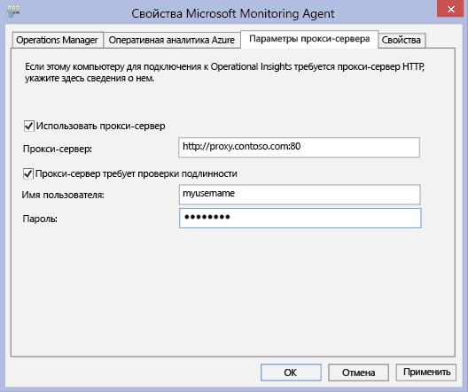

4. Выберите **Использовать прокси-сервер** и введите URL-адрес и номер порта (если он нужен), как показано в примере. Если для доступа к прокси-серверу требуется проверка подлинности, введите имя пользователя и пароль.

Используйте следующую процедуру для создания сценария PowerShell, который можно запустить для установки параметров прокси-сервера для каждого агента, который подключается непосредственно к серверам.

### Настройка параметров прокси-сервера для Microsoft Monitoring Agent с помощью скрипта


- Скопируйте следующий пример, измените его, указав данные своей среды, сохраните его в файл с расширением PS1, затем выполните сценарий на каждом компьютере, который подключается непосредственно к службе OMS.


```
param($ProxyDomainName="http://proxy.contoso.com:80", $cred=(Get-Credential))

# First we get the health service configuration object.  We need to determine if we
# have the right update rollup with the API we need.  If not, no need to run the rest of the script.
$healthServiceSettings = New-Object -ComObject 'AgentConfigManager.MgmtSvcCfg'

$proxyMethod = $healthServiceSettings | Get-Member -Name 'SetProxyInfo'

if (!$proxyMethod)
{
    Write-Output 'Health Service proxy API not present, will not update settings.'
    return
}


Write-Output "Clearing proxy settings."
$healthServiceSettings.SetProxyInfo('', '', '')

$ProxyUserName = $cred.username;


Write-Output "Setting Proxy to ${ProxyDomainName} with proxy username of (${ProxyUserName})."
$healthServiceSettings.SetProxyInfo($ProxyDomainName, $ProxyUserName, $cred.GetNetworkCredential().password)
```

## Настройка параметров прокси-сервера и брандмауэра с помощью Operations Manager

Чтобы группа управления Operations Manager могла подключиться к службе OMS и зарегистрироваться в ней, ей нужен доступ к номерам портов ваших доменов и URL-адресам. При использовании прокси-сервера для обмена данными между сервером управления Operations Manager и службой OMS необходимо убедиться, что соответствующие ресурсы доступны. Если используется брандмауэр, чтобы ограничить доступ к Интернету, его необходимо настроить таким образом, чтобы разрешить доступ к OMS. Даже в том случае, если сервер управления Operations Manager не находится за прокси-сервером, такую возможность могут иметь его агенты. В этом случае прокси-сервер должен быть настроен так же, как агенты, чтобы включить и разрешить передачу данных решения обеспечения безопасности и управления журналами в веб-службу OMS.

Чтобы агенты Operations Manager могли взаимодействовать со службой OMS, ваша инфраструктура Operations Manager (включая агенты) должна иметь правильные настройки и версию прокси-сервера. Настройка прокси-сервера для агентов указывается на консоли Operations Manager. У вас должна быть одна из следующих версий:

- Operations Manager 2012 SP1 с накопительным пакетом обновления 7 или более поздняя версия;
- Operations Manager 2012 R2 с накопительным пакетом обновления 3 или более поздняя версия.


В следующих таблицах перечислены порты, связанные с этими задачами.

>[AZURE.NOTE] В некоторых из следующих ресурсов упоминаются Advisor и Operational Insights — предыдущие версии OMS. Тем не менее, в будущем перечисленные ресурсы будут изменены.

Список ресурсов и портов агента:

|**Ресурс агента**|**Порты**|
|--------------|-----|
|*.ods.opinsights.azure.com|порт 443| 
|*.oms.opinsights.azure.com|Порт 443|
|ods.systemcenteradvisor.com|Порт 443|
|*.blob.core.windows.net/|Port 443|

Список ресурсов и портов сервера управления:

|**Ресурс сервера управления**|**Порты**|
|--------------|-----|
|*.ods.opinsights.azure.com|Port 443| 
|service.systemcenteradvisor.com|Port 443| 
|scadvisor.accesscontrol.windows.net|Port 443| 
|scadvisorservice.accesscontrol.windows.net|Port 443| 
|*.blob.core.windows.net|Порт 443|
|data.systemcenteradvisor.com|Порт 443|
|ods.systemcenteradvisor.com|Порт 443|
|*.systemcenteradvisor.com|Порт 443|

Список ресурсов OMS и консоли Operations Manager:

|**Ресурс OMS и консоли Operations Manager**|**Порты**|
|----|----|
|*.systemcenteradvisor.com|порт 80 и 443| 
|*.live.com|Порты 80 и 443|
|*.microsoftonline.com|Порты 80 и 443| 
|login.windows.net|Порт 80 и 443|


Используйте следующие процедуры для регистрации группы управления Operations Manager в службе OMS. При возникновении проблем связи между группой управления и службой OMS используйте процедуры проверки, чтобы устранить неполадки передачи данных в службу OMS.

### Запрос исключений для конечных точек службы OMS

1. Используйте информацию из первой таблицы, представленной ранее, чтобы убедиться, что ресурсы, необходимые для сервера управления Operations Manager, доступны через все имеющиеся у вас брандмауэры.
2. Используйте информацию из второй таблицы, чтобы убедиться, что ресурсы, необходимые для консоли управления в Operations Manager и OMS, доступны через все имеющиеся у вас брандмауэры.
3. Если используется прокси-сервер и Internet Explorer, убедитесь, что он правильно настроен и работает. Чтобы проверить это, можно открыть безопасное интернет-подключение (https), например [https://bing.com](https://bing.com). Если безопасное интернет-подключение не работает в браузере, вероятно, оно не будет работать и в консоли управления Operations Manager с веб-службами в облаке.

### Настройка прокси-сервера в консоли Operations Manager

1. Откройте консоль Operations Manager и выберите рабочую область **Администрирование**.

2. Разверните **оперативную аналитику** и выберите **Подключение к оперативной аналитике**.  
    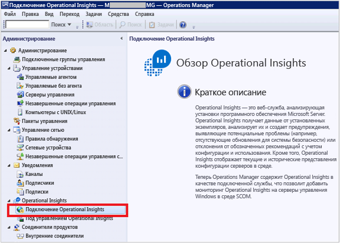
3. В представлении "Подключение к OMS" щелкните **Настройка прокси-сервера**.  
    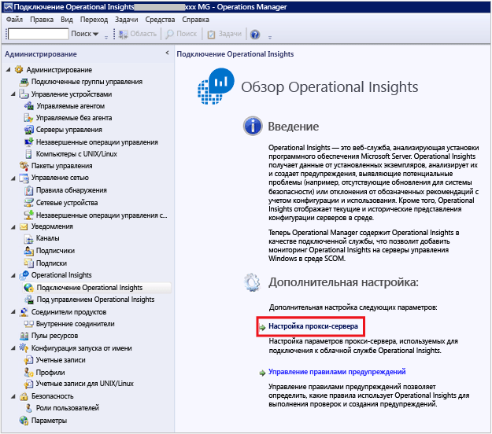
4. В мастере настройки прокси-сервера оперативной аналитики выберите **Использовать прокси-сервер для доступа к веб-службе оперативной аналитики**, а затем введите URL-адрес с номером порта, например **http://myproxy:80**.  
    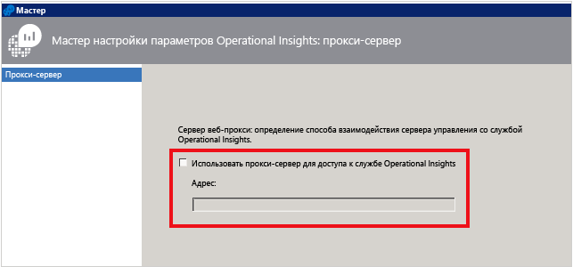


### Указание учетных данных, если для прокси-сервера требуется аутентификация
 Учетные данные и параметры прокси-сервера необходимо распространить на управляемые компьютеры, которые будут отправлять отчеты в OMS. Эти серверы должны находиться в *группе серверов мониторинга Microsoft System Center Advisor*. Учетные данные зашифрованы в реестре каждого сервера в группе.

1. Откройте консоль Operations Manager и выберите рабочую область **Администрирование**.
2. В разделе **Конфигурации запуска от имени** выберите **Профили**.
3. Откройте профиль **Запуск от имени прокси-сервера профиля System Center Advisor**.  
    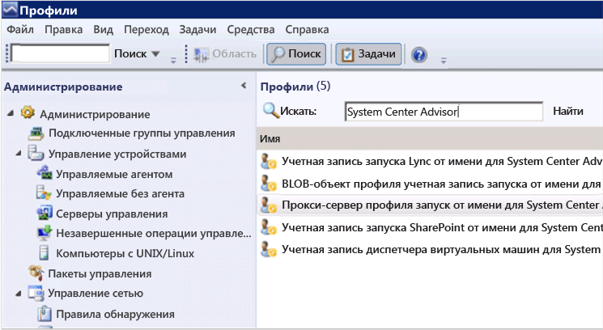
4. В мастере профиля запуска от имени нажмите кнопку **Добавить**, чтобы использовать учетную запись запуска от имени. Можно создать новую учетную запись запуска от имени или использовать существующую учетную запись. Эта учетная запись должна иметь достаточные разрешения для передачи данных через прокси-сервер.  
    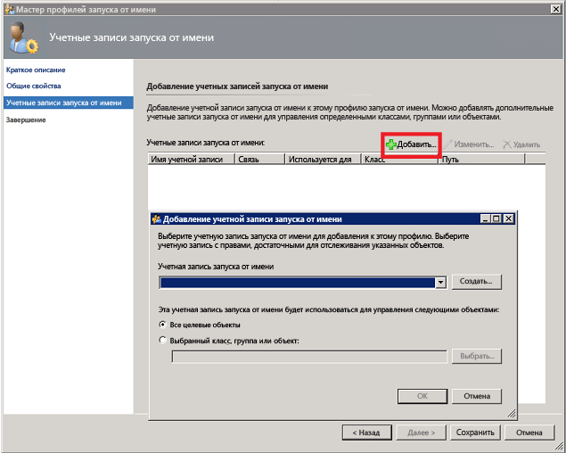
5. Чтобы настроить учетную запись для управления, выберите **Выбранный класс, группа или объект** для открытия окна поиска объектов.  
    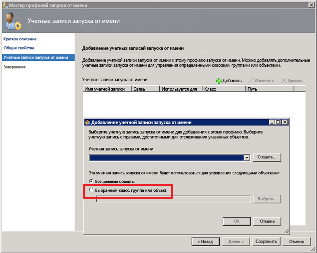
6. Найдите и выберите **группу серверов мониторинга Microsoft System Center Advisor**.  
    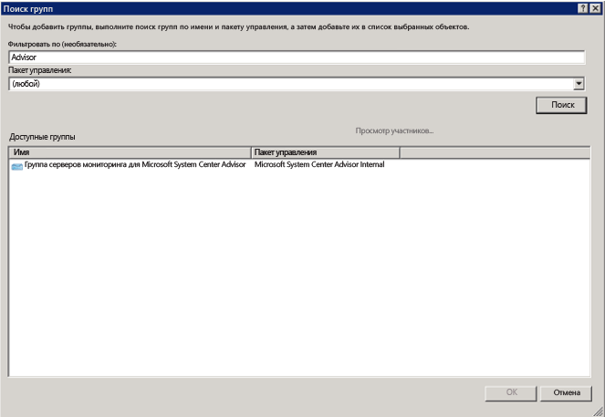
7. Нажмите кнопку **ОК**, чтобы закрыть окно "Добавление учетной записи запуска от имени".  
    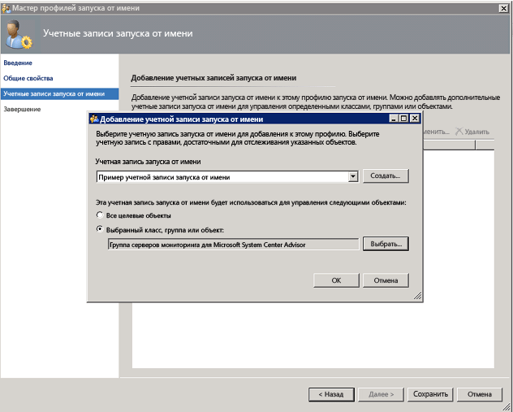
8. Закройте мастер и сохраните изменения.  
    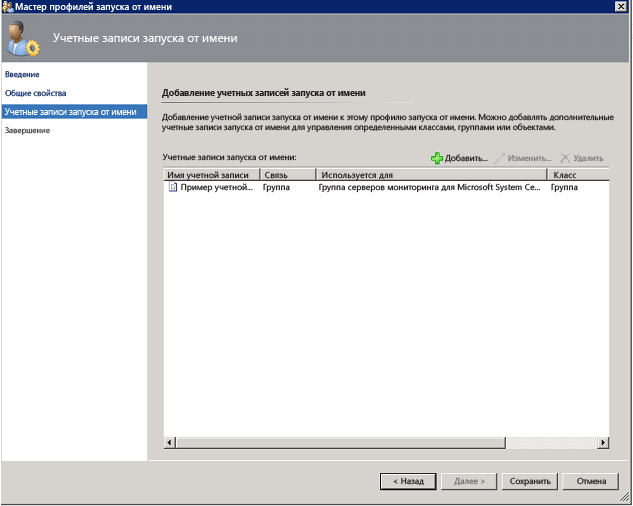


### Вот как можно проверить, скачаны ли пакеты управления OMS

- Если вы добавили решения в OMS, их можно просмотреть в консоли Operations Manager как пакеты управления, в разделе **Администрирование**. Выполните поиск *System Center Advisor*, чтобы быстро их найти.  
    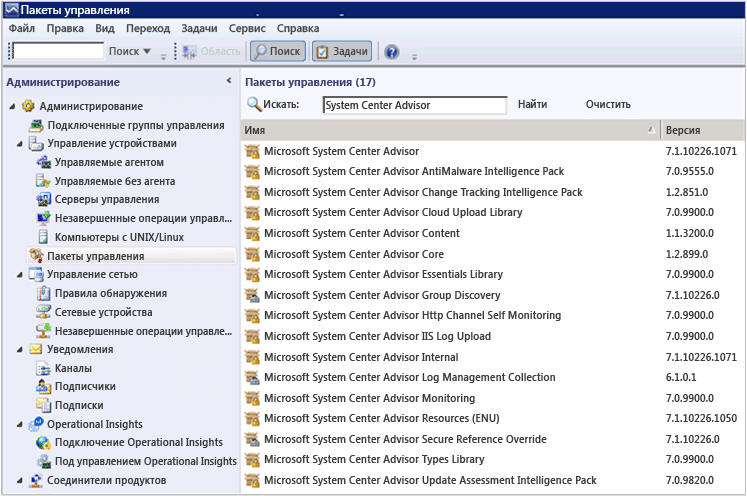
- Пакеты управления OMS можно также проверить с помощью следующих команд Windows PowerShell на сервере управления Operations Manager:

        get-scommanagementpack | where {$_.DisplayName -match 'Advisor'} | select Name,DisplayName,Version,KeyToken

        get-scommanagementpack | where {$_.DisplayName -match 'Advisor'} | select Name,DisplayName,Version | ft

### Вот как можно проверить, отправляет ли Operations Manager данные в службу OMS

1. На сервере управления Operations Manager откройте системный монитор (perfmon.exe) и выберите **Системный монитор**.
2. Щелкните **Добавить** и выберите **Группы управления службы работоспособности**.
3. Добавьте все счетчики, которые начинаются с **HTTP**.  
    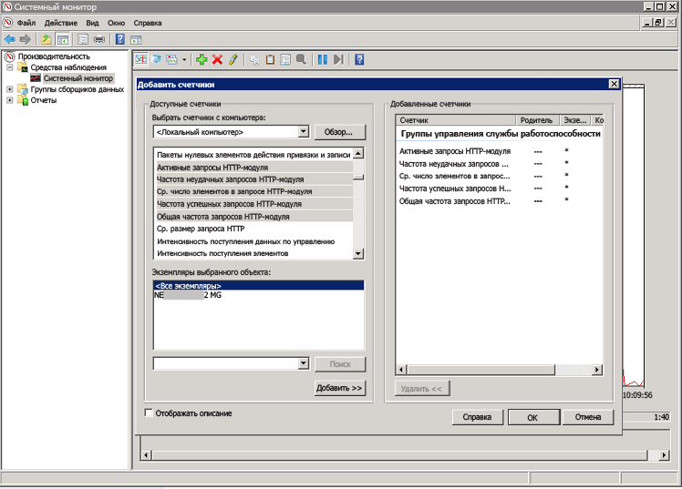
4. Если Operations Manager настроен правильно, вы увидите активность счетчиков управления службы работоспособности для событий и других данных для пакетов управления, которые вы добавили в OMS и для которых настроили политику сбора данных журналов.  
    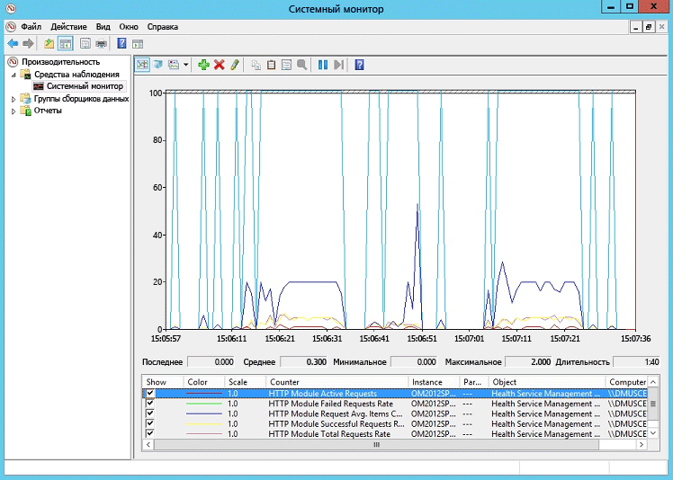


## Гибридные компоненты Runbook Worker в службе автоматизации Azure

Для поддержки гибридных компонентов Runbook Worker отсутствуют требования к брандмауэру для входящих подключений.

Локальный компьютер, на котором выполняется гибридная рабочая роль Runbook, должен иметь исходящий доступ к *.cloudapp.net на портах 443, 9354 и с 30000 по 30199.

## Дальнейшие действия

- Чтобы добавить функции и реализовать сбор данных, [добавьте решения Log Analytics из коллекции решений](log-analytics-add-solutions.md).
- Подробная информация, которую собирают решения, описана в статье [о поиске по журналам](log-analytics-log-searches.md).

<!---HONumber=AcomDC_0525_2016-->