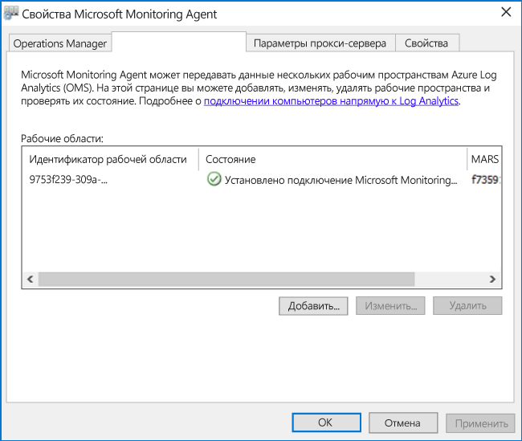
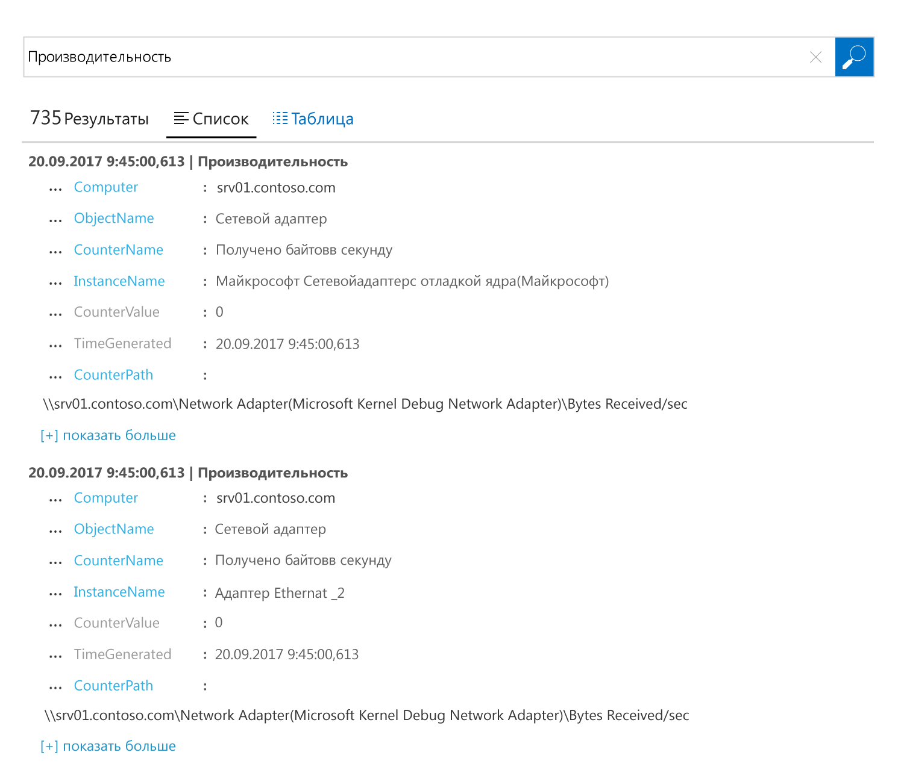

# Сбор данных с компьютеров Windows, размещенных в вашей среде
[Azure Log Analytics](log-analytics-overview.md) может собирать данные напрямую c физических компьютеров или виртуальных машин Windows и других ресурсов в вашей среде в один репозиторий для подробного анализа и корреляции.  В этом кратком руководстве показано, как настроить и собирать данные c компьютера Windows с помощью нескольких простых действий.  Сведения о виртуальных машинах Windows в Azure приведены далее в разделе [Сбор данных о виртуальных машинах Azure](log-analytics-quick-collect-azurevm.md).  

Чтобы узнать о сетевых и системных требованиях для развертывания агента Windows, см. описание [необходимых компонентов для операционных систем Windows](log-analytics-concept-hybrid.md#prerequisites).
 
Если у вас еще нет подписки Azure, [создайте бесплатную учетную запись Azure](https://azure.microsoft.com/free/?WT.mc_id=A261C142F), прежде чем начинать работу.

## Вход на портал Azure
Войдите на портал Azure по адресу [https://portal.azure.com](https://portal.azure.com). 

## Создание рабочей области
1. На портале Azure щелкните **Все службы**. В списке ресурсов введите **Log Analytics**. Как только вы начнете вводить символы, список отфильтруется соответствующим образом. Выберите **Log Analytics**.       
2. Щелкните **Создать** и задайте следующие параметры:

  * Введите имя для новой **рабочей области OMS**, например *DefaultLAWorkspace*. 
  * Выберите в раскрывающемся списке **подписку**, с которой нужно связать рабочую область, если выбранная по умолчанию не подходит.
  * В разделе **Группа ресурсов** выберите имеющуюся группу ресурсов, в которой содержится одна или несколько виртуальных машин Azure.  
  * Выберите **Расположение**, в котором развернуты виртуальные машины.  Дополнительные сведения о доступности службы Log Analytics в регионах см. в [этой статье](https://azure.microsoft.com/regions/services/).  
  * При создании рабочей области в новой подписке, созданной после 2 апреля 2018 г., будет автоматически использоваться тарифный план *За ГБ*, и выбор ценовой категории будет недоступен.  При создании рабочей области в существующей подписке, созданной до 2 апреля, или в подписке, которая была привязана к существующей регистрации EA, выберите нужную ценовую категорию.  Дополнительные сведения о конкретной ценовой категории см. в статье [Цены на Log Analytics](https://azure.microsoft.com/pricing/details/log-analytics/).

           

3. После ввода необходимых сведений в области **Рабочая область OMS** щелкните **Создать**.  

Пока проверяются данные, ход создания рабочей области можно проверить в разделе **Уведомления** в меню. 

## Получение идентификатора и ключа рабочей области
Перед установкой Microsoft Monitoring Agent для Windows требуется получить идентификатор и ключ для рабочей области Log Analytics.  Эта информация необходима мастеру установки для правильной настройки агента и обеспечения его взаимодействия с Log Analytics.  

1. На портале Azure щелкните **Все службы** в нижнем левом углу. В списке ресурсов введите **Log Analytics**. Как только вы начнете вводить символы, список отфильтруется соответствующим образом. Выберите **Log Analytics**.
2. В списке рабочих областей Log Analytics выберите рабочую область *DefaultLAWorkspace*, созданную ранее.
3. Выберите **Дополнительные параметры**.       
4. Выберите **Подключенные источники**, а затем выберите **Серверы с Windows**.   
5. Необходимые значения указаны справа от полей **Идентификатор рабочей области** и **Первичный ключ**. Скопируйте их и вставьте в любой удобный для вас редактор.   

## Установка агента для Windows
Ниже приведены инструкции по установке и настройке агента для Log Analytics в Azure и облаке Azure для государственных организаций с помощью программы установки для Microsoft Monitoring Agent на компьютере.  

1. На странице **Серверы с Windows** выберите соответствующую версию **агента для Windows** для скачивания в зависимости от архитектуры процессора, на котором выполняется операционная система Windows.
2. Запустите программу установки, чтобы установить агент на компьютере.
2. На странице **приветствия** нажмите кнопку **Далее**.
3. На странице **Условия лицензии** прочтите лицензию и нажмите кнопку **Принимаю**.
4. На странице **Папка назначения** измените или оставьте папку установки по умолчанию и нажмите кнопку **Далее**.
5. На странице **Параметры установки агента** выберите подключение агента к Azure Log Analytics (OMS) и нажмите кнопку **Далее**.   
6. На странице **Azure Log Analytics** выполните следующее.
   1. Вставьте **идентификатор рабочей области** и **ключ рабочей области (первичный ключ)**, скопированные ранее.  Если компьютер должен передавать данные в рабочую область Log Analytics в облаке Azure для государственных организаций, выберите  **	Azure для государственных организаций США** из раскрывающегося списка **Облако Azure**.  
   2. Если компьютер должен обмениваться данными со службой Log Analytics через прокси-сервер, щелкните **Дополнительно** и укажите URL-адрес и номер порта прокси-сервера.  Если для доступа к прокси-серверу требуется аутентификация, введите имя пользователя и пароль для аутентификации на прокси-сервере, затем нажмите кнопку **Далее**.  
7. Нажмите кнопку **Далее** после завершения ввода необходимых параметров конфигурации.     
8. На странице **Готовность к установке** просмотрите выбранные параметры и нажмите кнопку **Установить**.
9. На странице **Настройка успешно завершена** нажмите кнопку **Готово**.

После завершения установки на **панели управления** появится **Microsoft Monitoring Agent**. Вы можете просмотреть конфигурацию и проверить, подключен ли агент к Log Analytics. При подключении на вкладке **Azure Log Analytics (OMS)** агент выдает следующее сообщение: **Microsoft Monitoring Agent успешно подключен к службе Microsoft Operations Management Suite.**   

## Сбор данных событий и производительности
Log Analytics может собирать события из журналов событий и счетчиков производительности Windows, указанных для долгосрочного анализа и формирования отчетов, а также предпринимать действия при обнаружении определенного условия.  Сначала выполните приведенные ниже действия для настройки сбора событий из журнала событий Windows, а также нескольких стандартных счетчиков производительности.  

1. На портале Azure щелкните **Другие службы** в нижнем левом углу. В списке ресурсов введите **Log Analytics**. Как только вы начнете вводить символы, список отфильтруется соответствующим образом. Выберите **Log Analytics**.
2. Выберите **Дополнительные параметры**.      
3. Выберите **Данные**, а затем — **Журналы событий Windows**.  
4. Чтобы добавить журнал событий, введите его имя.  Введите **Система** и щелкните знак "плюс" **+**.  
5. Проверьте степени серьезности **Ошибка** и **Предупреждение** в таблице.   
6. В верхней части страницы щелкните **Сохранить**, чтобы сохранить конфигурацию.
7. Выберите **Windows Performance Data** (Данные производительности Windows), чтобы включить сбор данных счетчиков производительности на компьютере Windows. 
8. При первой настройке счетчиков производительности Windows для новой рабочей области Log Analytics вы можете быстро создать несколько распространенных счетчиков. Рядом с каждым счетчиком в списке есть флажок.  .  Щелкните **Add the selected performance counters** (Добавить выбранные счетчики производительности).  Они добавляются и устанавливаются с десятисекундным интервалом сбора.  
9. В верхней части страницы щелкните **Сохранить**, чтобы сохранить конфигурацию.

## Просмотр собранных данных
Теперь, когда сбор данных включен, можно запустить простой пример поиска по журналам, чтобы просмотреть некоторые данные с целевого компьютера.  

1. На портале Azure в разделе выбранной рабочей области щелкните элемент **Поиск по журналу**.  
2. В области "Поиск по журналу" в поле запроса введите `Perf`, а затем нажмите клавишу ВВОД или нажмите кнопку "Поиск" справа от поля запроса.      Например, запрос на следующем рисунке вернул 735 записей производительности.   

## Очистка ресурсов
Когда агент больше не нужен, его можно удалить с компьютера Windows, а также можно удалить рабочую область Log Analytics.  

Чтобы удалить агент, выполните указанные ниже действия.

1. Откройте **Панель управления**.
2. Откройте **Программы и компоненты**.
3. В окне **Программы и компоненты** выберите **Microsoft Monitoring Agent** и нажмите кнопку **Удалить**.

Чтобы удалить рабочую область Log Analytics, созданную ранее, выберите ее, затем на странице ресурсов щелкните **Удалить**.   

## Дополнительная информация
Теперь, когда вы собираете данные о работе и производительности со своих локальных компьютеров Linux, можно легко начать изучение и анализ собранных данных, а также работать с ними *бесплатно*.  

Чтобы узнать, как просматривать и анализировать данные, перейдите к следующему руководству.   

> [!div class="nextstepaction"]
> [Просмотр и анализ данных, собранных с помощью поиска по журналам Log Analytics](log-analytics-tutorial-viewdata.md)
