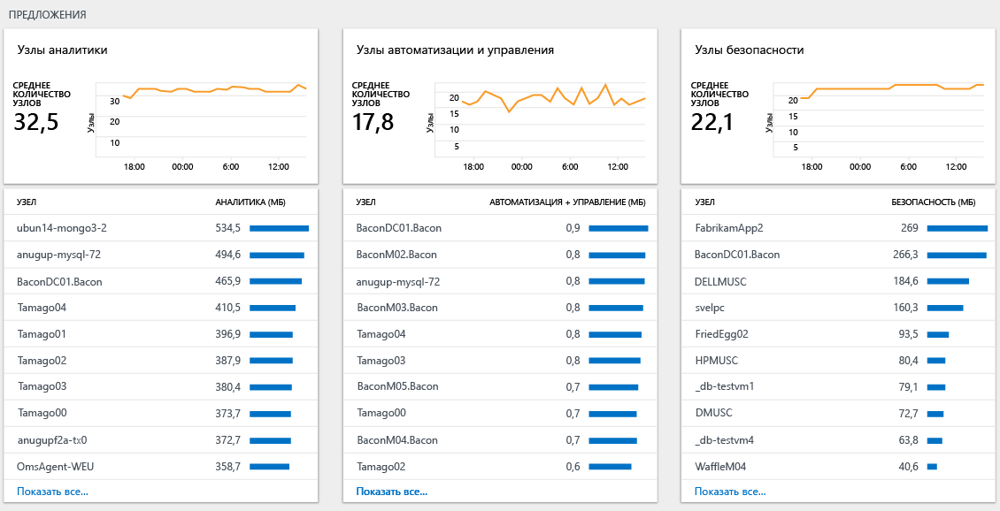

# Анализ использования данных в службе Log Analytics
Служба Log Analytics содержит сведения об объеме собранных данных, источниках, из которых отправляются эти данные, а также различных типах отправленных данных.  Просматривать и анализировать использование данных можно с помощью панели мониторинга **Использование службы анализа журналов**. На панели мониторинга отображаются объем данных, собранных каждым решением, и объем данных, отправляемый компьютерами.

## Основные сведения о панели мониторинга "Использование"
На панели мониторинга **Log Analytics usage** (Использование Log Analytics) отображается следующая информация.

- Объем данных:
    - объем данных по времени (зависит от текущего периода времени);
    - объем данных для каждого решения;
    - данные, не связанные с компьютером.
- Компьютеры
    - компьютеры, отправляющие данные;
    - компьютеры без данных за последние 24 часа.
- Предложения:
    - узлы Insight and Analytics;
    - узлы автоматизации и управления;
    - узлы безопасности.  
- Производительность
    - время, затраченное на сбор и индексирование данных;  
- список запросов.

 
)

### Работа с данными об использовании
1. Войдите на [портале Azure](https://portal.azure.com).
2. На портале Azure щелкните **Все службы**. В списке ресурсов введите **Log Analytics**. Как только вы начнете вводить символы, список отфильтруется соответствующим образом. Выберите **Log Analytics**.       
3. В списке рабочих областей Log Analytics выберите рабочую область.
4. В списке на панели слева выберите пункт **Использование и ожидаемые затраты**.
5. На панели мониторинга **Использование и ожидаемые затраты** можно изменить диапазон времени. Для этого выберите **Time: Last 24 hours** (Время: последние 24 часа) и измените интервал времени.     
6. Просмотрите колонки категорий использования, которые вас интересуют. Выберите колонку, а затем щелкните в ней элемент, чтобы увидеть дополнительные сведения на панели мониторинга [Поиск по журналу](log-analytics-log-searches.md).     
7. На панели мониторинга "Поиск по журналу" просмотрите результаты, возвращенные в результате поиска.   

## Создание оповещения для превышенного объема сбора данных
В этом разделе описывается создание оповещения для следующих случаев:
- объем данных превышает заданный объем;
- объем данных превысит заданный объем.

[Оповещения](log-analytics-alerts-creating.md) Log Analytics используют поисковые запросы. Следующий запрос содержит результат, когда за сутки собрано более 100 ГБ данных:

`union withsource = $table Usage | where QuantityUnit == "MBytes" and iff(isnotnull(toint(IsBillable)), IsBillable == true, IsBillable == "true") == true | extend Type = $table | summarize DataGB = sum((Quantity / 1024)) by Type | where DataGB > 100`

Следующий запрос использует простую формулу для прогноза, что в течение 24 часов будет отправлено более 100 ГБ данных: 

`union withsource = $table Usage | where QuantityUnit == "MBytes" and iff(isnotnull(toint(IsBillable)), IsBillable == true, IsBillable == "true") == true | extend Type = $table | summarize EstimatedGB = sum(((Quantity * 8) / 1024)) by Type | where EstimatedGB > 100`

Чтобы создать оповещения для различных объемов данных, измените значение "100" в запросах на число ГБ, для которых вы хотите создать оповещения.

Выполните действия, описанные в разделе [Создание правила оповещения](log-analytics-alerts-creating.md#create-an-alert-rule), чтобы получать уведомления при превышении объема данных.

При создании оповещения для первого запроса, когда имеется объем данных, превышающий 100 ГБ в сутки, задайте параметрам следующие значения:  
- **имени** — *объем данных, превышающий 100 ГБ в сутки*;  
- **серьезности** — *предупреждение*;  
- **поисковому запросу** — `union withsource = $table Usage | where QuantityUnit == "MBytes" and iff(isnotnull(toint(IsBillable)), IsBillable == true, IsBillable == "true") == true | extend Type = $table | summarize DataGB = sum((Quantity / 1024)) by Type | where DataGB > 100`;   
- **окну времени** *24 часа*;
- **периодичности оповещений** — 1 час, так как данные об использовании обновляются только один раз в час;
- параметру **создания оповещения на основе** задайте *число результатов*;
- **числу результатов** — значение *больше 0*.

Выполните действия, описанные в статье[Добавление действий в правила оповещений в Log Analytics](log-analytics-alerts-actions.md), чтобы настроить действия электронной почты, веб-перехватчика или Runbook для правила оповещения.

При создании оповещения для второго запроса, когда спрогнозировано, что суточный объем данных превысит 100 ГБ, задайте параметрам следующие значения:
- **имени** — *объем данных, превышающий 100 ГБ в сутки*;
- **серьезности** — *предупреждение*;
- **поисковому запросу** — `union withsource = $table Usage | where QuantityUnit == "MBytes" and iff(isnotnull(toint(IsBillable)), IsBillable == true, IsBillable == "true") == true | extend Type = $table | summarize EstimatedGB = sum(((Quantity * 8) / 1024)) by Type | where EstimatedGB > 100`;
- **окну времени** — *3 часа*;
- **периодичности оповещений** — 1 час, так как данные об использовании обновляются только один раз в час;
- параметру **создания оповещения на основе** задайте *число результатов*;
- **числу результатов** — значение *больше 0*.

Когда вы получите оповещение, выполните действия, описанные в следующем разделе, чтобы определить причину использования превышенного объема данных.

## Превышенный объем данных: причины и устранение
Панель мониторинга "Использование" поможет вам определить, почему превышено использование (и, соответственно, затраты).

Превышенное использование вызывается одной (или двумя) причинами:
- отправлен превышенный объем данных в службу Log Analytics;
- превышено число узлов, отправляющих данные в службу Log Analytics.

### Проверьте, превышен ли объем данных 
Существует два основных раздела страницы использования, с помощью которых вы можете определить, что именно вызывает превышенный сбор данных.

Диаграмма *объема данных по времени* отображает общий объем отправленных данных, а также компьютеры, отправляющие больший объем данных. В верхней области диаграммы вы можете увидеть, что происходит с общим объемом данных: увеличивается ли он, остается стабильным или уменьшается. Список компьютеров отображает 10 компьютеров, которые отправляют наибольший объем данных.

Диаграмма *объема данных для каждого решения* отображает объем данных, отправляемый каждым решением, а также решения, отправляющие наибольший объем данных. В верхней области диаграммы вы можете увидеть общий объем данных, отправляемый каждым решением за определенное время. Эта информация позволяет определить, отправляет ли решение превышенный объем данных, средний объем или меньший, чем необходимо, объем за определенное время. Список решений отображает 10 решений, которые отправляют наибольший объем данных. 

На этих двух диаграммах отображаются все данные. Одни данные оплачиваются, другие — нет. Чтобы оставить только оплачиваемые данные, изменить запрос на странице поиска, добавив элемент `IsBillable=true`.  

Обратите внимание на диаграмму *объема данных по времени*. Чтобы просмотреть решения и типы данных, которые отправляют наибольший объем данных для определенного компьютера, щелкните имя компьютера. Щелкните имя первого компьютера в списке.

На следующем снимке экрана тип данных *Управление журналами / Perf* отправляет наибольший объем данных для определенного компьютера.     

Затем вернитесь на панель мониторинга *Использование* и просмотрите диаграмму *Том данных по решениям*. Чтобы просмотреть компьютеры, отправляющие наибольший объем данных для решения, щелкните имя решения в списке. Щелкните имя первого решения в списке. 

На следующем снимке экрана мы видим подтверждение, что компьютер *acmetomcat* отправляет наибольший объем данных для решения управления журналами.     

При необходимости выполните дополнительный анализ, чтобы определить большие объемы в рамках типа данных или решения. Примеры запросов приведены ниже.

+ Решение по **безопасности**
  - `SecurityEvent | summarize AggregatedValue = count() by EventID`
+ Решение для **управления журналами**
  - `Usage | where Solution == "LogManagement" and iff(isnotnull(toint(IsBillable)), IsBillable == true, IsBillable == "true") == true | summarize AggregatedValue = count() by DataType`
+ Тип данных **Perf**
  - `Perf | summarize AggregatedValue = count() by CounterPath`
  - `Perf | summarize AggregatedValue = count() by CounterName`
+ Тип данных **Event**
  - `Event | summarize AggregatedValue = count() by EventID`
  - `Event | summarize AggregatedValue = count() by EventLog, EventLevelName`
+ Тип данных **Syslog**
  - `Syslog | summarize AggregatedValue = count() by Facility, SeverityLevel`
  - `Syslog | summarize AggregatedValue = count() by ProcessName`
+ Тип данных **AzureDiagnostics**
  - `AzureDiagnostics | summarize AggregatedValue = count() by ResourceProvider, ResourceId`

Чтобы уменьшить объем собранных журналов, сделайте следующее:

| Источник превышенного объема данных | Как сократить объем данных |
| -------------------------- | ------------------------- |
| События безопасности            | Выберите [события со стандартным или минимальным уровнем безопасности](https://blogs.technet.microsoft.com/msoms/2016/11/08/filter-the-security-events-the-oms-security-collects/).   Измените политику аудита безопасности таким образом, чтобы собирать только необходимые события. В частности проверьте необходимость сбора следующих событий:   - [аудит платформы фильтрации](https://technet.microsoft.com/library/dd772749(WS.10).aspx);   - [аудит реестра](https://docs.microsoft.com/windows/device-security/auditing/audit-registry);  - [аудит файловой системы](https://docs.microsoft.com/windows/device-security/auditing/audit-file-system);  - [аудит объектов ядра](https://docs.microsoft.com/windows/device-security/auditing/audit-kernel-object);  - [аудит работы с дескрипторами](https://docs.microsoft.com/windows/device-security/auditing/audit-handle-manipulation);  - [аудит съемных носителей](https://docs.microsoft.com/windows/device-security/auditing/audit-removable-storage). |
| Счетчики производительности       | Измените [конфигурацию счетчика производительности](log-analytics-data-sources-performance-counters.md), чтобы   уменьшить частоту сбора или   сократить число счетчиков производительности. |
| Журналы событий                 | Измените [конфигурацию журнала событий](log-analytics-data-sources-windows-events.md), чтобы   сократить число собранных журналов событий или   выполнять сбор только необходимых уровней событий. Например, не выполняйте сбор событий уровня *сведений*. |
| syslog                     | Измените [конфигурацию системного журнала](log-analytics-data-sources-syslog.md), чтобы   сократить число собранных объектов или   выполнять сбор только необходимых уровней событий. Например, не выполняйте сбор событий уровня *сведений* и *отладки*. |
| AzureDiagnostics           | Измените коллекцию журнала ресурсов, чтобы:   Уменьшить число ресурсов, отправляющих журналы в Log Analytics.   Выполнять сбор только необходимых журналов. |
| Данные решений с компьютеров, которым не требуется решение | Используйте [нацеливание решений](../operations-management-suite/operations-management-suite-solution-targeting.md), чтобы выполнять сбор данных только в нужных группах компьютеров. |

### Проверьте, превышено ли число узлов
Если у вас ценовая категория с оплатой *за каждый узел (OMS)*, то плата взимается на основании числа используемых узлов и решений. В разделе *offerings* (предложения) панели мониторинга "Использование" можно увидеть, сколько узлов из каждого предложения используется.     

Щелкните **Просмотреть все**, чтобы просмотреть полный список компьютеров, отправляющих данные для выбранного предложения.

Используйте [нацеливание решений](../operations-management-suite/operations-management-suite-solution-targeting.md), чтобы выполнять сбор данных только в нужных группах компьютеров.

## Дополнительная информация
* Ознакомьтесь со статьей [Поиск данных по журналам](log-analytics-log-searches.md), чтобы узнать, как использовать язык поиска. Вы можете использовать поисковые запросы, чтобы выполнить дополнительный анализ данных об использовании.
* Выполните действия, описанные в разделе [Создание правила оповещения](log-analytics-alerts-creating.md#create-an-alert-rule), чтобы получать уведомления при выполнении условий поиска.
* Используйте [нацеливание решений](../operations-management-suite/operations-management-suite-solution-targeting.md), чтобы собирать данные только в нужных группах компьютеров.
* Сведения о настройке эффективной политики сбора событий безопасности см. в статье [Сбор данных в центре безопасности Azure](../security-center/security-center-enable-data-collection.md).
* Измените [конфигурацию счетчика производительности](log-analytics-data-sources-performance-counters.md).
* Сведения об изменении параметров сбора событий см. в статье [Windows event log data sources in Log Analytics](log-analytics-data-sources-windows-events.md) (Источники данных журнала событий Windows в Log Analytics).
* Сведения об изменении конфигурации системного журнала см. в статье [Источники данных системного журнала в Log Analytics](log-analytics-data-sources-syslog.md).
