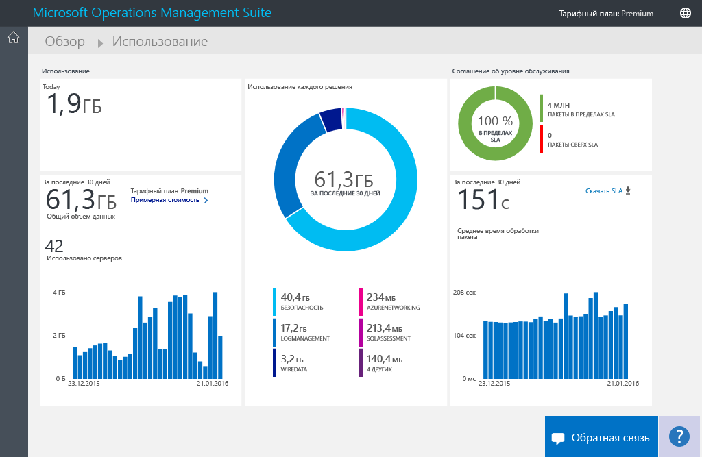
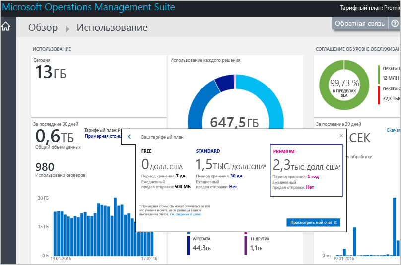
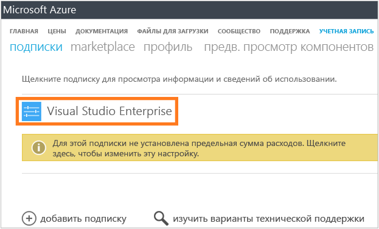
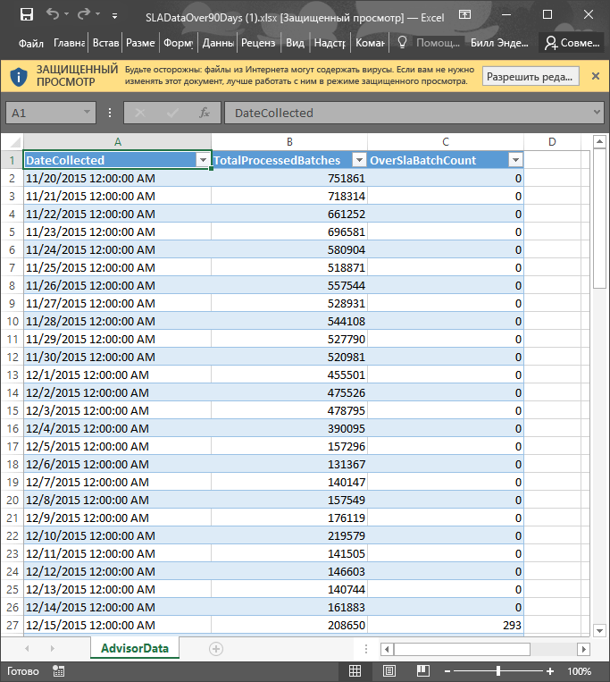

# Анализ использования данных в службе Log Analytics
Служба Log Analytics и Operations Management Suite (OMS) собирает данные и периодически отправляет их в службу OMS.  Чтобы просмотреть объем данных, отправляемых в службу OMS, откройте страницу **Использование** . На странице **Использование** также показано, сколько данных решения отправляют ежедневно и как часто серверы отправляют данные.

> [!NOTE]
> Если у вас бесплатная учетная запись, созданная с помощью [веб-сайта OMS](http://www.microsoft.com/oms), вы можете отправлять не больше 500 МБ данных в службу OMS ежедневно. По достижении предельного значения анализ данных будет остановлен и продолжится в начале следующего дня. Также вам придется повторно отправить все данные, которые не были приняты или обработаны OMS.
> 
> 

Вы можете просмотреть данные об использовании на плитке **Использование** панели мониторинга **Обзор** в OMS.

Если вы превысили предельное значение ежедневного использования или приближаетесь к нему, вы можете при необходимости удалить какое-либо решение, чтобы сократить объем данных, отправляемых в службу OMS. Дополнительные сведения об удалении решений см. в статье [Добавление решений Log Analytics из коллекции решений](log-analytics-add-solutions.md).

На странице **Использование** отображается следующая информация:

* средний объем использования в день;
* использование данных по каждому решению за последние 30 дней.
* Объем данных, который серверы в вашей среде отправляют в службу OMS, за последние 30 дней.
* Ценовая категория и расчетная стоимость тарифного плана
* Данные соглашения об уровне обслуживания (SLA), включая время обработки данных в службе OMS

## Работа с данными об использовании
1. На странице **Обзор** щелкните плитку **Использование**.
2. На странице **Использование** просмотрите категории использования, в которых отображаются интересующие вас области.
3. Если какое-то из ваших решений задействуют слишком большую часть ежедневной квоты загрузки, это решение можно удалить.

## Просмотр расчетной стоимости и платежных реквизитов
1. На странице **Обзор** щелкните плитку **Использование**.
2. На странице **Использование** в разделе **Использование** щелкните значок шеврона (**>**) рядом с параметром **Оценочная стоимость**.
3. В развернутом представлении **Тарифный план** можно увидеть расчетную месячную стоимость.  
    
4. Чтобы увидеть сведения о выставлении счетов, щелкните ссылку **Просмотреть мой счет** , чтобы открыть информацию о подписке.
   * На странице подписки щелкните подписку, чтобы открыть подробные сведения и построчный список расходов на использование.  
       
   * На странице сводных данных по подписке можно выполнять самые разные задачи по управлению и просмотру подробных сведений о подписке.  
       

## Просмотр пакетов данных для соглашения об уровне обслуживания
1. На странице **Обзор** щелкните плитку **Использование**.
2. В разделе **Соглашение об уровне обслуживания** щелкните **Загрузить данные соглашения об уровне обслуживания**.
3. XLSX-файл Excel будет загружен для вашей проверки.  
    

## Дальнейшие действия
* Подробная информация, которую собирают решения, описана в статье [Поиск по журналам в Log Analytics](log-analytics-log-searches.md) .

<!--HONumber=Nov16_HO2-->

