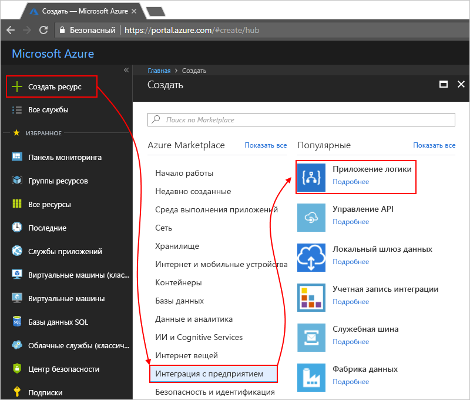

# Мониторинг и анализ запусков приложений логики с помощью Log Analytics

Для мониторинга и получения более подробных данных отладки при создании приложения логики можно включить Log Analytics. Служба Log Analytics поддерживает ведение журнала диагностики и мониторинг запусков приложений логики через портал Azure. Добавив решение по управлению Logic Apps, вы получите обобщенные сведения о выполнении приложений логики, а также некоторые подробные данные, такие как состояние приложения, время выполнения, состояние повторной отправки и идентификаторы корреляции.

В этой статье объясняется, как включить службу Log Analytics, чтобы просматривать события и данные среды выполнения, относящиеся к выполнению приложений логики.

 > [!TIP]
 > Чтобы отслеживать существующие приложения логики, [включите ведение журнала диагностики и отправку данных о приложениях логики из среды выполнения в Log Analytics](../logic-apps/logic-apps-monitor-your-logic-apps.md#azure-diagnostics).

## Требования

Чтобы начать работу, вам потребуется рабочая область Log Analytics. Узнайте, [как создать рабочую область Log Analytics](../log-analytics/log-analytics-quick-create-workspace.md). 

## Включение ведения журнала диагностики при создании приложений логики

1. На [портале Azure](https://portal.azure.com) создайте приложение логики. Последовательно выберите **Создать ресурс** > **Enterprise Integration** (Корпоративная интеграция) > **Приложение логики**.

   

2. На странице **Создание приложения логики** выполните показанные ниже действия.

   1. Введите имя приложения логики и выберите подписку Azure. 
   2. Создайте или выберите существующую группу ресурсов Azure.
   3. Установите переключатель **Log Analytics** в положение **Вкл.** 
   Выберите рабочую область Log Analytics, в которую будут отправляться данные о выполнении приложений логики. 
   4. Когда вы будете готовы, установите флажок **Закрепить на панели мониторинга** >  и нажмите кнопку **Создать**.

      

      По завершении этого шага Azure создает приложение логики, которое теперь связано с рабочей областью Log Analytics. 
      На этом шаге в рабочую область автоматически устанавливается решение по управлению Logic Apps.

3. Чтобы просмотреть сведения о запусках приложений логики, [выполните описанные здесь действия](#view-logic-app-runs-oms).

## Установка решения по управлению Logic Apps

Если вы уже включили Log Analytics при создании приложения логики, то пропустите этот шаг. Решение по управлению Logic Apps уже установлено.

1. На [портале Azure](https://portal.azure.com) щелкните **Больше служб**. В поле поиска введите словосочетание "log analytics" в качестве фильтра и выберите **Log Analytics**, как показано ниже.

   

2. В разделе **Log Analytics** найдите и выберите рабочую область Log Analytics. 

   

3. В разделе **Управление** выберите **Портал OMS**.

   

4. В разделе **Все решения** найдите и выберите элемент решения **Logic Apps Management**.

   

5. Чтобы установить решение в рабочую область Log Analytics, щелкните **Добавить**.

   

## Просмотр сведений о выполнении приложений логики в рабочей области Log Analytics

1. Чтобы просмотреть число и состояние запусков приложения логики, перейдите на страницу обзора рабочей области Log Analytics. Просмотрите сведения в элементе **Logic Apps Management**.

   

2. Чтобы просмотреть сводку с более подробными сведениями о выполнении приложений логики, выберите элемент **Logic Apps Management**.

   Здесь сведения о выполнении приложений логики группируются по имени или по состоянию выполнения. Также можно просмотреть сведения о сбоях в действиях или триггерах для выполнений приложения логики.

   
   
3. Чтобы просмотреть все сведения о выполнении конкретного приложения логики или о конкретном состоянии, выберите строку с соответствующим приложением логики или состоянием.

   Ниже приведен пример, в котором показаны все сведения о выполнении конкретного приложения логики.

   

   На этой странице доступны два дополнительных параметра:
   * **Tracked properties** (Отслеживаемые свойства). В этом столбце отображаются отслеживаемые свойства для приложения логики, которые группируются по действиям. Чтобы просмотреть отслеживаемые свойства, щелкните **Просмотреть**. Для поиска отслеживаемых свойств можно использовать фильтр столбцов.
   
     

     Прежде чем любое новое добавленное отслеживаемое свойство появится впервые, может пройти 10–15 минут. Узнайте, [как добавить отслеживаемые свойства в приложение логики](logic-apps-monitor-your-logic-apps.md#azure-diagnostics-event-settings-and-details).

   * **Отправить повторно**. Можно повторно отправить одно или несколько выполнений приложения логики, завершившихся сбоем, выполненных успешно или все еще выполняемых. Установите флажки для выполнений, которые необходимо отправить повторно, и щелкните **Отправить повторно**. 

     

4. Чтобы отфильтровать эти результаты, можно применить фильтр как на стороне клиента, так и на стороне сервера.

   * Клиентский фильтр: для каждого столбца выберите необходимые фильтры. 
   Ниже приведены некоторые примеры:

     

   * Серверный фильтр: чтобы выбрать определенное временное окно или ограничить отображаемое количество выполнений, воспользуйтесь элементом ограничения области в верхней части страницы. 
   По умолчанию за раз отображается только 1000 записей. 
   
     
 
5. Чтобы просмотреть все действия и сведения о них для определенного выполнения приложения логики, выберите его строку.

   Ниже приведен пример, в котором показаны все действия при определенном выполнении приложения логики.

   
   
6. На любой странице результатов, чтобы просмотреть результаты запроса или все результаты, щелкните элемент **Показать все**, которая открывает страницу "Поиск по журналу".
   
   
   
   На странице "Поиск по журналу" сделайте следующее.
   * Чтобы просмотреть результаты запроса в таблице, выберите **Таблица**.
   * Чтобы изменить запрос, отредактируйте строку запроса на панели поиска. 
   Для доступа к дополнительным функциональным возможностям выберите **Расширенная аналитика**.

     
     
     На открывшейся странице Azure Log Analytics можно обновить запросы и просмотреть результаты из таблицы. 
     В этом запросе используется [язык запросов Kusto](https://docs.loganalytics.io/docs/Language-Reference), который можно изменять, если требуется просмотреть другие результаты. 

     

## Дополнительная информация

* [Мониторинг сообщений B2B](../logic-apps/logic-apps-monitor-b2b-message.md)

