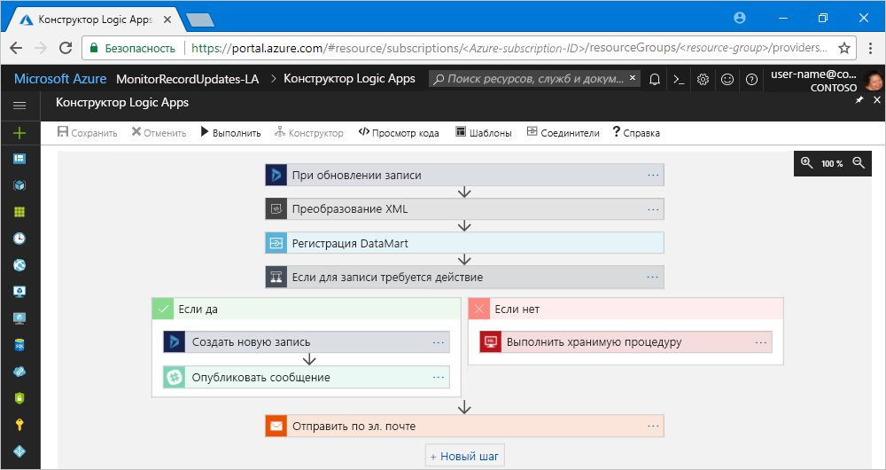

# Что такое Azure Logic Apps

[Logic Apps](https://azure.microsoft.com/services/logic-apps) помогает создавать, планировать и автоматизировать [рабочие процессы](#logic-app-concepts), что позволяет интегрировать приложения, данные, системы и службы на разных предприятиях или в организациях. Эта служба упрощает разработку и создание масштабируемых решений интеграции приложений (EAI), данных, систем и реализации взаимодействия типа "бизнес — бизнес" в облаке, локальных системах или в обеих средах.

Например, с помощью приложений логики можно автоматизировать такие рабочие нагрузки:

* обработка и перенаправление заказов в облачные службы и локальные системы;
* перемещение переданных файлов с FTP-сервера в службу хранилища Azure; 
* отслеживание твитов на определенную тему, анализ тональности, а также создание предупреждений и задач для элементов, которые требуется проверять.

Чтобы создать решения с помощью приложений логики, выберите из коллекции один из [более 200 встроенных соединителей](../connectors/apis-list.md), например база данных SQL, службы Azure, Office 365, Salesforce, Google и многие другие. Их количество постоянно растет. Эти [соединители](#logic-app-concepts) предоставляют [триггеры](#logic-app-concepts) и [действия](#logic-app-concepts), позволяющие создавать приложения логики, которые безопасно обращаются к данным и обрабатывают их в режиме реального времени.

> [!VIDEO https://channel9.msdn.com/Blogs/Azure/Introducing-Azure-Logic-Apps/player]

## Принцип работы Logic Apps 

Каждое приложение логики запускается триггером, который активируется, когда происходит определенное событие или если новые данные соответствуют заданным условиям. Многие триггеры поддерживают базовые возможности планирования, за счет чего можно указать регулярность выполнения рабочих нагрузок. Чтобы добавить дополнительные сценарии планирования, рабочие процессы должны начинаться с триггера расписания. Дополнительные сведения см. в статье [Проверка загрузки дорог при помощи приложения логики на основе планировщика](../logic-apps/tutorial-build-schedule-recurring-logic-app-workflow.md).

При каждом срабатывании триггера обработчик Logic Apps создает экземпляр приложения логики, выполняющего действия рабочего процесса. К этим действиям также относится преобразование данных и элементы управления потоками, такие как условные операторы, операторы switch, циклы и ветви. Например, приведенное ниже приложение логики начинается с триггера Dynamics 365 со встроенным условием "При обновлении записи". При обнаружении события, соответствующего этому критерию, триггер срабатывает и выполняются действия рабочего процесса. Здесь эти действия включают XML-преобразование, обновление данных, создание ветвей решений и отправку электронных уведомлений.

Приложения логики можно создавать визуально с помощью конструктора Logic Apps, доступ к которому можно получить на портале Azure через браузер и в Visual Studio. Чтобы реализовать дополнительные возможности приложений логики, вы можете создать или изменить их определения в формате нотации объектов JavaScript (JSON) в режиме просмотра кода. Кроме того, к задачам можно применять команды Azure PowerShell и шаблоны Azure Resource Manager. Приложения логики развертываются и выполняются в облаке Azure. Подробный обзор см. в видео [Use Azure Enterprise Integration Services to run cloud apps at scale](https://channel9.msdn.com/Events/Connect/2017/T119/) (Выполнение облачных приложений с возможностью масштабирования с помощью Azure Enterprise Integration Services).

## Преимущества Logic Apps

В связи с переходом организаций на цифровые решения приложения логики упрощают и ускоряют подключение устаревших, современных и передовых систем, а также предоставляют предварительно созданные API-интерфейсы как управляемые корпорацией Майкрософт соединители. Это позволяет сосредоточиться на бизнес-логике и функциональности приложений, так как больше не нужно беспокоиться о создании, размещении, масштабировании, обслуживании, мониторинге приложений и управлении ими. Все эти действия выполняют приложения логики. Кроме того, вы платите только за используемые ресурсы ([модель ценообразования](../logic-apps/logic-apps-pricing.md) на основе потребления). 

Во многих случаях код писать не требуется. Но если это нужно, вы можете создать фрагменты кода с помощью службы [Функции Azure](../azure-functions/functions-overview.md) и по требованию выполнить их из приложений логики. Кроме того, если приложения логики должны взаимодействовать с событиями из служб Azure, пользовательских приложений или решений сторонних разработчиков, вы можете использовать службу [Сетка событий Azure](../event-grid/overview.md) и с помощью этой службы выполнять мониторинг, маршрутизацию и публикацию событий.

Logic Apps, "Функции" и "Сетка событий" — это полностью управляемые службы Microsoft Azure, что позволяет избежать дополнительных проблем, связанных с созданием, размещением, масштабированием, мониторингом, поддержкой решений и управлением ими. Благодаря возможности создавать [бессерверные приложения и решения](../logic-apps/logic-apps-serverless-overview.md) вы можете просто сосредоточиться на бизнес-логике. Эти службы автоматически выполняют масштабирование в соответствии с потребностями, ускоряют интеграцию и помогают создавать надежные облачные приложения. При этом писать код практически не нужно. Кроме того, вы платите только за используемые ресурсы ([модель ценообразования](../logic-apps/logic-apps-pricing.md) на основе потребления). 

Сведения о том, как компании повысили уровень гибкости и смогли сосредоточиться на основных бизнес-процессах после сочетания Logic Apps с другими службами Azure и продуктами Майкрософт, см. в этих [историях клиентов](https://aka.ms/logic-apps-customer-stories).

Ниже приведены дополнительные сведения о возможностях и преимуществах, предоставляемых Logic Apps.

* **Визуальное создание рабочих процессов с помощью простых средств**

  Сэкономьте время и упростите сложные процессы с помощью средств визуальной разработки. 
  Создавайте приложения логики от начала и до конца в конструкторе Logic Apps на портале Azure через браузер или в Visual Studio. Запускайте рабочие процессы с помощью триггера и добавляйте любое количество действий из [коллекции соединителей](../connectors/apis-list.md).

* **Быстрое начало работы с помощью шаблонов приложений логики**

  Быстро создавайте часто используемые решения со стандартными рабочими процессами на основе [шаблонов из коллекции](../logic-apps/logic-apps-create-logic-apps-from-templates.md). 
  С помощью этих шаблонов можно реализовать как простую возможность подключения приложений SaaS, так и создавать современные решения B2B. И это далеко не все. Дополнительные сведения см. в статье [Создание рабочих процессов приложения логики на основе предварительно созданных шаблонов](../logic-apps/logic-apps-create-logic-apps-from-templates.md).

* **Подключение разрозненных систем в различных средах**

  Некоторые шаблоны и рабочие процессы просто описать, но трудно реализовать в коде. 
  Приложения логики позволяют легко подключать разрозненные системы в локальных и облачных средах. Например, вы можете подключить облачное коммерческое решение к локальной системе выставления счетов или централизовать обмен сообщениями между интерфейсами API и системами с помощью корпоративной служебной шины. Приложения логики — это быстрый, надежный и последовательный способ предоставления многоразовых настраиваемых решений, поддерживающих эти сценарии.

* **Первоклассная поддержка сценариев корпоративной интеграции и сценариев B2B**

  Компании и организации обмениваются данными через стандартные электронные средства с разными форматами и протоколами, такими как EDIFACT, AS2 и X12. 
  Благодаря возможностям в [Пакете интеграции Enterprise](../logic-apps/logic-apps-enterprise-integration-overview.md) вы можете создавать приложения логики, которые преобразовывают форматы сообщений, используемые партнерами, в формат, который может распознать и обработать система организации. Приложения логики обрабатывают эти сообщения с использованием технологии шифрования и цифровых подписей, что обеспечивает стабильную работу и безопасность.

  Начните с малого с текущими системами и службами и постепенно расширяйте свой бизнес. Logic Apps и корпоративная платформа интеграции позволяют выполнять масштабирование и реализовать более сложные сценарии интеграции. Ниже приведены их основные преимущества.

  * Создание с использованием таких продуктов и служб: 
    * [Microsoft BizTalk Server](https://docs.microsoft.com/biztalk/core/introducing-biztalk-server) 
    * [Управление API](../api-management/api-management-key-concepts.md) 
    * [Функции Azure](../azure-functions/functions-overview.md) 
    * [служебной шине Azure](../service-bus-messaging/service-bus-messaging-overview.md)
  * Обработка [XML-сообщений](../logic-apps/logic-apps-enterprise-integration-xml.md).
  * Обработка [неструктурированных файлов](../logic-apps/logic-apps-enterprise-integration-flatfile.md).
  * Обмен сообщениями по протоколам [EDIFACT](../logic-apps/logic-apps-enterprise-integration-edifact.md), [AS2](../logic-apps/logic-apps-enterprise-integration-as2.md) и [X12](../logic-apps/logic-apps-enterprise-integration-x12.md).
  * Централизованное хранение таких артефактов B2B и многих других компонентов, а также управление ими с помощью [учетных записей интеграции](../logic-apps/logic-apps-enterprise-integration-accounts.md):
    * [Партнеры](../logic-apps/logic-apps-enterprise-integration-partners.md)
    * [Соглашения](../logic-apps/logic-apps-enterprise-integration-agreements.md) 
    * [Карты для преобразования XML](../logic-apps/logic-apps-enterprise-integration-maps.md)
    * [Схемы для проверки XML](../logic-apps/logic-apps-enterprise-integration-schemas.md)

* **Создание многократно используемых шаблонов**

  Создавайте приложения логики как шаблоны, чтобы [развертывать и перенастраивать их](../logic-apps/logic-apps-create-deploy-template.md) в нескольких средах и регионах.

* **Встроенная расширяемость**

  Если вы не нашли соединитель, с помощью которого необходимо выполнить пользовательский код, приложения логики можно расширить, создав и по запросу вызвав собственные фрагменты кода через [Функции Azure](../azure-functions/functions-overview.md). 
  Создавайте собственные [API-интерфейсы](../logic-apps/logic-apps-create-api-app.md) и [соединители](../logic-apps/custom-connector-overview.md), которые можно вызвать из приложений логики.

* **Оплата по мере использования**
  
  [Плата за Logic Apps выставляется по мере использования](../logic-apps/logic-apps-pricing.md) (если приложения логики не созданы ранее с использованием планов службы приложений).

Дополнительные сведения о Logic Apps см. в этих вступительных видео:
* [Integration with Logic Apps — Go from zero to hero](https://channel9.msdn.com/Events/Build/2017/C9R17) (Интеграция с помощью Logic Apps. Создание приложений с нуля)
* [Enterprise integration with Microsoft Azure Logic Apps](https://channel9.msdn.com/Events/Ignite/Microsoft-Ignite-Orlando-2017/BRK2188) (Корпоративная интеграция с помощью Microsoft Azure Logic Apps)
* [Building advanced business processes with Logic Apps](https://channel9.msdn.com/Events/Ignite/Microsoft-Ignite-Orlando-2017/BRK3179) (Создание расширенных бизнес-процессов с помощью Logic Apps)

## Основные термины

* **Рабочий процесс** — визуализация, разработка, создание, автоматизация и развертывание бизнес-процессов в виде последовательности действий.

* **Управляемые соединители.** Приложениям логики требуется доступ к данным, службам и системам. Предварительно созданные управляемые корпорацией Майкрософт соединители позволяют подключаться, получать доступ к данным и работать с ними. Дополнительные сведения см. в статье [Список соединителей](../connectors/apis-list.md).

* **Триггеры.** Большинство управляемых корпорацией Майкрософт соединителей предоставляют триггеры, которые срабатывают, если события или новые данные соответствуют определенным условиям. К событиям, например, относится получение сообщения электронной почты или обнаружение изменений в учетной записи службы хранилища Azure. При каждом срабатывании триггера обработчик Logic Apps создает экземпляр приложения логики, выполняющего рабочий процесс.

* **Действия** — это все шаги, выполняемые после срабатывания триггера. Каждое действие обычно сопоставляется с операцией, определенной пользовательским API, управляемым или пользовательским соединителем.

* **Пакет интеграции Enterprise.** При реализации более сложных сценариев интеграции Logic Apps предоставляет средства BizTalk Server. Кроме того, этот пакет предоставляет соединители, позволяющие приложениям логики легко выполнять проверку, преобразование и другие действия.

## Сравнение служб Logic Apps, "Функции", "Веб-задания" и Flow

Все эти службы позволяют связывать и подключать разрозненные системы. Каждая из них имеет свои преимущества, объединив которые можно быстро создать масштабируемые, полнофункциональные системы интеграции. Дополнительные сведения см. в статье [Сравнение Microsoft Flow, Logic Apps, функций и веб-заданий Azure](../azure-functions/functions-compare-logic-apps-ms-flow-webjobs.md).

## Начало работы 

Logic Apps — это одна из многих служб, размещенных в Microsoft Azure. Чтобы приступить к работе с ней, нужна подписка Azure. Если у вас нет ее, вы можете <a href="https://azure.microsoft.com/free/" target="_blank">зарегистрироваться для получения бесплатной учетной записи Azure</a>. 

Если у вас есть подписка, ознакомьтесь с этим [кратким руководством по созданию первого приложения логики](../logic-apps/quickstart-create-first-logic-app-workflow.md), которое отслеживает новое содержимое на веб-сайте через RSS-канал, а затем и отправляет сообщения электронной почты.

## Поддержка и обратная связь

* Если у вас возникли вопросы, то посетите [форум Azure Logic Apps](https://social.msdn.microsoft.com/Forums/en-US/home?forum=azurelogicapps).
* Отправить идею по поводу возможности или проголосовать за нее вы можете на [сайте отзывов пользователей Logic Apps](http://aka.ms/logicapps-wish).

## Дополнительная информация

* [Проверка трафика при помощи приложения логики, которое выполняется по расписанию](../logic-apps/tutorial-build-schedule-recurring-logic-app-workflow.md)
* [Обзор бессерверных компонентов Azure с Функциями и Logic Apps](../logic-apps/logic-apps-serverless-overview.md)
* [Обзор: сценарии B2B и обмен данными с использованием пакета интеграции Enterprise](../logic-apps/logic-apps-enterprise-integration-overview.md)