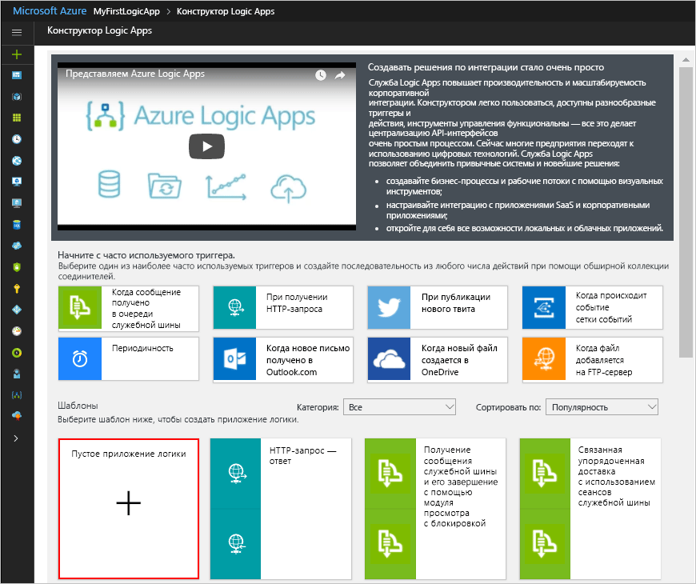

# <a name="check-traffic-with-a-scheduler-based-logic-app"></a>Проверка загрузки дорог при помощи приложения логики на основе планировщика

Azure Logic Apps позволяет автоматизировать рабочие процессы, выполняемые по расписанию. В этом руководстве показано, как можно создать [приложение логики](../logic-apps/logic-apps-overview.md) с триггером планировщика, который запускается каждое утро в будние дни и проверяет время в пути (включая загрузку дорог) между двумя местами. Если время превышает определенный предел, приложение логики отправляет электронное письмо с указанием времени в пути и дополнительного времени, необходимого, чтобы достичь пункта назначения.

Из этого руководства вы узнаете, как выполнять такие задачи:

> [!div class="checklist"]
> * Создание пустого приложения логики. 
> * Добавление триггера, который работает в качестве планировщика для приложения логики.
> * Добавление действия, которое получает время в пути для маршрута.
> * Добавление действия, которое создает переменную, преобразует время в пути из секунд в минуты и сохраняет результат в переменной.
> * Добавление условия, которое сравнивает время в пути с заданным ограничением.
> * Добавление действия, которое отправляет электронное сообщение, если время в пути превышает ограничение.

По завершении приложение логики будет выглядеть как этот высокоуровневый рабочий процесс:


Если у вас еще нет подписки Azure, <a href="https://azure.microsoft.com/free/" target="_blank">подпишитесь для получения бесплатной учетной записи</a> Azure, прежде чем начинать работу.

## <a name="prerequisites"></a>предварительным требованиям

* Учетная запись электронной почты поставщика услуг электронной почты, поддерживаемого Logic Apps, например Office 365 Outlook, Outlook.com или Gmail. Сведения о дополнительных поставщиках см. в [списке соединителей](https://docs.microsoft.com/connectors/). В кратком руководстве используется учетная запись Outlook.com. Если используется другая учетная запись электронной почты, общие шаги остаются неизменными, однако интерфейс может выглядеть несколько иначе.

* Чтобы получить время в пути для маршрута, требуется ключ доступа для API Карт Bing. Чтобы получить этот ключ, выполните шаги <a href="https://msdn.microsoft.com/library/ff428642.aspx" target="_blank">для получения ключа Карт Bing</a>. 

## <a name="sign-in-to-the-azure-portal"></a>Выполните вход на портал Azure.

Войдите на <a href="https://portal.azure.com" target="_blank">портал Azure</a> с помощью учетных данных учетной записи Azure.

## <a name="create-your-logic-app"></a>Создание приложения логики

1. В главном меню на портале Azure выберите **Создать ресурс** > **Интеграция с предприятием** > **Приложение логики**.

   

2. В разделе **Создание приложения логики** предоставьте сведения о приложении логики, как показано и описано. По завершении выберите **Закрепить на панели мониторинга** > **Создать**.

   

   | Параметр | Значение | ОПИСАНИЕ | 
   | ------- | ----- | ----------- | 
   | **Имя** | LA-TravelTime | Имя приложения логики. | 
   | **Подписка** | <*Имя вашей подписки Azure*> | Имя подписки Azure. | 
   | **Группа ресурсов** | LA-TravelTime-RG | Имя [группы ресурсов Azure](../azure-resource-manager/resource-group-overview.md), используемой для упорядочения связанных ресурсов. | 
   | **Местоположение.** | Восток США 2 | Регион для хранения сведений о приложении логики. | 
   | **Служба Log Analytics** | Отключить | Сохраните параметр **Выкл.** для журнала ведения диагностики. | 
   |||| 

3. После развертывания приложения логики в Azure откроется конструктор Logic Apps и появится страница с вводным видео и шаблонами распространенных приложений логики. В разделе **Шаблоны** выберите **Пустое приложение логики**.

   

Затем добавьте [триггер](../logic-apps/logic-apps-overview.md#logic-app-concepts) повторения, который запускается в зависимости от заданного расписания. Каждое приложение логики должно запускаться по триггеру, который активируется, когда происходит определенное событие или если новые данные соответствуют заданным условиям. Дополнительные сведения см. в статье о [создании первого приложения логики](../logic-apps/quickstart-create-first-logic-app-workflow.md).

## <a name="add-scheduler-trigger"></a>Добавление триггера планировщика

1. В конструкторе введите "повторение" в поле поиска. Выберите триггер **Расписание — повторение**.

   

2. В фигуре **Повторение** нажмите кнопку **многоточия** (**...**) и выберите **Переименовать**. Переименуйте триггер, используя это описание: ```Check travel time every weekday morning```.

   

3. В триггере выберите **Показать дополнительные параметры**.

4. Укажите расписание и подробности о повторении для своего триггера, как показано и описано:

   

   | Параметр | Значение | ОПИСАНИЕ | 
   | ------- | ----- | ----------- | 
   | **Интервал** | 1 | Количество интервалов ожидания между проверками. | 
   | **Frequency** | Неделя | Единица измерения времени, используемая для повторения. | 
   | **Часовой пояс** | None | Применимо, только если указано время запуска. Это полезно для указания нелокального часового пояса. | 
   | **Время начала** | None | Задержка повторения до определенной даты и времени. Дополнительные сведения см. в статье [Планирование регулярно выполняемых задач и рабочих процессов с помощью приложений логики](../connectors/connectors-native-recurrence.md). | 
   | **В эти дни** | "Понедельник", "Вторник", "Среда", "Четверг", "Пятница" | Доступно, только если параметру **Frequency** (Частота) присвоено значение "Неделя". | 
   | **В эти часы** | 7, 8, 9 | Доступно, только если параметру **Frequency** (Частота) присвоено значение "Неделя" или "День". Выберите часы, в течение которых будет запущено это повторение. Этот пример выполняется на часовых метках 7, 8 и 9. | 
   | **В эти минуты** | 0, 15, 30, 45 | Доступно, только если параметру **Frequency** (Частота) присвоено значение "Неделя" или "День". Выберите минуты, в течение которых будет запущено это повторение. Этот пример выполняется каждые 15 минут, начиная с отметки нулевого часа. | 
   ||||

   Этот триггер срабатывает каждый день недели, каждые 15 минут с 7:00 до 9:45. 
   В поле **Просмотр** отображается расписание повторения. 
   Дополнительные сведения см. в статье [Планирование регулярно выполняемых задач и рабочих процессов с помощью приложений логики](../connectors/connectors-native-recurrence.md) и разделе [Триггер повторения](../logic-apps/logic-apps-workflow-actions-triggers.md#recurrence-trigger).

5. Чтобы скрыть сведения о триггере, щелкните внутри заголовка окна фигуры.

   

6. Сохраните приложение логики. На панели инструментов конструктора нажмите кнопку **Сохранить**. 

Теперь приложение логики активно, но не выполняет никаких других действий повтора. Итак, добавим действие, отвечающее при срабатывании триггера.

## <a name="get-the-travel-time-for-a-route"></a>Получение данных о времени в пути для маршрута

Теперь, когда у вас есть триггер, добавьте [действие](../logic-apps/logic-apps-overview.md#logic-app-concepts), которое получает данные о времени в пути между двумя местами. Logic Apps предоставляет соединитель для API Карт Bing, чтобы вы могли легко получить эту информацию. Прежде чем начать эту задачу, убедитесь, что у вас есть ключ API Карт Bing, как описано в предварительных требованиях для этого руководства.

1. В конструкторе Logic Apps выберите для триггера пункты **+ Новый шаг** > **Add an action** (Добавить действие).

2. Выполните поиск по слову "карты" и выберите действие **Bing Maps — Get route** (Карты Bing — получить маршрут).

3. Если у вас нет подключения к Картам Bing, появится запрос на его установку. Укажите сведения о подключении и выберите **Создать**.

   

   | Параметр | Значение | ОПИСАНИЕ |
   | ------- | ----- | ----------- |
   | **Имя подключения** | BingMapsConnection | Укажите имя подключения. | 
   | **Ключ API**. | <*ваш ключ Карт Bing*> | Введите ключ Карт Bing, полученный ранее. Если у вас нет ключа Карт Bing, узнайте, <a href="https://msdn.microsoft.com/library/ff428642.aspx" target="_blank">как получить его</a>. | 
   | | | |  

4. Переименуйте действие с использованием этого описания: ```Get route and travel time with traffic```.

5. Укажите сведения для действия **Get route** (Получить маршрут), как описано здесь, например:

    

   | Параметр | Значение | ОПИСАНИЕ |
   | ------- | ----- | ----------- |
   | **Пункт маршрута 1** | <*исходный пункт*> | Начало маршрута | 
   | **Пункт маршрута 2** | <*пункт назначения*> | Место назначения маршрута | 
   | **Avoid** (Избегать) | None | Все, чего нужно избегать на маршруте, например шоссе, платные дороги и т. д. | 
   | **Optimize** (Оптимизация) | timeWithTraffic | Параметр для оптимизации маршрута, например расстояние, время в пути в соответствии с текущей загрузкой дорог и т. д. Выберите параметр "timeWithTraffic" | 
   | **Distance unit** (Единица расстояния) | <*выбранная единица*> | Единицы измерения расстояния для маршрута. В этой статье используется единица "миля".  | 
   | **Travel mode** (Режим движения) | Driving (Движение на автомобиле) | Режим движения для маршрута. Выберите режим Driving (Движение на автомобиле) | 
   | **Transit Date-Time** (Дата и время транзита) | None | Применяется только для режима движения Transit (Транзит) | 
   | **Значение даты и времени** | None | Применяется только для режима движения Transit (Транзит) | 
   |||| 

   Дополнительные сведения об этих параметрах см. в статье [Calculate a Route](https://msdn.microsoft.com/library/ff701717.aspx) (Расчет маршрута).

6. Сохраните приложение логики.

Затем создайте переменную, чтобы преобразовать и сохранить текущее время в минутах, а не в секундах. Таким образом можно избежать повторного преобразования и проще использовать значение на последующих шагах. 

## <a name="create-variable-to-store-travel-time"></a>Создание переменной для сохранения времени в пути

В некоторых случаях можно выполнять операции с данными в своем рабочем процессе и использовать результаты в последующих действиях. Чтобы повторно использовать результаты и ссылаться на них, их нужно сохранить. Для этого следует создать переменные после их обработки. Переменные можно создать только на верхнем уровне приложения логики.

По умолчанию предыдущее действие **Get route** (Получить маршрут) возвращает текущее время в пути в секундах в соответствии с загрузкой дорог в поле **Travel Duration Traffic** (Трафик длительности пути). Преобразовав и сохранив это значение в минутах, вы упрощаете его повторное использование, при котором не потребуется преобразование.

1. Для действия **Get route** (Получить маршрут) выберите **+ Новый шаг** > **Add an action** (Добавить действие).

2. Выполните поиск по слову "переменные" и выберите действие **Variables — Initialize variable** (Переменные — инициализировать переменную)

   

3. Переименуйте действие с использованием этого описания: ```Create variable to store travel time```.

4. Укажите сведения о переменной, как описано здесь:

   | Параметр | Значение | ОПИСАНИЕ | 
   | ------- | ----- | ----------- | 
   | **Имя** | travelTime | Имя для переменной. | 
   | **Тип** | Целое число  | Тип данных для переменной. | 
   | **Значение** | Выражение, преобразующее текущее время в секундах в минуты (см. шаги в этой таблице). | Начальное значение для переменной | 
   |||| 

   1. Чтобы создать выражение для поля **Значение**, щелкните внутри поля для отображения списка динамического содержимого. 
   При необходимости расширьте окно браузера, пока не появится список. 
   В списке динамического содержимого выберите **Выражение**. 

      

      Если щелкнуть внутри некоторых текстовых полей, появится либо список динамического содержимого, либо список встроенных параметров. В этом списке показаны любые параметры из предыдущих действий, которые можно использовать в качестве входных данных в рабочем процессе. 
      В списке динамического содержимого имеется редактор выражений, в котором можно выбрать функции для выполнения операций. 
      Этот редактор выражений отображается только в списке динамического содержимого.

      Ширина окна браузера определяет отображение определенного списка. 
      Если окно браузера широкое, отобразится список динамического содержимого. 
      Если окно браузера узкое, список параметров отображается под активным текстовым полем.

   2. В редакторе выражений введите следующее выражение: ```div(,60)```

      

   3. Поместите курсор внутрь выражения между левой скобкой (**(**) и запятой (**,**). 
   Выберите **Динамическое содержимое**.

      

   4. В списке динамического содержимого выберите **Travel Duration Traffic** (Трафик длительности пути).

      

   5. После разрешения выражения в поле выберите **ОК**.

      

      Появится поле **Значение**, которое выглядит следующим образом:

      

5. Сохраните приложение логики.

Затем добавьте условие, которое проверяет, превышает ли текущее время в пути определенное ограничение.

## <a name="compare-travel-time-with-limit"></a>Сравнение времени в пути с ограничением

1. В предыдущем действии выберите **+ Новый шаг** > **Add a condition** (Добавить условие). 

2. Переименуйте условие, используя описание: ```If travel time exceeds limit```.

3. Создайте условие, которое проверяет, превышает ли значение **travelTime** определенное ограничение, как описано и показано ниже:

   1. В условии щелкните внутри поля **Выберите значение** слева (широкое представление браузера) или в верхней области (узкое представление браузера).

   2. Из списка динамического содержимого или параметров выберите поле **travelTime** в разделе **Переменные**.

   3. В диалоговом окне сравнения выберите оператор **больше чем**.

   4. В поле **Выберите значение** в правой области (широкое представление) или нижней области (узкое представление) введите такое ограничение: ```15```.

   Например, при работе в узком представлении условие создается следующим образом:

   

4. Сохраните приложение логики.

Затем добавьте действие, выполняемое, когда время в пути превышает ограничение.

## <a name="send-email-when-limit-exceeded"></a>Отправка электронного сообщения при превышении ограничения

Теперь добавьте действие, которое отправляет сообщение электронной почты, когда время в пути превышает ограничения. Это сообщение электронной почты содержит текущее время в пути и дополнительное время, необходимое для поездки по заданному маршруту. 

1. Внутри ветви **Если истинно** условия выберите **Add an action** (Добавить действие).

2. Выполните поиск по фразе "отправить сообщение электронной почты", а затем выберите соединитель электронной почты и действие отправки электронного сообщения, которое требуется использовать.

   

   * Для личных учетных записей Майкрософт выберите **Outlook.com**. 
   * Для рабочих или учебных учетных записей Azure выберите **Office 365 Outlook**.

3. Если у вас еще нет подключения, появится запрос на вход в учетную запись электронной почты.

   Logic Apps создает подключение к учетной записи электронной почты.

4. Переименуйте действие с использованием этого описания: ```Send email with travel time```.

5. В поле **Кому** введите адрес электронной почты получателя. Для тестирования используйте свой адрес электронной почты.

6. В поле **Тема** укажите тему электронного сообщения и включите переменную **travelTime**.

   1. Введите текст ```Current travel time (minutes): ``` с пробелом. 
   
   2. Из списка динамического содержимого или параметров выберите **travelTime** в разделе **Переменные**. 
   
      Например, если браузер находится в узком представлении:

      

7. В поле **Текст** укажите текст сообщения электронной почты. 

   1. Введите текст ```Add extra travel time (minutes): ``` с пробелом. 
   
   2. При необходимости расширяйте окно браузера, пока не появится список динамического содержимого. 
   В списке динамического содержимого выберите **Выражение**.

      

   3. Введите это выражение в редакторе выражений, чтобы рассчитать, на сколько минут превышается ограничение: ```sub(,15)```.

      

   4. Поместите курсор внутрь выражения между левой скобкой (**(**) и запятой (**,**). Выберите **Динамическое содержимое**.

      

   5. В разделе **Переменные** выберите **travelTime**.

      

   6. После разрешения выражения в поле выберите **ОК**.

      

      Появится поле **Текст**, которое выглядит следующим образом:

      

8. Сохраните приложение логики.

Затем протестируйте приложение логики, которое теперь выглядит, как показано в примере:


## <a name="run-your-logic-app"></a>Запуск приложения логики

Чтобы вручную запустить приложение логики, на панели инструментов конструктора щелкните **Запустить**. Если текущее время в пути не превышает ограничений, приложение логики ничего не делает и ожидает следующего интервала перед повторной проверкой.
Однако, если текущее время в пути превышает ограничение, вы получаете электронное письмо с текущим временем в пути и количеством минут сверх ограничения. Ниже приведен пример сообщения, которое отправляет приложение логики:


Если электронные сообщения не приходят, проверьте папку нежелательной почты. Фильтр нежелательной почты может перенаправлять такие виды электронных сообщений. В противном случае, если вы не уверены, что приложение логики работает правильно, см. статью [Диагностика сбоев приложений логики](../logic-apps/logic-apps-diagnosing-failures.md).

Итак, повторяющееся приложение логики на основе планировщика создано и выполняется. 

Чтобы создать другие приложения логики, использующие триггер **Расписание — повторение**, ознакомьтесь со следующими шаблонами, которые станут доступны после создания приложения логики:

* Получайте ежедневные напоминания, отправленные вам.
* Удалите старые большие двоичные объекты Azure.
* Добавьте сообщение в очередь службы хранилища Azure.

## <a name="clean-up-resources"></a>Очистка ресурсов

Удалите ненужную группу ресурсов, содержащую приложение логики и связанные ресурсы. В главном меню Azure перейдите к **группам ресурсов** и выберите группу ресурсов для приложения логики. Выберите **Удалить группу ресурсов**. Введите имя группы ресурсов для подтверждения и нажмите кнопку **Удалить**.


## <a name="get-support"></a>Получение поддержки

* Если у вас возникли вопросы, то посетите [форум Azure Logic Apps](https://social.msdn.microsoft.com/Forums/en-US/home?forum=azurelogicapps).
* Отправить идею по поводу возможности или проголосовать за нее вы можете на [сайте отзывов пользователей Logic Apps](http://aka.ms/logicapps-wish).

## <a name="next-steps"></a>Дополнительная информация

В этом руководстве было создано приложение логики, которое проверяет загрузку дорог на основе заданного расписания (по будним дням) и принимает меры (отправляет сообщение электронной почты), когда время в пути превышает указанное ограничение. Теперь узнайте, как создать приложение логики, которое отправляет запросы для списка рассылки на утверждение, интегрируя службы Azure, службы Майкрософт и другие приложения SaaS.

> [!div class="nextstepaction"]
> [Управление запросами для списка рассылки с помощью приложения логики](../logic-apps/tutorial-process-mailing-list-subscriptions-workflow.md)
