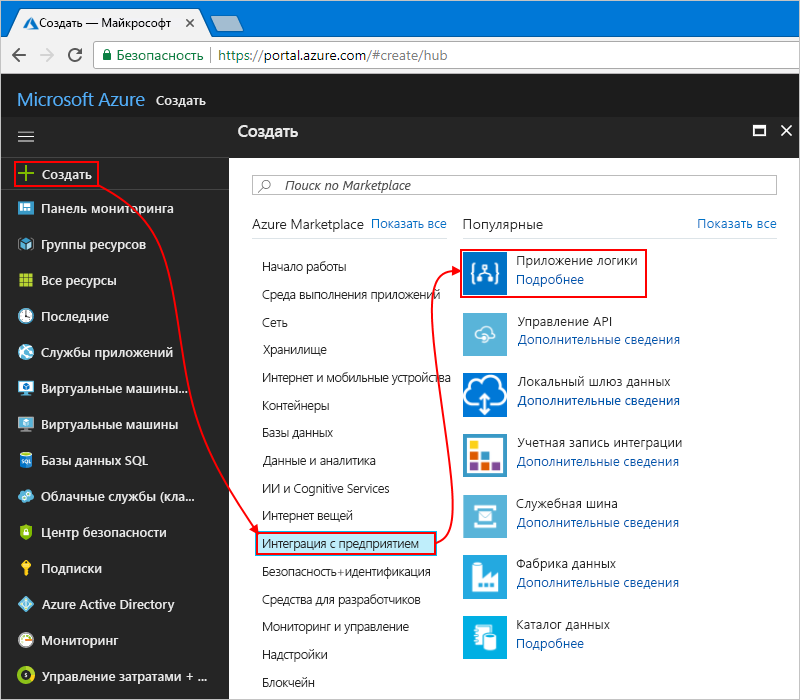

# <a name="manage-mailing-list-requests-with-a-logic-app"></a>Управление запросами для списка рассылки с помощью приложения логики

Azure Logic Apps дает возможность автоматизировать рабочие процессы и интегрировать данные в различные службы Azure, Майкрософт, локальные системы и другие приложения SaaS (программное обеспечение как услуга). В этом руководстве описывается, как создать [приложение логики](../logic-apps/logic-apps-overview.md), обрабатывающее запросы на подписку для списка рассылки, управляемого службой [MailChimp](https://mailchimp.com/).
Это приложение логики отслеживает учетную запись электронной почты для этих запросов, отправляет их на утверждение и добавляет утвержденных участников в список рассылки.

Из этого руководства вы узнаете, как выполнять такие задачи:

> [!div class="checklist"]
> * Создание пустого приложения логики.
> * Добавление триггера для отслеживания сообщений электронной почты для запросов подписок.
> * Добавление действия, которое отправляет сообщения электронной почты для утверждения или отклонения этих запросов.
> * Добавление условия, которое проверяет ответ утверждения.
> * Добавление действия, которое добавляет утвержденных участников в список рассылки.
> * Добавление условия, которое проверяет, были ли участники добавлены в список.
> * Добавление действия, которое отправляет сообщения электронной почты с подтверждением того, что участники добавлены в список.

По завершении приложение логики будет выглядеть как этот высокоуровневый рабочий процесс:


Если у вас еще нет подписки Azure, <a href="https://azure.microsoft.com/free/" target="_blank">подпишитесь для получения бесплатной учетной записи</a> Azure, прежде чем начинать работу.

## <a name="prerequisites"></a>предварительным требованиям

* Учетная запись MailChimp. Создайте список с именем test-members-ML, с помощью которого ваше приложение логики будет добавлять адреса электронной почты утвержденных участников. Если у вас еще нет учетной записи, [зарегистрируйтесь для использования бесплатной учетной записи](https://login.mailchimp.com/signup/) и узнайте, [как создать список](https://us17.admin.mailchimp.com/lists/#). 

* Учетная запись электронной почты со службой Office 365 Outlook или Outlook.com, поддерживающей рабочие процессы утверждения. В этой статье используется Office 365 Outlook. Если используется другая учетная запись электронной почты, общие шаги остаются неизменными, однако интерфейс может выглядеть несколько иначе.

## <a name="sign-in-to-the-azure-portal"></a>Выполните вход на портал Azure.

Войдите на <a href="https://portal.azure.com" target="_blank">портал Azure</a> с помощью учетных данных учетной записи Azure.

## <a name="create-your-logic-app"></a>Создание приложения логики

1. В главном меню на портале Azure выберите **Создать ресурс** > **Интеграция с предприятием** > **Приложение логики**.

   

2. В разделе **Создание приложения логики** предоставьте сведения о приложении логики, как показано и описано. По завершении выберите **Закрепить на панели мониторинга** > **Создать**.

   

   | Параметр | Значение | ОПИСАНИЕ | 
   | ------- | ----- | ----------- | 
   | **Имя** | LA-MailingList | Имя приложения логики. | 
   | **Подписка** | <*Имя вашей подписки Azure*> | Имя подписки Azure. | 
   | **Группа ресурсов** | LA-MailingList-RG | Имя [группы ресурсов Azure](../azure-resource-manager/resource-group-overview.md), используемой для упорядочения связанных ресурсов. | 
   | **Местоположение.** | Восток США 2 | Регион для хранения сведений о приложении логики. | 
   | **Служба Log Analytics** | Отключить | Сохраните параметр **Выкл.** для журнала ведения диагностики. | 
   |||| 

3. После развертывания приложения логики в Azure откроется конструктор Logic Apps и появится страница с вводным видео и шаблонами распространенных приложений логики. В разделе **Шаблоны** выберите **Пустое приложение логики**.

   

Затем добавьте [триггер](../logic-apps/logic-apps-overview.md#logic-app-concepts), который ожидает передачи входящих сообщений электронной почты с запросами подписок.
Каждое приложение логики должно запускаться по триггеру, который активируется, когда происходит определенное событие или если новые данные соответствуют заданным условиям. Дополнительные сведения см. в статье о [создании первого приложения логики](../logic-apps/quickstart-create-first-logic-app-workflow.md).

## <a name="add-trigger-to-monitor-emails"></a>Добавление триггера для отслеживания сообщений электронной почты

1. В конструкторе в поле поиска введите "когда приходит электронное письмо". Выберите триггер для своего поставщика услуг электронной почты: **<*ваш поставщик услуг электронной почты*> — Когда приходит новое электронное письмо**.
   
   

   * Для рабочих или учебных учетных записей Azure выберите Office 365 Outlook.
   * Для личных учетных записей Майкрософт выберите Outlook.com.

2. При появлении запроса учетных данных войдите в свою учетную запись электронной почты для установки подключения к этой учетной записи в Logic Apps.

3. Затем укажите условие, которое триггер будет проверять во всех новых сообщениях почты.

   1. Укажите папку, интервал и частоту проверки сообщений почты.

      

      | Параметр | Значение | ОПИСАНИЕ | 
      | ------- | ----- | ----------- | 
      | **Папка** | Папка "Входящие" | Папка электронной почты для мониторинга | 
      | **Интервал** | 1 | Количество интервалов ожидания между проверками. | 
      | **Frequency** | Hour | Единица измерения времени для каждого интервала между проверками  | 
      |  |  |  | 

   2. Выберите **Показать дополнительные параметры**. В поле **Фильтр темы** введите приведенный текст для поиска триггером в теме сообщения: ```subscribe-test-members-ML```.

      

4. Чтобы скрыть сведения о триггере, щелкните его заголовок.

   

5. Сохраните приложение логики. На панели инструментов конструктора нажмите кнопку **Сохранить**.

   Теперь приложение логики активно, но оно только проверяет входящие сообщения почты. 
   Итак, добавим действие, отвечающее при срабатывании триггера.

## <a name="send-approval-email"></a>Отправка сообщения электронной почты с утверждением

Теперь, когда у вас есть триггер, добавьте [действие](../logic-apps/logic-apps-overview.md#logic-app-concepts), отправляющее сообщение почты для утверждения или отклонения запроса. 

1. В разделе триггера выберите **+ Новый шаг** > **Добавить действие**. Выполните поиск по слову "утверждение" и выберите такое действие: **<*ваш поставщик услуг электронной почты*> — Отправить письмо с запросом на утверждение**.

   

2. Укажите сведения для этого действия, как показано и описано ниже. 

   

   | Параметр | Значение | ОПИСАНИЕ | 
   | ------- | ----- | ----------- | 
   | **To** | <*адрес электронной почты утверждающего лица*> | Адрес электронной почты утверждающего лица. В целях тестирования можно использовать свой адрес. | 
   | **Параметры пользователя** | "Утвердить", "Отклонить" | Параметры ответа, которые может выбрать утверждающее лицо. По умолчанию утверждающее лицо может выбрать в качестве ответа "Утвердить" или "Отклонить". | 
   | **Тема** | Утверждение запроса участника для test-members-ML | Описательная тема сообщения | 
   |  |  |  | 

   Пока что пропустите список с динамическим содержимым или список со встроенными параметрами, который появляется, если щелкнуть внутри определенных текстовых полей. 
   Этот список позволяет выбрать параметры из предыдущих действий, которые можно использовать в качестве входных данных в рабочем процессе. 
   Ширина окна браузера определяет отображение определенного списка. 
 
4. Сохраните приложение логики.

Затем добавьте условие для проверки выбранного ответа утверждающего лица.

## <a name="check-approval-response"></a>Проверка ответа утверждения

1. В разделе действия **Отправить письмо с запросом на утверждение** выберите **+ Новый шаг** > **Добавить условие**.

   Появится фигура условия со всеми доступными параметрами, которые можно включить как входные данные в рабочий процесс. 

2. Переименуйте условие, чтобы оно содержало более понятное описание.

   1. В строке заголовка условия нажмите кнопку **многоточия** (**...**) и выберите **Переименовать**.

      Например, если браузер находится в узком представлении:

      

      Если браузер находится в широком представлении, а список с динамическим содержимым блокирует доступ к кнопке с многоточием, закройте этот список, выбрав **Добавить динамическое содержимое** внутри условия.

   2. Переименуйте условие, используя описание: ```If request approved```.

3. Создайте условие, которое проверяет, выбрало ли утверждающее лицо вариант **Утвердить**.

   1. В условии щелкните внутри поля **Выберите значение** слева (широкое представление браузера) или в верхней области (узкое представление браузера).
   В списке параметров или динамического содержимого выберите поле **SelectedOption** в области **Отправка сообщения электронной почты с утверждением**.

      Например, если вы работаете в широком представлении, ваше условие должно выглядеть приблизительно так, как в этом примере:

      

   2. В поле оператора сравнения выберите такой оператор: **равно**.

   3. В поле **Выберите значение** в правой области (широкое представление) или нижней области (узкое представление) введите такое значение: ```Approve```.

      После введения значения условие должно выглядеть приблизительно так, как показано в примере ниже:

      

4. Сохраните приложение логики.

Затем укажите действие для выполнения приложением логики после утверждения запроса рецензентом. 

## <a name="add-member-to-mailchimp-list"></a>Добавление участника в список MailChimp

Теперь добавьте действие, которое включает утвержденного участника в список рассылки.

1. Внутри ветви **Если истинно** условия выберите **Add an action** (Добавить действие).
Введите в поле поиска mailchimp, а затем выберите такое действие: **MailChimp — Добавить участника в список**.

   

3. При появлении запроса на вход в учетную запись MailChimp войдите с помощью соответствующих учетных данных.

4. Укажите сведения для этого действия, как показано и описано здесь:

   

   | Параметр | Значение | ОПИСАНИЕ | 
   | ------- | ----- | ----------- | 
   | **Идентификатор списка** | test-members-ML | Имя для списка рассылки MailChimp. | 
   | **Состояние** | subscribed | Состояние подписки нового участника. Дополнительные сведения см. в руководстве разработчика об <a href="https://developer.mailchimp.com/documentation/mailchimp/guides/manage-subscribers-with-the-mailchimp-api/" target="_blank">управлении подписчиками с помощью API MailChimp</a>. | 
   | **Электронная почта** | <*адрес электронной почты нового участника*> | В списке параметров или динамического содержимого выберите поле **От** в разделе **Когда приходит новое электронное письмо**, в котором отображается адрес электронной почты нового участника. 
   |  |  |  | 

5. Сохраните приложение логики.

Затем добавьте условие, чтобы можно было проверить, добавлен ли новый участник в список рассылки. Таким образом, от приложения логики вы получите уведомление о результате операции добавления участников — успешном или завершившемся сбоем.

## <a name="check-for-success-or-failure"></a>Проверка успешного или неудачного добавления участника

1. В ветви **Если истинно** в действии **Добавить участника в список** выберите **Дополнительно...** > **Добавить условие**.

2. Переименуйте условие, используя описание: ```If add member succeeded```.

3. Создайте условие, которое проверяет, успешно ли добавлен в список рассылки утвержденный участник:

   1. В условии щелкните внутри поля **Выберите значение** слева (широкое представление браузера) или в верхней области (узкое представление браузера).
   Из списка динамического содержимого или параметров выберите в действии **Добавить участника в список** поле **Состояние**.

      Например, если вы работаете в широком представлении, ваше условие должно выглядеть приблизительно так, как в этом примере:

      

   2. В поле оператора сравнения выберите такой оператор: **равно**.

   3. В поле **Выберите значение** в правой области (широкое представление) или нижней области (узкое представление) введите такое значение: ```subscribed```.

   После введения значения условие должно выглядеть приблизительно так, как показано в примере ниже:

   

Далее настройте электронную почту на отправку сообщений об успешном или неудачном добавлении утвержденного участника в список рассылки.

## <a name="send-email-if-member-added"></a>Отправка уведомления по электронной почте при добавлении участника

1. В ветви **Если истинно** для условия **If add member succeeded** (При успешном добавлении участника) нажмите кнопку **Добавить действие**.

   

2. Введите в поле поиска "отправка электронной почты из Outlook" и выберите такое действие: **<*ваш поставщик услуг электронной почты*> — Отправить сообщение электронной почты**.

   

3. Переименуйте действие с использованием этого описания: ```Send email on success```.

4. Укажите сведения для этого действия, как показано и описано ниже.

   

   | Параметр | Значение | ОПИСАНИЕ | 
   | ------- | ----- | ----------- | 
   | **To** | <*ваш адрес электронной почты*> | Адрес электронной почты, на который будет отправлено сообщение об успешном выполнении операции. Для тестировании можете использовать свой собственный адрес. | 
   | **Тема** | <*тема сообщения об успешном выполнении операции*> | Тема сообщения об успешном выполнении операции. В рамках примеров в этом руководстве введите текст ниже и в списке параметров или динамического содержимого выберите указанное поле в действии **Добавить участника в список**: <p>"Поздравляем! Участник успешно добавлен в список test-members-ML: **адрес электронной почты**". | 
   | **Текст** | <*текст сообщения почты об успешном выполнении операции*> | Содержимое сообщения электронной почты об успешном выполнении операции. В рамках примеров в этом руководстве введите текст ниже и в списке параметров или списке с динамическим содержимым выберите указанное поле в действии **Добавить участника в список**:  <p>"В список test-members-ML добавлен новый участник: **адрес электронной почты**".</br>"Статус пользователя: **состояние**". | 
   | | | | 

5. Сохраните приложение логики.

## <a name="send-email-if-member-not-added"></a>Отправка уведомления по электронной почте, если участник не был добавлен

1. В ветви **Если ложно** для условия **If add member succeeded** (При успешном добавлении участника) нажмите кнопку **Добавить действие**.

   

2. Введите в поле поиска "отправка электронной почты из Outlook" и выберите такое действие: **<*ваш поставщик услуг электронной почты*> — Отправить сообщение электронной почты**.

   

3. Переименуйте действие с использованием этого описания: ```Send email on failure```.

4. Укажите сведения для этого действия, как показано и описано здесь:

   

   | Параметр | Значение | ОПИСАНИЕ | 
   | ------- | ----- | ----------- | 
   | **To** | <*ваш адрес электронной почты*> | Адрес электронной почты, на который будет отправлено сообщение о неудачном выполнении операции. Для тестировании можете использовать свой собственный адрес. | 
   | **Тема** | <*тема сообщения о неудачном выполнении операции*> | Тема сообщения о неудачном выполнении операции. В рамках примеров в этом руководстве введите текст ниже и в списке параметров или динамического содержимого выберите указанное поле в действии **Добавить участника в список**: <p>"Не удалось добавить участника в список test-members-ML: **адрес электронной почты**". | 
   | **Текст** | <*текст сообщения о неудачном выполнении операции*> | Содержимое сообщения электронной почты о неудачном выполнении операции. В рамках примеров в этом руководстве введите текст ниже: <p>"Возможно, этот участник уже включен в список. Просмотрите учетную запись MailChimp". | 
   | | | | 

5. Сохраните приложение логики. 

Затем протестируйте приложение логики, которое теперь выглядит, как показано в примере:

 

## <a name="run-your-logic-app"></a>Запуск приложения логики

1. Отправьте запрос сообщения электронной почты на присоединение к списку рассылки.
Дождитесь появления запроса в папке входящих сообщений.

3. Чтобы вручную запустить приложение логики, на панели инструментов конструктора щелкните **Запустить**. 

   Если тема сообщения почты соответствует фильтру темы триггера, приложение логики отправит сообщение электронной почты для утверждения запроса подписки.

4. В сообщении утверждения выберите **Утвердить**.

5. Если адреса электронной почты подписчика нет в списке рассылки, приложение логики добавит его и отправит сообщение почты, которое будет выглядеть, как показано в примере ниже:

   

   Если приложение логики не добавит подписчика, вы получите сообщение, которое будет выглядеть, как показано в примере ниже:

   

   Если электронные сообщения не приходят, проверьте папку нежелательной почты. 
   Фильтр нежелательной почты может перенаправлять такие виды электронных сообщений. 
   В противном случае, если вы не уверены, что приложение логики работает правильно, см. статью [Диагностика сбоев приложений логики](../logic-apps/logic-apps-diagnosing-failures.md).

Поздравляем! Вы создали и запустили приложение логики, интегрирующее сведения служб Azure, Майкрософт и других приложений SaaS.

## <a name="clean-up-resources"></a>Очистка ресурсов

Удалите ненужную группу ресурсов, содержащую приложение логики и связанные ресурсы. В главном меню Azure перейдите к **группам ресурсов** и выберите группу ресурсов для приложения логики. Выберите **Удалить группу ресурсов**. Введите имя группы ресурсов для подтверждения и нажмите кнопку **Удалить**.


## <a name="get-support"></a>Получение поддержки

* Если у вас возникли вопросы, то посетите [форум Azure Logic Apps](https://social.msdn.microsoft.com/Forums/en-US/home?forum=azurelogicapps).
* Отправить идею по поводу возможности или проголосовать за нее вы можете на [сайте отзывов пользователей Logic Apps](http://aka.ms/logicapps-wish).

## <a name="next-steps"></a>Дополнительная информация

С помощью этого руководства вы создали приложение логики, управляющее утверждениями запросов для списка рассылки. Теперь вы можете ознакомиться с созданием приложения логики, с помощью которого можно обрабатывать и сохранять вложения электронной почты путем интеграции служб Azure, например службы хранилища Azure и функций Azure.

> [!div class="nextstepaction"]
> [Обработка сообщений электронной почты и вложений с помощью приложения логики](../logic-apps/tutorial-process-email-attachments-workflow.md)