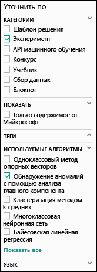
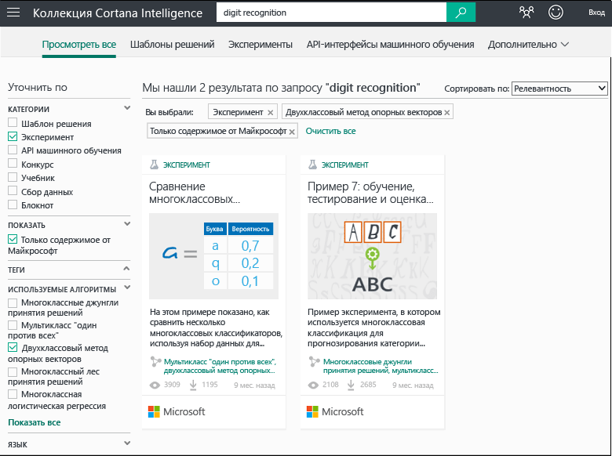
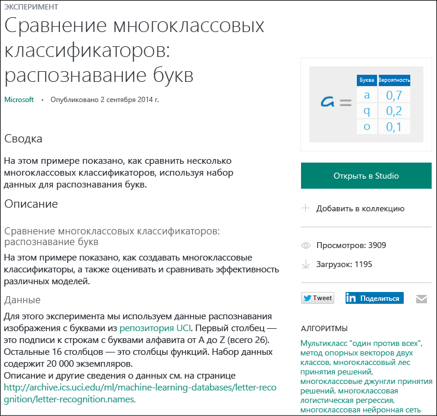

<properties
    pageTitle="Использование образцов экспериментов для создания новых экспериментов | Microsoft Azure"
    description="Создавайте новые эксперименты машинного обучения Azure из образцов экспериментов и экспериментов, представленных в сообществе."
    services="machine-learning"
    documentationCenter=""
    authors="cjgronlund"
    manager="paulettm"
    editor="cgronlun"/>

<tags
    ms.service="machine-learning"
    ms.workload="data-services"
    ms.tgt_pltfrm="na"
    ms.devlang="na"
    ms.topic="get-started-article"
    ms.date="04/28/2016"
    ms.author="chhavib;olgali"/>

# Использование образцов экспериментов для создания новых экспериментов
Если вам нужно создать эксперимент, поищите примеры в [коллекции Cortana Intelligence](http://gallery.cortanaintelligence.com/). Можно найти примеры экспериментов, предоставленные не только группой по машинному обучению, но и более широким сообществом машинного обучения. Также можно задавать вопросы и публиковать комментарии об экспериментах.

[AZURE.INCLUDE [machine-learning-free-trial](../../includes/machine-learning-free-trial.md)]

## Обзор коллекции Cortana Intelligence
Чтобы просмотреть доступные эксперименты в коллекции, перейдите в раздел [Коллекция](http://gallery.cortanaintelligence.com/) и нажмите кнопку **Эксперименты** в верхней части страницы. На этой странице можно просмотреть **недавно добавленные** эксперименты, узнать о **популярных экспериментах**, а также просмотреть последние **популярные эксперименты Майкрософт**.

Для просмотра всех экспериментов выполните следующие действия.

1. В верхней части страницы щелкните **Просмотреть все**.
2. В разделе **Уточнить** выберите **Эксперимент** для просмотра всех экспериментов в коллекции.
3. Список можно уточнить, выбрав фильтры слева. Например, чтобы просмотреть эксперименты, в которых используется алгоритм обнаружения аномалий на основе PCA, выберите **Эксперимент** в разделе **Категории** и **Обнаружение аномалий на основе PCA** в разделе **Используемые алгоритмы** (если этот алгоритм не отображается, нажмите кнопку **Показать все** в нижней части списка).    
4. Можно использовать поле поиска для дальнейшего сужения вариантов выбора. Например, чтобы найти эксперименты, предоставленные корпорацией Майкрософт и относящиеся к распознаванию цифр с использованием алгоритма двухклассовой машины опорных векторов, введите "распознавание цифр" в поле поиска и выберите **Эксперимент**, **Только содержимое Майкрософт** и **Двухклассовая машина опорных векторов**:  
5. Щелкните эксперимент, чтобы узнать о нем подробнее. Чтобы запустить или изменить эксперимент, щелкните **Открыть в студии** на странице эксперимента.

> [AZURE.NOTE] Чтобы открыть эксперимент в студии машинного обучения, потребуется выполнить вход с использованием учетной записи Майкрософт. Если у вас еще нет рабочего пространства машинного обучения, создается бесплатное пробное рабочее пространство. [Узнайте, что входит в бесплатную пробную версию программы машинного обучения](https://azure.microsoft.com/pricing/details/machine-learning/)

## Использование шаблона в студии машинного обучения

Эксперимент в студии машинного обучения также можно создать, используя образец из коллекции в качестве шаблона.

1. Войдите в [студию](https://studio.azureml.net) с использованием учетной записи Майкрософт, после чего щелкните **Создать***, чтобы создать эксперимент.
2. Просмотрите образцы содержимого и выберите то, что вам подходит.

В рабочей области будет создан эксперимент на основе выбранного образца в качестве шаблона.

## Дальнейшие действия
- [Подготовка данных](machine-learning-data-science-import-data.md)
- [Попробуйте использовать R в вашем эксперименте](machine-learning-r-quickstart.md)
- [Просмотрите образцы экспериментов на R](machine-learning-r-csharp-web-service-examples.md)
- [Создайте API веб-службы](machine-learning-publish-a-machine-learning-web-service.md)
- [Просмотрите приложения, готовые к использованию](https://datamarket.azure.com/browse?query=machine+learning)

<!---HONumber=AcomDC_0504_2016-->