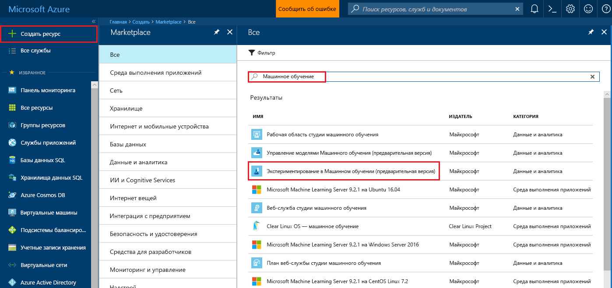

# Создание учетной записи для предварительной версии службы "Машинное обучение Azure" и установка Azure Machine Learning Workbench
Служба "Машинное обучение Microsoft Azure" — это полнофункциональное интегрированное решение для расширенной аналитики, обработки и анализа данных. Оно позволяет специалистам по обработке и анализу данных подготавливать данные, разрабатывать эксперименты и развертывать модели в масштабах облака.

Это краткое руководство подскажет вам, как создать учетные записи Экспериментирования и Управления моделями в предварительной версии службы "Машинное обучение Azure". Вы также узнаете, как установить приложение рабочего стола Azure Machine Learning Workbench и средства для интерфейса командной строки. Затем мы кратко перечислим функции предварительной версии службы "Машинное обучение Azure" на примере набора данных [Ирисы Фишера](https://en.wikipedia.org/wiki/iris_flower_data_set). Вы построите модель для прогнозирования типа ириса по его физическим характеристикам.  

Если у вас еще нет подписки Azure, [создайте бесплатную учетную запись Azure](https://azure.microsoft.com/free/?WT.mc_id=A261C142F), прежде чем начинать работу.

## Предварительные требования

Сейчас классическое приложение Azure Machine Learning Workbench можно установить только в следующих операционных системах: 
- Windows 10
- Windows Server 2016
- macOS Sierra.
- macOS High Sierra;

## Выполните вход на портал Azure.
Выполните вход на [портал Azure](https://portal.azure.com/).

## Создание учетных записей Машинного обучения Azure
Для подготовки учетных записей службы "Машинное обучение Azure" откройте портал Azure. 
1. Щелкните **Создать** (+) в левом верхнем углу портала.

2. Введите **машинное обучение** в строке поиска. Выберите результат поиска с именем **Экспериментирование в Машинном обучении (Предварительная версия)**.  Щелкните значок звездочки, чтобы добавить этот элемент в избранное на портале Azure.

   

3. Нажмите кнопку **+ Добавить**, чтобы настроить новую учетную запись службы "Экспериментирование в Машинном обучении". Откроется форма для ввода данных.

   

4. Введите данные в эту форму, как описано далее.

   Настройка|Рекомендуемое значение|Описание
   ---|---|---
   Имя учетной записи Экспериментирования | _Уникальное имя_ |Выберите уникальное имя для идентификации учетной записи. Вы можете использовать настоящее имя, название отдела или проекта, которое лучше всего подходит для этого эксперимента. Имя должно содержать от 2 до 32 алфавитно-цифровых символов и дефис (-). 
   Подписки | _Ваша подписка_ |Выберите подписку Azure, которую вы хотите использовать для этого эксперимента. Если вы используете несколько подписок, выберите ту, в которой за ресурс взимается плата.
   Группа ресурсов | _Используемая группа ресурсов_ | Вы можете создать группу ресурсов или использовать имеющуюся из подписки.
   Расположение | _Ближайший к пользователям регион_ | Выберите ближайшее к пользователям и ресурсам данных расположение.
   Число рабочих мест | 2 | Введите число рабочих мест. Этот выбор влияет на [цены](https://azure.microsoft.com/pricing/details/machine-learning/). Первые два рабочих места предоставляются бесплатно. Для нашего примера выберите два рабочих места. Это значение вы при необходимости можете изменить позднее на портале Azure.
   Учетная запись хранения | _Уникальное имя_ | Выберите **Создать** и укажите имя, чтобы создать учетную запись хранения Azure. Вы также можете щелкнуть **Использовать существующий** и выбрать имеющуюся учетную запись хранения из раскрывающегося списка. Учетная запись хранения является обязательным ресурсом. В ней хранятся артефакты проекта и данные журнала выполнения. 
   Рабочая область для учетной записи Экспериментирования | _Уникальное имя_ | Укажите имя новой рабочей области. Имя должно содержать от 2 до 32 алфавитно-цифровых символов и дефис (-).
   Назначьте владельца рабочей области. | _Ваша учетная запись_ | Выберите свою учетную запись в качестве владельца рабочей области.
   Создание учетной записи службы "Управление моделями" | *check* | В процессе создания учетной записи Экспериментирования вы можете также создать учетную запись Управления моделями в Машинном обучении. Этот ресурс вам понадобится для развертывания и управления моделями в качестве веб-служб реального времени. Рекомендуем создавать учетную запись Управления моделями одновременно с учетной записью Экспериментирования.
   Имя учетной записи | _Уникальное имя_ | Выберите уникальное имя для учетной записи Управления моделями. Вы можете использовать настоящее имя, название отдела или проекта, которое лучше всего подходит для этого эксперимента. Имя должно содержать от 2 до 32 алфавитно-цифровых символов и дефис (-). 
   Ценовая категория Управления моделями | **Разработка и тестирование** | Щелкните **Ценовая категория не выбрана**, чтобы указать ценовую категорию для учетной записи службы "Управление моделями". Для экономии выберите ценовую категорию **DEVTEST**, если она доступна в вашей подписке (ограниченная доступность). В противном случае выберите ценовую категорию S1 для этой цели. Нажмите кнопку **Выбрать**, чтобы сохранить ценовую категорию. 
   Закрепить на панели мониторинга | _check_ | Установите флажок **Закрепить на панели мониторинга**, чтобы отслеживать работу учетной записи службы "Экспериментирование в Машинном обучении" на странице передней панели мониторинга портала Azure.

5. Выберите **Создать**, чтобы начать процесс создания.

6. На панели инструментов портала Azure щелкните **Уведомления** (значок колокольчика), чтобы отслеживать процесс развертывания. 

   Вы увидите уведомление с текстом **Выполняется развертывание**. Когда процесс завершится, текст изменится на **Развертывание прошло успешно**. После успешного выполнения откроется страница учетной записи Экспериментирования в Машинном обучении.
   
   

Теперь установите Azure Machine Learning Workbench, используя инструкции для соответствующей операционной системы. 

## Установка Azure Machine Learning Workbench на Windows
Azure Machine Learning Workbench можно установить на компьютере под управлением Windows 10, Windows Server 2016 или более поздней версии.

1. Скачайте последнюю версию установщика Azure Machine Learning Workbench [AmlWorkbenchSetup.msi](https://aka.ms/azureml-wb-msi).

2. В проводнике дважды щелкните файл установщика **AmlWorkbenchSetup.msi**.

   >[!IMPORTANT]
   >Дождитесь, пока установщик полностью скопируется на диск, а затем запустите его из целевого каталога. Не запускайте его непосредственно из мини-приложения для скачивания в браузере.

3. Завершите установку, следуя инструкциям на экране.

   Программа установки скачивает все необходимые компоненты-зависимости, например Python, Miniconda и другие связанные библиотеки. Установка всех компонентов может занять около получаса. 

4. Приложение Azure Machine Learning Workbench будет установлено в следующий каталог:
   
   `C:\Users\<user>\AppData\Local\AmlWorkbench`

## Установка Azure Machine Learning Workbench на macOS
Azure Machine Learning Workbench можно установить на компьютере под управлением macOS версии Sierra или выше.

1. Скачайте последнюю версию установщика Azure Machine Learning Workbench [AmlWorkbench.dmg](https://aka.ms/azureml-wb-dmg).

   >[!IMPORTANT]
   >Дождитесь, пока установщик полностью скопируется на диск, а затем запустите его из целевого каталога. Не запускайте его непосредственно из мини-приложения для скачивания в браузере.

2. Дважды щелкните файл установщик **AmlWorkbench.dmg** из системы поиска.

3. Завершите установку, следуя инструкциям на экране.

   Программа установки скачивает все необходимые компоненты-зависимости, например Python, Miniconda и другие связанные библиотеки. Установка всех компонентов может занять около получаса. 

4. Приложение Azure Machine Learning Workbench будет установлено в следующий каталог: 

   `/Applications/AmlWorkbench.app`

## Запуск Azure Machine Learning Workbench для первого входа
1. Когда завершится процесс установки, нажмите кнопку **Launch Workbench** (Запуск Workbench) на последней странице программы установки. Если вы уже закрыли программу установки, найдите ярлык Azure Machine Learning Workbench на рабочем столе или пункт **Azure Machine Learning Workbench** в меню **Пуск** и запустите приложение с их помощью.

2. Для входа в Workbench используйте ту же учетную запись, которую вы ранее использовали для подготовки ресурсов Azure. 

3. Если вход пройдет успешно, приложение Workbench попробует найти ранее созданные учетные записи службы "Экспериментирование в Машинном обучении". Поиск выполняется во всех подписках Azure, к которым есть доступ у ваших учетных данных. Если будет найдена хотя бы одна учетная запись Экспериментирования, Workbench открывается с этой учетной записью. В ней будут перечислены все рабочие области и проекты, сохраненные в этой учетной записи. 

   >[!TIP]
   > Если у вас есть доступ к нескольким учетным записям службы "Экспериментирование", между ними можно переключаться, выбирая значок аватара в левом нижнем углу приложения Workbench.

Дополнительные сведения о создании среды для развертывания веб-служб см. в статье [Установка службы управления моделями](deployment-setup-configuration.md).

## Создание нового проекта
1. Запустите приложение Azure Machine Learning Workbench и выполните вход. 

2. Выберите **Файл** > **Новый проект** (или выберите символ **+** на панели **Проекты**). 

3. Заполните поля **Имя проекта** и **Каталог проекта**. Поле **Описание проекта** заполнять не обязательно, но может быть полезно. Поле **URL-адрес репозитория GIT Visualstudio.com** пока оставьте пустым. Выберите рабочую область и шаблон проекта **Классификация цветков ириса**.

   >[!TIP]
   >Вы также можете указать в текстовом поле репозитория GIT URL-адрес репозитория Git, размещенного в проекте [Visual Studio Team Service](https://www.visualstudio.com). Следует использовать уже существующий пустой репозиторий Git без главной ветви. Также вам нужны права на запись в репозиторий. Если вы сразу добавите репозиторий Git, то позже сможете использовать сценарии роуминга и совместного использования. [Подробная информация](using-git-ml-project.md).

4. Нажмите кнопку **Создать**, чтобы создать проект. Новый проект создается и открывается автоматически. На этом этапе вы можете изучить домашнюю страницу проекта, источники данных, записные книжки и файлы исходного кода. 

    >[!TIP]
    >Кроме того, проект можно открыть в Visual Studio Code или любом другом редакторе. Для этого настройте ссылку интегрированной среды разработки и откройте в редакторе каталог проекта. [Подробная информация](how-to-configure-your-IDE.md). 

## Выполнение скрипта Python
Выполните скрипт на локальном компьютере. 

1. Для каждого проекта открывается собственная страница **Панель мониторинга проекта**. На панели команд в верхней части приложения выберите **local** в качестве целевого объекта выполнения и **iris_sklearn.py** в качестве скрипта для выполнения. В пример включено еще несколько файлов, которые вы можете проверить позже. 

   

2. В текстовом поле **Аргументы** введите **0,01**. Это число используется в коде для установки скорости регуляризации. Это значение используется для настройки способа обучения модели линейной регрессии. 

3. Нажмите кнопку **Запуск**, чтобы начать выполнение **iris_sklearn.py** на компьютере. 

   Этот код использует для построения модели алгоритм [логистической регрессии](https://en.wikipedia.org/wiki/logistic_regression) из популярной библиотеки Python [scikit-learn](http://scikit-learn.org/stable/index.html).

4. Справа появляется панель **Задания**, если она еще не открыта, и в нее добавляется задание **iris_sklearn**. Состояние задания в начале выполнения сменяется с **Отправка** на **Выполняется**, а еще через несколько секунд — на **Завершено**. 

   Поздравляем! Вы успешно выполнили скрипт Python в Azure Machine Learning Workbench.

6. Повторите шаги 2–4 несколько раз. Каждый раз используйте разные значения аргумента в диапазоне от **10** до **0,001**.

## Просмотр журнала выполнения
1. Перейдите к представлению **Запуски** и выберите **iris_sklearn.py** в списке запусков. Откроется панель мониторинга журнала выполнения для **iris_sklearn.py**. Здесь вы увидите все запуски, выполненные для **iris_sklearn.py**. 

   

2. Также панель мониторинга с журналом выполнения содержит самые лучшие метрики, набор диаграмм по умолчанию и список метрик для каждого запуска. Это представление можно настроить путем сортировки, фильтрации и настройки конфигураций. Просто выберите значок конфигурации или фильтра.

   

3. Выберите завершенный запуск, и вы увидите подробное представление для этого конкретного запуска, в том числе дополнительные метрики, созданные файлы и другие журналы, которые могут оказаться полезны.

## Дальнейшие действия
Вы успешно создали учетную запись Экспериментирования в Машинном обучении Azure и учетную запись Управления моделями в Машинном обучении Azure. Вы установили настольное приложение Azure Machine Learning Workbench и интерфейс командной строки. Вы создали новый проект, выполнили скрипт для создания модели и изучили журнал выполнения этого скрипта.

Дополнительные сведения об этом рабочем процессе, в том числе о развертывании модели в качестве веб-службы, вы найдете в полном руководстве *Классификация цветков ириса*. В нем описаны процедуры [подготовки данных](tutorial-classifying-iris-part-1.md), [экспериментирования](tutorial-classifying-iris-part-2.md) и [управления моделями](tutorial-classifying-iris-part-3.md). 

> [!div class="nextstepaction"]
> [Руководство по классификации цветков ириса](tutorial-classifying-iris-part-1.md)
