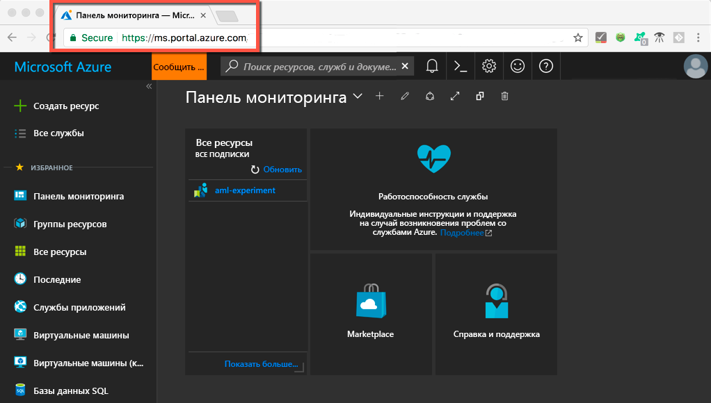
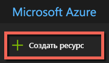
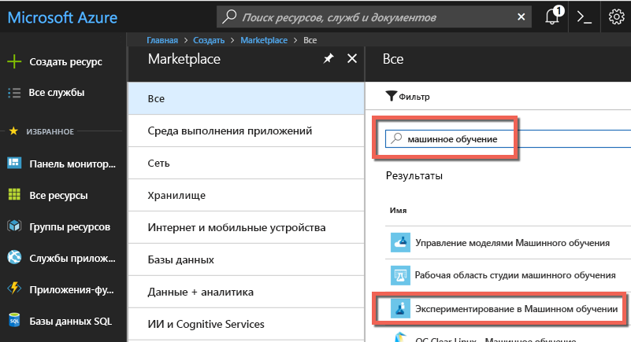
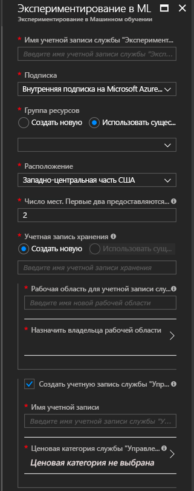
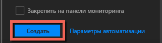
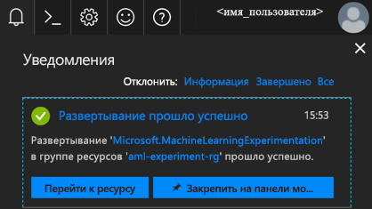
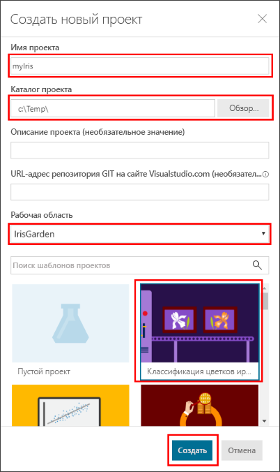
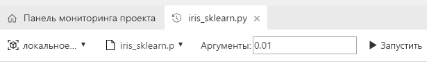
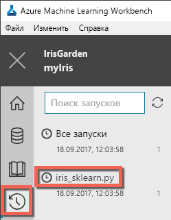
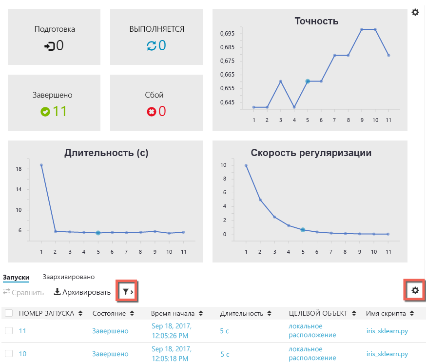

# <a name="quickstart-install-and-get-started-with-azure-machine-learning-services"></a>Краткое руководство. Установка и начало работы со службами Машинного обучения Azure
Служба "Машинное обучение Microsoft Azure" (предварительная версия) — это полнофункциональное интегрированное решение для расширенной аналитики, обработки и анализа данных. Оно позволяет специалистам по обработке и анализу данных подготавливать данные, разрабатывать эксперименты и развертывать модели в масштабах облака.

В этом кратком руководстве объясняется, как выполнять следующие задачи:

* создание учетных записей служб для служб машинного обучения Azure;
* установка службы Azure Machine Learning Workbench и вход в нее;
* создание проекта в Workbench;
* запуск скрипта в этом проекте;  
* получение доступа к интерфейсу командной строки (CLI).


В рамках портфеля Microsoft Azure для служб машинного обучения Azure требуется подписка Azure. Если у вас еще нет подписки Azure, [создайте бесплатную учетную запись Azure](https://azure.microsoft.com/free/?WT.mc_id=A261C142F), прежде чем начинать работу.

Вам также потребуются соответствующие разрешения для создания ресурсов, например групп ресурсов, виртуальных машин и т. д. 

<a name="prerequisites"></a>Приложение Azure Machine Learning Workbench можно установить только в следующих операционных системах:
- Windows 10 или Windows Server 2016;
- macOS Sierra или High Sierra.

## <a name="create-azure-machine-learning-services-accounts"></a>Создание учетных записей службы "Машинное обучение Azure"
Для подготовки учетных записей службы "Машинное обучение Azure" откройте портал Azure: 
1. Войдите на [портал Azure](https://portal.azure.com/) с помощью учетных данных для подписки Azure, которая будет использоваться. Если у вас еще нет подписки Azure, [создайте бесплатную учетную запись](https://azure.microsoft.com/free/?WT.mc_id=A261C142F). 

   

1. Нажмите кнопку **Создать ресурс** (+) в левом верхнем углу окна портала.

   

1. Введите **машинное обучение** в строке поиска. Выберите результат поиска **Экспериментирование в Машинном обучении**. 

   

1. В области **Экспериментирование в Машинном обучении** прокрутите до нижней части страницы и выберите **Создать**, чтобы начать определение учетной записи для экспериментирования.  

   

1. В области **Экспериментирование в Машинном обучении** настройте учетную запись службы "Экспериментирование в Машинном обучении". 

   Параметр|Предлагаемое значение для руководства|ОПИСАНИЕ
   ---|---|---
   Имя учетной записи Экспериментирования | _Уникальное имя_ |Введите уникальное имя для идентификации учетной записи. Вы можете использовать настоящее имя, название отдела или проекта, которое лучше всего подходит для этого эксперимента. Имя должно содержать от 2 до 32 алфавитно-цифровых символов и дефис (-). 
   Подписка | _Ваша подписка_ |Выберите подписку Azure, которую вы хотите использовать для этого эксперимента. Если вы используете несколько подписок, выберите ту, в которой за ресурс взимается плата.
   Группа ресурсов | _Используемая группа ресурсов_ | Используйте группу ресурсов, которая есть в подписке или введите имя, чтобы создать группу ресурсов для этой учетной записи экспериментирования. 
   Расположение | _Ближайший к пользователям регион_ | Выберите ближайшее к пользователям и ресурсам данных расположение.
   Число рабочих мест | 2 | Введите число рабочих мест. Узнайте, как [места влияют на цену](https://azure.microsoft.com/pricing/details/machine-learning/).<br/><br/>Для этого краткого руководства вам потребуется два рабочих места. Рабочее место можно добавить или удалить на портале Azure.
   Учетная запись хранения | _Уникальное имя_ | Выберите **Создать** и укажите имя, чтобы создать [учетную запись хранения Azure](https://docs.microsoft.com/azure/storage/common/storage-quickstart-create-account?tabs=portal). Имя должно состоять только из буквенно-цифровых символов, и его длина должна находиться в диапазоне от 3 до 24 символов. Кроме того, можно щелкнуть **Использовать существующий** и выбрать имеющуюся учетную запись хранения из раскрывающегося списка. Учетная запись хранения является обязательным ресурсом. В ней хранятся артефакты проекта и данные журнала выполнения. 
   Рабочая область для учетной записи Экспериментирования | IrisGarden<br/>(имя, используемое в руководствах) | Введите имя для рабочей области в этой учетной записи. Имя должно содержать от 2 до 32 алфавитно-цифровых символов и дефис (-). Такая рабочая область содержит инструменты, необходимые для создания, публикации экспериментов и управления ими.
   Назначьте владельца рабочей области. | _Ваша учетная запись_ | Выберите свою учетную запись в качестве владельца рабочей области.
   Создание учетной записи службы "Управление моделями" | **check** |Создайте учетную запись службы "Управление моделями", чтобы этот ресурс был доступен, когда вам потребуется развернуть модели как веб-службы в режиме реального времени и управлять ими. <br/><br/>Хотя это необязательно, рекомендуем создавать учетную запись Управления моделями одновременно с учетной записью Экспериментирования.
   Имя учетной записи | _Уникальное имя_ | Выберите уникальное имя для учетной записи Управления моделями. Вы можете использовать настоящее имя, название отдела или проекта, которое лучше всего подходит для этого эксперимента. Имя должно содержать от 2 до 32 алфавитно-цифровых символов и дефис (-). 
   Ценовая категория Управления моделями | **Разработка и тестирование** | Щелкните **Ценовая категория не выбрана**, чтобы указать ценовую категорию для учетной записи службы "Управление моделями". Для экономии выберите ценовую категорию **DEVTEST**, если она доступна в вашей подписке (ограниченная доступность). В противном случае выберите ценовую категорию S1. Нажмите кнопку **Выбрать**, чтобы сохранить ценовую категорию. 
   Закрепить на панели мониторинга | _check_ | Установите флажок **Закрепить на панели мониторинга**, чтобы отслеживать работу учетной записи службы "Экспериментирование в Машинном обучении" на странице передней панели мониторинга портала Azure.

   

5. Выберите **Создать**, чтобы начать процесс создания учетной записи службы "Экспериментирование" и учетной записи службы "Управление моделями".

   

   Создание учетной записи может занять несколько минут. Вы можете проверить состояние процесса развертывания, щелкнув значок уведомлений (колокольчик) на панели инструментов Azure.
   
   


## <a name="install-and-log-in-to-workbench"></a>Установите и войдите в Workbench

Azure Machine Learning Workbench доступна для Windows или macOS. Ознакомьтесь со списком [поддерживаемых платформ](#prerequisites).

>[!WARNING]
>Установка может занять до 30 минут. 

1. Скачайте и запустите последний установщик Workbench. 
   >[!IMPORTANT]
   >Дождитесь, пока установщик полностью скопируется на диск, а затем запустите его из целевого каталога. Не запускайте его непосредственно из мини-приложения для скачивания в браузере.

   **В Windows:** 

   &nbsp;&nbsp;&nbsp;&nbsp;A. Скачайте [AmlWorkbenchSetup.msi](https://aka.ms/azureml-wb-msi).  <br/>
   &nbsp;&nbsp;&nbsp;&nbsp;Б. Дважды щелкните скачанный установщик в проводнике.

   **В MacOS:** 

   &nbsp;&nbsp;&nbsp;&nbsp;A. Скачайте [AmlWorkbench.dmg](https://aka.ms/azureml-wb-dmg). <br/>
   &nbsp;&nbsp;&nbsp;&nbsp;Б. Дважды щелкните скачанный установщик в системе поиска.<br/><br/>

1. Следуйте инструкциям на экране, чтобы выполнить установку. 

   **Установка может занять до 30 минут.**  
   
   | |Установочный путь к Azure Machine Learning Workbench.|
   |--------|------------------------------------------------|
   |Windows|C:\Users\\<пользователь\>\AppData\Local\AmlWorkbench|
   |macOS|/Applications/Azure ML Workbench.app|

   Программа установки скачает и настроит все необходимые зависимости, например Python, Miniconda и другие связанные библиотеки. Эта установка также включает программу командной строки Azure (Azure CLI), которая работает на всех платформах.

1. Запустите Workbench, нажав кнопку **Launch Workbench** (Запуск Workbench) на последней странице программы установки. 

   Если установщик закрыт:
   + В Windows запустите его с помощью ярлыка на рабочем столе **Machine Learning Workbench**. 
   + В macOS выберите **Azure ML Workbench** на панели запуска.

1. На первом экране выберите **Войти с помощью учетной записи Майкрософт** для проверки подлинности с помощью Azure Machine Learning Workbench. Используйте те же учетные данные, использованные на портале Azure, для создания учетных записей службы "Экспериментирование" и службы "Управление моделями". 

   После входа Workbench использует первую учетную запись службы "Экспериментирование", найденную в подписках Azure, и отобразит все рабочие области и проекты, связанные с этой учетной записью. 

   >[!TIP]
   > Вы можете переключиться на другую учетную запись экспериментирования, используя значок в левом нижнем углу окна приложения Workbench.

## <a name="create-a-project-in-workbench"></a>создание проекта в Workbench;

В службе "Машинное обучение Azure" проект представляет собой логический контейнер для всех действий, выполняемых для решения проблемы. Он сопоставляется с отдельной папкой на локальном диске, в которую можно добавить любые файлы и вложенные папки. 

Мы создаем проект Workbench с помощью шаблона, который включает [набор данных Ирисы Фишера](https://en.wikipedia.org/wiki/Iris_flower_data_set). Руководства, которые следуют за этим кратким руководством, зависят от этих данных и используются для создания модели, которая прогнозирует тип ириса на основе некоторых из его физических характеристик.  

1. В открытой Azure Machine Learning Workbench выберите знак плюс (+) в области **Проекты** и выберите **Новый проект**.  

   

1. Заполните поля форм и нажмите кнопку **Создать**, чтобы создать проект в Workbench.

   Поле|Предлагаемое значение для руководства|ОПИСАНИЕ
   ---|---|---
   Имя проекта | myIris |Введите уникальное имя для идентификации учетной записи. Вы можете использовать настоящее имя, название отдела или проекта, которое лучше всего подходит для этого эксперимента. Имя должно содержать от 2 до 32 алфавитно-цифровых символов и дефис (-). 
   каталог проекта; | c:\Temp\ | Укажите каталог, в котором создается проект.
   описание проекта; | _Не указывайте_ | Дополнительное поле, полезное для описания проектов.
   Visualstudio.com GIT Repository URL (URL-адрес репозитория Git на сайте Visualstudio.com) |_Не указывайте_ | Дополнительное поле. При необходимости проект можно связать с репозиторием Git в Visual Studio Team Services для системы управления версиями и совместной работы. [Узнайте, как настроить это](/desktop-workbench/using-git-ml-project#step-3-set-up-a-machine-learning-project-and-git-repo). 
   Selected workspace (Выбранная рабочая область) | IrisGarden (если он существует) | Выберите рабочую область, созданную для учетной записи службы "Экспериментирование" на портале Azure. <br/>Если вы следовали краткому руководству, у вас должна быть рабочая область с именем IrisGarden. В противном случае выберите ту, которая была создана при создании учетной записи службы "Экспериментирование", или любую другую, которую вы хотите использовать.
   Шаблон проекта | Classifying Iris (Классификация цветков ириса) | Шаблоны, содержащие скрипты и данные, которые можно использовать для изучения продукта. Этот шаблон содержит скрипты и данные, необходимые для этого краткого руководства и других руководств на этом сайте документации. 

   
 
 Новый проект создан. Вместе с ним откроется панель мониторинга. На этом этапе вы можете изучить домашнюю страницу проекта, источники данных, записные книжки и файлы исходного кода. 

>[!TIP]
>Вы можете настроить Workbench для работы с интегрированной средой разработки Python, чтобы обеспечить плавную обработку и анализ данных. Затем можно взаимодействовать с проектом в интегрированной среде разработки. [Подробнее](../desktop-workbench/how-to-configure-your-ide.md). 

## <a name="run-a-python-script"></a>Выполнение скрипта Python

Теперь можно запустить скрипт **iris_sklearn.py** на локальном компьютере. Этот скрипт включен по умолчанию с шаблоном проекта **Classifying Iris** (Классификация цветков ириса). Этот скрипт создает модель [логистической регрессии](https://en.wikipedia.org/wiki/Logistic_regression) с помощью популярной библиотеки Python [scikit-learn](http://scikit-learn.org/stable/index.html).

1. На странице **Панель мониторинга проекта** выберите **local** в качестве целевого объекта выполнения и **iris_sklearn.py** в качестве скрипта для выполнения. Эти значения будут выбраны по умолчанию заранее. 

   В пример включены другие файлы, которые можно проверить позже, но для этого краткого руководства нас интересует **iris_sklearn.py**. 

   

1. В текстовом поле **Аргументы** введите **0,01**. Это число соответствует коэффициенту регуляризации и используется в скрипте для настройки модели логистической регрессии. 

1. Выберите **Запустить** для начала выполнения сценария на компьютере. Задание **Iris_sklearn.py** сразу же отображается на панели **Задания** справа, где можно отслеживать выполнение скрипта.

   Поздравляем! Вы успешно выполнили скрипт Python в Azure Machine Learning Workbench.

1. Повторите шаги 2–3 несколько раз, используя другой аргумент значения в диапазоне от **0,001** до **10** (например, степень 10). Каждый из запусков отображается на панели **Задания**.

1. Проверьте журнал выполнения, выбрав представление **Выполнения**, а затем **iris_sklearn.py** в списке выполнений. 

   

   В этом представлении отображаются все запуски, выполненные для **iris_sklearn.py**. Также панель мониторинга с журналом выполнения содержит самые лучшие метрики, набор диаграмм по умолчанию и список метрик для каждого запуска. 

1. Это представление можно настроить путем сортировки, фильтрации и настройки конфигураций, используя значок шестеренки и фильтра.

   

3. Выберите завершенное выполнение в области "Задания" и вы увидите подробное представление для этого конкретного запуска. в том числе дополнительные метрики, созданные файлы и другие журналы, которые могут оказаться полезны.

## <a name="start-the-cli"></a>Запуск CLI

Кроме того, устанавливается CLI службы "Машинное обучение Azure". Интерфейс CLI дает возможность доступа к службам "Машинное обучение Azure" и взаимодействия с ними с помощью команд `az` для выполнения всех задач, необходимых для обработки и анализа данных от начала и до конца рабочего процесса. [Подробнее.](../desktop-workbench/tutorial-iris-azure-cli.md)

Интерфейс командной строки службы "Машинное обучение Azure" можно запустить с панели инструментов Workbench с помощью **File → Open Command Prompt** (Файл → Открыть командную строку).

Кроме того, можно получить справку о командах в интерфейсе командной строки службы "Машинное обучение Azure" с помощью аргумента --help.

```az ml --help```

## <a name="clean-up-resources"></a>Очистка ресурсов

[!INCLUDE [aml-delete-resource-group](../../../includes/aml-delete-resource-group.md)]

## <a name="next-steps"></a>Дополнительная информация
Вы создали необходимые учетные записи службы "Машинное обучение Azure" и установили приложение Azure Machine Learning Workbench. Вы также создали проект, выполнили скрипт и изучили журнал выполнения скрипта.

Дополнительные сведения об этом рабочем процессе, в том числе о развертывании модели в качестве веб-службы, вы найдете в полном руководстве *Классификация цветков ириса*. В нем описаны процедуры [подготовки данных](../desktop-workbench/tutorial-classifying-iris-part-1.md), [экспериментирования](../desktop-workbench/tutorial-classifying-iris-part-2.md) и [управления моделями](../desktop-workbench/tutorial-classifying-iris-part-3.md). 

> [!div class="nextstepaction"]
> [Часть 1. Классификация цветков ириса: подготовка данных](../desktop-workbench/tutorial-classifying-iris-part-1.md)

>[!NOTE]
> Несмотря на наличие созданной учетной записи управления моделью, среда еще не настроена для развертывания веб-служб. Узнайте, как настроить [среду развертывания](../desktop-workbench/deployment-setup-configuration.md).
