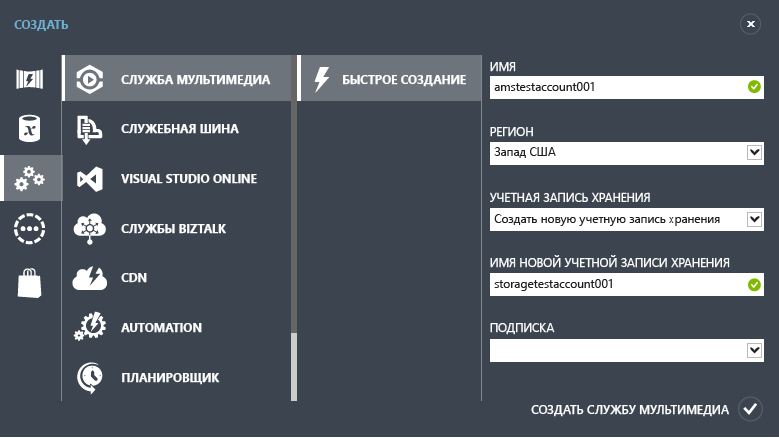
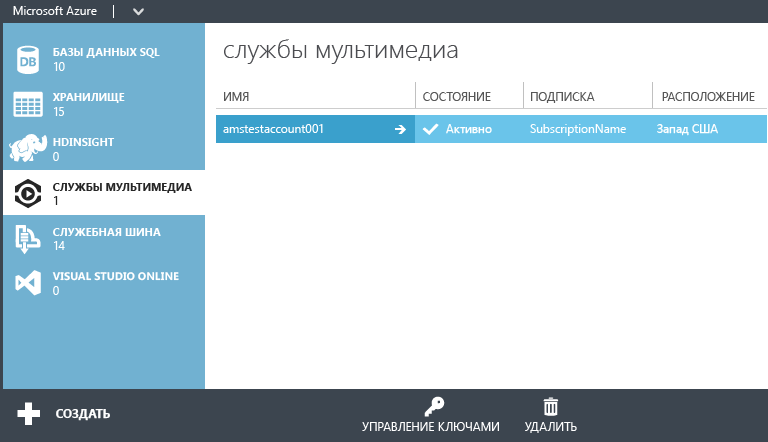

<properties
	pageTitle="Создание учетной записи служб мультимедиа | Microsoft Azure"
	description="В этой статье описывается создание новой учетной записи служб мультимедиа в Azure."
	services="media-services"
	documentationCenter=""
	authors="Juliako"
	manager="erikre"
	editor=""/>

<tags
	ms.service="media-services"
	ms.workload="media"
	ms.tgt_pltfrm="na"
	ms.devlang="na"
	ms.topic="get-started-article"
	ms.date="09/26/2016"
	ms.author="juliako"/>

# Создание учетной записи служб мультимедиа Azure

> [AZURE.SELECTOR]
- [Портал](media-services-create-account.md)
- [PowerShell](media-services-manage-with-powershell.md)
- [REST](http://msdn.microsoft.com/library/azure/dn194267.aspx)

> [AZURE.NOTE] Для работы с этим учебником требуется учетная запись Azure. Дополнительные сведения см. в разделе [Бесплатная пробная версия Azure](/pricing/free-trial/?WT.mc_id=A261C142F).
 
На классическом портале Azure можно быстро создать учетную запись служб мультимедиа Azure. Эту учетную запись можно использовать для доступа к службам мультимедиа, которые позволяют хранить, шифровать, кодировать мультимедийный контент, управлять им и обеспечивать его потоковую передачу в Azure. При создании учетной записи служб мультимедиа также создается связанная учетная запись хранения (или используется уже существующая) в той же географической области, что и учетная запись служб мультимедиа.

В этой статье объясняется, как использовать метод быстрого создания для создания новой учетной записи служб мультимедиа и ее связывания с учетной записью хранения.

## Основные понятия

Для доступа к службам мультимедиа требуется две связанные учетные записи:

-   **Создание учетной записи служб носителей**. Ваша учетная запись обеспечивает доступ к набору облачных служб мультимедиа, доступных в Azure. Учетная запись служб мультимедиа фактически не хранит мультимедийный контент. Вместо этого в учетной записи хранятся метаданные о мультимедийном контенте и заданиях обработки мультимедиа. При создании учетной записи выберите доступную область служб мультимедиа. Выбранная область является центром обработки данных, который хранит записи метаданных для вашей учетной записи.

	В службах мультимедиа (AMS) доступны следующие регионы: Северная Европа, Западная Европа, Запад США, Восток США, Юго-Восточная Азия, Восточная Азия, Западная часть Японии, Восточная часть Японии. Для служб мультимедиа не используются территориальные группы.
	
	AMS теперь доступны в таких центрах обработки данных: Южная Бразилия, Западная Индия, Южная Индия и Центральная Индия. Кроме того, на классическом портале Azure можно [создавать учетные записи служб мультимедиа](media-services-create-account.md#create-a-media-services-account-using-quick-create) и выполнять различные задачи, описанные [здесь](https://azure.microsoft.com/documentation/services/media-services/). Но в этих центрах обработки данных не поддерживается кодирование в реальном времени. Кроме того, в этих центрах обработки данных доступны не все типы зарезервированных единиц кодирования.
	
	- Южная Бразилия: доступны только стандартные и базовые зарезервированные единицы кодирования.
	- Западная Индия, Южная Индия и Центральная Индия: доступны только базовые зарезервированные единицы кодирования.

-   **Связанная учетная запись хранения** Ваша учетная запись хранения является учетной записью хранения Azure, связанной с вашей учетной записью служб мультимедиа. Учетная запись хранения предоставляет хранилище BLOB-объектов для файлов мультимедиа и должна находиться в той же географической области, что и учетная запись служб мультимедиа. При создании учетной записи служб мультимедиа можно выбрать существующую учетную запись хранения в той же области или создать новую учетную запись хранения в той же области. При удалении учетной записи служб мультимедиа, BLOB-объекты в связанной учетной записи хранения не удаляются.

## Создание учетной записи служб мультимедиа с помощью функции "Быстрое создание"

1. На [классическом портале Azure][] последовательно выберите **Создать**, **Служба мультимедиа** и **Быстрое создание**.

2. В поле **ИМЯ** введите имя новой учетной записи. Имя учетной записи служб мультимедиа может состоять из букв или цифр в нижнем регистре без пробелов и должно иметь длину от 3 до 24 символов.

3. В поле **РЕГИОН** выберите географический регион, который будет использоваться для хранения записей метаданных вашей учетной записи служб мультимедиа. В раскрывающемся списке отображаются только доступные области служб мультимедиа.

4. В поле **УЧЕТНАЯ ЗАПИСЬ ХРАНЕНИЯ** выберите учетную запись хранения, которая обеспечит хранилище BLOB-объектов для мультимедийного контента из учетной записи служб мультимедиа. Можно выбрать существующую учетную запись хранения в географическом регионе, где находится учетная запись служб носителей, или создать новую учетную запись хранения. Новая учетная запись хранения будет создана в том же регионе.

5. Если была создана новая учетная запись хранения, в поле **ИМЯ НОВОЙ УЧЕТНОЙ ЗАПИСИ ХРАНЕНИЯ** введите имя для учетной записи хранения. В отношении учетных записей хранения действуют те же правила, что и для учетных записей служб носителей.

6. Щелкните **Быстрое создание** в нижней части формы.

Состояние процесса можно контролировать с помощью области сообщений в нижней части окна.

Статус меняется на "Активная", когда учетная запись успешно создана. Откроется страница **службы носителей** с новой учетной записью.

В нижней части страницы появится кнопка **УПРАВЛЕНИЕ КЛЮЧАМИ**. Если ее нажать, откроется страница с именем учетной записи служб мультимедиа, а также первичным и вторичным ключами. Для программного доступа к учетной записи служб мультимедиа потребуется имя учетной записи и сведения о первичном ключе.

Если дважды щелкнуть имя учетной записи, по умолчанию откроется страница **Быстрый запуск**. Эта страница позволяет выполнять некоторые задачи управления, которые также доступны на других страницах портала. Например, видеофайл можно выложить как с этой страницы, так и со страницы **Содержимое**.

Кроме того, можно просмотреть код, который использует пакет SDK для служб мультимедиа Azure для выполнения следующих задач: добавление, кодирование и публикация видеоматериалов. Можно щелкнуть одну из ссылок в разделе **НАПИСАНИЕ КОДА**, скопировать код и использовать его в приложении.

##Схемы обучения работе со службами мультимедиа

[AZURE.INCLUDE [media-services-learning-paths-include](../../includes/media-services-learning-paths-include.md)]

##Отзывы

[AZURE.INCLUDE [media-services-user-voice-include](../../includes/media-services-user-voice-include.md)]

## Дальнейшие действия

- [Приступая к работе с доставкой видео по запросу (VOD) с помощью пакета SDK для .NET](media-services-dotnet-get-started.md)

- [Использование пакета SDK для .NET для создания каналов, выполняющих кодирование односкоростного потока во многоскоростной в реальном времени](media-services-dotnet-creating-live-encoder-enabled-channel.md)

<!-- Reusable paths. -->

.<!-- Anchors. -->
  [Concepts]: #concepts
  [Before you begin]: #begin
  [How to: Create a Media Services account using Quick Create]: #quick

<!-- URLs. -->
  [Web Platform Installer]: http://go.microsoft.com/fwlink/?linkid=255386

  [классическом портале Azure]: http://manage.windowsazure.com/

<!---HONumber=AcomDC_0928_2016-->