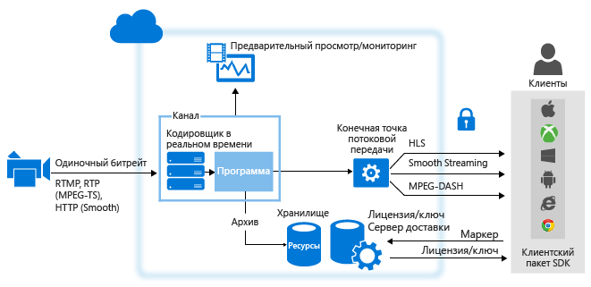

<properties 
	pageTitle="Общие сведения о динамической потоковой передаче с использованием служб мультимедиа Azure | Microsoft Azure" 
	description="В этой статье приводятся общие сведения о динамической потоковой передаче с использованием служб мультимедиа Azure." 
	services="media-services" 
	documentationCenter="" 
	authors="Juliako" 
	manager="erikre" 
	editor=""/>

<tags 
	ms.service="media-services" 
	ms.workload="media" 
	ms.tgt_pltfrm="na" 
	ms.devlang="ne" 
	ms.topic="article" 
	ms.date="09/19/2016"
	ms.author="juliako"/>

#Общие сведения о динамической потоковой передаче с использованием служб мультимедиа Azure

##Обзор

При трансляции мероприятий путем динамической потоковой передачи с помощью служб мультимедиа Azure обычно используется следующее:

- Камера, которая используется для трансляции события.
- Динамический видеокодировщик, который преобразует сигналы от камеры в потоки, отправляемые службе динамической потоковой передачи.

	Несколько синхронизированных кодировщиков прямой передачи (по желанию). Для некоторых критически важных транслируемых событий, для которых требуется очень высокая степень доступности и качество передачи, рекомендуется задействовать активно-активные избыточные кодировщики с синхронизацией по времени для достижения беспроблемной отработки отказа без потери данных.
- Служба динамической потоковой передачи, которая позволяет делать следующее:
	
	- прием содержимого в реальном времени с использованием различных протоколов динамической потоковой передачи (например, RTMP или Smooth Streaming);
	- кодирование вашего потока в поток с адаптивной скоростью (по желанию);
	- предварительный просмотр динамического потока;
	- запись и хранение принятого содержимого для потоковой передачи в дальнейшем (видео по запросу);
	- доставка содержимого посредством общих потоковых протоколов (например, MPEG DASH, Smooth, HLS, HDS) непосредственно клиентам или в сеть доставки содержимого (CDN) для дальнейшего распространения.

**Службы мультимедиа Microsoft Azure** (AMS) предоставляют возможность приема, кодирования, предварительного просмотра, хранения и доставки содержимого динамической потоковой передачи.

При доставке содержимого клиентам ваша задача — доставлять видео высокого качества для различных устройств в разных сетевых условиях. Для этого используйте динамические кодировщики, кодирующие поток в видеопоток с разными скоростями (с адаптивной скоростью). Для обеспечения потоковой передачи на различных устройствах используйте [динамическое упаковывание](media-services-dynamic-packaging-overview.md) служб мультимедиа, чтобы выполнить повторное динамическое упаковывание потока в разные протоколы. Службы мультимедиа поддерживают доставку следующих потоковых технологий с адаптивной скоростью: HTTP Live Streaming (HLS), Smooth Streaming, MPEG DASH и HDS (только для обладателей лицензий Adobe PrimeTime/Access).

**Каналы**, **программы** и **конечные точки потоковой передачи** в службах мультимедиа Azure обрабатывают все связанные с потоковым вещанием функции, включая прием, форматирование, DVR, безопасность, масштабируемость и избыточность.

**Канал** представляет собой конвейер для обработки содержимого, передаваемого динамически в потоковом режиме. Канал может получать динамические входные потоки следующим способом.

- Локальный динамический кодировщик передает контент в многоскоростном формате **RTMP** или **Smooth Streaming** (фрагментированный формат MP4) в канал, настроенный для **сквозной** доставки. **Сквозная** доставка осуществляется, когда переданные потоки проходят через **каналы** без дополнительной обработки. Вы можете использовать следующие динамические кодировщики, выдающие контент в многоскоростном формате Smooth Streaming: Elemental, Envivio, Cisco. Следующие динамические кодировщики выдают контент в формате RTMP: Adobe Flash Media Live Encoder (FMLE), Telestream Wirecast и транскодеры Tricaster. Динамический кодировщик может также передавать односкоростной поток в канал, для которого не включено динамическое кодирование, но это не рекомендуется. При получении запроса службы мультимедиа предоставляют потоки клиентам.

	>[AZURE.NOTE] Метод сквозной доставки — наиболее экономичный способ осуществления потоковой передачи в режиме реального времени, если передается ряд событий за длительный период времени и у вас уже есть локальные кодировщики. См. сведения о [ценах](/pricing/details/media-services/).
	
	
- Локальный динамический кодировщик передает односкоростной поток в канал, который может осуществлять кодирование в реальном времени с помощью служб мультимедиа, в одном из следующих форматов: RTMP или Smooth Streaming (Fragmented MP4) . Также поддерживается формат RTP (MPEG-TS), если есть выделенное подключение к центру обработки данных Azure. С каналами этого типа работают следующие динамические кодировщики с выходными данным в формате RTMP: Telestream Wirecast, FMLE. Затем канал кодирует входящий односкоростной поток в реальном времени в многоскоростной (адаптивный) видеопоток. При получении запроса службы мультимедиа предоставляют потоки клиентам.

Начиная с выпуска 2.10 служб мультимедиа, при создании канала можно указать, как он должен принимать входной поток и должен ли он выполнять его кодирование в реальном времени. Существует два варианта.

- **Нет** (сквозная передача) — задайте это значение, если вы собираетесь использовать локальный динамический кодировщик, который будет выдавать многоскоростной (сквозной) поток. В этом случае входящий поток передается на выход без кодирования. Таким образом каналы работали до выпуска 2.10.

- **Стандартный** — выберите это значение, если собираетесь использовать службы мультимедиа для кодирования односкоростного потока во многоскоростной. Этот метод служит наиболее экономичным решением для быстрого масштабирования редких событий. Помните о том, что за кодирование в реальном времени взимается плата, поэтому, если вы оставите канал кодирования в реальном времени в состоянии "Работает", вам будут выставлены соответствующие счета. Рекомендуется сразу же прекращать работу канала после завершения потоковой передачи в реальном времени во избежание оплаты дополнительных часов.

##Сравнение типов каналов

В представленной ниже таблице сравниваются два типа каналов, поддерживаемых службами мультимедиа.

Функция|Сквозной канал|Стандартный канал
---|---|---
Кодировка односкоростного источника данных в несколько потоков с различными скоростями передачи в облаке|Нет|Да
Максимальное разрешение, количество слоев|1080p, 8 слоев, 60 и более кадров в секунду|720p, 6 слоев, 30 и более кадров в секунду
Протоколы входных данных|RTMP, Smooth Streaming|RTMP, Smooth Streaming и RTP
Цена|Откройте [страницу цен](/pricing/details/media-services/) и выберите вкладку Live Video|См. [страницу цен](/pricing/details/media-services/) 
Максимальное время выполнения|24x7|8 ч
Поддержка вставки баннеров|Нет|Да
Поддержка сигнализации о рекламе|Нет|Да
Сквозная передача субтитров стандарта CEA 608/708|Да|Да
Возможность восстановления после кратких остановок в канале входного потока данных|Да|Нет (канал начнет вставку через 6 или более секунд без входных данных)
Поддержка неоднородных GPO|Да|Нет — входные данные должны представлять собой двухсекундные GOP с фиксированной скоростью передачи
Поддержка входных данных с переменной частотой кадров|Да|Нет — входные данные должны иметь фиксированную частоту кадров.   Небольшие колебания допустимы, например, в сценах с высокой скоростью движения. При этом кодировщик не поддерживает сжатие до 10 кадров в секунду.
Автоотключение каналов при потере входного потока данных|Нет|Через 12 часов, если не будет запущена ни одна программа 

##Работа с каналами, получающими динамические многоскоростные потоки данных от локальных кодировщиков (сквозная передача)

На следующей схеме показаны основные части платформы AMS, участвующие в рабочем процессе **сквозной передачи**.

Дополнительные сведения см. в статье [Live streaming with on-premise encoders that create multi-bitrate streams](media-services-live-streaming-with-onprem-encoders.md) (Потоковая передача в реальном времени с использованием локальных кодировщиков, создающих многоскоростные потоки).

##Работа с каналами, выполняющими кодирование в реальном времени с помощью служб мультимедиа Azure

На следующей схеме показаны основные части платформы AMS, участвующие в процессе динамическое потоковой передачи, где для кодировщика включено динамическое кодирование с помощью служб мультимедиа.

Дополнительные сведения см. в разделе [Работа с каналами, выполняющими кодирование в реальном времени с помощью служб мультимедиа Azure](media-services-manage-live-encoder-enabled-channels.md).

##Описание канала и связанных с ним компонентов

###Канал

В службах мультимедиа [каналы](https://msdn.microsoft.com/library/azure/dn783458.aspx) отвечают за обработку обновляющегося содержимого потоковой трансляции. Канал предоставляет входную конечную точку, которая затем передается динамическому кодировщику. Канал получает входные потоковые трансляции от кодировщика и предоставляет их для потоковой передачи по одной или нескольким StreamingEndpoint. Каналы также предоставляют конечную точку предварительного просмотра (URL-адрес предварительного просмотра), используемого для предварительного просмотра и проверки вашего потока перед дальнейшей обработкой и доставкой.

URL-адрес приема и URL-адрес предварительного просмотра можно получить при создании канала. Получить эти URL-адреса можно только тогда, когда канал не запущен. Когда все готово для начала передачи данных из динамического транскодера в канал, канал должен быть запущен. После запуска приема данных динамического транскодера можно выполнить предварительный просмотр потока.

Каждая учетная запись служб мультимедиа может содержать множество каналов, программ и конечных служб StreamingEndpoint. В зависимости от пропускной способности и потребностей безопасности службы StreamingEndpoint могут быть выделены одному или нескольким каналам. Любая служба StreamingEndpoint может извлекать данные из любого канала.

###Программа 

[Программа](https://msdn.microsoft.com/library/azure/dn783463.aspx) позволяет управлять публикацией и хранением сегментов в динамическом потоке. Каналы управляют программами. Отношение между каналом и программой очень похоже на традиционные мультимедиа, где канал передает постоянный поток контента, а программа ограничена временным событием на этом канале. Можно указать количество часов, в течение которого записанный содержимого должен сохраняться для программы, установив свойство **ArchiveWindowLength**. Это значение может быть задано в диапазоне от 5 минут до 25 часов.

Оно также указывает максимальное время, на которое клиенты могут вернуться назад от текущей позиции. Программы могут выходить за указанный промежуток времени, но содержимое за пределами этого промежутка постоянно удаляется. Значение этого свойства также определяет максимальный размер манифестов клиентов.

Каждая программа связана с ресурсом. Чтобы опубликовать программу, необходимо создать указатель для связанного ресурса. С помощью этого указателя можно сформировать URL-адрес потоковой передачи данных, который предоставляется клиентам.

Канал поддерживает одновременную потоковую трансляцию до трех программ, поэтому можно создавать по несколько архивов одного и того же входящего потока. Благодаря этому можно публиковать и архивировать разные части транслируемого мероприятия. Например ваш бизнес-требование — архивировать 6 часов программы, но для передачи только оставить последние 10 минут. Для этого необходимо создать две одновременно работающие программы. Для одной из них настроено архивирование 6 часов транслируемого мероприятия, но без публикации. Для второй программы настроено архивирование 10 минут с публикацией.

##Процесс выставления счетов

Начисление платы за канал кодирования начинается, как только он переходит в состояние "Запущено" с помощью API-интерфейса.

В таблице ниже показано, как состояния канала соотносятся с состояниями выставления счетов в API и на классическом портале Azure. Обратите внимание, что состояния для API и портала немного отличаются. Как только канал переходит в состояние поток "Работает" с помощью API-интерфейса или в состояние "Готово" или "Потоковая передача" на классическом портале Azure, начинается начисление оплаты.

Чтобы прекратить начисление оплаты за канал, необходимо остановить канал через API или на классическом портале. Только вы отвечаете за остановку каналов после завершения кодирования. Если вы не остановите работу канала, начисление оплаты будет продолжено.

>[AZURE.NOTE]При работе с каналами ценовой категории "Стандартный", AMS автоматически отключает любой канал, находящийся в состоянии "Запущено" в течение 12 часов после потери входного потока данных, если нет работающих программ. Оплата при этом будет начисляться за все время, пока канал находится в состоянии "Запущено".

###Состояния канала и их сопоставление с режимом выставления счетов 

Текущее состояние канала. Ниже перечислены возможные значения.

- **Остановлен**. Это начальное состояние канала после его создания (если только на портале не был выбран автозапуск). В этом состоянии начисление оплаты не происходит. В этом состоянии можно изменять свойства канала, но потоковая передача запрещена.
- **Запуск**. Канал запускается. В этом состоянии начисление оплаты не происходит. В этом состоянии обновление и потоковая передача запрещены. Если возникает ошибка, канал возвращается в состояние "Остановлен".
- **Выполняется**. Канал может обрабатывать динамические потоки. Теперь оплата начисляется. Необходимо остановить работу канала, чтобы избежать дальнейшего начисления оплаты.
- **Остановка**. Канал останавливается. В этом переходном состоянии оплата не начисляется. В этом состоянии обновление и потоковая передача запрещены.
- **Удаление**. Канал удаляется. В этом переходном состоянии оплата не начисляется. В этом состоянии обновление и потоковая передача запрещены.

В таблице ниже показано, как состояния канала соотносятся с режимом выставления счетов.
 
Состояние канала|Индикаторы в пользовательском интерфейсе портала|Это начисление оплаты?
---|---|---
Запуск|Starting|Нет (переходное состояние)
Выполнение|Готово (нет запущенных программ) или Потоковая передача (запущена по крайней мере одна программа)|ДА
Остановка|Остановка|Нет (переходное состояние)
Остановлена|Остановлено|Нет

##Схемы обучения работе со службами мультимедиа

[AZURE.INCLUDE [media-services-learning-paths-include](../../includes/media-services-learning-paths-include.md)]

##Отзывы

[AZURE.INCLUDE [media-services-user-voice-include](../../includes/media-services-user-voice-include.md)]

##Связанные разделы

[Спецификация приема фрагментированного потока MP4 в режиме реального времени в службах мультимедиа Azure](media-services-fmp4-live-ingest-overview.md)

[Работа с каналами, выполняющими кодирование в реальном времени с помощью служб мультимедиа Azure](media-services-manage-live-encoder-enabled-channels.md)

[Работа с каналами, получающими динамические многоскоростные потоки данных от локальных кодировщиков](media-services-live-streaming-with-onprem-encoders.md)

[Квоты и ограничения](media-services-quotas-and-limitations.md)

[Основные понятия служб мультимедиа](media-services-concepts.md)

<!---HONumber=AcomDC_0921_2016-->