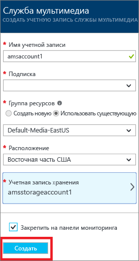
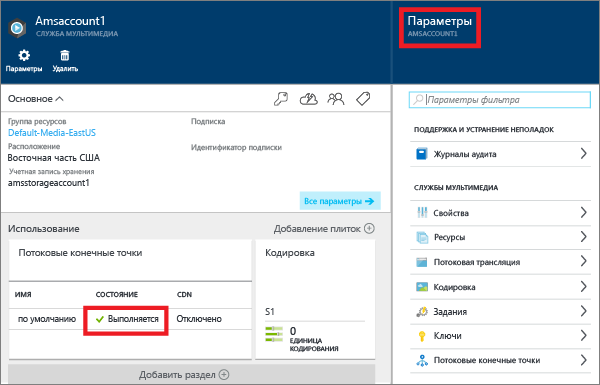
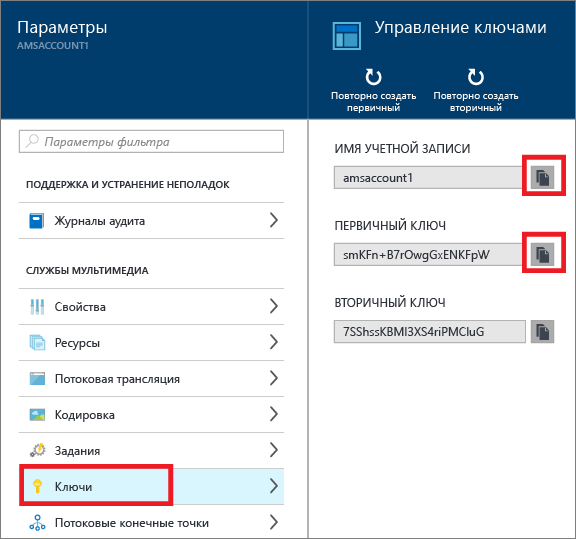

# Создание учетной записи служб мультимедиа Azure с помощью портала Azure
> [!div class="op_single_selector"]
> * [Портал](media-services-portal-create-account.md)
> * [PowerShell](media-services-manage-with-powershell.md)
> * [REST](https://docs.microsoft.com/rest/api/media/mediaservice)
> 
> [!NOTE]
> Для работы с этим учебником требуется учетная запись Azure. Дополнительные сведения см. в разделе [Бесплатная пробная версия Azure](https://azure.microsoft.com/pricing/free-trial/). 
> 
> 

На портале Azure можно быстро создать учетную запись служб мультимедиа Azure (AMS). Эту учетную запись можно использовать для доступа к службам мультимедиа, которые позволяют хранить, шифровать, кодировать мультимедийный контент, управлять им и обеспечивать его потоковую передачу в Azure. При создании учетной записи служб мультимедиа также создается связанная учетная запись хранения (или используется уже существующая) в той же географической области, что и учетная запись служб мультимедиа.

В этой статье объясняются некоторые общие понятия и демонстрируется, как создать учетную запись служб мультимедиа с помощью портала Azure.

## Основные понятия
Для доступа к службам мультимедиа требуется две связанные учетные записи:

* Учетная запись служб мультимедиа. Ваша учетная запись обеспечивает доступ к набору облачных служб мультимедиа, доступных в Azure. Учетная запись служб мультимедиа фактически не хранит мультимедийный контент. Вместо этого в учетной записи хранятся метаданные о мультимедийном контенте и заданиях обработки мультимедиа. При создании учетной записи выберите доступную область служб мультимедиа. Выбранная область является центром обработки данных, который хранит записи метаданных для вашей учетной записи.
  
    В службах мультимедиа (AMS) доступны следующие регионы: Северная Европа, Западная Европа, Запад США, Восток США, Юго-Восточная Азия, Восточная Азия, Западная часть Японии, Восточная часть Японии. Для служб мультимедиа не используются территориальные группы.
  
    Службы AMS теперь доступны в таких центрах обработки данных: южная Бразилия, западная Индия, южная Индия и центральная Индия. Теперь с помощью портала Azure вы можете создавать учетные записи служб мультимедиа и выполнять различные задачи, описанные здесь. Но в этих центрах обработки данных не поддерживается кодирование в реальном времени. Кроме того, в этих центрах обработки данных доступны не все типы зарезервированных единиц кодирования.
  
  * Южная Бразилия: доступны только стандартные и базовые зарезервированные единицы кодирования.
  * Западная Индия, Южная Индия 
* Учетная запись хранения Azure. Учетная запись хранения должна находиться в том же географическом регионе, что и учетная запись служб мультимедиа. При создании учетной записи служб мультимедиа можно выбрать существующую учетную запись хранения в той же области или создать новую учетную запись хранения в той же области. При удалении учетной записи служб мультимедиа, BLOB-объекты в связанной учетной записи хранения не удаляются.

## Создание учетной записи AMS
В этом разделе показано, как создать учетную запись AMS.

1. Войдите на [портал Azure](https://portal.azure.com/).
2. Выберите последовательно **+ Создать** > **Интернет + мобильные устройства** > **Службы мультимедиа**.
   
    
3. В окне **создания учетной записи служб мультимедиа** введите необходимые значения.
   
    
   
   1. Укажите **имя учетной записи**AMS. Имя учетной записи служб мультимедиа может состоять из букв или цифр в нижнем регистре без пробелов и должно иметь длину от 3 до 24 символов.
   2. В поле "Подписка" выберите одну из доступных подписок Azure.
   3. Выберите новую или существующую **группу ресурсов**.  Группа ресурсов — это коллекция ресурсов с одинаковым жизненным циклом, разрешениями и политиками. Дополнительные сведения см. [здесь](../azure-resource-manager/resource-group-overview.md#resource-groups).
   4. В поле **Расположение**выберите географический регион, который будет использоваться для хранения записей мультимедиа и метаданных вашей учетной записи служб мультимедиа. Этот регион будет использоваться для обработки и потоковой передачи мультимедиа. В раскрывающемся списке отображаются только доступные регионы служб мультимедиа. 
   5. Выберите **учетную запись хранения**, чтобы определить хранилище BLOB-объектов для мультимедийного содержимого из учетной записи служб мультимедиа. Можно выбрать существующую учетную запись хранения в географическом регионе, где находится учетная запись служб мультимедиа, или создать учетную запись хранения. Новая учетная запись хранения будет создана в том же регионе. В отношении учетных записей хранения действуют те же правила, что и для учетных записей служб носителей.
      
       Дополнительные сведения о хранилище см. [здесь](../storage/storage-introduction.md).
   6. Установите флажок **Закрепить на панели мониторинга** , чтобы отслеживать развертывание учетной записи.
4. Нажмите кнопку **Создать** в нижней части формы.
   
    Когда учетная запись будет создана, состояние изменится на **Выполняется**. 
   
    
   
    Управлять учетной записью AMS (например, передавать видео, кодировать ресурсы, отслеживать выполнение задания) можно в окне **Параметры** .

## Управление ключами
Для программного доступа к учетной записи служб мультимедиа требуется имя учетной записи и сведения о первичном ключе.

1. На портале Azure выберите свою учетную запись. 
   
    Справа появится окно **Параметры** . 
2. В окне **Параметры** выберите элемент **Ключи**. 
   
    В окне **Управление ключами** отображается имя учетной записи, а также первичные и вторичные ключи. 
3. Нажмите кнопку копирования, чтобы скопировать значения.
   
    

## Дальнейшие действия
Теперь можно отправить файлы в учетную запись AMS. Дополнительные сведения см. в статье [Отправка файлов в учетную запись служб мультимедиа с помощью портала Azure](media-services-portal-upload-files.md).

## Схемы обучения работе со службами мультимедиа
[!INCLUDE [media-services-learning-paths-include](../../includes/media-services-learning-paths-include.md)]

## Отзывы
[!INCLUDE [media-services-user-voice-include](../../includes/media-services-user-voice-include.md)]

<!--HONumber=Nov16_HO5-->

