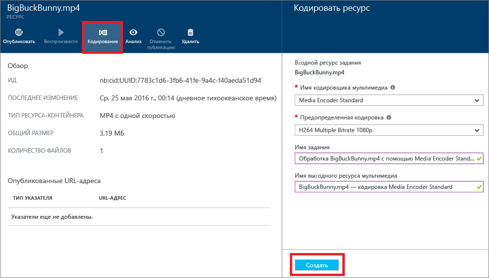

# Кодирование ресурса с помощью кодировщика мультимедиа Standard на портале Azure

> [!NOTE]
> Для работы с этим учебником требуется учетная запись Azure. Дополнительные сведения см. на странице с [бесплатной пробной версией Azure](https://azure.microsoft.com/pricing/free-trial/). 
> 
> 

При работе со службами мультимедиа Azure один из самых частых сценариев — доставка потоковой передачи с переменной скоростью клиентам. Службы мультимедиа поддерживают следующие потоковые передачи с переменной скоростью: Apple HTTP Live Streaming (HLS), Microsoft Smooth Streaming и динамическая адаптивная потоковая передача по HTTP (DASH, также называется MPEG-DASH). Чтобы подготовить видео к потоковой передаче с переменной скоростью, необходимо закодировать исходное видео в файлы с поддержкой разных скоростей. Для кодирования видео можно использовать кодировщика мультимедиа Azure Standard.  

Службы мультимедиа обеспечивают динамическую упаковку. При использовании динамической упаковки можно доставлять MP4-файлы с несколькими скоростями в форматах HLS, Smooth Streaming и MPEG-DASH без распаковки в этих форматах потоковой передачи. Используя динамическую упаковку, можно хранить и оплачивать файлы в одном формате хранения. Службы мультимедиа создают и обрабатывают соответствующий ответ с учетом запроса клиента.

Чтобы воспользоваться преимуществами динамического шифрования, закодируйте исходный файл в набор MP4-файлов с несколькими скоростями. Этапы кодирования описаны далее в этой статье.

Сведения о масштабировании обработки мультимедиа см. в статье [Изменение типа зарезервированных единиц](media-services-portal-scale-media-processing.md).

## Кодировка на портале Azure

Чтобы закодировать содержимое с помощью кодировщика мультимедиа Standard:

1. Создание учетной записи служб мультимедиа Azure с помощью [портала Azure](https://portal.azure.com/).
2. Установите флажок **Параметры** > **Ресурсы-контейнеры**. Выберите ресурс, который требуется закодировать.
3. Нажмите кнопку **Кодировать**.
4. В области **кодирования ресурса** выберите обработчик **Кодировщик мультимедиа Standard** с предустановкой. Дополнительные сведения о предустановках см. в статьях [Использование стандартной версии кодировщика мультимедиа Azure для автоматического создания схемы скоростей](media-services-autogen-bitrate-ladder-with-mes.md) и [Предустановки задач для Media Encoder Standard](media-services-mes-presets-overview.md). Важно выбрать предустановку, которая больше всего подходит для входного видео. Например, если известно, что входное видео имеет разрешение 1920 &#215; 1080 пикселей, можно использовать предустановку **H264 Multiple Bitrate 1080p**. Если у вас видео с низким разрешением (640 &#215; 360), предустановку **H264 Multiple Bitrate 1080p** использовать не следует.
   
   Чтобы упростить управление ресурсами, вы можете изменить имена выходного ресурса и задания.
   
   
5. Нажмите кнопку **Создать**.

## Схемы обучения работе со службами мультимедиа
[!INCLUDE [media-services-learning-paths-include](../../includes/media-services-learning-paths-include.md)]

## Отзывы
[!INCLUDE [media-services-user-voice-include](../../includes/media-services-user-voice-include.md)]

## Дальнейшие действия
* [Отслеживайте ход выполнения задания кодирования](media-services-portal-check-job-progress.md) на портале Azure.  

