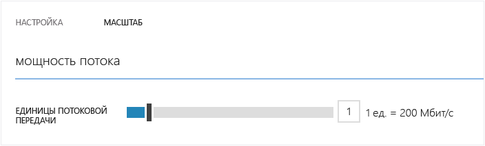
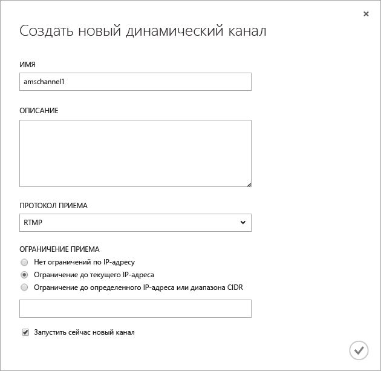
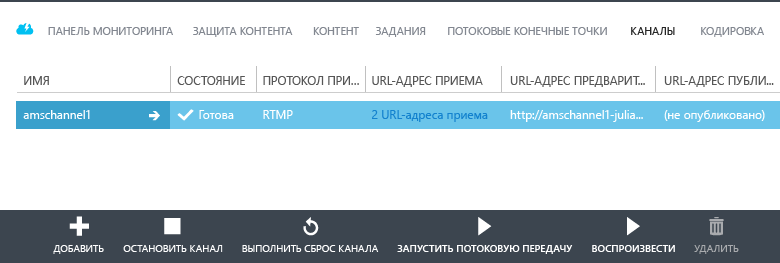
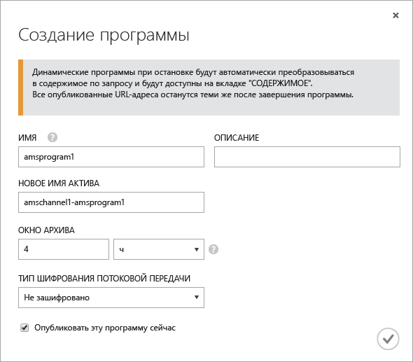
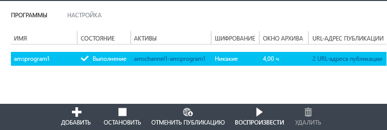
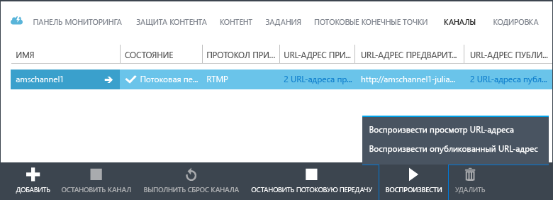
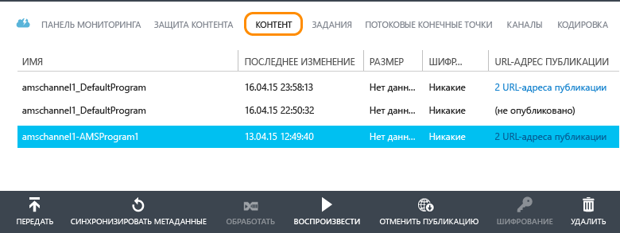

<properties
	pageTitle="Использование портала управления для создания каналов, получающих динамические мультискоростные потоки данных от локальных кодировщиков"
	description="В этом руководстве подробно описываются все этапы создания простого приложения служб мультимедиа для потоковой трансляции, которое реализует канал, принимающий динамический мультискоростной поток данных от локального кодировщика."
	services="media-services"
	documentationCenter=""
	authors="Juliako"
	manager="dwrede"
	editor=""/>

<tags
	ms.service="media-services"
	ms.workload="media"
	ms.tgt_pltfrm="na"
	ms.devlang="ne"
	ms.topic="get-started-article" 
	ms.date="08/11/2015" 
	ms.author="juliako"/>

#Использование портала управления для создания каналов, получающих динамические мультискоростные потоки данных от локальных кодировщиков

[AZURE.INCLUDE [media-services-selector-manage-channels](../../includes/media-services-selector-manage-channels.md)]

В этом руководстве подробно описываются все этапы создания простого приложения служб мультимедиа для потоковой трансляции, которое реализует **канал**, принимающий динамический мультискоростной поток данных от локального кодировщика. Более подробные сведения о работе с каналами и связанными с ними компонентами см. в разделе [Работа с каналами, принимающими динамические многоскоростные потоки от локальных кодировщиков](media-services-manage-channels-overview.md).

В этом руководстве описано выполнение перечисленных ниже задач с помощью портала управления Azure.

2.  Настройка конечных точек потоковой передачи данных
3.  Создание канала
1.  Настройка динамического кодировщика и передача потока данных на вход каналу (для этого используется технология Wirecast)
1.  Создание программы (и ресурса)
1.  Публикация ресурса и получение URL-адресов для потоковой передачи.  
1.  Воспроизведение содержимого
2.  Очистка.

##Предварительные требования
Ниже перечислены необходимые условия для выполнения действий, описанных в этом учебнике.

- Для работы с этим учебником требуется учетная запись Azure. Если ее нет, можно создать бесплатную пробную учетную запись всего за несколько минут. Дополнительные сведения см. в разделе [Бесплатная пробная версия Azure](azure.microsoft.com).
- Учетная запись служб мультимедиа. Инструкции по созданию учетной записи служб мультимедиа см. в разделе [Создание учетной записи](media-services-create-account.md).
- Веб-камера и кодировщик, который передает динамический мультискоростной поток данных.

##Настройка конечной точки потоковой передачи с помощью портала

При работе со службами мультимедиа Azure один из самых частых сценариев — доставка клиентам потоковой передачи с адаптивной скоростью. С помощью потоковой передачи с адаптивным битрейтом клиент может переключаться на потоковую передачу с более высоким или более низким битрейтом, так как видео отображается на основе текущей пропускной способности сети, загрузки ЦП и других факторов. Службы мультимедиа поддерживают следующие технологии потоковой передачи с адаптивной скоростью: потоковая трансляция HTTP (HLS), Smooth Streaming, MPEG DASH и HDS (только для владельцев лицензий Adobe PrimeTime/Access).

При потоковой трансляции локальный динамический кодировщик (в нашем случае это Wirecast) передает мультискоростной поток данных в режиме реального времени на вход каналу. Когда пользователь запрашивает поток, службы мультимедиа перепаковывают исходный поток с использованием технологии динамической упаковки в поток указанного формата с адаптивной скоростью (HLS, DASH или Smooth).

Для использования динамической упаковки потребуется получить по крайней мере одну единицу потоковой передачи для **конечной точки потоковой передачи**, из которой планируется передавать содержимое.

Чтобы изменить число зарезервированных единиц кодирования:

1. Войдите на [Портал управления](https://manage.windowsazure.com/) и щелкните элемент **Службы мультимедиа**. Затем щелкните имя службы мультимедиа.

2. Откройте страницу КОНЕЧНЫЕ ТОЧКИ ПОТОКОВОЙ ПЕРЕДАЧИ. Затем щелкните конечную точку, которую требуется изменить.

3. Чтобы указать число единиц потоковой передачи, перейдите на вкладку МАСШТАБ и переместите ползунок **зарезервированная мощность**.

	

4. Нажмите кнопку СОХРАНИТЬ, чтобы сохранить изменения.

	Выделение новых единиц потоковой передачи занимает около 20 минут.

	>[AZURE.NOTE]В настоящее время переход от любого положительного значения единиц потоковой передачи к нулевому может привести к отключению потоковой передачи на период до одного часа.
	>
	> Для расчета затрат используется наибольшее число единиц, указанных для 24-часового периода. Дополнительные сведения о ценах см. в разделе [Сведения о ценах для служб мультимедиа](http://go.microsoft.com/fwlink/?LinkId=275107).

##Создание канала

На портале управления Azure откройте страницу **КАНАЛ**. Нажмите кнопку **СОЗДАТЬ**. В диалоговом окне **Создание динамического канала** введите имя канала.

Нажмите кнопку **ОК**.

Через несколько минут канал будет создан и запущен.

##Получение URL-адресов приема

После создания канала можно получить URL-адреса приема, которые необходимо передать динамическому кодировщику. Он использует эти адреса для передачи динамического потока на вход.

Дополнительные сведения об URL-адресах приема см. в разделе [Передача мультискоростного динамического потока данных каналу с использованием локальных кодировщиков](../media-services-channels-overview.md).

##Настройка динамического кодировщика и передача потока данных на вход

>[AZURE.NOTE]На этом этапе потребуются URL-адреса приема канала, которые были созданы на предыдущем этапе.

Подробные сведения о настройке Wirecast и запуске потоковой передачи данных на вход см. в разделе [Настройка Wirecast](http://azure.microsoft.com/blog/2014/09/18/azure-media-services-rtmp-support-and-live-encoders/).

>[AZURE.NOTE]Если вы по какой-то причине остановили кодировщик, а затем его потребовалось перезапустить, сначала выполните сброс канала с помощью команды **СБРОС** на портале управления Azure.

##Создание программы и управление ею

###Обзор

Канал связан с программами, с помощью которых вы можете управлять публикацией и хранением сегментов динамического потока. Каналы управляют программами. Связь между каналом и программой очень похожа на аналогичную взаимосвязь в традиционной мультимедийной отрасли, где по определенному каналу транслируется постоянный поток информации, а программа связана с определенным временным промежутком — мероприятием на этом канале.

Задать количество часов, в течение которых следует хранить записанное содержимое программы, можно с помощью параметра длины **окна архивирования**. Для него можно задать значение от 5 минут до 25 часов. Длина окна архивирования также определяет максимальный период, в пределах которого клиенты могут перемещаться назад во времени относительно текущей позиции в передаваемом потоке данных. Программы могут длиться в течение определенного времени, однако содержимое, выходящее за пределы окна указанной длины, теряется. Значение этого свойства также определяет максимальный размер манифестов клиентов.

Каждая программа связана с ресурсом. Чтобы опубликовать программу, необходимо создать указатель OnDemand для соответствующего ресурса. С помощью этого указателя можно сформировать URL-адрес потоковой передачи данных, который предоставляется клиентам.

Канал поддерживает одновременную потоковую трансляцию до трех программ, поэтому можно создавать по несколько архивов одного и того же входящего потока. Благодаря этому можно публиковать и архивировать разные части транслируемого мероприятия. Предположим, например, что, согласно существующим нормативам, необходимо архивировать 6 часов программы, а транслировать только последние 10 минут. Для этого необходимо создать две одновременно работающие программы. Для одной из них настроено архивирование 6 часов транслируемого мероприятия, но без публикации. Для второй программы настроено архивирование 10 минут с публикацией.

Не используйте существующие программы повторно для новых мероприятий. Вместо этого создавайте и запускайте новую программу для каждого мероприятия, как описано в разделе «Программирование приложений потоковой трансляции».

Когда вы будете готовы начать потоковую передачу и архивацию, запустите программу. Чтобы остановить потоковую передачу и архивацию содержимого мероприятия, завершите работу программы.

Чтобы удалить архивированное содержимое, остановите и удалите программу, а затем удалите связанный с ней ресурс. Ресурс невозможно удалить, пока он используется какой-либо программой: сначала нужно удалить ее.

Даже после остановки и удаления программы пользователи смогут запрашивать потоковую передачу архивированного видеосодержимого, пока не удален соответствующий ресурс.

Если вы хотите сохранить архивированное содержимое, но при этом заблокировать возможность его потоковой передачи, удалите указатель.

###Создание, запуск и остановка программ

Настроив передачу потока данных в канал, вы можете начать потоковую передачу мероприятия, создав ресурс, программу и указатель потоковой передачи. В результате вы сможете запустить архивирование потока и предложить его зрителям через конечную точку потоковой передачи.

Запустить мероприятие можно двумя способами.

1. На странице **КАНАЛ** нажмите **ДОБАВИТЬ**, чтобы добавить программу.

	Укажите название программы и ресурса, окно архивирования и параметр кодирования.

	

	Если оставить установленным флажок **Опубликовать эту программу**, для нее будут созданы URL-АДРЕСА ПУБЛИКАЦИИ.

	Когда вы будете готовы к потоковой передаче программы, нажмите **НАЧАТЬ**.

	После запуска программы нажмите «ВОСПРОИЗВЕСТИ», чтобы начать воспроизведение содержимого.

	

2. Кроме того, можно выполнить сразу все операции, нажав кнопку **НАЧАТЬ ПОТОКОВУЮ ПЕРЕДАЧУ** на странице **КАНАЛ**. В результате будут созданы ресурс, программа и указатель потоковой передачи.

	Программе будет присвоено название DefaultProgram, и для нее будет задано окно архивирования длиной в 1 час.

	Начать воспроизведение опубликованной программы можно на странице КАНАЛ.

	

При нажатии кнопки **ОСТАНОВИТЬ ПОТОКОВУЮ ПЕРЕДАЧУ** на странице **КАНАЛ** программа по умолчанию останавливается и удаляется. При этом ресурс останется, и вы можете публиковать его и отменять его публикацию на странице **СОДЕРЖИМОЕ**.

На странице **КОНТЕНТ**можно найти все ресурсы, созданные для ваших программ.

##Воспроизведение содержимого

Чтобы предоставить пользователю URL-адрес, по которому будет осуществляться потоковая передача содержимого, сначала необходимо «опубликовать» ресурс (эта процедура описана в предыдущем разделе), создав указатель (при публикации ресурсов с помощью портала указатели создаются автоматически). Указатели предоставляют доступ к файлам, содержащимся в активе.

В зависимости от того, какой протокол потоковой передачи используется для воспроизведения вашего содержимого, вам может потребоваться изменить URL-адрес, доступный по ссылке **URL-АДРЕС ПУБЛИКАЦИИ** для канала или программы.

Технология динамической упаковки обеспечит упаковку динамического потока данных с использованием указанного протокола.

По умолчанию URL-адрес потоковой передачи создается в указанном ниже формате, и его можно использовать для воспроизведения ресурсов Smooth Streaming.

	{streaming endpoint name-media services account name}.streaming.mediaservices.windows.net/{locator ID}/{filename}.ism/Manifest

Чтобы создать URL-адрес для потоковой передачи в формате HLS, добавьте к исходному адресу строку (format=m3u8-aapl).

	{streaming endpoint name-media services account name}.streaming.mediaservices.windows.net/{locator ID}/{filename}.ism/Manifest(format=m3u8-aapl)

Чтобы создать URL-адрес для потоковой передачи в формате MPEG DASH, добавьте к исходному адресу строку (format=mpd-time-csf).

	{streaming endpoint name-media services account name}.streaming.mediaservices.windows.net/{locator ID}/{filename}.ism/Manifest(format=mpd-time-csf)

Дополнительные сведения о потоковой передаче содержимого см. в разделе [Доставка содержимого](media-services-deliver-content-overview.md).

Для воспроизведения содержимого в формате Smooth Stream можно использовать проигрыватель [AMS Player](http://amsplayer.azurewebsites.net/azuremediaplayer.html), а для просмотра видео в формате HLS версии 3 вы можете воспользоваться устройствами на платформах iOS и Android.

##Очистка

После завершения потоковой передачи мероприятия вы можете удалить выделенные ранее ресурсы с помощью описанной ниже процедуры.

- Остановите трансляцию потока из кодировщика.
- Остановите работу канала. После остановки канала начисление платы прекращается. Если вам понадобится снова запустить его, вы можете воспользоваться тем же URL-адресом приема (перенастраивать кодировщик не потребуется).
- Вы можете остановить конечную точку потоковой передачи, если больше не собираетесь предоставлять доступ к архиву мероприятия в качестве потоковой передачи по требованию. Пока канал остановлен, начисление платы не осуществляется.

<!-- URLs. -->
[Management Portal]: http://manage.windowsazure.com/

<!-- Images -->

<!---HONumber=August15_HO7-->