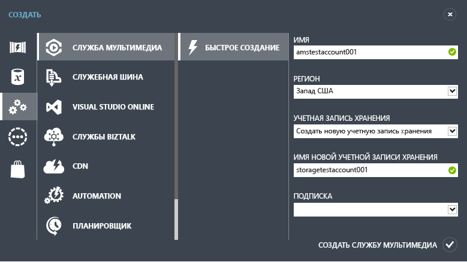

<properties
	pageTitle="Приступая к работе с доставкой содержимого по запросу с помощью классического портала Azure | Microsoft Azure"
	description="В этом руководстве показаны шаги по реализации приложения доставки видео по запросу с помощью служб мультимедиа Azure с использованием классического портала Azure."
	services="media-services"
	documentationCenter=""
	authors="Juliako"
	manager="dwrede"
	editor=""/>

<tags
	ms.service="media-services"
	ms.workload="media"
	ms.tgt_pltfrm="na"
	ms.devlang="na"
	ms.topic="get-started-article"
	ms.date="10/05/2015"
	ms.author="juliako"/>

# Приступая к работе с доставкой содержимого по запросу с помощью классического портала Azure

[AZURE.INCLUDE [media-services-selector-get-started](../../includes/media-services-selector-get-started.md)]

В этом руководстве приведены пошаговые инструкции по реализации базового приложения доставки видео по запросу (VOD) с помощью классического портала Azure.

> [AZURE.NOTE]Для работы с этим учебником требуется учетная запись Azure. Если ее нет, можно создать бесплатную пробную учетную запись всего за несколько минут. Дополнительные сведения см. в разделе <a href="http://www.windowsazure.com/pricing/free-trial/?WT.mc_id=A8A8397B5" target="_blank">Бесплатная пробная версия Azure</a>.

Учебник включает в себя следующие разделы:

1.  Создание учетной записи служб мультимедиа Azure;
2.  Настройка конечной точки потоковой передачи;
1.  Загрузка видеофайла.
1.  Кодирование исходного файла в набор MP4-файлов с адаптивным битрейтом.
1.  Публикация ресурса и получение URL-адресов потоковой передачи и поэтапного скачивания.  
1.  Воспроизведение содержимого.

## Создание учетной записи служб мультимедиа Azure

1. На [классическом портале Azure](https://manage.windowsazure.com/) последовательно выберите **Создать**, **Служба мультимедиа** и **Быстрое создание**.

	

2. В поле **ИМЯ** введите имя новой учетной записи. Имя учетной записи служб мультимедиа может состоять из букв или цифр в нижнем регистре без пробелов и должно иметь длину от 3 до 24 символов.

3. В поле **РЕГИОН** выберите географический регион, который будет использоваться для хранения записей метаданных вашей учетной записи служб мультимедиа. В раскрывающемся списке отображаются только доступные регионы служб мультимедиа.

4. В поле **УЧЕТНАЯ ЗАПИСЬ ХРАНЕНИЯ** выберите учетную запись хранения, которая обеспечит хранилище больших двоичных объектов для мультимедийного контента из учетной записи служб мультимедиа. Можно выбрать существующую учетную запись хранения в географическом регионе, где находится учетная запись служб носителей, или создать новую учетную запись хранения. Новая учетная запись хранения будет создана в том же регионе.

5. Если была создана новая учетная запись хранения, в поле **ИМЯ НОВОЙ УЧЕТНОЙ ЗАПИСИ ХРАНЕНИЯ** введите имя для учетной записи хранения. В отношении учетных записей хранения действуют те же правила, что и для учетных записей служб носителей.

6. Щелкните **Быстрое создание** в нижней части формы.

	Состояние процесса можно контролировать с помощью области сообщений в нижней части окна.

	После успешного создания учетной записи состояние изменится на "Активно".

	В нижней части страницы появится кнопка **УПРАВЛЕНИЕ КЛЮЧАМИ**. При нажатии этой кнопки отобразится диалоговое окно с именем учетной записи служб мультимедиа, а также первичным и вторичным ключами. Для программного доступа к учетной записи служб мультимедиа потребуется имя учетной записи и сведения о первичном ключе.

	

	Если дважды щелкнуть имя учетной записи, по умолчанию откроется страница "Быстрый запуск". Эта страница позволяет выполнять некоторые задачи управления, которые также доступны на других страницах портала. Например, видеофайл можно загрузить как с этой страницы, так и со страницы КОНТЕНТ.

## Настройка конечной точки потоковой передачи с помощью портала

При работе со службами мультимедиа Azure один из самых частых сценариев — доставка потоковой передачи с адаптивным битрейтом клиентам. С помощью потоковой передачи с адаптивным битрейтом клиент может переключаться на потоковую передачу с более высоким или более низким битрейтом, так как видео отображается на основе текущей пропускной способности сети, загрузки ЦП и других факторов. Службы мультимедиа поддерживают следующие технологии потоковой передачи с адаптивной скоростью: потоковая трансляция HTTP (HLS), Smooth Streaming, MPEG DASH и HDS (только для владельцев лицензий Adobe PrimeTime/Access).

Службы мультимедиа обеспечивают динамическую упаковку, которая позволяет доставлять закодированное содержимое MP4-файлов с адаптивным битрейтом или Smooth Streaming в форматах потоковой передачи с поддержкой служб мультимедиа (MPEG DASH, HLS, Smooth Streaming, HDS) без необходимости повторной упаковки в эти форматы потоковой передачи.

Чтобы воспользоваться преимуществом динамической упаковки, необходимо выполнить следующие действия:

- закодировать мезонинный (исходный) файл в набор MP4-файлов с адаптивной скоростью или в набор файлов Smooth Streaming (шаги кодирования показаны далее в этом учебнике);  
- Получите по крайней мере одну единицу потоковой передачи для *конечной точки потоковой передачи*, из которой вы планируете доставлять содержимое.

С динамической упаковкой потребуется хранить и оплачивать файлы только в одном формате хранения, а службы мультимедиа выполнят сборку и будут обслуживать соответствующий ответ на основе запросов клиента.

Чтобы изменить число зарезервированных единиц потоковой передачи, выполните следующие действия:

1. На [классическом портале Azure](https://manage.windowsazure.com/) щелкните **Службы мультимедиа**. Затем щелкните имя службы мультимедиа.

2. Откройте страницу КОНЕЧНЫЕ ТОЧКИ ПОТОКОВОЙ ПЕРЕДАЧИ. Затем щелкните конечную точку, которую требуется изменить.

3. Чтобы указать количество единиц потоковой передачи, перейдите на вкладку **МАСШТАБ** и переместите ползунок **зарезервированная емкость**.

	

4. Нажмите кнопку **СОХРАНИТЬ**, чтобы сохранить изменения.

	Выделение новых единиц потоковой передачи занимает около 20 минут.

	>[AZURE.NOTE]В настоящее время переход от любого положительного значения единиц потоковой передачи к нулевому может привести к отключению потоковой передачи на период до одного часа.
	>
	> Для расчета затрат используется наибольшее число единиц, указанных для 24-часового периода. Дополнительные сведения о ценах см. в разделе [Сведения о ценах для служб мультимедиа](http://go.microsoft.com/fwlink/?LinkId=275107).

## Передача контента

1. На [классическом портале Azure](http://go.microsoft.com/fwlink/?LinkID=256666&clcid=0x409) щелкните **Службы мультимедиа**, а затем выберите имя учетной записи служб мультимедиа.
2. Выберите страницу "КОНТЕНТ".
3. Нажмите кнопку **Передать** на странице или в нижней части портала.
4. В диалоговом окне **Передача содержимого** перейдите к нужному файлу ресурса. Щелкните файл и нажмите кнопку **Открыть** или нажмите клавишу "Ввод".

	![UploadContentDialog][uploadcontent]

5. В диалоговом окне **Передача содержимого** нажмите кнопку с галочкой, чтобы принять значения полей **Файл** и **Название содержимого**.
6. Начнется передача, ход ее выполнения можно отслеживать в нижней части портала.  

	![JobStatus][status]

После завершения загрузки в списке "Контент" появится новый актив. По соглашению в конец имени будет добавлено "**-Источник**" для отслеживания нового контента как источника контента для задач кодирования.

![ContentPage][contentpage]

Если значение размера файла не обновляется после остановки процесса загрузки, нажмите кнопку **Синхронизировать метаданные**. Это синхронизирует размер файла актива с фактическим размером файла в хранилище и обновляет значение на странице "Контент".

## Кодирование контента

### Обзор
Для доставки цифрового видео через Интернет необходимо выполнить сжатие мультимедиа. Службы мультимедиа предоставляют кодировщик мультимедиа, который позволяет указать, как следует кодировать содержимое (например, используемые кодеки, формат файла, разрешение и битрейт).

При работе со службами мультимедиа Azure один из самых частых сценариев — доставка потоковой передачи с адаптивным битрейтом клиентам. С помощью потоковой передачи с адаптивным битрейтом клиент может переключаться на потоковую передачу с более высоким или более низким битрейтом, так как видео отображается на основе текущей пропускной способности сети, загрузки ЦП и других факторов. Службы мультимедиа поддерживают следующие технологии потоковой передачи с адаптивной скоростью: потоковая трансляция HTTP (HLS), Smooth Streaming, MPEG DASH и HDS (только для владельцев лицензий Adobe PrimeTime/Access).

Службы мультимедиа обеспечивают динамическую упаковку, которая позволяет доставлять содержимое, закодированное в форматах MP4 с адаптивным битрейтом или Smooth Streaming, в форматах потоковой передачи, которые поддерживаются службами мультимедиа (MPEG DASH, HLS, Smooth Streaming, HDS) без необходимости повторной упаковки в эти форматы потоковой передачи.

Чтобы воспользоваться преимуществом динамической упаковки, необходимо выполнить следующие действия:

- закодировать мезонинный (исходный) файл в набор MP4-файлов с адаптивной скоростью или в набор файлов Smooth Streaming (шаги кодирования показаны далее в этом учебнике);
- получить по крайней мере одну единицу потоковой передачи по запросу для конечной точки потоковой передачи, из которой планируется доставлять содержимое. Дополнительную информацию см. в разделе [Масштабирование зарезервированных единиц потокового воспроизведения по запросу](media-services-manage-origins.md#scale_streaming_endpoints/).

С динамической упаковкой потребуется хранить и оплачивать файлы только в одном формате хранения, а службы мультимедиа выполнят сборку и будут обслуживать соответствующий ответ на основе запросов клиента.

Обратите внимание, что кроме возможности использовать динамическую упаковку, зарезервированные единицы потокового воспроизведения по запросу обеспечивают выделенную выходную пропускную способность, которую можно приобрести с шагом 200 Мбит/с. По умолчанию потоковое воспроизведение по запросу настроено в модели общего экземпляра, для которой серверные ресурсы (например, вычислительные ресурсы или мощности исходящего трафика) используются совместно с другими пользователями. Чтобы повысить производительность потокового воспроизведения по запросу, рекомендуется приобретать зарезервированные единицы потокового воспроизведения по запросу.

### Кодирование

В этом разделе описаны шаги, которые можно предпринять для кодирования содержимого с помощью кодировщика мультимедиа Azure на классическом портале Azure.

1.  Выберите файл, который следует закодировать. Если кодирование поддерживается для этого типа файла, кнопка **ОБРАБОТАТЬ** в нижней части страницы "СОДЕРЖИМОЕ" будет активна.
4. В диалоговом окне **Обработка** выберите обработчик **Кодировщик мультимедиа Azure**.
5. Выберите одну из **конфигураций кодирования**.

	![Process2][process2]

	В разделе [Предустановленные задачи для кодировщика мультимедиа Azure](https://msdn.microsoft.com/library/azure/dn619392.aspx) описывается значение каждой предустановки в категориях **Предустановки для адаптивной потоковой передачи (динамическая упаковка)**, **Предустановки для поэтапного скачивания**, **Устаревшие предустановки для адаптивной потоковой передачи**.

	**Другие** конфигурации описаны ниже.

	+ **Кодирование с защитой контента PlayReady**. Эта предустановка позволяет получить кодированный актив с защитой содержимого PlayReady.  

		Служба лицензий PlayReady служб мультимедиа включена по умолчанию. Чтобы указать другую службу, из которой клиенты могут получить лицензию на воспроизведение зашифрованного контента PlayReady, используйте API-интерфейсы REST или пакета SDK .NET для служб мультимедиа. Для получения дополнительной информации ознакомьтесь с разделом [Использование статического шифрования для защиты контента]() и установите свойство **licenseAcquisitionUrl** в предустановке Media Encryptor. Также можно использовать динамическое шифрование и установить свойство **PlayReadyLicenseAcquisitionUrl**, как описано в разделе [Использование динамического шифрования PlayReady и службы доставки лицензий](http://go.microsoft.com/fwlink/?LinkId=507720).
	+ **Воспроизведение на ПК и компьютерах "Макинтош" (с помощью Flash или Silverlight)**. Эта предустановка позволяет получить актив с бесперебойной потоковой передачей, который имеет следующие характеристики: стереозвук CBR 44,1 кГц в разрядности 16 бит/сэмпл с кодировкой 96 Кбит/с в AAC, а также видео CBR с разрешением 720 пикселей и 6 скоростями — от 3400 Кбит/с до 400 Кбит/с — с использованием основного профиля H.264 и двумя вторичными группами GOP.
	+ **Воспроизведение в HTML5 (IE/Chrome/Safari)**. Эта предустановка позволяет получить отдельный MP4-файл, который имеет следующие характеристики: стереозвук CBR 44,1 кГц в разрядности 16 бит/сэмпл с кодировкой 128 Кбит/с в AAC, а также видео CBR с разрешением 720 пикселей и скоростью 4500 Кбит/с с использованием основного профиля H.264.
	+ **Воспроизведение на устройствах iOS, ПК и компьютерах "Макинтош"**. Эта предустановка позволяет получить ресурс с теми же характеристиками, что и у ресурса Smooth Streaming (описан выше), но в формате, который может использоваться для доставки потоков Apple HLS на устройства iOS.

5. Затем введите нужное понятное имя выходного содержимого или примите значение по умолчанию. Нажмите кнопку проверки, чтобы начать операцию кодирования, ход выполнения которой можно отслеживать в нижней части портала.
6. Нажмите кнопку **ОК**.

	После выполнения кодирования на странице СОДЕРЖИМОЕ появится закодированный файл.

	Чтобы просмотреть ход задания кодирования, перейдите на страницу **ЗАДАНИЯ**.

	Если значение размера файла не обновляется после завершения кодирования, нажмите кнопку **Синхронизировать метаданные**. Это синхронизирует размер файла выводимого актива с фактическим размером файла в хранилище и обновляет значение на странице "Контент".

## Публикация контента

### Обзор

Чтобы предоставить пользователю URL-ссылку, которую можно использовать для потоковой передачи или скачивания содержимого, сначала необходимо "опубликовать" ресурс, создав указатель. Указатели предоставляют доступ к файлам, содержащимся в активе. Службы мультимедиа поддерживают два типа указателей: указатели на OnDemandOrigin, использующиеся для потоковой передачи служб мультимедиа (например, MPEG DASH, HLS или Smooth Streaming), и указатели на подписанный URL-адрес, использующиеся для скачивания файлов мультимедиа.

При публикации ресурсов на классическом портале Azure создаются указатели, а также предоставляется URL-адрес OnDemand (если ресурс содержит ISM-файл) или URL-адрес SAS.

URL-адрес SAS имеет следующий формат.

	{blob container name}/{asset name}/{file name}/{SAS signature}

URL-адрес потоковой передачи имеет следующий формат, и его можно использовать для воспроизведения ресурсов Smooth Streaming:

	{streaming endpoint name-media services account name}.streaming.mediaservices.windows.net/{locator ID}/{filename}.ism/Manifest

Чтобы создать URL-адрес потоковой передачи HLS, добавьте (format=m3u8-aapl) к URL-адресу.

	{streaming endpoint name-media services account name}.streaming.mediaservices.windows.net/{locator ID}/{filename}.ism/Manifest(format=m3u8-aapl)

Чтобы создать URL-адрес потоковой передачи MPEG DASH, добавьте к URL-адресу (format=mpd-time-csf).

	{streaming endpoint name-media services account name}.streaming.mediaservices.windows.net/{locator ID}/{filename}.ism/Manifest(format=mpd-time-csf)

Указатели имеют срок действия. При использовании портала для публикации ресурсов срок действия создаваемых указателей составляет 100 лет.

>[AZURE.NOTE]Для указателей, созданных до марта 2015 года, срок действия составляет два года.

Чтобы обновить срок действия указателя, используйте [REST API](http://msdn.microsoft.com/library/azure/hh974308.aspx#update_a_locator) или [API .NET](http://go.microsoft.com/fwlink/?LinkID=533259). Обратите внимание, что при обновлении срока действия указателя SAS изменяется URL-адрес.

### Опубликовать

Для публикации ресурса с помощью портала выполните следующие действия.

1. Выберите ресурс.
2. Затем нажмите кнопку "Опубликовать".

 ![PublishedContent][publishedcontent]

## Воспроизведение контента на портале

На классическом портале Azure доступен проигрыватель содержимого, с помощью которого можно проверить видео.

Выберите нужное видео и нажмите кнопку **Воспроизвести** в нижней части портала.

Важные особенности

- Убедитесь, что видео опубликовано.
- **ПРОИГРЫВАТЕЛЬ КОНТЕНТА СЛУЖБ МУЛЬТИМЕДИА** выполняет воспроизведение из конечной точки потоковой передачи по умолчанию. Если требуется воспроизвести из конечной точке потоковой передачи не по умолчанию, используйте другой проигрыватель. Например, [Проигрыватель служб мультимедиа Azure](http://amsplayer.azurewebsites.net/azuremediaplayer.html).

![AMSPlayer][AMSPlayer]

##Дальнейшие действия: схемы обучения работе со службами мультимедиа

[AZURE.INCLUDE [media-services-learning-paths-include](../../includes/media-services-learning-paths-include.md)]

##Отзывы

[AZURE.INCLUDE [media-services-user-voice-include](../../includes/media-services-user-voice-include.md)]

## Не нашли ответа?

Если содержание этого раздела не соответствует вашим ожиданиям или не содержит ответов на ваши вопросы, оставьте отзыв в обсуждении Disqus ниже.

### Дополнительные ресурсы
- <a href="http://channel9.msdn.com/Shows/Azure-Friday/Azure-Media-Services-101-Get-your-video-online-now-">Azure Media Services 101 - Get your video online now! (Службы мультимедиа Azure 101. Передача видео в Интернет)</a>
- <a href="http://channel9.msdn.com/Shows/Azure-Friday/Azure-Media-Services-102-Dynamic-Packaging-and-Mobile-Devices">Azure Media Services 102 - Dynamic Packaging and Mobile Devices (Службы мультимедиа Azure 102. Динамическая упаковка и мобильные устройства)</a>

<!-- Anchors. -->

<!-- URLs. -->
[Azure Classic Portal]: http://manage.windowsazure.com/

<!-- Images -->
[portaloverview]: ./media/media-services-portal-get-started/media-services-content-page.png
[publishedcontent]: ./media/media-services-portal-get-started/media-services-upload-content-published.png
[uploadcontent]: ./media/media-services-portal-get-started/UploadContent.png
[status]: ./media/media-services-portal-get-started/Status.png
[encoder]: ./media/media-services-manage-content/EncoderDialog2.png
[branding]: ./media/branding-reporting.png
[contentpage]: ./media/media-services-portal-get-started/media-services-content-page.png
[process]: ./media/media-services-manage-content/media-services-process-video.png
[process2]: ./media/media-services-portal-get-started/media-services-process-video2.png
[encrypt]: ./media/media-services-manage-content/media-services-encrypt-content.png
[AMSPlayer]: ./media/media-services-portal-get-started/media-services-portal-player.png

<!---HONumber=AcomDC_1203_2015-->