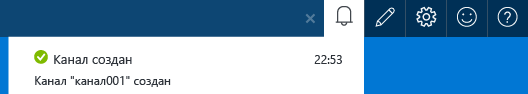
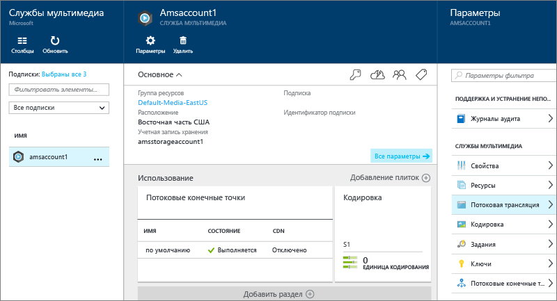
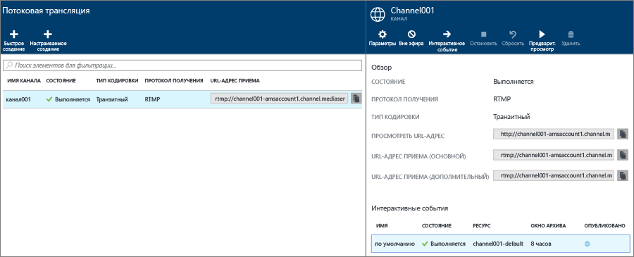
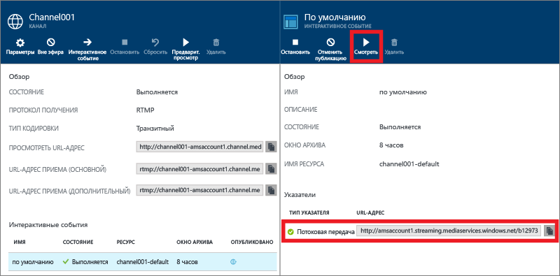
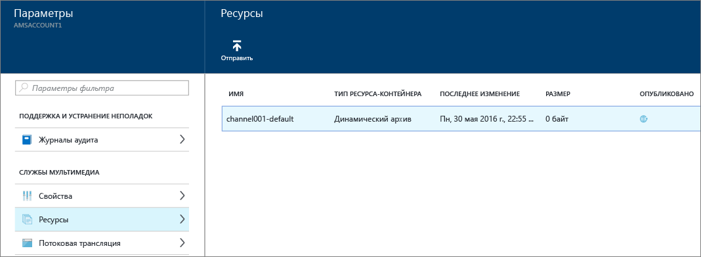

<properties 
	pageTitle="Потоковая трансляция с помощью локальных кодировщиков c использованием портала Azure | Microsoft Azure" 
	description="В этом руководстве рассматривается создание канала, настроенного для сквозной доставки." 
	services="media-services" 
	documentationCenter="" 
	authors="juliako" 
	manager="erikre" 
	editor=""/>

<tags 
	ms.service="media-services" 
	ms.workload="media" 
	ms.tgt_pltfrm="na" 
	ms.devlang="na" 
	ms.topic="get-started-article"
	ms.date="06/22/2016" 
	ms.author="juliako"/>

#Потоковая трансляция с помощью локальных кодировщиков c использованием портала Azure

В этом руководстве рассматривается создание **канала**, настроенного для сквозной доставки, с помощью портала Azure.

В настоящее время доступна предварительная версия службы мультимедиа Azure на портале Azure.

##Предварительные требования

Ниже перечислены необходимые условия для выполнения действий, описанных в этом учебнике.

- Учетная запись Azure. Дополнительные сведения см. в разделе [Бесплатная пробная версия Azure](https://azure.microsoft.com/pricing/free-trial/).
- Учетная запись служб мультимедиа. Инструкции по созданию учетной записи служб мультимедиа см. в разделе [Создание учетной записи служб мультимедиа](media-services-create-account.md).
- Веб-камера, например [кодировщик Telestream Wirecast](http://www.telestream.net/wirecast/overview.htm).

Настоятельно рекомендуется ознакомиться со следующими статьями:

- [Поддержка протокола RTMP службами мультимедиа Azure и динамические кодировщики](https://azure.microsoft.com/blog/2014/09/18/azure-media-services-rtmp-support-and-live-encoders/)
- [Общие сведения о динамической потоковой передаче с использованием служб мультимедиа Azure](media-services-manage-channels-overview.md)
- [Потоковая трансляция с помощью локальных кодировщиков, создающих потоки с разными скоростями](media-services-live-streaming-with-onprem-encoders.md)

##Стандартный сценарий потоковой передачи в режиме реального времени

Далее описаны задачи, связанные с созданием стандартных приложений для потоковой трансляции, которые используют каналы, настроенные для сквозной доставки. В этом руководстве показано, как создавать сквозные каналы и интерактивные события, а также управлять ими.

1. Подключите видеокамеру к компьютеру. Запустите и настройте локальный динамический кодировщик, который выводит поток с разными скоростями RTMP или фрагментированный поток MP4. Дополнительные сведения см. в статье [Поддержка протокола RTMP службами мультимедиа Azure и динамические кодировщики](http://go.microsoft.com/fwlink/?LinkId=532824).
	
	Это действие также можно выполнить после создания канала.

1. Создайте и запустите сквозной канал.
1. Получите URL-адрес приема канала.

	URL-адрес приема используется динамическим кодировщиком для отправки потока в канал.
1. Получите URL-адрес предварительного просмотра канала.

	С его помощью можно убедиться в том, что канал надлежащим образом получает поток.

3. Создайте интерактивное событие или программу.

	Если вы используете портал Azure, при создании интерактивного события также создается ресурс.
	  
	>[AZURE.NOTE]Убедитесь, что есть как минимум одна зарезервированная единица потоковой передачи на конечной точке потоковой передачи, с которой необходимо выполнять потоковую передачу содержимого.
1. Когда вы будете готовы начать потоковую передачу и архивацию, запустите событие или программу.
2. При необходимости динамическому кодировщику можно дать сигнал начать показ рекламы. Реклама вставляется в выходной поток.
1. Чтобы остановить потоковую передачу и архивацию содержимого события, завершите работу события или программы.
1. Удалите событие или программу (и при необходимости ресурс).

>[AZURE.IMPORTANT] Основные понятия и рекомендации, связанные с потоковой трансляцией с помощью локальных кодировщиков и сквозных каналов, см. в статье [Потоковая трансляция с помощью локальных кодировщиков, создающих потоки с разными скоростями](media-services-live-streaming-with-onprem-encoders.md).

##Просмотр уведомлений и сообщений об ошибках

Чтобы просмотреть уведомления и ошибки на портале Azure, щелкните значок уведомления.

##Настройка конечных точек потоковой передачи данных 

Службы мультимедиа обеспечивают динамическую упаковку, которая позволяет доставлять MP4-файлы с поддержкой нескольких скоростей в форматах потоковой передачи (MPEG DASH, HLS, Smooth Streaming, HDS) без необходимости повторной упаковки в эти форматы потоковой передачи. С динамической упаковкой потребуется хранить и оплачивать файлы только в одном формате хранения, а службы мультимедиа выполнят сборку и будут обслуживать соответствующий ответ на основе запросов клиента.

Для использования динамической упаковки потребуется получить по крайней мере одну единицу потоковой передачи для конечной точки потоковой передачи, из которой планируется передавать содержимое.

Чтобы создать зарезервированные единицы потоковой передачи и изменить их число, сделайте следующее:

1. В окне **Параметры** щелкните **Потоковые конечные точки**.

2. Щелкните конечную точку потоковой передачи по умолчанию.

	Появится окно **DEFAULT STREAMING ENDPOINT DETAILS** (СВЕДЕНИЯ О ПОТОКОВОЙ КОНЕЧНОЙ ТОЧКЕ ПО УМОЛЧАНИЮ).

3. Чтобы указать число единиц потоковой передачи, передвиньте ползунок **Единицы потоковой передачи**.

	

4. Нажмите кнопку **Сохранить**, чтобы сохранить изменения.

	>[AZURE.NOTE]Выделение новых единиц потоковой передачи может занять до 20 минут.
	
##Создание и запуск сквозных каналов и событий

Канал связан с событиями и программами, с помощью которых вы можете управлять публикацией и хранением сегментов динамического потока. Каналы управляют событиями.
	
Задать количество часов, в течение которых следует хранить записанное содержимое программы, можно с помощью параметра длины **окна архивирования**. Для него можно задать значение от 5 минут до 25 часов. Длина окна архивирования также определяет максимальный период, в пределах которого клиенты могут перемещаться назад во времени относительно текущей позиции в передаваемом потоке данных. События могут происходить в течение определенного времени, однако содержимое, выходящее за пределы этого периода, теряется. Значение этого свойства также определяет максимальный размер манифестов клиентов.

Каждое событие связано с ресурсом. Чтобы опубликовать событие, необходимо создать указатель OnDemand для соответствующего ресурса. Наличие этого указателя позволит создать URL-адрес потоковой передачи, который можно предоставить клиентам.

Канал поддерживает одновременную потоковую трансляцию максимум трех событий, поэтому можно создавать по несколько архивов одного и того же входящего потока. Благодаря этому можно публиковать и архивировать разные части транслируемого мероприятия. Например ваш бизнес-требование — архивировать 6 часов программы, но для передачи только оставить последние 10 минут. Для этого необходимо создать две одновременно работающие программы. Для одной из них настроено архивирование 6 часов транслируемого мероприятия, но без публикации. Для второй программы настроено архивирование 10 минут с публикацией.

Не следует использовать имеющиеся интерактивные события повторно. Вместо этого создайте и запустите новое событие для каждого события.

Когда вы будете готовы начать потоковую передачу и архивацию, запустите событие. Чтобы остановить потоковую передачу и архивацию содержимого мероприятия, завершите работу программы.

Чтобы удалить архивированное содержимое, остановите и удалите событие, а затем удалите связанный с ним ресурс. Ресурс невозможно удалить, пока он используется каким-либо событием: сначала нужно удалить это событие.

Даже после остановки и удаления события пользователи смогут запрашивать потоковую передачу архивированного видеосодержимого, пока не удален соответствующий ресурс.

Если вы хотите сохранить заархивированное содержимое, но при этом заблокировать возможность его потоковой передачи, удалите указатель.

###Создание канала с помощью портала 

В этом разделе показано, как использовать функцию **Быстрое создание** для создания сквозного канала.

Дополнительные сведения об этих каналах см. в статье [Потоковая трансляция с помощью локальных кодировщиков, создающих потоки с разными скоростями](media-services-live-streaming-with-onprem-encoders.md).

1. В окне **Параметры** щелкните **Live streaming** (Потоковая трансляция).

	
	
	Появится окно **Live streaming** (Потоковая трансляция).

3. Щелкните **Быстрое создание**, чтобы создать сквозной канал с протоколом приема RTMP.

	Появится окно **CREATE A NEW CHANNEL** (СОЗДАНИЕ КАНАЛА).
4. Присвойте имя новому каналу и нажмите кнопку **Создать**.

	Таким образом будет создан сквозной канал с протоколом приема RTMP.

	Кроме того, канал добавляет, запускает и публикует интерактивную программу или интерактивное событие по умолчанию. Для этого события настроено окно архивирования продолжительностью 8 часов.

	Чтобы добавить дополнительные события, нажмите кнопку **Интерактивное событие**.

##Получение URL-адресов приема

После создания канала можно получить URL-адреса приема, которые необходимо передать динамическому кодировщику. Он использует эти адреса для передачи динамического потока на вход.

##Просмотр событий

Чтобы просмотреть событие, щелкните **Посмотреть** на портале Azure или скопируйте URL-адрес потоковой передачи и используйте проигрыватель по своему усмотрению.
 

После остановки интерактивное событие автоматически преобразуется в событие по требованию.

##Очистка

Дополнительные сведения об этих каналах см. в статье [Потоковая трансляция с помощью локальных кодировщиков, создающих потоки с разными скоростями](media-services-live-streaming-with-onprem-encoders.md).

- Канал можно остановить, только если все передаваемые по нему события и программы остановлены. После остановки канала начисление платы прекращается. Если вам понадобится снова запустить его, вы можете воспользоваться тем же URL-адресом приема (перенастраивать кодировщик не потребуется).
- Канал можно удалить, только если все передаваемые по нему интерактивные события удалены.

##Просмотр архивного содержимого

Даже после остановки и удаления события пользователи смогут запрашивать потоковую передачу архивированного видеосодержимого, пока не удален соответствующий ресурс. Ресурс невозможно удалить, пока он используется каким-либо событием: сначала нужно удалить это событие.

Для управления ресурсами выберите элемент **Параметры** и щелкните **Ресурсы**.

##Схемы обучения работе со службами мультимедиа

[AZURE.INCLUDE [media-services-learning-paths-include](../../includes/media-services-learning-paths-include.md)]

##Отзывы

[AZURE.INCLUDE [media-services-user-voice-include](../../includes/media-services-user-voice-include.md)]

<!----HONumber=AcomDC_0629_2016-->