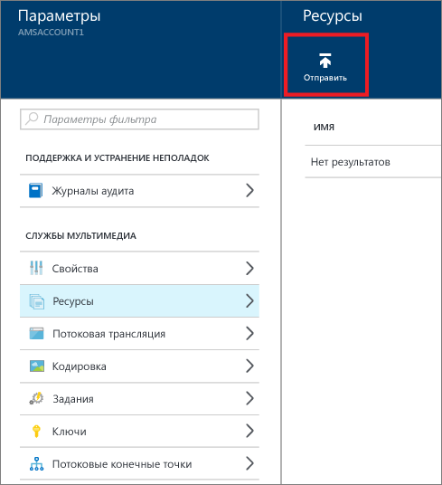
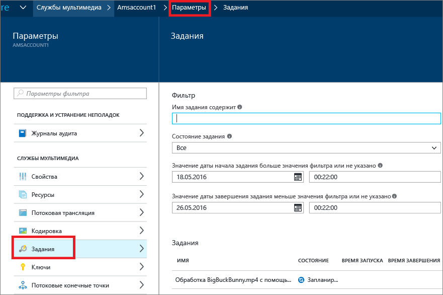
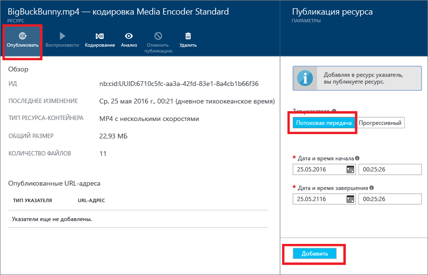
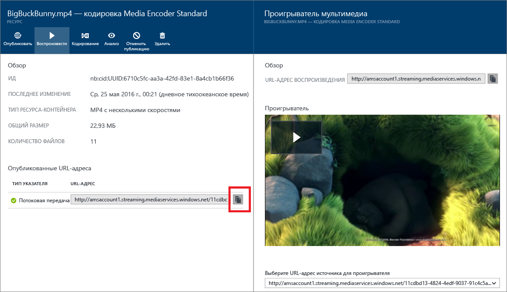

# Приступая к работе с доставкой содержимого по запросу с помощью портала Azure
[!INCLUDE [media-services-selector-get-started](../../includes/media-services-selector-get-started.md)]

В этом руководстве описано, как реализовать простую службу доставки видео по запросу (VOD) с помощью приложения служб мультимедиа Azure (AMS) и портала Azure.

## Предварительные требования
Ниже перечислены необходимые условия для выполнения действий, описанных в этом учебнике.

* Учетная запись Azure. Дополнительные сведения см. в разделе [Бесплатная пробная версия Azure](https://azure.microsoft.com/pricing/free-trial/). 
* Учетная запись служб мультимедиа. Инструкции по созданию учетной записи служб мультимедиа см. в статье [Создание учетной записи служб мультимедиа Azure с помощью портала Azure](media-services-portal-create-account.md).

Учебник включает в себя следующие разделы:

1. Запуск конечной точки потоковой передачи.
2. Загрузка видеофайла.
3. Кодирование исходного файла в набор MP4-файлов с адаптивным битрейтом.
4. Публикация ресурса и получение URL-адресов потоковой передачи и поэтапного скачивания.  
5. Воспроизведение содержимого.

## Запуск конечной точки потоковой передачи 

При работе со службами мультимедиа Azure один из самых частых сценариев — потоковая передача видео с переменной скоростью. Службы мультимедиа обеспечивают динамическую упаковку, которая позволяет своевременно доставлять закодированное содержимое MP4-файлов с переменной скоростью в форматах потоковой передачи, которые поддерживаются службами мультимедиа (MPEG DASH, HLS, Smooth Streaming), без необходимости хранения предварительно упакованных версий каждого из этих форматов потоковой передачи.

>[!NOTE]
>При создании учетной записи AMS в нее добавляется конечная точка потоковой передачи **по умолчанию** в состоянии **Остановлена**. Чтобы начать потоковую передачу содержимого и воспользоваться динамической упаковкой и динамическим шифрованием, конечная точка потоковой передачи, из которой необходимо выполнять потоковую передачу содержимого, должна находиться в состоянии **Выполняется**. 

Чтобы запустить конечную точку потоковой передачи, сделайте следующее:

1. Войдите на [портал Azure](https://portal.azure.com/).
2. В окне "Параметры" щелкните элемент "Потоковые конечные точки". 
3. Щелкните конечную точку потоковой передачи по умолчанию. 

    Появится окно сведений о конечной точке потоковой передачи по умолчанию.

4. Щелкните значок "Пуск".
5. Нажмите кнопку "Сохранить", чтобы сохранить изменения.

## Отправка файлов
Для потоковой передачи видео с помощью служб мультимедиа Azure необходимо передать и закодировать исходные видео с использованием нескольких скоростей, а затем опубликовать результат. В этом разделе описан первый шаг. 

1. В окне **Параметры** щелкните **Ресурсы**.
   
    
2. Нажмите кнопку **Отправить** .
   
    Появится окно **загрузки видеоресурса** .
   
   > [!NOTE]
   > Размер файлов неограничен.
   > 
   > 
3. Найдите нужное видео на компьютере, выберите его и нажмите кнопку "ОК".  
   
    Начнется передача. За ходом загрузки можно наблюдать под именем файла.  

По завершении загрузки в окне **Ресурсы-контейнеры** появится новый элемент. 

## Кодирование ресурсов
При работе со службами мультимедиа Azure один из самых частых сценариев — доставка потоковой передачи с адаптивным битрейтом клиентам. Службы мультимедиа поддерживают следующие технологии потоковой передачи с переменной скоростью: HTTP Live Streaming (HLS), Smooth Streaming и MPEG DASH. Чтобы подготовить видео к потоковой передаче с переменной скоростью, необходимо закодировать исходное видео в файлы с поддержкой разных скоростей. Для кодирования этого видео следует использовать **Media Encoder Standard** .  

Службы мультимедиа также обеспечивают динамическую упаковку, которая позволяет доставлять MP4-файлы с поддержкой нескольких скоростей в форматах потоковой передачи (MPEG DASH, HLS, Smooth Streaming) без необходимости повторной упаковки в эти форматы потоковой передачи. Благодаря динамической упаковке вы оплачиваете хранение файлов только в одном формате, так как службы мультимедиа автоматически подготавливают и передают содержимое в нужном формате, исходя из полученных от клиента запросов.

Чтобы воспользоваться динамической упаковкой, закодируйте исходный файл в набор MP4-файлов с поддержкой нескольких скоростей (шаги кодирования показаны далее в этом руководстве).

### Кодирование с помощью портала
В этом разделе описаны шаги, которые можно предпринять для кодирования содержимого с помощью стандартного кодировщика служб мультимедиа.

1. В окне **Параметры** выберите элемент **Ресурсы**.  
2. В окне **Ресурсы-контейнеры** выберите ресурс, который требуется закодировать.
3. Нажмите кнопку **Кодировать** .
4. В окне**кодирования ресурса** выберите обработчик Media Encoder Standard с предустановкой. Например, если известно, что исходное видео имеет разрешение 1920 x 1080 пикселей, можно использовать предустановку "H264 Multiple Bitrate 1080p". Дополнительные сведения о предустановках см. [здесь](media-services-mes-presets-overview.md). Важно выбрать предустановку в соответствии с параметрами исходного видео. Если у вас есть видео с низким разрешением (640 x 360), не следует использовать предустановку по умолчанию ("H264 Multiple Bitrate 1080p").
   
   Для упрощения управления предусмотрена возможность изменения имени выходного ресурса и задания.
   
   
5. Нажмите кнопку **Создать**.

### Мониторинг хода выполнения задания кодирования
Чтобы отслеживать выполнение задания кодирования, в верхней части страницы щелкните элемент **Параметры**, а затем выберите пункт **Задания**.

## Публикация контента
Чтобы предоставить пользователю URL-ссылку, которую можно использовать для потоковой передачи или скачивания содержимого, сначала необходимо "опубликовать" ресурс, создав указатель. Указатели предоставляют доступ к файлам, содержащимся в активе. Службы мультимедиа поддерживают два типа указателей: 

* Указатели потоковой передачи (OnDemandOrigin), используемые для потоковой передачи с переменной скоростью (например, для потоковой передачи в форматах MPEG DASH, HLS или Smooth Streaming). Чтобы создать указатель потоковой передачи, ресурс должен содержать ISM-файл. 
* Последовательные указатели (SAS), используемые для доставки видео путем последовательного скачивания.

URL-адрес потоковой передачи имеет следующий формат, и его можно использовать для воспроизведения ресурсов Smooth Streaming:

    {streaming endpoint name-media services account name}.streaming.mediaservices.windows.net/{locator ID}/{filename}.ism/Manifest

Чтобы создать URL-адрес потоковой передачи HLS, добавьте (format=m3u8-aapl) к URL-адресу.

    {streaming endpoint name-media services account name}.streaming.mediaservices.windows.net/{locator ID}/{filename}.ism/Manifest(format=m3u8-aapl)

Чтобы создать URL-адрес для потоковой передачи в формате MPEG DASH, добавьте к исходному адресу строку (format=mpd-time-csf).

    {streaming endpoint name-media services account name}.streaming.mediaservices.windows.net/{locator ID}/{filename}.ism/Manifest(format=mpd-time-csf)

URL-адрес SAS имеет следующий формат.

    {blob container name}/{asset name}/{file name}/{SAS signature}

> [!NOTE]
> Для указателей, созданных до марта 2015 года, срок действия составляет два года.  
> 
> 

Чтобы обновить срок действия указателя, используйте [REST API](https://docs.microsoft.com/rest/api/media/operations/locator#update_a_locator) или [.NET API](http://go.microsoft.com/fwlink/?LinkID=533259). При обновлении срока действия указателя SAS URL-адрес изменяется.

### Публикация ресурса с помощью портала
Для публикации ресурса с помощью портала выполните следующие действия.

1. Установите флажок **Параметры** > **Ресурсы-контейнеры**.
2. Выберите ресурс, который требуется опубликовать.
3. Нажмите кнопку **Опубликовать** .
4. Выберите тип указателя.
5. Нажмите кнопку **Добавить**.
   
    

URL-адрес будет добавлен в список **опубликованных URL-адресов**.

## Воспроизведение контента на портале
Портал Azure предлагает проигрыватель содержимого, с помощью которого можно проверить видео.

Выберите нужное видео и нажмите кнопку **Воспроизвести** .

Важные особенности

* Убедитесь, что видео опубликовано.
* Этот **проигрыватель мультимедиа** воспроизводит содержимое из конечной точки потоковой передачи по умолчанию. Если требуется воспроизвести из конечной точки потоковой передачи не по умолчанию, щелкните, чтобы скопировать URL-адрес, и используйте другой проигрыватель. Например, [Проигрыватель служб мультимедиа Azure](http://amsplayer.azurewebsites.net/azuremediaplayer.html).

## Дальнейшие действия
Просмотрите схемы обучения работе со службами мультимедиа.

[!INCLUDE [media-services-learning-paths-include](../../includes/media-services-learning-paths-include.md)]

## Отзывы
[!INCLUDE [media-services-user-voice-include](../../includes/media-services-user-voice-include.md)]

<!--HONumber=Jan17_HO4-->

