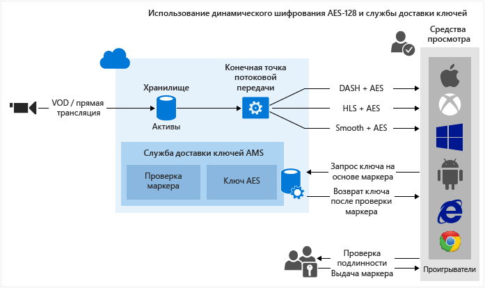

<properties
	pageTitle="Использование динамического шифрования AES-128 и службы доставки ключей | Microsoft Azure"
	description="Службы мультимедиа Microsoft Azure позволяют доставлять содержимое, зашифрованное с помощью 128-битных ключей шифрования AES. Они также включают в себя службу доставки ключей, которая доставляет ключи шифрования авторизованным пользователям. В этой статье показано, как динамически шифровать содержимое с помощью алгоритма AES-128 и службы доставки ключей."
	services="media-services"
	documentationCenter=""
	authors="Juliako"
	manager="erikre"
	editor=""/>

<tags
	ms.service="media-services"
	ms.workload="media"
	ms.tgt_pltfrm="na"
	ms.devlang="na"
	ms.topic="article" 
	ms.date="09/19/2016"
	ms.author="juliako"/>

#Использование динамического шифрования AES-128 и службы доставки ключей

> [AZURE.SELECTOR]
- [.NET](media-services-protect-with-aes128.md)
- [Java](https://github.com/southworkscom/azure-sdk-for-media-services-java-samples)
- [PHP](https://github.com/Azure/azure-sdk-for-php/tree/master/examples/MediaServices)

##Обзор

Службы мультимедиа Microsoft Azure позволяют доставлять по каналам HLS и Smooth Streaming содержимое, зашифрованное с помощью AES (с использованием 128-битных ключей шифрования). Они также включают в себя службу доставки ключей, которая доставляет ключи шифрования авторизованным пользователям. Если вам нужно, чтобы службы мультимедиа зашифровали ресурс-контейнер, свяжите с ним ключ шифрования и настройте политики авторизации для ключа. Когда поток запрашивается проигрывателем, службы мультимедиа используют указанный ключ для динамического шифрования содержимого с помощью AES. Чтобы расшифровать поток, проигрыватель запросит ключ у службы доставки ключей. Чтобы определить, есть ли у пользователя право на получение ключа, служба оценивает политики авторизации, заданные для ключа.

Службы мультимедиа поддерживают несколько способов аутентификации пользователей, которые запрашивают ключи. Для политики авторизации ключа содержимого можно задать одно или несколько из ограничений авторизации: открытая авторизация или с ограничением по маркеру. При ограничении по маркеру к политике должен прилагаться маркер, выданный службой маркеров безопасности (STS). Службы мультимедиа поддерживают маркеры в формате [простого веб-маркера](https://msdn.microsoft.com/library/gg185950.aspx#BKMK_2) (SWT) и [веб-маркера JSON](https://msdn.microsoft.com/library/gg185950.aspx#BKMK_3) (JWT). Дополнительную информацию см. в разделе [Настройка политики авторизации ключа содержимого](media-services-protect-with-aes128.md#configure_key_auth_policy).

Чтобы воспользоваться преимуществами динамического шифрования, необходимо иметь ресурс-контейнер, содержащий набор многоскоростных MP4-файлов или многоскоростных исходных файлов Smooth Streaming. Вам также потребуется настроить политику доставки для ресурса-контейнера (описывается далее в этой статье). В зависимости от формата, указанного в URL-адресе потоковой передачи, сервер потокового воспроизведения по запросу обеспечивает доставку содержимого по выбранному протоколу. В результате вы сможете хранить и оплачивать файлы только в одном формате, а службы мультимедиа выполнят сборку и будут обслуживать соответствующий ответ на основе запросов клиента.

Эта статья будет полезна разработчикам приложений, которые доставляют защищенные файлы мультимедиа. В ней показано, как настроить политики авторизации для службы доставки ключей, чтобы только авторизованные клиенты могли получать ключи шифрования, а также рассматривается использование динамического шифрования.

>[AZURE.NOTE]Чтобы приступить к работе с динамическим шифрованием, необходимо сначала получить хотя бы одну единицу масштабирования (единицу потоковой передачи). Дополнительную информацию см. в разделе [Масштабирование службы мультимедиа](media-services-portal-manage-streaming-endpoints.md).

##Рабочий процесс динамического шифрования AES-128 и службы доставки ключей

Ниже описаны общие действия, которые необходимо выполнить для шифрования ресурсов-контейнеров с помощью AES, используя службу доставки ключей служб мультимедиа и динамическое шифрование.

1. [Создание ресурса-контейнера и отправка в него файлов](media-services-protect-with-aes128.md#create_asset).
1. [Кодирование ресурса-контейнера с файлами в набор MP4-файлов с переменной скоростью](media-services-protect-with-aes128.md#encode_asset).
1. [Создание ключа содержимого и связывание его с закодированным ресурсом-контейнером](media-services-protect-with-aes128.md#create_contentkey). В службах мультимедиа ключ содержимого содержит ключ шифрования ресурса-контейнера.
1. [Настройка политики авторизации для ключа содержимого](media-services-protect-with-aes128.md#configure_key_auth_policy). Чтобы получить ключ содержимого, клиент должен соответствовать заданной для этого ключа политике авторизации.
1. [Настройте политику доставки для ресурса-контейнера](media-services-protect-with-aes128.md#configure_asset_delivery_policy). Конфигурация политики доставки включает: URL-адрес для получения ключа и вектор инициализации (IV) (при использовании AES 128 необходимо указывать один и тот же вектор инициализации для шифрования и расшифровки), протокол доставки (например, MPEG-DASH, HLS, HDS, Smooth Streaming или все перечисленные) и тип динамического шифрования (например, конвертное или без динамического шифрования).

К разным протоколам можно применять разные политики в отношении одного и того же ресурса-контейнера. Например, вы можете применить шифрование PlayReady при использовании Smooth или DASH и конвертное шифрование AES при использовании HLS. Потоковая передача по тем протоколам, которые не определены в политике доставки (например, если вы добавили одну политику, которая предусматривает использование только протокола HLS), будет блокироваться. Исключением являются те случаи, когда политика доставки ресурсов совсем не определена. Тогда все протоколы могут использоваться в незашифрованном виде.

1. [ Создайте указатель OnDemand](media-services-protect-with-aes128.md#create_locator), чтобы получить URL-адрес для потоковой передачи.

В этой статье также показано, [как клиентское приложение может запрашивать ключ у службы доставки ключей](media-services-protect-with-aes128.md#client_request).

В конце раздела вы найдете полный [пример](media-services-protect-with-aes128.md#example) для .NET.

На следующем изображении показан описанный выше рабочий процесс. В данном случае для проверки подлинности используется маркер.

Далее приводятся подробные объяснения, примеры кода и ссылки на статьи с инструкциями для выполнения описанных выше задач.

##Текущие ограничения

При добавлении или обновлении политики доставки ресурсов необходимо удалить существующий указатель (если он есть) и создать новый.

##Создание ресурса-контейнера и отправка в него файлов

Для кодирования и потоковой передачи видео, а также управления ими необходимо сначала отправить содержимое в службы мультимедиа Microsoft Azure. Оно будет сохранено в безопасном облачном хранилище для последующей обработки и потоковой передачи.

Дополнительные сведения см. в разделе [Передача файлов в учетную запись служб мультимедиа](media-services-dotnet-upload-files.md).

##Закодируйте ресурс-контейнер с файлами в набор MP4-файлов с переменной скоростью.

При использовании динамического шифрования вам достаточно создать ресурс-контейнер, содержащий набор многоскоростных MP4-файлов или многоскоростных исходных файлов Smooth Streaming. Затем с учетом формата, указанного в манифесте или запросе фрагмента, сервер потоковой передачи по запросу организует передачу содержимого по выбранному протоколу. В результате вы сможете хранить и оплачивать файлы только в одном формате, а службы мультимедиа выполнят сборку и будут обслуживать соответствующий ответ на основе запросов клиента. Дополнительные сведения см. в статье [Динамическая упаковка](media-services-dynamic-packaging-overview.md).

Инструкции по выполнению шифрования см. в статье [Порядок кодирования ресурса с использованием стандартного кодировщика мультимедиа](media-services-dotnet-encode-with-media-encoder-standard.md).

##Создание ключа содержимого и связывание его с закодированным ресурсом-контейнером

В службах мультимедиа ключ содержимого содержит ключ, который используется для шифрования ресурса-контейнера.

Дополнительные сведения см. в статье [Создание ContentKey с использованием .NET](media-services-dotnet-create-contentkey.md).

##Настройка политики авторизации ключа содержимого

Службы мультимедиа поддерживают несколько способов аутентификации пользователей, которые запрашивают ключи. Чтобы получить ключ содержимого, клиент (проигрыватель) должен соответствовать заданной для этого ключа политике авторизации. Для политики авторизации ключа содержимого можно задать одно или несколько из ограничений авторизации: открытая авторизация, с ограничением по маркеру или с ограничением по IP-адресу.

Подробную информацию см. в разделе [Динамическое шифрование. Настройка политики авторизации ключа содержимого](media-services-dotnet-configure-content-key-auth-policy.md).

##Настройка политики доставки для ресурса-контейнера 

Настройте политику доставки для ресурса-контейнера. Вот некоторые элементы, входящие в конфигурацию политики доставки:

- URL-адрес для получения ключа.
- Вектор инициализации, используемый для конвертного шифрования. При использовании AES 128 для шифрования и расшифровки необходимо указывать один и тот же вектор инициализации.
- Протокол доставки ресурсов-контейнеров (например, MPEG-DASH, HLS, HDS, Smooth Streaming или все перечисленные).
- Тип динамического шифрования (например, конвертное шифрование с помощью AES), если оно используется.

Дополнительные сведения см. в разделе [Настройка политик доставки ресурсов](media-services-rest-configure-asset-delivery-policy.md).

##Создание указателя потоковой передачи по запросу для получения URL-адреса для потоковой передачи

При использовании протоколов Smooth, DASH или HLS вам потребуется предоставить пользователю URL-адрес для потоковой передачи.

>[AZURE.NOTE]При добавлении или обновлении политики доставки ресурсов необходимо удалить существующий указатель (если он есть) и создать новый.

Указания по публикации ресурса и созданию URL-адреса потоковой передачи см. в статье [Создание URL-адреса потоковой передачи](media-services-deliver-streaming-content.md).

##Получение маркера тестирования

Получите маркер тестирования в зависимости от ограничения по маркеру, заданного в политике авторизации ключа.

	// Deserializes a string containing an Xml representation of a TokenRestrictionTemplate
	// back into a TokenRestrictionTemplate class instance.
	TokenRestrictionTemplate tokenTemplate = 
	    TokenRestrictionTemplateSerializer.Deserialize(tokenTemplateString);
	
	// Generate a test token based on the data in the given TokenRestrictionTemplate.
	//The GenerateTestToken method returns the token without the word “Bearer” in front
	//so you have to add it in front of the token string. 
	string testToken = TokenRestrictionTemplateSerializer.GenerateTestToken(tokenTemplate);
	Console.WriteLine("The authorization token is:\nBearer {0}", testToken);

Для проверки потока можно использовать [проигрыватель AMS](http://amsplayer.azurewebsites.net/azuremediaplayer.html).

##Отправка запроса клиента на получение ключа в службе доставки ключей

На предыдущем этапе вы создали URL-адрес, указывающий на файл манифеста. Клиент должен извлечь необходимые сведения из файлов манифеста потоковой передачи и отправить запрос в службу доставки ключей.

###Файлы манифестов

Клиенту необходимо извлечь из файла манифеста значение URL-адреса (который также содержит идентификатор ключа содержимого (KID)). Затем клиент попытается получить ключ шифрования в службе доставки ключей. Клиенту также потребуется извлечь значение вектора инициализации и использовать его для расшифровки потока. В следующем фрагменте кода показан элемент <Protection> манифеста Smooth Streaming.

	<Protection>
	  <ProtectionHeader SystemID="B47B251A-2409-4B42-958E-08DBAE7B4EE9">
	    <ContentProtection xmlns:sea="urn:mpeg:dash:schema:sea:2012" schemeIdUri="urn:mpeg:dash:sea:2012">
	      <sea:SegmentEncryption schemeIdUri="urn:mpeg:dash:sea:aes128-cbc:2013"/>
	      <sea:KeySystem keySystemUri="urn:mpeg:dash:sea:keysys:http:2013"/>
	      <sea:CryptoPeriod IV="0xD7D7D7D7D7D7D7D7D7D7D7D7D7D7D7D7" 
	                        keyUriTemplate="https://wamsbayclus001kd-hs.cloudapp.net/HlsHandler.ashx?
	                                        kid=da3813af-55e6-48e7-aa9f-a4d6031f7b4d"/>
	    </ContentProtection>
	  </ProtectionHeader>
	</Protection>

При использовании протокола HLS корневой манифест разбивается на файлы сегментов.

Например, корневой манифест http://test001.origin.mediaservices.windows.net/8bfe7d6f-34e3-4d1a-b289-3e48a8762490/BigBuckBunny.ism/manifest(format=m3u8-aapl) содержит список имен файлов сегментов.
	
	. . . 
	#EXT-X-STREAM-INF:PROGRAM-ID=1,BANDWIDTH=630133,RESOLUTION=424x240,CODECS="avc1.4d4015,mp4a.40.2",AUDIO="audio"
	QualityLevels(514369)/Manifest(video,format=m3u8-aapl)
	#EXT-X-STREAM-INF:PROGRAM-ID=1,BANDWIDTH=965441,RESOLUTION=636x356,CODECS="avc1.4d401e,mp4a.40.2",AUDIO="audio"
	QualityLevels(842459)/Manifest(video,format=m3u8-aapl)
	…

Если открыть один из файлов сегментов в текстовом редакторе (например, http://test001.origin.mediaservices.windows.net/8bfe7d6f-34e3-4d1a-b289-3e48a8762490/BigBuckBunny.ism/QualityLevels(514369)/Manifest(video,format=m3u8-aapl)), можно увидеть строку #EXT-X-KEY, которая означает, что файл зашифрован.
	
	#EXTM3U
	#EXT-X-VERSION:4
	#EXT-X-ALLOW-CACHE:NO
	#EXT-X-MEDIA-SEQUENCE:0
	#EXT-X-TARGETDURATION:9
	#EXT-X-KEY:METHOD=AES-128,
	URI="https://wamsbayclus001kd-hs.cloudapp.net/HlsHandler.ashx?
	     kid=da3813af-55e6-48e7-aa9f-a4d6031f7b4d",
	        IV=0XD7D7D7D7D7D7D7D7D7D7D7D7D7D7D7D7
	#EXT-X-PROGRAM-DATE-TIME:1970-01-01T00:00:00.000+00:00
	#EXTINF:8.425708,no-desc
	Fragments(video=0,format=m3u8-aapl)
	#EXT-X-ENDLIST
	
###Запрос ключа в службе доставки ключей

В следующем коде показано, как отправить запрос в службу доставки ключей служб мультимедиа, используя код URI доставки ключа (извлеченный из манифеста) и маркер (получение простых веб-маркеров из службы маркеров безопасности в этой статье не рассматривается).

	private byte[] GetDeliveryKey(Uri keyDeliveryUri, string token)
	{
	    HttpWebRequest request = (HttpWebRequest)WebRequest.Create(keyDeliveryUri);
	            
	    request.Method = "POST";
	    request.ContentType = "text/xml";
	    if (!string.IsNullOrEmpty(token))
	    {
	        request.Headers[AuthorizationHeader] = token;
	    }
	    request.ContentLength = 0;
	
	    var response = request.GetResponse();
	 
	    var stream = response.GetResponseStream();
	    if (stream == null)
	    {
	        throw new NullReferenceException("Response stream is null");
	    }
	
	    var buffer = new byte[256];
	    var length = 0;
	    while (stream.CanRead && length <= buffer.Length)
	    {
	        var nexByte = stream.ReadByte();
	        if (nexByte == -1)
	        {
	            break;
	        }
	        buffer[length] = (byte)nexByte;
	        length++;
	    }
	    response.Close();
	
	    // AES keys must be exactly 16 bytes (128 bits).
	    var key = new byte[length];
	    Array.Copy(buffer, key, length);
	    return key;
	}
	
##Пример

1. Создайте новый консольный проект.
1. Используйте NuGet для установки и добавьте расширения пакета SDK служб мультимедиа для .NET. При установке этого пакета также устанавливается пакет SDK .NET служб мультимедиа и добавляются все остальные необходимые зависимости.
2. Добавьте файл конфигурации, содержащий сведения об имени и ключе учетной записи:

	
		<?xml version="1.0" encoding="utf-8"?>
		<configuration>
		    <startup> 
		        <supportedRuntime version="v4.0" sku=".NETFramework,Version=v4.5" />
		    </startup>
			  <appSettings>
			
			    <add key="MediaServicesAccountName" value="AccountName"/>
			    <add key="MediaServicesAccountKey" value="AccountKey"/>
			
			    <add key="Issuer" value="http://testacs.com"/>
			    <add key="Audience" value="urn:test"/>
			  </appSettings>
		</configuration>

1. Замените код в файле Program.cs кодом, приведенным в этом разделе.
	
	Обязательно обновите переменные, чтобы они указывали на папки, в которых находятся входные файлы.
			
		
		using System;
		using System.Collections.Generic;
		using System.Configuration;
		using System.IO;
		using System.Linq;
		using System.Net;
		using System.Security.Cryptography;
		using System.Text;
		using System.Threading.Tasks;
		using Microsoft.WindowsAzure.MediaServices.Client;
		using Newtonsoft.Json.Linq;
		using System.Threading;
		using Microsoft.WindowsAzure.MediaServices.Client.ContentKeyAuthorization;
		using Microsoft.WindowsAzure.MediaServices.Client.DynamicEncryption;
		using System.Web;
		using System.Globalization;
		
		namespace AESDynamicEncryptionAndKeyDeliverySvc
		{
		    class Program
		    {
		        // Read values from the App.config file.
		        private static readonly string _mediaServicesAccountName =
		            ConfigurationManager.AppSettings["MediaServicesAccountName"];
		        private static readonly string _mediaServicesAccountKey =
		            ConfigurationManager.AppSettings["MediaServicesAccountKey"];
		
		        // A Uri describing the issuer of the token.  
		        // Must match the value in the token for the token to be considered valid.
		        private static readonly Uri _sampleIssuer =
		            new Uri(ConfigurationManager.AppSettings["Issuer"]);
		        // The Audience or Scope of the token.  
		        // Must match the value in the token for the token to be considered valid.
		        private static readonly Uri _sampleAudience =
		            new Uri(ConfigurationManager.AppSettings["Audience"]);
		
		        // Field for service context.
		        private static CloudMediaContext _context = null;
		        private static MediaServicesCredentials _cachedCredentials = null;
		
		        private static readonly string _mediaFiles =
		            Path.GetFullPath(@"../..\Media");
		
		        private static readonly string _singleMP4File =
		            Path.Combine(_mediaFiles, @"BigBuckBunny.mp4");
		
		
		        static void Main(string[] args)
		        {
		            // Create and cache the Media Services credentials in a static class variable.
		            _cachedCredentials = new MediaServicesCredentials(
		                            _mediaServicesAccountName,
		                            _mediaServicesAccountKey);
		            // Used the chached credentials to create CloudMediaContext.
		            _context = new CloudMediaContext(_cachedCredentials);
		
		            bool tokenRestriction = false;
		            string tokenTemplateString = null;
		
		            IAsset asset = UploadFileAndCreateAsset(_singleMP4File);
		            Console.WriteLine("Uploaded asset: {0}", asset.Id);
		
		            IAsset encodedAsset = EncodeToAdaptiveBitrateMP4Set(asset);
		            Console.WriteLine("Encoded asset: {0}", encodedAsset.Id);
		
		            IContentKey key = CreateEnvelopeTypeContentKey(encodedAsset);
		            Console.WriteLine("Created key {0} for the asset {1} ", key.Id, encodedAsset.Id);
		            Console.WriteLine();
		
		            if (tokenRestriction)
		                tokenTemplateString = AddTokenRestrictedAuthorizationPolicy(key);
		            else
		                AddOpenAuthorizationPolicy(key);
		
		            Console.WriteLine("Added authorization policy: {0}", key.AuthorizationPolicyId);
		            Console.WriteLine();
		
		            CreateAssetDeliveryPolicy(encodedAsset, key);
		            Console.WriteLine("Created asset delivery policy. \n");
		            Console.WriteLine();
		
		            if (tokenRestriction && !String.IsNullOrEmpty(tokenTemplateString))
		            {
		                // Deserializes a string containing an Xml representation of a TokenRestrictionTemplate
		                // back into a TokenRestrictionTemplate class instance.
		                TokenRestrictionTemplate tokenTemplate =
		                    TokenRestrictionTemplateSerializer.Deserialize(tokenTemplateString);
		
		                // Generate a test token based on the data in the given TokenRestrictionTemplate.
		                // Note, you need to pass the key id Guid because we specified 
		                // TokenClaim.ContentKeyIdentifierClaim in during the creation of TokenRestrictionTemplate.
		                Guid rawkey = EncryptionUtils.GetKeyIdAsGuid(key.Id);
		
		                //The GenerateTestToken method returns the token without the word “Bearer” in front
		                //so you have to add it in front of the token string. 
		                string testToken = TokenRestrictionTemplateSerializer.GenerateTestToken(tokenTemplate, null, rawkey);
		                Console.WriteLine("The authorization token is:\nBearer {0}", testToken);
		                Console.WriteLine();
		            }
		
		            // You can use the bit.ly/aesplayer Flash player to test the URL 
		            // (with open authorization policy). 
		            // Paste the URL and click the Update button to play the video. 
		            //
		            string URL = GetStreamingOriginLocator(encodedAsset);
		            Console.WriteLine("Smooth Streaming Url: {0}/manifest", URL);
		            Console.WriteLine();
		            Console.WriteLine("HLS Url: {0}/manifest(format=m3u8-aapl)", URL);
		            Console.WriteLine();
		
		            Console.ReadLine();
		        }
		
		        static public IAsset UploadFileAndCreateAsset(string singleFilePath)
		        {
		            if (!File.Exists(singleFilePath))
		            {
		                Console.WriteLine("File does not exist.");
		                return null;
		            }
		
		            var assetName = Path.GetFileNameWithoutExtension(singleFilePath);
		            IAsset inputAsset = _context.Assets.Create(assetName, AssetCreationOptions.StorageEncrypted);
		
		            var assetFile = inputAsset.AssetFiles.Create(Path.GetFileName(singleFilePath));
		
		            Console.WriteLine("Created assetFile {0}", assetFile.Name);
		
		            var policy = _context.AccessPolicies.Create(
		                                    assetName,
		                                    TimeSpan.FromDays(30),
		                                    AccessPermissions.Write | AccessPermissions.List);
		
		            var locator = _context.Locators.CreateLocator(LocatorType.Sas, inputAsset, policy);
		
		            Console.WriteLine("Upload {0}", assetFile.Name);
		
		            assetFile.Upload(singleFilePath);
		            Console.WriteLine("Done uploading {0}", assetFile.Name);
		
		            locator.Delete();
		            policy.Delete();
		
		            return inputAsset;
		        }
		
		        static public IAsset EncodeToAdaptiveBitrateMP4Set(IAsset asset)
		        {
		            // Declare a new job.
		            IJob job = _context.Jobs.Create("Media Encoder Standard Job");
		            // Get a media processor reference, and pass to it the name of the 
		            // processor to use for the specific task.
		            IMediaProcessor processor = GetLatestMediaProcessorByName("Media Encoder Standard");
		
		            // Create a task with the encoding details, using a string preset.
		            // In this case "H264 Multiple Bitrate 720p" preset is used.
		            ITask task = job.Tasks.AddNew("My encoding task",
		                processor,
		                "H264 Multiple Bitrate 720p",
		                TaskOptions.None);
		
		            // Specify the input asset to be encoded.
		            task.InputAssets.Add(asset);
		            // Add an output asset to contain the results of the job. 
		            // This output is specified as AssetCreationOptions.None, which 
		            // means the output asset is not encrypted. 
		            task.OutputAssets.AddNew("Output asset",
		                AssetCreationOptions.StorageEncrypted);
		
		            job.StateChanged += new EventHandler<JobStateChangedEventArgs>(JobStateChanged);
		            job.Submit();
		            job.GetExecutionProgressTask(CancellationToken.None).Wait();
		
		            return job.OutputMediaAssets[0];
		        }
		
		        private static IMediaProcessor GetLatestMediaProcessorByName(string mediaProcessorName)
		        {
		            var processor = _context.MediaProcessors.Where(p => p.Name == mediaProcessorName).
		            ToList().OrderBy(p => new Version(p.Version)).LastOrDefault();
		
		            if (processor == null)
		                throw new ArgumentException(string.Format("Unknown media processor", mediaProcessorName));
		
		            return processor;
		        }
		
		        static public IContentKey CreateEnvelopeTypeContentKey(IAsset asset)
		        {
		            // Create envelope encryption content key
		            Guid keyId = Guid.NewGuid();
		            byte[] contentKey = GetRandomBuffer(16);
		
		            IContentKey key = _context.ContentKeys.Create(
		                                    keyId,
		                                    contentKey,
		                                    "ContentKey",
		                                    ContentKeyType.EnvelopeEncryption);
		
		            // Associate the key with the asset.
		            asset.ContentKeys.Add(key);
		
		            return key;
		        }
		
		        static public void AddOpenAuthorizationPolicy(IContentKey contentKey)
		        {
		            // Create ContentKeyAuthorizationPolicy with Open restrictions 
		            // and create authorization policy             
		            IContentKeyAuthorizationPolicy policy = _context.
		                                    ContentKeyAuthorizationPolicies.
		                                    CreateAsync("Open Authorization Policy").Result;
		
		            List<ContentKeyAuthorizationPolicyRestriction> restrictions =
		                new List<ContentKeyAuthorizationPolicyRestriction>();
		
		            ContentKeyAuthorizationPolicyRestriction restriction =
		                new ContentKeyAuthorizationPolicyRestriction
		                {
		                    Name = "HLS Open Authorization Policy",
		                    KeyRestrictionType = (int)ContentKeyRestrictionType.Open,
		                    Requirements = null // no requirements needed for HLS
		                        };
		
		            restrictions.Add(restriction);
		
		            IContentKeyAuthorizationPolicyOption policyOption =
		                _context.ContentKeyAuthorizationPolicyOptions.Create(
		                "policy",
		                ContentKeyDeliveryType.BaselineHttp,
		                restrictions,
		                "");
		
		            policy.Options.Add(policyOption);
		
		            // Add ContentKeyAutorizationPolicy to ContentKey
		            contentKey.AuthorizationPolicyId = policy.Id;
		            IContentKey updatedKey = contentKey.UpdateAsync().Result;
		            Console.WriteLine("Adding Key to Asset: Key ID is " + updatedKey.Id);
		        }
		
		        public static string AddTokenRestrictedAuthorizationPolicy(IContentKey contentKey)
		        {
		            string tokenTemplateString = GenerateTokenRequirements();
		
		            IContentKeyAuthorizationPolicy policy = _context.
		                                    ContentKeyAuthorizationPolicies.
		                                    CreateAsync("HLS token restricted authorization policy").Result;
		
		            List<ContentKeyAuthorizationPolicyRestriction> restrictions =
		                    new List<ContentKeyAuthorizationPolicyRestriction>();
		
		            ContentKeyAuthorizationPolicyRestriction restriction =
		                    new ContentKeyAuthorizationPolicyRestriction
		                    {
		                        Name = "Token Authorization Policy",
		                        KeyRestrictionType = (int)ContentKeyRestrictionType.TokenRestricted,
		                        Requirements = tokenTemplateString
		                    };
		
		            restrictions.Add(restriction);
		
		            //You could have multiple options 
		            IContentKeyAuthorizationPolicyOption policyOption =
		                _context.ContentKeyAuthorizationPolicyOptions.Create(
		                    "Token option for HLS",
		                    ContentKeyDeliveryType.BaselineHttp,
		                    restrictions,
		                    null  // no key delivery data is needed for HLS
		                    );
		
		            policy.Options.Add(policyOption);
		
		            // Add ContentKeyAutorizationPolicy to ContentKey
		            contentKey.AuthorizationPolicyId = policy.Id;
		            IContentKey updatedKey = contentKey.UpdateAsync().Result;
		            Console.WriteLine("Adding Key to Asset: Key ID is " + updatedKey.Id);
		
		            return tokenTemplateString;
		        }
		
		        static public void CreateAssetDeliveryPolicy(IAsset asset, IContentKey key)
		        {
		            Uri keyAcquisitionUri = key.GetKeyDeliveryUrl(ContentKeyDeliveryType.BaselineHttp);
		
		            string envelopeEncryptionIV = Convert.ToBase64String(GetRandomBuffer(16));
		    
		            // When configuring delivery policy, you can choose to associate it
		            // with a key acquisition URL that has a KID appended or
		            // or a key acquisition URL that does not have a KID appended  
		            // in which case a content key can be reused. 

		            // EnvelopeKeyAcquisitionUrl:  contains a key ID in the key URL.
		            // EnvelopeBaseKeyAcquisitionUrl:  the URL does not contains a key ID

		            // The following policy configuration specifies: 
		            // key url that will have KID=<Guid> appended to the envelope and
		            // the Initialization Vector (IV) to use for the envelope encryption.
		            
		            Dictionary<AssetDeliveryPolicyConfigurationKey, string> assetDeliveryPolicyConfiguration =
		                new Dictionary<AssetDeliveryPolicyConfigurationKey, string>
		            {
		                        {AssetDeliveryPolicyConfigurationKey.EnvelopeKeyAcquisitionUrl, keyAcquisitionUri.ToString()}
		            };
		
		            IAssetDeliveryPolicy assetDeliveryPolicy =
		                _context.AssetDeliveryPolicies.Create(
		                            "AssetDeliveryPolicy",
		                            AssetDeliveryPolicyType.DynamicEnvelopeEncryption,
		                            AssetDeliveryProtocol.SmoothStreaming | AssetDeliveryProtocol.HLS | AssetDeliveryProtocol.Dash,
		                            assetDeliveryPolicyConfiguration);
		
		            // Add AssetDelivery Policy to the asset
		            asset.DeliveryPolicies.Add(assetDeliveryPolicy);
		            Console.WriteLine();
		            Console.WriteLine("Adding Asset Delivery Policy: " +
		                assetDeliveryPolicy.AssetDeliveryPolicyType);
		        }
		
		        static public string GetStreamingOriginLocator(IAsset asset)
		        {
		
		            // Get a reference to the streaming manifest file from the  
		            // collection of files in the asset. 
		
		            var assetFile = asset.AssetFiles.Where(f => f.Name.ToLower().
		                                        EndsWith(".ism")).
		                                        FirstOrDefault();
		
		            // Create a 30-day readonly access policy. 
                	// You cannot create a streaming locator using an AccessPolicy that includes write or delete permissions.            
		            IAccessPolicy policy = _context.AccessPolicies.Create("Streaming policy",
		                TimeSpan.FromDays(30),
		                AccessPermissions.Read);
		
		            // Create a locator to the streaming content on an origin. 
		            ILocator originLocator = _context.Locators.CreateLocator(LocatorType.OnDemandOrigin, asset,
		                policy,
		                DateTime.UtcNow.AddMinutes(-5));
		
		            // Create a URL to the manifest file. 
		            return originLocator.Path + assetFile.Name;
		        }
		
		        static private string GenerateTokenRequirements()
		        {
		            TokenRestrictionTemplate template = new TokenRestrictionTemplate(TokenType.SWT);
		
		            template.PrimaryVerificationKey = new SymmetricVerificationKey();
		            template.AlternateVerificationKeys.Add(new SymmetricVerificationKey());
		            template.Audience = _sampleAudience.ToString();
		            template.Issuer = _sampleIssuer.ToString();
		
		            template.RequiredClaims.Add(TokenClaim.ContentKeyIdentifierClaim);
		
		            return TokenRestrictionTemplateSerializer.Serialize(template);
		        }
		
		        static private void JobStateChanged(object sender, JobStateChangedEventArgs e)
		        {
		            Console.WriteLine(string.Format("{0}\n  State: {1}\n  Time: {2}\n\n",
		                ((IJob)sender).Name,
		                e.CurrentState,
		                DateTime.UtcNow.ToString(@"yyyy_M_d__hh_mm_ss")));
		        }
		
		        static private byte[] GetRandomBuffer(int size)
		        {
		            byte[] randomBytes = new byte[size];
		            using (RNGCryptoServiceProvider rng = new RNGCryptoServiceProvider())
		            {
		                rng.GetBytes(randomBytes);
		            }
		
		            return randomBytes;
		        }
		    }
		}

##Схемы обучения работе со службами мультимедиа

[AZURE.INCLUDE [media-services-learning-paths-include](../../includes/media-services-learning-paths-include.md)]

##Отзывы

[AZURE.INCLUDE [media-services-user-voice-include](../../includes/media-services-user-voice-include.md)]

<!---HONumber=AcomDC_0921_2016-->