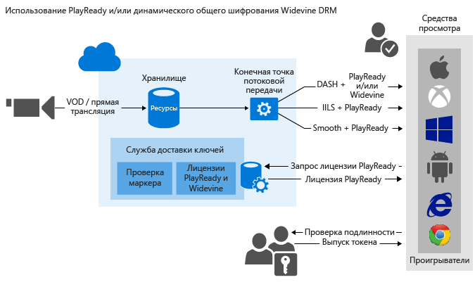

<properties
	pageTitle="Использование общего динамического шифрования PlayReady и (или) Widevine DRM | Microsoft Azure"
	description="Службы мультимедиа Microsoft Azure позволяют защищать потоковое содержимое, которое доставляется по протоколам MPEG-DASH, Smooth Streaming и Http Live Streaming (HLS), с помощью технологии Microsoft PlayReady DRM. Она позволяет также передавать DASH с шифрованием, выполненным с помощью Widevine DRM. Здесь описывается выполнение динамического шифрования с помощью PlayReady и Widevine DRM."
	services="media-services"
	documentationCenter=""
	authors="juliako"
	manager="erikre"
	editor=""/>

<tags
	ms.service="media-services"
	ms.workload="media"
	ms.tgt_pltfrm="na"
	ms.devlang="na"
	ms.topic="get-started-article" 
	ms.date="09/27/2016"
	ms.author="juliako"/>

#Использование общего динамического шифрования PlayReady и (или) Widevine DRM

> [AZURE.SELECTOR]
- [.NET](media-services-protect-with-drm.md)
- [Java](https://github.com/southworkscom/azure-sdk-for-media-services-java-samples)
- [PHP](https://github.com/Azure/azure-sdk-for-php/tree/master/examples/MediaServices)

Службы мультимедиа Microsoft Azure позволяют защищать потоковое содержимое, которое доставляется по протоколам MPEG-DASH, Smooth Streaming и HTTP-Live-Streaming (HLS), с помощью технологии [Microsoft PlayReady DRM](https://www.microsoft.com/playready/overview/). Они также позволяют передавать зашифрованное потоковое содержимое DASH с использованием лицензий Widevine DRM. PlayReady и Widewine шифруются согласно спецификации общего шифрования (ISO/IEC 23001-7 CENC). Чтобы настроить AssetDeliveryConfiguration для использования Widevine, можно воспользоваться пакетом [AMS .NET SDK](https://www.nuget.org/packages/windowsazure.mediaservices/) (начиная с версии 3.5.1) или REST API.

Службы мультимедиа обеспечивают доставку лицензий PlayReady и DRM Widevine. Они также предоставляют API-интерфейсы для настройки прав и ограничений, которые должны применяться в среде выполнения PlayReady или Widevine DRM, когда пользователь воспроизводит защищенное содержимое. Когда пользователь запрашивает защищенное содержимое DRM, приложение проигрывателя в свою очередь запрашивает лицензию из службы лицензий AMS. Служба AMS лицензий выдаст лицензию проигрывателю, который авторизован. Лицензия PlayReady или Widevine содержит ключ расшифровки, который может использоваться клиентским проигрывателем для расшифровки и потоковой передачи содержимого.

Для доставки лицензий Widevine можно использовать следующих партнеров AMS: [Axinom](http://www.axinom.com/press/ibc-axinom-drm-6/), [EZDRM](http://ezdrm.com/) и [castLabs](http://castlabs.com/company/partners/azure/). Дополнительные сведения см. в статьях, посвященных интеграции с [Axinom](media-services-axinom-integration.md) и [castLabs](media-services-castlabs-integration.md).

Службы мультимедиа поддерживают несколько способов авторизации пользователей, которые запрашивают ключи. Для политики авторизации ключа содержимого можно задать одно или несколько из ограничений авторизации: открытая авторизация или с ограничением по маркеру. При ограничении по маркеру к политике должен прилагаться маркер, выданный службой маркеров безопасности (STS). Службы мультимедиа поддерживают маркеры в формате [простого веб-маркера](https://msdn.microsoft.com/library/gg185950.aspx#BKMK_2) (SWT) и [веб-маркера JSON](https://msdn.microsoft.com/library/gg185950.aspx#BKMK_3) (JWT). Дополнительную информацию см. в разделе "Настройка политики авторизации для ключа содержимого".

Чтобы воспользоваться преимуществами динамического шифрования, необходимо иметь ресурс-контейнер, содержащий набор многоскоростных MP4-файлов или многоскоростных исходных файлов Smooth Streaming. Вам также потребуется настроить политику доставки для ресурса (описывается далее в этой статье). В зависимости от формата, указанного в URL-адресе потоковой передачи, сервер потокового воспроизведения по запросу обеспечивает доставку содержимого по выбранному протоколу. В результате вы сможете хранить и оплачивать файлы в одном формате, а службы мультимедиа выполнят сборку и будут обслуживать соответствующий HTTP-ответ на основе запросов клиента.

Эта статья будет полезна для разработчиков приложений, предоставляющих мультимедийные файлы, защищенные с помощью нескольких лицензий DRM, например PlayReady и Widevine. Здесь показано, как настроить политики авторизации для службы доставки лицензий PlayReady, чтобы только авторизованные клиенты могли получать лицензии PlayReady или Widevine. Также показано, как использовать динамическое шифрование с помощью PlayReady или Widevine DRM через DASH.

>[AZURE.NOTE]Чтобы приступить к работе с динамическим шифрованием, необходимо сначала получить хотя бы одну единицу масштабирования (единицу потоковой передачи). Дополнительную информацию см. в разделе [Масштабирование службы мультимедиа](media-services-portal-manage-streaming-endpoints.md).

##Скачивание образца

Пример, описанный в этой статье, можно скачать [по этой ссылке](https://github.com/Azure-Samples/media-services-dotnet-dynamic-encryption-with-drm).

##Настройка общего динамического шифрования и службы доставки лицензий DRM

Ниже описаны общие действия, которые необходимо выполнить для защиты ресурсов-контейнеров с помощью PlayReady, используя службу доставки лицензий служб мультимедиа и динамическое шифрование.

1. Создайте ресурс-контейнер и отправьте в него файлы.
1. Закодируйте ресурс-контейнер с файлами в набор MP4-файлов с переменной скоростью.
1. Создайте ключ содержимого и свяжите его с закодированным ресурсом-контейнером. В службах мультимедиа ключ содержимого содержит ключ шифрования ресурса-контейнера.
1. Настройте политику авторизации для ключа содержимого. Чтобы получить ключ содержимого, клиент должен соответствовать заданной для этого ключа политике авторизации.

Создавая политику авторизации ключа содержимого, необходимо указать следующее: метод доставки (PlayReady или Widevine), ограничения (открытая авторизация или с ограничением по маркеру), а также способ доставки ключа клиенту (шаблон лицензии [PlayReady](media-services-playready-license-template-overview.md) или [Widevine](media-services-widevine-license-template-overview.md)).
1. Настройте политику доставки для ресурса-контейнера. Настройка политики доставки включает: протокол доставки (например, MPEG-DASH, HLS, HDS, Smooth Streaming или все перечисленные), тип динамического шифрования (например, общее шифрование) и URL-адрес для получения лицензии PlayReady или Widevine.

К разным протоколам можно применять разные политики в отношении одного и того же ресурса-контейнера. Например, вы можете применить шифрование PlayReady при использовании Smooth или DASH и конвертное шифрование AES при использовании HLS. Потоковая передача по тем протоколам, которые не определены в политике доставки (например, если вы добавили одну политику, которая предусматривает использование только протокола HLS), будет блокироваться. Исключением являются те случаи, когда политика доставки ресурсов совсем не определена. Тогда все протоколы могут использоваться в незашифрованном виде.
1. Создайте указатель OnDemand, чтобы получить URL-адрес для потоковой передачи.

В конце статьи вы найдете полный пример для .NET.

На следующем изображении показан описанный выше рабочий процесс. В данном случае для проверки подлинности используется маркер.

Далее приводятся подробные объяснения, примеры кода и ссылки на статьи с инструкциями для выполнения описанных выше задач.

##Текущие ограничения

При добавлении или обновлении политики доставки ресурсов необходимо удалить связанный указатель (если он есть) и создать новый.

Ограничение при шифровании с помощью Widevine в службах мультимедиа Azure: в настоящее время использование нескольких ключей содержимого не поддерживается.

##Создание ресурса-контейнера и отправка в него файлов

Для кодирования и потоковой передачи видео, а также управления ими необходимо сначала отправить содержимое в службы мультимедиа Microsoft Azure. Оно будет сохранено в безопасном облачном хранилище для последующей обработки и потоковой передачи.

Дополнительные сведения см. в статье [Отправка файлов в учетную запись служб мультимедиа](media-services-dotnet-upload-files.md).

##Кодирование ресурса-контейнера с файлами в набор MP4-файлов с переменной скоростью

При использовании динамического шифрования вам достаточно создать ресурс-контейнер, содержащий набор многоскоростных MP4-файлов или многоскоростных исходных файлов Smooth Streaming. Затем с учетом формата, указанного в манифесте или запросе фрагмента, сервер потокового воспроизведения по запросу организует передачу содержимого по выбранному протоколу. В результате вы сможете хранить и оплачивать файлы только в одном формате, а службы мультимедиа выполнят сборку и будут обслуживать соответствующий ответ на основе запросов клиента. Дополнительные сведения см. в статье [Динамическая упаковка](media-services-dynamic-packaging-overview.md).

Инструкции по выполнению шифрования см. в статье [Порядок кодирования ресурса с использованием стандартного кодировщика мультимедиа](media-services-dotnet-encode-with-media-encoder-standard.md).

##Создание ключа содержимого и связывание его с закодированным ресурсом-контейнером

В службах мультимедиа ключ содержимого содержит ключ, который используется для шифрования ресурса-контейнера.

Дополнительные сведения см. в статье [Создание ContentKey с использованием .NET](media-services-dotnet-create-contentkey.md).

##Настройка политики авторизации ключа содержимого

Службы мультимедиа поддерживают несколько способов аутентификации пользователей, которые запрашивают ключи. Чтобы получить ключ содержимого, клиент (проигрыватель) должен соответствовать заданной для этого ключа политике авторизации. Для политики авторизации ключа содержимого можно задать одно или несколько из ограничений авторизации: открытая авторизация или с ограничением по маркеру.

Дополнительные сведения см. в разделе [Настройка политики авторизации ключа содержимого](media-services-dotnet-configure-content-key-auth-policy.md#playready-dynamic-encryption).

##Настройка политики доставки для ресурса-контейнера 

Настройте политику доставки для ресурса-контейнера. Вот некоторые элементы, входящие в конфигурацию политики доставки:

- URL-адрес для приобретения лицензии DRM.
- Протокол доставки ресурсов-контейнеров (например, MPEG-DASH, HLS, HDS, Smooth Streaming или все перечисленные).
- Тип динамического шифрования (в данном случае — стандартное шифрование).

Дополнительные сведения см. в разделе [Настройка политик доставки ресурсов](media-services-rest-configure-asset-delivery-policy.md).

##Создание указателя потоковой передачи по запросу для получения URL-адреса для потоковой передачи

При использовании протоколов Smooth, DASH или HLS вам потребуется предоставить пользователю URL-адрес для потоковой передачи.

>[AZURE.NOTE]При добавлении или обновлении политики доставки ресурсов необходимо удалить существующий указатель (если он есть) и создать новый.

Указания по публикации ресурса и созданию URL-адреса потоковой передачи см. в статье [Создание URL-адреса потоковой передачи](media-services-deliver-streaming-content.md).

##Получение маркера тестирования

Получите маркер тестирования в зависимости от ограничения по маркеру, заданного в политике авторизации ключа.

	// Deserializes a string containing an Xml representation of a TokenRestrictionTemplate
	// back into a TokenRestrictionTemplate class instance.
	TokenRestrictionTemplate tokenTemplate = 
	    TokenRestrictionTemplateSerializer.Deserialize(tokenTemplateString);
	
	// Generate a test token based on the data in the given TokenRestrictionTemplate.
	//The GenerateTestToken method returns the token without the word “Bearer” in front
	//so you have to add it in front of the token string. 
	string testToken = TokenRestrictionTemplateSerializer.GenerateTestToken(tokenTemplate);
	Console.WriteLine("The authorization token is:\nBearer {0}", testToken);

	
Для проверки потоковой передачи можно использовать [проигрыватель AMS](http://amsplayer.azurewebsites.net/azuremediaplayer.html).

##Пример

В следующем примере показаны функциональные возможности, появившиеся в версии 3.5.2 пакета SDK служб мультимедиа Azure для .NET (в частности, возможность указывать шаблон лицензии Widevine и отправлять запрос на лицензию Widevine из служб мультимедиа Azure). Для установки пакета использовалась следующая команда пакета NuGet:

	PM> Install-Package windowsazure.mediaservices -Version 3.5.2

1. Создайте новый консольный проект.
1. Используйте NuGet для установки и добавления пакета SDK служб мультимедиа для .NET.
2. Добавьте дополнительную ссылку: System.Configuration.
2. Добавьте файл конфигурации, содержащий сведения об имени и ключе учетной записи:
	
		<?xml version="1.0" encoding="utf-8"?>
		<configuration>
		    <startup> 
		        <supportedRuntime version="v4.0" sku=".NETFramework,Version=v4.5" />
		    </startup>
			  <appSettings>
			
			    <add key="MediaServicesAccountName" value="AccountName"/>
			    <add key="MediaServicesAccountKey" value="AccountKey"/>
			
			    <add key="Issuer" value="http://testacs.com"/>
			    <add key="Audience" value="urn:test"/>
			  </appSettings>
		</configuration>

1. получить по крайней мере одну единицу потоковой передачи для конечной точки потоковой передачи, из которой вы планируете доставлять содержимое. Дополнительные сведения можно найти в разделе [Настройка конечной точки потоковой передачи](media-services-dotnet-get-started.md#configure-streaming-endpoint-using-the-portal).

1. Замените код в файле Program.cs кодом, приведенным в этом разделе.
	
	Обязательно обновите переменные, чтобы они указывали на папки, в которых находятся входные файлы.
		
		using System;
		using System.Collections.Generic;
		using System.Configuration;
		using System.IO;
		using System.Linq;
		using System.Threading;
		using Microsoft.WindowsAzure.MediaServices.Client;
		using Microsoft.WindowsAzure.MediaServices.Client.ContentKeyAuthorization;
		using Microsoft.WindowsAzure.MediaServices.Client.DynamicEncryption;
		using Microsoft.WindowsAzure.MediaServices.Client.Widevine;
		using Newtonsoft.Json;
		
		namespace DynamicEncryptionWithDRM
		{
		    class Program
		    {
		        // Read values from the App.config file.
		        private static readonly string _mediaServicesAccountName =
		            ConfigurationManager.AppSettings["MediaServicesAccountName"];
		        private static readonly string _mediaServicesAccountKey =
		            ConfigurationManager.AppSettings["MediaServicesAccountKey"];
		
		        private static readonly Uri _sampleIssuer =
		            new Uri(ConfigurationManager.AppSettings["Issuer"]);
		        private static readonly Uri _sampleAudience =
		            new Uri(ConfigurationManager.AppSettings["Audience"]);
		
		        // Field for service context.
		        private static CloudMediaContext _context = null;
		        private static MediaServicesCredentials _cachedCredentials = null;
		
		        private static readonly string _mediaFiles =
		            Path.GetFullPath(@"../..\Media");
		
		        private static readonly string _singleMP4File =
		            Path.Combine(_mediaFiles, @"BigBuckBunny.mp4");
		
		        static void Main(string[] args)
		        {
		            // Create and cache the Media Services credentials in a static class variable.
		            _cachedCredentials = new MediaServicesCredentials(
		                            _mediaServicesAccountName,
		                            _mediaServicesAccountKey);
		            // Used the cached credentials to create CloudMediaContext.
		            _context = new CloudMediaContext(_cachedCredentials);
		
		            bool tokenRestriction = false;
		            string tokenTemplateString = null;
		
		            IAsset asset = UploadFileAndCreateAsset(_singleMP4File);
		            Console.WriteLine("Uploaded asset: {0}", asset.Id);
		
		            IAsset encodedAsset = EncodeToAdaptiveBitrateMP4Set(asset);
		            Console.WriteLine("Encoded asset: {0}", encodedAsset.Id);
		
		            IContentKey key = CreateCommonTypeContentKey(encodedAsset);
		            Console.WriteLine("Created key {0} for the asset {1} ", key.Id, encodedAsset.Id);
		            Console.WriteLine("PlayReady License Key delivery URL: {0}", key.GetKeyDeliveryUrl(ContentKeyDeliveryType.PlayReadyLicense));
		            Console.WriteLine();
		
		            if (tokenRestriction)
		                tokenTemplateString = AddTokenRestrictedAuthorizationPolicy(key);
		            else
		                AddOpenAuthorizationPolicy(key);
		
		            Console.WriteLine("Added authorization policy: {0}", key.AuthorizationPolicyId);
		            Console.WriteLine();
		
		            CreateAssetDeliveryPolicy(encodedAsset, key);
		            Console.WriteLine("Created asset delivery policy. \n");
		            Console.WriteLine();
		
		            if (tokenRestriction && !String.IsNullOrEmpty(tokenTemplateString))
		            {
		                // Deserializes a string containing an Xml representation of a TokenRestrictionTemplate
		                // back into a TokenRestrictionTemplate class instance.
		                TokenRestrictionTemplate tokenTemplate =
		                    TokenRestrictionTemplateSerializer.Deserialize(tokenTemplateString);
		
		                // Generate a test token based on the the data in the given TokenRestrictionTemplate.
		                // Note, you need to pass the key id Guid because we specified 
		                // TokenClaim.ContentKeyIdentifierClaim in during the creation of TokenRestrictionTemplate.
		                Guid rawkey = EncryptionUtils.GetKeyIdAsGuid(key.Id);
		                string testToken = TokenRestrictionTemplateSerializer.GenerateTestToken(tokenTemplate, null, rawkey, 
																				DateTime.UtcNow.AddDays(365));
		                Console.WriteLine("The authorization token is:\nBearer {0}", testToken);
		                Console.WriteLine();
		            }
		
		            // You can use the http://amsplayer.azurewebsites.net/azuremediaplayer.html player to test streams.
		            // Note that DASH works on IE 11 (via PlayReady), Edge (via PlayReady), Chrome (via Widevine).
		             
		            string url = GetStreamingOriginLocator(encodedAsset);
		            Console.WriteLine("Encrypted DASH URL: {0}/manifest(format=mpd-time-csf)", url);
		
		            Console.ReadLine();
		        }
		
		
		        static public IAsset UploadFileAndCreateAsset(string singleFilePath)
		        {
		            if (!File.Exists(singleFilePath))
		            {
		                Console.WriteLine("File does not exist.");
		                return null;
		            }
		
		            var assetName = Path.GetFileNameWithoutExtension(singleFilePath);
		            IAsset inputAsset = _context.Assets.Create(assetName, AssetCreationOptions.None);
		
		            var assetFile = inputAsset.AssetFiles.Create(Path.GetFileName(singleFilePath));
		
		            Console.WriteLine("Created assetFile {0}", assetFile.Name);
		
		            var policy = _context.AccessPolicies.Create(
		                                    assetName,
		                                    TimeSpan.FromDays(30),
		                                    AccessPermissions.Write | AccessPermissions.List);
		
		            var locator = _context.Locators.CreateLocator(LocatorType.Sas, inputAsset, policy);
		
		            Console.WriteLine("Upload {0}", assetFile.Name);
		
		            assetFile.Upload(singleFilePath);
		            Console.WriteLine("Done uploading {0}", assetFile.Name);
		
		            locator.Delete();
		            policy.Delete();
		
		            return inputAsset;
		        }
		
			    static public IAsset EncodeToAdaptiveBitrateMP4Set(IAsset inputAsset)
			    {
			        var encodingPreset = "H264 Multiple Bitrate 720p";
			
			        IJob job = _context.Jobs.Create(String.Format("Encoding into Mp4 {0} to {1}",
			                                inputAsset.Name,
			                                encodingPreset));
			
			        var mediaProcessors =
			            _context.MediaProcessors.Where(p => p.Name.Contains("Media Encoder Standard")).ToList();
			
			        var latestMediaProcessor =
			            mediaProcessors.OrderBy(mp => new Version(mp.Version)).LastOrDefault();
			
			        ITask encodeTask = job.Tasks.AddNew("Encoding", latestMediaProcessor, encodingPreset, TaskOptions.None);
			        encodeTask.InputAssets.Add(inputAsset);
			        encodeTask.OutputAssets.AddNew(String.Format("{0} as {1}", inputAsset.Name, encodingPreset), 	AssetCreationOptions.StorageEncrypted);
			
			        job.StateChanged += new EventHandler<JobStateChangedEventArgs>(JobStateChanged);
			        job.Submit();
			        job.GetExecutionProgressTask(CancellationToken.None).Wait();
			
			        return job.OutputMediaAssets[0];
			    }
		
		
		        static public IContentKey CreateCommonTypeContentKey(IAsset asset)
		        {
		            
		            Guid keyId = Guid.NewGuid();
		            byte[] contentKey = GetRandomBuffer(16);
		
		            IContentKey key = _context.ContentKeys.Create(
		                                    keyId,
		                                    contentKey,
		                                    "ContentKey",
		                                    ContentKeyType.CommonEncryption);
		
		            // Associate the key with the asset.
		            asset.ContentKeys.Add(key);
		
		            return key;
		        }
		
		        static public void AddOpenAuthorizationPolicy(IContentKey contentKey)
		        {
		
		            // Create ContentKeyAuthorizationPolicy with Open restrictions 
		            // and create authorization policy          
		
		            List<ContentKeyAuthorizationPolicyRestriction> restrictions = new List<ContentKeyAuthorizationPolicyRestriction>
		            {
		                new ContentKeyAuthorizationPolicyRestriction
		                {
		                    Name = "Open",
		                    KeyRestrictionType = (int)ContentKeyRestrictionType.Open,
		                    Requirements = null
		                }
		            };
		
		            // Configure PlayReady and Widevine license templates.
		            string PlayReadyLicenseTemplate = ConfigurePlayReadyLicenseTemplate();
		
		            string WidevineLicenseTemplate = ConfigureWidevineLicenseTemplate();
		
		            IContentKeyAuthorizationPolicyOption PlayReadyPolicy =
		                _context.ContentKeyAuthorizationPolicyOptions.Create("",
		                    ContentKeyDeliveryType.PlayReadyLicense,
		                        restrictions, PlayReadyLicenseTemplate);
		
		            IContentKeyAuthorizationPolicyOption WidevinePolicy =
		                _context.ContentKeyAuthorizationPolicyOptions.Create("", 
		                    ContentKeyDeliveryType.Widevine, 
		                    restrictions, WidevineLicenseTemplate);
		
		            IContentKeyAuthorizationPolicy contentKeyAuthorizationPolicy = _context.
		                        ContentKeyAuthorizationPolicies.
		                        CreateAsync("Deliver Common Content Key with no restrictions").
		                        Result;
		
		
		            contentKeyAuthorizationPolicy.Options.Add(PlayReadyPolicy);
		            contentKeyAuthorizationPolicy.Options.Add(WidevinePolicy);
		            // Associate the content key authorization policy with the content key.
		            contentKey.AuthorizationPolicyId = contentKeyAuthorizationPolicy.Id;
		            contentKey = contentKey.UpdateAsync().Result;
		        }
		
		        public static string AddTokenRestrictedAuthorizationPolicy(IContentKey contentKey)
		        {
		            string tokenTemplateString = GenerateTokenRequirements();
		
		            List<ContentKeyAuthorizationPolicyRestriction> restrictions = new List<ContentKeyAuthorizationPolicyRestriction>
		            {
		                new ContentKeyAuthorizationPolicyRestriction
		                {
		                    Name = "Token Authorization Policy",
		                    KeyRestrictionType = (int)ContentKeyRestrictionType.TokenRestricted,
		                    Requirements = tokenTemplateString,
		                }
		            };
		
		            // Configure PlayReady and Widevine license templates.
		            string PlayReadyLicenseTemplate = ConfigurePlayReadyLicenseTemplate();
		
		            string WidevineLicenseTemplate = ConfigureWidevineLicenseTemplate();
		
		            IContentKeyAuthorizationPolicyOption PlayReadyPolicy =
		                _context.ContentKeyAuthorizationPolicyOptions.Create("Token option",
		                    ContentKeyDeliveryType.PlayReadyLicense,
		                        restrictions, PlayReadyLicenseTemplate);
		
		            IContentKeyAuthorizationPolicyOption WidevinePolicy =
		                _context.ContentKeyAuthorizationPolicyOptions.Create("Token option",
		                    ContentKeyDeliveryType.Widevine,
		                        restrictions, WidevineLicenseTemplate);
		
		            IContentKeyAuthorizationPolicy contentKeyAuthorizationPolicy = _context.
		                        ContentKeyAuthorizationPolicies.
		                        CreateAsync("Deliver Common Content Key with token restrictions").
		                        Result;
		
		            contentKeyAuthorizationPolicy.Options.Add(PlayReadyPolicy);
		            contentKeyAuthorizationPolicy.Options.Add(WidevinePolicy);
		
		            // Associate the content key authorization policy with the content key
		            contentKey.AuthorizationPolicyId = contentKeyAuthorizationPolicy.Id;
		            contentKey = contentKey.UpdateAsync().Result;
		
		            return tokenTemplateString;
		        }
		
		        static private string GenerateTokenRequirements()
		        {
		            TokenRestrictionTemplate template = new TokenRestrictionTemplate(TokenType.SWT);
		
		            template.PrimaryVerificationKey = new SymmetricVerificationKey();
		            template.AlternateVerificationKeys.Add(new SymmetricVerificationKey());
		            template.Audience = _sampleAudience.ToString();
		            template.Issuer = _sampleIssuer.ToString();
		            template.RequiredClaims.Add(TokenClaim.ContentKeyIdentifierClaim);
		
		            return TokenRestrictionTemplateSerializer.Serialize(template);
		        }
		
		        static private string ConfigurePlayReadyLicenseTemplate()
		        {
		            // The following code configures PlayReady License Template using .NET classes
		            // and returns the XML string.
		
		            //The PlayReadyLicenseResponseTemplate class represents the template for the response sent back to the end user. 
		            //It contains a field for a custom data string between the license server and the application 
		            //(may be useful for custom app logic) as well as a list of one or more license templates.
		            PlayReadyLicenseResponseTemplate responseTemplate = new PlayReadyLicenseResponseTemplate();
		
		            // The PlayReadyLicenseTemplate class represents a license template for creating PlayReady licenses
		            // to be returned to the end users. 
		            //It contains the data on the content key in the license and any rights or restrictions to be 
		            //enforced by the PlayReady DRM runtime when using the content key.
		            PlayReadyLicenseTemplate licenseTemplate = new PlayReadyLicenseTemplate();
		            //Configure whether the license is persistent (saved in persistent storage on the client) 
		            //or non-persistent (only held in memory while the player is using the license).  
		            licenseTemplate.LicenseType = PlayReadyLicenseType.Nonpersistent;
		
		            // AllowTestDevices controls whether test devices can use the license or not.  
		            // If true, the MinimumSecurityLevel property of the license
		            // is set to 150.  If false (the default), the MinimumSecurityLevel property of the license is set to 2000.
		            licenseTemplate.AllowTestDevices = true;
		
		            // You can also configure the Play Right in the PlayReady license by using the PlayReadyPlayRight class. 
		            // It grants the user the ability to playback the content subject to the zero or more restrictions 
		            // configured in the license and on the PlayRight itself (for playback specific policy). 
		            // Much of the policy on the PlayRight has to do with output restrictions 
		            // which control the types of outputs that the content can be played over and 
		            // any restrictions that must be put in place when using a given output.
		            // For example, if the DigitalVideoOnlyContentRestriction is enabled, 
		            //then the DRM runtime will only allow the video to be displayed over digital outputs 
		            //(analog video outputs won’t be allowed to pass the content).
		
		            //IMPORTANT: These types of restrictions can be very powerful but can also affect the consumer experience. 
		            // If the output protections are configured too restrictive, 
		            // the content might be unplayable on some clients. For more information, see the PlayReady Compliance Rules document.
		
		            // For example:
		            //licenseTemplate.PlayRight.AgcAndColorStripeRestriction = new AgcAndColorStripeRestriction(1);
		
		            responseTemplate.LicenseTemplates.Add(licenseTemplate);
		
		            return MediaServicesLicenseTemplateSerializer.Serialize(responseTemplate);
		        }
		
		
		        private static string ConfigureWidevineLicenseTemplate()
		        {
		            var template = new WidevineMessage
		            {
		                allowed_track_types = AllowedTrackTypes.SD_HD,
		                content_key_specs = new[]
		                {
		                    new ContentKeySpecs
		                    {
		                        required_output_protection = new RequiredOutputProtection { hdcp = Hdcp.HDCP_NONE},
		                        security_level = 1,
		                        track_type = "SD"
		                    }
		                },
		                policy_overrides = new
		                {
		                    can_play = true,
		                    can_persist = true,
		                    can_renew = false
		                }
		            };
		
		            string configuration = JsonConvert.SerializeObject(template);
		            return configuration;
		        }
		
		        static public void CreateAssetDeliveryPolicy(IAsset asset, IContentKey key)
		        {
		            // Get the PlayReady license service URL.
		            Uri acquisitionUrl = key.GetKeyDeliveryUrl(ContentKeyDeliveryType.PlayReadyLicense);
			    
			        // GetKeyDeliveryUrl for Widevine attaches the KID to the URL.
			        // For example: https://amsaccount1.keydelivery.mediaservices.windows.net/Widevine/?KID=268a6dcb-18c8-4648-8c95-f46429e4927c.  
			        // The WidevineBaseLicenseAcquisitionUrl (used below) also tells Dynamaic Encryption 
			        // to append /? KID =< keyId > to the end of the url when creating the manifest.
			        // As a result Widevine license acquisition URL will have KID appended twice, 
			        // so we need to remove the KID that in the URL when we call GetKeyDeliveryUrl.
			
		            Uri widevineUrl = key.GetKeyDeliveryUrl(ContentKeyDeliveryType.Widevine);
		            UriBuilder uriBuilder = new UriBuilder(widevineUrl);
		            uriBuilder.Query = String.Empty;
		            widevineUrl = uriBuilder.Uri;
		
		            Dictionary<AssetDeliveryPolicyConfigurationKey, string> assetDeliveryPolicyConfiguration =
		                new Dictionary<AssetDeliveryPolicyConfigurationKey, string>
		                {
		                    {AssetDeliveryPolicyConfigurationKey.PlayReadyLicenseAcquisitionUrl, acquisitionUrl.ToString()},
		                    {AssetDeliveryPolicyConfigurationKey.WidevineBaseLicenseAcquisitionUrl, widevineUrl.ToString()}
		
		                };
		
					// In this case we only specify Dash streaming protocol in the delivery policy,
					// All other protocols will be blocked from streaming.
		            var assetDeliveryPolicy = _context.AssetDeliveryPolicies.Create(
		                    "AssetDeliveryPolicy",
		                AssetDeliveryPolicyType.DynamicCommonEncryption,
		                AssetDeliveryProtocol.Dash,
		                assetDeliveryPolicyConfiguration);
		
		
		            // Add AssetDelivery Policy to the asset
		            asset.DeliveryPolicies.Add(assetDeliveryPolicy);
		
		        }
		
		        /// 

		        /// Gets the streaming origin locator.
		        /// 

		        /// <param name="assets"></param>
		        /// <returns></returns>
		        static public string GetStreamingOriginLocator(IAsset asset)
		        {
		
		            // Get a reference to the streaming manifest file from the  
		            // collection of files in the asset. 
		
		            var assetFile = asset.AssetFiles.Where(f => f.Name.ToLower().
		                                         EndsWith(".ism")).
		                                         FirstOrDefault();
		
		            // Create a 30-day readonly access policy. 
		            IAccessPolicy policy = _context.AccessPolicies.Create("Streaming policy",
		                TimeSpan.FromDays(30),
		                AccessPermissions.Read);
		
		            // Create a locator to the streaming content on an origin. 
		            ILocator originLocator = _context.Locators.CreateLocator(LocatorType.OnDemandOrigin, asset,
		                policy,
		                DateTime.UtcNow.AddMinutes(-5));
		
		            // Create a URL to the manifest file. 
		            return originLocator.Path + assetFile.Name;
		        }
		
		        static private void JobStateChanged(object sender, JobStateChangedEventArgs e)
		        {
		            Console.WriteLine(string.Format("{0}\n  State: {1}\n  Time: {2}\n\n",
		                ((IJob)sender).Name,
		                e.CurrentState,
		                DateTime.UtcNow.ToString(@"yyyy_M_d__hh_mm_ss")));
		        }
		
		        static private byte[] GetRandomBuffer(int length)
		        {
		            var returnValue = new byte[length];
		
		            using (var rng =
		                new System.Security.Cryptography.RNGCryptoServiceProvider())
		            {
		                rng.GetBytes(returnValue);
		            }
		
		            return returnValue;
		        }
		    }
		}

## Дальнейшие действия

Просмотрите схемы обучения работе со службами мультимедиа.

[AZURE.INCLUDE [media-services-learning-paths-include](../../includes/media-services-learning-paths-include.md)]

##Отзывы

[AZURE.INCLUDE [media-services-user-voice-include](../../includes/media-services-user-voice-include.md)]

##Дополнительные материалы

[CENC with Multi-DRM and Access Control (CENC с несколькими подсистемами DRM и контролем доступа)](media-services-cenc-with-multidrm-access-control.md)

[Настройка упаковки Widevine с использованием AMS](http://mingfeiy.com/how-to-configure-widevine-packaging-with-azure-media-services)

[Анонс служб доставки лицензий Google Widevine в службах мультимедиа Azure](https://azure.microsoft.com/blog/announcing-general-availability-of-google-widevine-license-services/)

<!---HONumber=AcomDC_0928_2016-->