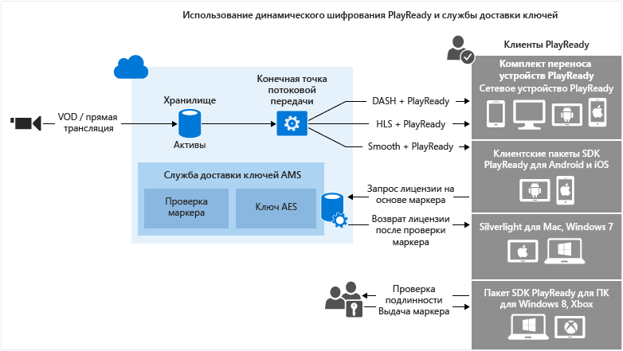

<properties
	pageTitle="Использование динамического шифрования PlayReady DRM и службы доставки лицензий"
	description="Службы мультимедиа Microsoft Azure позволяют защищать потоковое содержимое, которое доставляется по протоколам MPEG-DASH, Smooth Streaming и Http Live Streaming (HLS), с помощью технологии Microsoft PlayReady DRM. В этой статье показано, как динамически шифровать содержимое с помощью технологии PlayReady DRM и службы доставки ключей."
	services="media-services"
	documentationCenter=""
	authors="Juliako"
	manager="dwrede"
	editor=""/>

<tags
	ms.service="media-services"
	ms.workload="media"
	ms.tgt_pltfrm="na"
	ms.devlang="na"
	ms.topic="get-started-article" 
	ms.date="09/07/2015"
	ms.author="juliako"/>

#Использование динамического шифрования PlayReady DRM и службы доставки лицензий

> [AZURE.SELECTOR]
- [.NET](media-services-protect-with-drm.md)
- [Java](https://github.com/southworkscom/azure-sdk-for-media-services-java-samples)

Службы мультимедиа Microsoft Azure позволяют защищать потоковое содержимое, которое доставляется по протоколам MPEG-DASH, Smooth Streaming и Http Live Streaming (HLS), с помощью технологии [Microsoft PlayReady DRM](https://www.microsoft.com/playready/overview/).

Службы мультимедиа теперь обеспечивают доставку лицензий Microsoft PlayReady. Они также предоставляют API для настройки прав и ограничений, которые должны применяться в среде выполнения PlayReady DRM, когда пользователь пытается воспроизвести защищенное содержимое. Когда пользователь пытается воспроизвести содержимое, защищенное с помощью PlayReady, клиентское приложение проигрывателя запрашивает это содержимое в службах мультимедиа Azure. Затем службы мультимедиа Azure перенаправляют клиент на сервер лицензий PlayReady служб мультимедиа Azure, который проверяет подлинность пользователя и авторизует доступ к содержимому. Лицензия PlayReady содержит ключ расшифровки, который может использоваться клиентским проигрывателем для расшифровки и потоковой передачи содержимого.

Службы мультимедиа поддерживают несколько способов аутентификации пользователей, которые запрашивают ключи. Для политики авторизации ключа содержимого можно задать одно или несколько из ограничений авторизации: открытая авторизация, с ограничением по маркеру или с ограничением по IP-адресу. При ограничении по маркеру к политике должен прилагаться маркер, выданный службой маркеров безопасности (STS). Службы мультимедиа поддерживают маркеры в формате [простого веб-маркера](https://msdn.microsoft.com/library/gg185950.aspx#BKMK_2) (SWT) и [веб-маркера JSON](https://msdn.microsoft.com/library/gg185950.aspx#BKMK_3) (JWT). Дополнительную информацию см. в разделе "Настройка политики авторизации для ключа содержимого".

Чтобы воспользоваться преимуществами динамического шифрования, необходимо иметь ресурс-контейнер, содержащий набор многоскоростных MP4-файлов или многоскоростных исходных файлов Smooth Streaming. Вам также потребуется настроить политику доставки для ресурса-контейнера (описывается далее в этой статье). В зависимости от формата, указанного в URL-адресе потоковой передачи, сервер потокового воспроизведения по запросу обеспечивает доставку содержимого по выбранному протоколу. В результате вы сможете хранить и оплачивать файлы только в одном формате, а службы мультимедиа выполнят сборку и будут обслуживать соответствующий ответ на основе запросов клиента.

Эта статья будет полезна разработчикам приложений, которые доставляют защищенные файлы мультимедиа. В ней показано, как настроить политики авторизации для службы доставки лицензий PlayReady, чтобы только авторизованные клиенты могли получать лицензии PlayReady, а также рассматривается использование динамического шифрования.

>[AZURE.NOTE]Чтобы приступить к работе с динамическим шифрованием, необходимо сначала получить хотя бы одну единицу масштабирования (единицу потоковой передачи). Дополнительную информацию см. в разделе [Масштабирование службы мультимедиа](media-services-manage-origins.md#scale_streaming_endpoints).

##Рабочий процесс динамического шифрования PlayReady и службы доставки лицензий PlayReady

Ниже описаны общие действия, которые необходимо выполнить для защиты ресурсов-контейнеров с помощью PlayReady, используя службу доставки лицензий служб мультимедиа и динамическое шифрование.

1. Создайте ресурс-контейнер и отправьте в него файлы. 
1. Закодируйте ресурс-контейнер с файлами в набор MP4-файлов с переменной скоростью.
1. Создайте ключ содержимого и свяжите его с закодированным ресурсом-контейнером. В службах мультимедиа ключ содержимого содержит ключ шифрования ресурса-контейнера. Дополнительные сведения см. в разделах, посвященных ключу содержимого.
1. Настройте политику авторизации для ключа содержимого. Чтобы получить ключ содержимого, клиент должен соответствовать заданной для этого ключа политике авторизации. 
1. Настройте политику доставки для ресурса-контейнера. Настройка политики доставки включает: протокол доставки (например, MPEG-DASH, HLS, HDS, Smooth Streaming или все перечисленные), тип динамического шифрования (например, общее шифрование) и URL-адрес для получения лицензии PlayReady. 
 
	К разным протоколам можно применять разные политики в отношении одного и того же ресурса-контейнера. Например, вы можете применить шифрование PlayReady при использовании Smooth или DASH и конвертное шифрование AES при использовании HLS. Потоковая передача по тем протоколам, которые не определены в политике доставки (например, если вы добавили одну политику, которая предусматривает использование только протокола HLS), будет блокироваться. Исключением являются те случаи, когда политика доставки ресурсов совсем не определена. Тогда все протоколы могут использоваться в незашифрованном виде.
1. Создайте указатель OnDemand, чтобы получить URL-адрес для потоковой передачи.

В конце статьи вы найдете полный пример для .NET.

На следующем изображении показан описанный выше рабочий процесс. В данном случае для проверки подлинности используется маркер.

Далее приводятся подробные объяснения, примеры кода и ссылки на статьи с инструкциями для выполнения описанных выше задач.

##Текущие ограничения

При добавлении или обновлении политики доставки ресурсов необходимо удалить существующий указатель (если он есть) и создать новый.

##Создание ресурса-контейнера и отправка в него файлов

Для кодирования и потоковой передачи видео, а также управления ими необходимо сначала отправить содержимое в службы мультимедиа Microsoft Azure. Оно будет сохранено в безопасном облачном хранилище для последующей обработки и потоковой передачи.

В следующем фрагменте кода показано, как создать ресурс-контейнер и отправить в него указанный файл.

	static public IAsset UploadFileAndCreateAsset(string singleFilePath)
	{
	    if(!File.Exists(singleFilePath))
	    {
	        Console.WriteLine("File does not exist.");
	        return null;
	    }
	
	    var assetName = Path.GetFileNameWithoutExtension(singleFilePath);
	    IAsset inputAsset = _context.Assets.Create(assetName, AssetCreationOptions.StorageEncrypted);
	
	    var assetFile = inputAsset.AssetFiles.Create(Path.GetFileName(singleFilePath));
	
	    Console.WriteLine("Created assetFile {0}", assetFile.Name);
	
	    var policy = _context.AccessPolicies.Create(
	                            assetName,
	                            TimeSpan.FromDays(30),
	                            AccessPermissions.Write | AccessPermissions.List);
	
	    var locator = _context.Locators.CreateLocator(LocatorType.Sas, inputAsset, policy);
	
	    Console.WriteLine("Upload {0}", assetFile.Name);
	
	    assetFile.Upload(singleFilePath);
	    Console.WriteLine("Done uploading {0}", assetFile.Name);
	
	    locator.Delete();
	    policy.Delete();
	
	    return inputAsset;
	}

##Кодирование ресурса-контейнера с файлами в набор MP4-файлов с переменной скоростью

При использовании динамического шифрования вам достаточно создать ресурс-контейнер, содержащий набор многоскоростных MP4-файлов или многоскоростных исходных файлов Smooth Streaming. Затем с учетом формата, указанного в манифесте или запросе фрагмента, сервер потоковой передачи по запросу организует передачу содержимого по выбранному протоколу. В результате вы сможете хранить и оплачивать файлы только в одном формате, а службы мультимедиа выполнят сборку и будут обслуживать соответствующий ответ на основе запросов клиента. Дополнительные сведения см. в разделе [Динамическое упаковывание](media-services-dynamic-packaging-overview.md).

В следующем фрагменте кода показано, как закодировать ресурс-контейнер в набор MP4-файлов с переменной скоростью.

	static public IAsset EncodeToAdaptiveBitrateMP4Set(IAsset inputAsset)
	{
	    var encodingPreset = "H264 Adaptive Bitrate MP4 Set 720p";
	
	    IJob job = _context.Jobs.Create(String.Format("Encoding into Mp4 {0} to {1}",
	                            inputAsset.Name,
	                            encodingPreset));
	
	    var mediaProcessors = 
	        _context.MediaProcessors.Where(p => p.Name.Contains("Media Encoder")).ToList();
	
	    var latestMediaProcessor = 
	        mediaProcessors.OrderBy(mp => new Version(mp.Version)).LastOrDefault();
	
	
	
	    ITask encodeTask = job.Tasks.AddNew("Encoding", latestMediaProcessor, encodingPreset, TaskOptions.None);
	    encodeTask.InputAssets.Add(inputAsset);
	    encodeTask.OutputAssets.AddNew(String.Format("{0} as {1}", inputAsset.Name, encodingPreset), AssetCreationOptions.StorageEncrypted);
	
	    job.StateChanged += new EventHandler<JobStateChangedEventArgs>(JobStateChanged);
	    job.Submit();
	    job.GetExecutionProgressTask(CancellationToken.None).Wait();
	
	    return job.OutputMediaAssets[0];
	}
	
	static private void JobStateChanged(object sender, JobStateChangedEventArgs e)
	{
	    Console.WriteLine(string.Format("{0}\n  State: {1}\n  Time: {2}\n\n",
	        ((IJob)sender).Name,
	        e.CurrentState,
	        DateTime.UtcNow.ToString(@"yyyy_M_d__hh_mm_ss")));
	}

##Создание ключа содержимого и связывание его с закодированным ресурсом-контейнером

В службах мультимедиа ключ содержимого содержит ключ, который используется для шифрования ресурса-контейнера.

Дополнительные сведения см. в разделе [Создание ContentKey с использованием .NET](media-services-dotnet-create-contentkey.md).

##Настройка политики авторизации для ключа содержимого

Службы мультимедиа поддерживают несколько способов аутентификации пользователей, которые запрашивают ключи. Чтобы получить ключ содержимого, клиент (проигрыватель) должен соответствовать заданной для этого ключа политике авторизации. Для политики авторизации ключа содержимого можно задать одно или несколько из ограничений авторизации: открытая авторизация, с ограничением по маркеру или с ограничением по IP-адресу.

Подробную информацию см. в разделе [Динамическое шифрование: настройка политики авторизации ключа содержимого](media-services-dotnet-configure-content-key-auth-policy.md#playready-dynamic-encryption).

##Настройка политики доставки для ресурса-контейнера 

Настройте политику доставки для ресурса-контейнера. Вот некоторые элементы, входящие в конфигурацию политики доставки:

- URL-адрес для получения лицензии PlayReady; 
- протокол доставки ресурсов-контейнеров (например, MPEG-DASH, HLS, HDS, Smooth Streaming или все перечисленные); 
- тип динамического шифрования (в данном случае общее шифрование). 

Подробную информацию см. в разделе [Практическое руководство: настройка политик доставки ресурсов](media-services-rest-configure-asset-delivery-policy.md).

##Создание указателя OnDemand для получения URL-адреса для потоковой передачи

При использовании протоколов Smooth, DASH или HLS вам потребуется предоставить пользователю URL-адрес для потоковой передачи.

>[AZURE.NOTE]При добавлении или обновлении политики доставки ресурсов необходимо удалить существующий указатель (если он есть) и создать новый.

Указания по публикации ресурса и созданию URL-адреса потоковой передачи см. в статье [Создание URL-адреса потоковой передачи](media-services-deliver-streaming-content.md).

##Получение маркера тестирования

Получите маркер тестирования в зависимости от ограничения по маркеру, заданного в политике авторизации ключа.

	// Deserializes a string containing an Xml representation of a TokenRestrictionTemplate
	// back into a TokenRestrictionTemplate class instance.
	TokenRestrictionTemplate tokenTemplate = 
	    TokenRestrictionTemplateSerializer.Deserialize(tokenTemplateString);
	
	// Generate a test token based on the data in the given TokenRestrictionTemplate.
	//The GenerateTestToken method returns the token without the word “Bearer” in front
	//so you have to add it in front of the token string. 
	string testToken = TokenRestrictionTemplateSerializer.GenerateTestToken(tokenTemplate);
	Console.WriteLine("The authorization token is:\nBearer {0}", testToken);

	
Для проверки потока можно использовать [проигрыватель AMS](http://amsplayer.azurewebsites.net/azuremediaplayer.html).

##Пример

1. Создайте новый консольный проект.
1. Используйте NuGet для установки и добавьте расширения пакета SDK служб мультимедиа для .NET. При установке этого пакета также устанавливается пакет SDK .NET служб мультимедиа и добавляются все остальные необходимые зависимости.
2. Добавьте файл конфигурации, содержащий сведения об имени и ключе учетной записи:

	
		<?xml version="1.0" encoding="utf-8"?>
		<configuration>
		    <startup> 
		        <supportedRuntime version="v4.0" sku=".NETFramework,Version=v4.5" />
		    </startup>
			  <appSettings>
			
			    <add key="MediaServicesAccountName" value="AccountName"/>
			    <add key="MediaServicesAccountKey" value="AccountKey"/>
			
			    <add key="Issuer" value="http://testacs.com"/>
			    <add key="Audience" value="urn:test"/>
			  </appSettings>
		</configuration>

1. Замените код в файле Program.cs кодом, приведенным в этом разделе.
	
	Обязательно обновите переменные, чтобы они указывали на папки, в которых находятся входные файлы.

		using System;
		using System.Collections.Generic;
		using System.Configuration;
		using System.IO;
		using System.Linq;
		using System.Text;
		using System.Threading;
		using System.Threading.Tasks;
		using System.Xml.Linq;
		using Microsoft.WindowsAzure.MediaServices.Client;
		using Microsoft.WindowsAzure.MediaServices.Client.ContentKeyAuthorization;
		using Microsoft.WindowsAzure.MediaServices.Client.DynamicEncryption;
		
		namespace PlayReadyDynamicEncryptAndKeyDeliverySvc
		{
		    class Program
		    {
		        // Read values from the App.config file.
		        private static readonly string _mediaServicesAccountName =
		            ConfigurationManager.AppSettings["MediaServicesAccountName"];
		        private static readonly string _mediaServicesAccountKey =
		            ConfigurationManager.AppSettings["MediaServicesAccountKey"];
		
		        private static readonly Uri _sampleIssuer =
		            new Uri(ConfigurationManager.AppSettings["Issuer"]);
		        private static readonly Uri _sampleAudience =
		            new Uri(ConfigurationManager.AppSettings["Audience"]);
		
		        // Field for service context.
		        private static CloudMediaContext _context = null;
		        private static MediaServicesCredentials _cachedCredentials = null;
		
		        private static readonly string _mediaFiles =
		            Path.GetFullPath(@"../..\Media");
		
		        private static readonly string _singleMP4File =
		            Path.Combine(_mediaFiles, @"BigBuckBunny.mp4");
		
		        static void Main(string[] args)
		        {
		            // Create and cache the Media Services credentials in a static class variable.
		            _cachedCredentials = new MediaServicesCredentials(
		                            _mediaServicesAccountName,
		                            _mediaServicesAccountKey);
		            // Used the cached credentials to create CloudMediaContext.
		            _context = new CloudMediaContext(_cachedCredentials);
		
		            bool tokenRestriction = false;
		            string tokenTemplateString = null;
		
		            IAsset asset = UploadFileAndCreateAsset(_singleMP4File);
		            Console.WriteLine("Uploaded asset: {0}", asset.Id);
		
		            IAsset encodedAsset = EncodeToAdaptiveBitrateMP4Set(asset);
		            Console.WriteLine("Encoded asset: {0}", encodedAsset.Id);
		
		            IContentKey key = CreateCommonTypeContentKey(encodedAsset);
		            Console.WriteLine("Created key {0} for the asset {1} ", key.Id, encodedAsset.Id);
		            Console.WriteLine("PlayReady License Key delivery URL: {0}", key.GetKeyDeliveryUrl(ContentKeyDeliveryType.PlayReadyLicense));
		            Console.WriteLine();
		    
		            if (tokenRestriction)
		                tokenTemplateString = AddTokenRestrictedAuthorizationPolicy(key);
		            else
		                AddOpenAuthorizationPolicy(key);
		
		            Console.WriteLine("Added authorization policy: {0}", key.AuthorizationPolicyId);
		            Console.WriteLine();
		
		            CreateAssetDeliveryPolicy(encodedAsset, key);
		            Console.WriteLine("Created asset delivery policy. \n");
		            Console.WriteLine();
		
		            if (tokenRestriction && !String.IsNullOrEmpty(tokenTemplateString))
		            {
		                // Deserializes a string containing an Xml representation of a TokenRestrictionTemplate
		                // back into a TokenRestrictionTemplate class instance.
		                TokenRestrictionTemplate tokenTemplate =
		                    TokenRestrictionTemplateSerializer.Deserialize(tokenTemplateString);
		
		                // Generate a test token based on the the data in the given TokenRestrictionTemplate.
		                // Note, you need to pass the key id Guid because we specified 
		                // TokenClaim.ContentKeyIdentifierClaim in during the creation of TokenRestrictionTemplate.
		                Guid rawkey = EncryptionUtils.GetKeyIdAsGuid(key.Id);
		
		                //The GenerateTestToken method returns the token without the word “Bearer” in front
		                //so you have to add it in front of the token string. 
		                string testToken = TokenRestrictionTemplateSerializer.GenerateTestToken(tokenTemplate, null, rawkey, DateTime.UtcNow.AddDays(365));
		                Console.WriteLine("The authorization token is:\nBearer {0}", testToken);
		                Console.WriteLine();
		            }
		
		            // You can use the http://smf.cloudapp.net/healthmonitor player 
		            // to test the smoothStreamURL URL.
		            //
		            string url = GetStreamingOriginLocator(encodedAsset);
		            Console.WriteLine("Encrypted Smooth Streaming URL: {0}/manifest", url);
		
		
		            Console.ReadLine();
		        }
		
		        static public IAsset UploadFileAndCreateAsset(string singleFilePath)
		        {
		            if (!File.Exists(singleFilePath))
		            {
		                Console.WriteLine("File does not exist.");
		                return null;
		            }
		
		            var assetName = Path.GetFileNameWithoutExtension(singleFilePath);
		            IAsset inputAsset = _context.Assets.Create(assetName, AssetCreationOptions.StorageEncrypted);
		
		            var assetFile = inputAsset.AssetFiles.Create(Path.GetFileName(singleFilePath));
		
		            Console.WriteLine("Created assetFile {0}", assetFile.Name);
		
		            var policy = _context.AccessPolicies.Create(
		                                    assetName,
		                                    TimeSpan.FromDays(30),
		                                    AccessPermissions.Write | AccessPermissions.List);
		
		            var locator = _context.Locators.CreateLocator(LocatorType.Sas, inputAsset, policy);
		
		            Console.WriteLine("Upload {0}", assetFile.Name);
		
		            assetFile.Upload(singleFilePath);
		            Console.WriteLine("Done uploading {0}", assetFile.Name);
		
		            locator.Delete();
		            policy.Delete();
		
		            return inputAsset;
		        }
		
		
		        static public IAsset EncodeToAdaptiveBitrateMP4Set(IAsset inputAsset)
		        {
		            var encodingPreset = "H264 Adaptive Bitrate MP4 Set 720p";
		
		            IJob job = _context.Jobs.Create(String.Format("Encoding into Mp4 {0} to {1}",
		                                    inputAsset.Name,
		                                    encodingPreset));
		
		            var mediaProcessors =
		                _context.MediaProcessors.Where(p => p.Name.Contains("Media Encoder")).ToList();
		
		            var latestMediaProcessor =
		                mediaProcessors.OrderBy(mp => new Version(mp.Version)).LastOrDefault();
		
		
		
		            ITask encodeTask = job.Tasks.AddNew("Encoding", latestMediaProcessor, encodingPreset, TaskOptions.None);
		            encodeTask.InputAssets.Add(inputAsset);
		            encodeTask.OutputAssets.AddNew(String.Format("{0} as {1}", inputAsset.Name, encodingPreset), AssetCreationOptions.StorageEncrypted);
		
		            job.StateChanged += new EventHandler<JobStateChangedEventArgs>(JobStateChanged);
		            job.Submit();
		            job.GetExecutionProgressTask(CancellationToken.None).Wait();
		
		            return job.OutputMediaAssets[0];
		        }
		
		
		        static public IContentKey CreateCommonTypeContentKey(IAsset asset)
		        {
		            // Create envelope encryption content key
		            Guid keyId = Guid.NewGuid();
		            byte[] contentKey = GetRandomBuffer(16);
		
		            IContentKey key = _context.ContentKeys.Create(
		                                    keyId,
		                                    contentKey,
		                                    "ContentKey",
		                                    ContentKeyType.CommonEncryption);
		
		            // Associate the key with the asset.
		            asset.ContentKeys.Add(key);
		
		            return key;
		        }
		
		    static public void AddOpenAuthorizationPolicy(IContentKey contentKey)
		    {
		
		        // Create ContentKeyAuthorizationPolicy with Open restrictions 
		        // and create authorization policy          
		
		        List<ContentKeyAuthorizationPolicyRestriction> restrictions = new List<ContentKeyAuthorizationPolicyRestriction>
		        {
		            new ContentKeyAuthorizationPolicyRestriction 
		            { 
		                Name = "Open", 
		                KeyRestrictionType = (int)ContentKeyRestrictionType.Open, 
		                Requirements = null
		            }
		        };
		
		        // Configure PlayReady license template.
		        string newLicenseTemplate = ConfigurePlayReadyLicenseTemplate();
		
		        IContentKeyAuthorizationPolicyOption policyOption =
		            _context.ContentKeyAuthorizationPolicyOptions.Create("",
		                ContentKeyDeliveryType.PlayReadyLicense,
		                    restrictions, newLicenseTemplate);
		
		        IContentKeyAuthorizationPolicy contentKeyAuthorizationPolicy = _context.
		                    ContentKeyAuthorizationPolicies.
		                    CreateAsync("Deliver Common Content Key with no restrictions").
		                    Result;
		
		
		        contentKeyAuthorizationPolicy.Options.Add(policyOption);
		
		        // Associate the content key authorization policy with the content key.
		        contentKey.AuthorizationPolicyId = contentKeyAuthorizationPolicy.Id;
		        contentKey = contentKey.UpdateAsync().Result;
		    }
		
		        public static string AddTokenRestrictedAuthorizationPolicy(IContentKey contentKey)
		        {
		            string tokenTemplateString = GenerateTokenRequirements();
		
		            IContentKeyAuthorizationPolicy policy = _context.
		                                    ContentKeyAuthorizationPolicies.
		                                    CreateAsync("HLS token restricted authorization policy").Result;
		
		            List<ContentKeyAuthorizationPolicyRestriction> restrictions = new List<ContentKeyAuthorizationPolicyRestriction>
		            {
		                new ContentKeyAuthorizationPolicyRestriction 
		                { 
		                    Name = "Token Authorization Policy", 
		                    KeyRestrictionType = (int)ContentKeyRestrictionType.TokenRestricted,
		                    Requirements = tokenTemplateString, 
		                }
		            };
		
		            // Configure PlayReady license template.
		            string newLicenseTemplate = ConfigurePlayReadyLicenseTemplate();
		
		            IContentKeyAuthorizationPolicyOption policyOption =
		                _context.ContentKeyAuthorizationPolicyOptions.Create("Token option",
		                    ContentKeyDeliveryType.PlayReadyLicense,
		                        restrictions, newLicenseTemplate);
		
		            IContentKeyAuthorizationPolicy contentKeyAuthorizationPolicy = _context.
		                        ContentKeyAuthorizationPolicies.
		                        CreateAsync("Deliver Common Content Key with no restrictions").
		                        Result;
		            
		            policy.Options.Add(policyOption);
		
		            // Add ContentKeyAutorizationPolicy to ContentKey
		            contentKeyAuthorizationPolicy.Options.Add(policyOption);
		
		            // Associate the content key authorization policy with the content key
		            contentKey.AuthorizationPolicyId = contentKeyAuthorizationPolicy.Id;
		            contentKey = contentKey.UpdateAsync().Result;
		
		            return tokenTemplateString;
		        }
		
		        static private string GenerateTokenRequirements()
		        {
		            TokenRestrictionTemplate template = new TokenRestrictionTemplate(TokenType.SWT);
		
		            template.PrimaryVerificationKey = new SymmetricVerificationKey();
		            template.AlternateVerificationKeys.Add(new SymmetricVerificationKey());
		            template.Audience = _sampleAudience;
		            template.Issuer = _sampleIssuer;
		            template.RequiredClaims.Add(TokenClaim.ContentKeyIdentifierClaim);
		
		            return TokenRestrictionTemplateSerializer.Serialize(template);
		        } 
		
		        static private string ConfigurePlayReadyLicenseTemplate()
		        {
		            // The following code configures PlayReady License Template using .NET classes
		            // and returns the XML string.
		             
		            PlayReadyLicenseResponseTemplate responseTemplate = new PlayReadyLicenseResponseTemplate();
		            PlayReadyLicenseTemplate licenseTemplate = new PlayReadyLicenseTemplate();
		
		            responseTemplate.LicenseTemplates.Add(licenseTemplate);
		
		            return MediaServicesLicenseTemplateSerializer.Serialize(responseTemplate);
		        }
		
		        static public void CreateAssetDeliveryPolicy(IAsset asset, IContentKey key)
		        {
		            Uri acquisitionUrl = key.GetKeyDeliveryUrl(ContentKeyDeliveryType.PlayReadyLicense);
		
		            Dictionary<AssetDeliveryPolicyConfigurationKey, string> assetDeliveryPolicyConfiguration =
		                new Dictionary<AssetDeliveryPolicyConfigurationKey, string>
		            {
		                {AssetDeliveryPolicyConfigurationKey.PlayReadyLicenseAcquisitionUrl, acquisitionUrl.ToString()},
		            };
		
		            var assetDeliveryPolicy = _context.AssetDeliveryPolicies.Create(
		                    "AssetDeliveryPolicy",
		                AssetDeliveryPolicyType.DynamicCommonEncryption,
		                AssetDeliveryProtocol.SmoothStreaming,
		                assetDeliveryPolicyConfiguration);
		
		            // Add AssetDelivery Policy to the asset
		            asset.DeliveryPolicies.Add(assetDeliveryPolicy);
		
		            Console.WriteLine();
		            Console.WriteLine("Adding Asset Delivery Policy: " +
		                assetDeliveryPolicy.AssetDeliveryPolicyType);
		        }
		
		
		        /// 

		        /// Gets the streaming origin locator.
		        /// 

		        /// <param name="assets"></param>
		        /// <returns></returns>
		        static public string GetStreamingOriginLocator(IAsset asset)
		        {
		
		            // Get a reference to the streaming manifest file from the  
		            // collection of files in the asset. 
		
		            var assetFile = asset.AssetFiles.Where(f => f.Name.ToLower().
		                                         EndsWith(".ism")).
		                                         FirstOrDefault();
		
		            // Create a 30-day readonly access policy. 
		            IAccessPolicy policy = _context.AccessPolicies.Create("Streaming policy",
		                TimeSpan.FromDays(30),
		                AccessPermissions.Read);
		
		            // Create a locator to the streaming content on an origin. 
		            ILocator originLocator = _context.Locators.CreateLocator(LocatorType.OnDemandOrigin, asset,
		                policy,
		                DateTime.UtcNow.AddMinutes(-5));
		
		            // Create a URL to the manifest file. 
		            return originLocator.Path + assetFile.Name;
		        }
		
		        static private void JobStateChanged(object sender, JobStateChangedEventArgs e)
		        {
		            Console.WriteLine(string.Format("{0}\n  State: {1}\n  Time: {2}\n\n",
		                ((IJob)sender).Name,
		                e.CurrentState,
		                DateTime.UtcNow.ToString(@"yyyy_M_d__hh_mm_ss")));
		        }
		
		        static private byte[] GetRandomBuffer(int length)
		        {
		            var returnValue = new byte[length];
		
		            using (var rng =
		                new System.Security.Cryptography.RNGCryptoServiceProvider())
		            {
		                rng.GetBytes(returnValue);
		            }
		
		            return returnValue;
		        }
		    }
		}

##Схемы обучения работе со службами мультимедиа

Схемы обучения AMS можно просмотреть здесь:

- [Рабочий процесс для потоковой передачи в реальном времени в службах AMS](http://azure.microsoft.com/documentation/learning-paths/media-services-streaming-live/)
- [Рабочий процесс для потоковой передачи по запросу в службах AMS](http://azure.microsoft.com/documentation/learning-paths/media-services-streaming-on-demand/)

<!---HONumber=Sept15_HO2-->