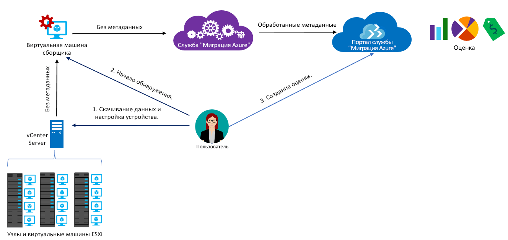

# Сведения о службе "Миграция Azure"

Служба "Миграция Azure" выполняет оценку локальных рабочих нагрузок для миграции в Azure. Оценивается пригодность локальных компьютеров для миграции, показатели производительности, на основе которых определяется требуемый размер, и расходы на работу локальных компьютеров в Azure. Эта служба подходит для миграции методом lift-and-shift, а также для начальных этапов оценки миграции. После оценки можно использовать такие службы, как [Azure Site Recovery](https://docs.microsoft.com/azure/site-recovery/site-recovery-overview) и [Azure Database Migration Service](https://docs.microsoft.com/azure/dms/dms-overview), чтобы перенести компьютеры в Azure.

## Зачем использовать службу "Миграция Azure"?

Служба "Миграция Azure" помогает выполнить следующие задачи:

- **Оценка готовности к работе в Azure.** Позволяет определить, подходят ли локальные компьютеры для работы в Azure. 
- **Выбор размера.** Рекомендации по размерам виртуальных машин Azure на основе журнала производительности локальных виртуальных машин. 
- **Оценка ежемесячных расходов.** Расчет затрат на работу локальных виртуальных машин в Azure.  
- **Миграция с высокой надежностью.** Визуализация зависимостей локальных виртуальных машин, позволяющая создавать группы виртуальных машин для совместной оценки и миграции. 

## Текущие ограничения

- Сейчас для перехода на виртуальные машины Azure можно оценить только локальные виртуальные машины VMware. Виртуальные машины VMware должны работать под управлением vCenter Server (версии 5.5, 6.0 или 6.5).
- Мы планируем реализовать поддержку Hyper-V. Пока для планирования миграции рабочих нагрузок Hyper-V рекомендуем использовать [Планировщик развертывания Azure Site Recovery](http://aka.ms/asr-dp-hyperv-doc). 
- Вы можете обработать до 1500 виртуальных машин при помощи одной операции обнаружения и до 1500 виртуальных машин в одном проекте. Кроме того, можно обработать до 1500 виртуальных машин при помощи одной операции оценки.
- Проект службы "Миграция Azure" можно создать только в регионах "Западно-центральная часть США" и "восточная часть США". Но это не влияет на планирование миграции для различных целевых расположений Azure. Расположение проекта миграции используется только для хранения метаданных из локальной среды.
- Служба "Миграция Azure" поддерживает только управляемые диски для оценки миграции.

## За что будет взиматься плата?

См. дополнительные сведения о [ценах на Миграцию Azure](https://azure.microsoft.com/en-in/pricing/details/azure-migrate/).

## Что такое оценка?

Оценка позволяет определить пригодность локальных виртуальных машин для Azure, получить рекомендации по выбору правильного размера и оценку затрат на запуск виртуальных машин в Azure. Оценку можно настроить в зависимости от потребностей, изменив ее свойства. Ниже приведены свойства, которые учитываются при создании оценки. 

**Свойство** | **Дополнительные сведения**
--- | ---
**Целевое расположение** | Расположение Azure для миграции.  Сейчас служба "Миграция Azure" поддерживает 30 регионов, включая Восточную Австралию, Юго-восточную Австралию, Южную Бразилию, Центральную часть Канады, Восточную часть Канады, Центральную Индию, Центральную часть США, Восток Китая, Север Китая, Азиатско-Тихоокеанский регион, Восток США, Центральную часть Германии, Северо-восток Германии, Восточную часть США 2, Восточную Японию, Западную Японию, Центральный регион Республики Корея, Южный регион Республики Корея, Северо-центральный регион США, Северную Европу, Юго-центральный регион США, Юго-Восточную Азию, Южную Индию, Южную часть Соединенного Королевства, Западную часть Соединенного Королевства, Западно-Центральную часть США, Западную Европу, Западную Индию, Западную часть США и Западную часть США 2. По умолчанию в качестве целевого расположения указана западная часть США 2. 
**Избыточность хранилища** | Тип [избыточности хранилища](https://docs.microsoft.com/azure/storage/common/storage-redundancy) для виртуальных машин Azure после миграции. По умолчанию используется локально избыточное хранилище (LRS). Обратите внимание, что служба "Миграция Azure" поддерживает только управляемые оценки на основе дисков, а управляемые диски поддерживают только LRS, поэтому сейчас свойство имеет только вариант LRS. 
**Условия определения размера** | Условия, используемые в службе "Миграция Azure", для установки правильного размера виртуальных машин Azure. Вы можете определять размер локальных виртуальных машин на основе *журнала производительности* или устанавливать для виртуальных машин Azure размер как *для локальных* без учета журнала производительности. По умолчанию установлен выбор размера на основе производительности.
**Тарифные планы** | Для расчета затрат при оценке учитывается, имеется ли у вас гарантия на программное обеспечение и распространяется ли на вас программа [Преимущество гибридного использования Azure](https://azure.microsoft.com/pricing/hybrid-use-benefit/). Кроме того, учитываются [предложения Azure](https://azure.microsoft.com/support/legal/offer-details/), в которых вы зарегистрированы, чтобы вы могли указать скидки для подписки (%), которые вы получаете в дополнение к предложению. 
**Ценовая категория** | Вы можете указать [ценовую категорию ("Базовый" или "Стандартный")](../virtual-machines/windows/sizes-general.md) целевых виртуальных машин Azure. Например, при планировании переноса рабочей среды можно рассмотреть использование уровня "Стандартный", который предоставляет виртуальные машины с низкой задержкой, но может быть более затратным. В среде разработки и тестирования, в свою очередь, можно использовать уровень "Базовый" с виртуальными машинами с большей задержкой, но меньшими затратами. По умолчанию применяется категория [Стандартный](../virtual-machines/windows/sizes-general.md).
**Журнал производительности** | Применяется, только если для изменения размера используется условие на основе производительности. По умолчанию в службе "Миграция Azure" оценивается производительность локальных компьютеров на основе журнала за последний день со значением процентиля 95 %. Вы можете изменить эти значения в свойствах оценки. 
**Фактор комфорта** | При оценке в службе "Миграция Azure" учитывается буфер (фактор комфорта). Этот буфер применяется на основе данных об использовании компьютера для виртуальных машин (показателей ЦП, памяти, диска и сети). Фактор комфорта учитывается, например, для сезонного использования и малого количества записей в журнале с потенциальным повышением в будущем.   Например, если виртуальная машина с 10 ядрами загружена на 20 %, обычно в результате оценки определяется виртуальная машина с 2 ядрами. Но с фактором комфорта 2.0x в результате определяется машина с 4 ядрами. По умолчанию используется фактор комфорта 1.3x.

## Как работает служба "Миграция Azure"?

1.  Создайте проект службы.
2.  Для получения сведений о локальных компьютерах в службе "Миграция Azure" используется локальная виртуальная машина, называемая модулем сборщика. Чтобы создать модуль, скачайте файл установки в формате Open Virtualization Appliance (OVA) и импортируйте его как виртуальную машину на локальный сервер vCenter Server.
3.  Подключитесь к виртуальной машине, используя подключение консоли на сервере vCenter Server. При подключении укажите новый пароль для виртуальной машины, а затем запустите приложение сборщика на виртуальной машине, чтобы начать обнаружение.
4.  Сборщик собирает метаданные виртуальной машины с помощью командлетов VMware PowerCLI. Обнаружение выполняется без агента и установки каких-либо компонентов на узлах или виртуальных машинах VMware. Собранные метаданные содержат информацию о виртуальной машине (сведения о ядрах, памяти, дисках, размерах дисков и сетевых адаптерах). Кроме того, собираются данные производительности для виртуальных машин, включая показатели использования ЦП и памяти, операций ввода-вывода для диска, пропускной способности диска (МБ/с) и выходные показатели сети (МБ/с).
5.  Метаданные отправляются в проект службы "Миграция Azure". Их можно просмотреть на портале Azure.
6.  Для оценки виртуальные обнаруженные виртуальные машины объединяются в группы. Например, вы можете сгруппировать виртуальные машины, на которых выполняется одно и то же приложение. Для более точного группирования вы можете использовать визуализацию зависимостей, чтобы просмотреть зависимости для определенной виртуальной машины или для всех машин в группе и уточнить группу.
7.  После формирования группы для нее проводится оценка. 
8.  По завершении оценки можно просмотреть ее результаты на портале или скачать их в формате Excel.

  

## Каковы требования к портам?

В следующей таблице содержится список портов для обмена данными со службой "Миграция Azure":

|Компонент          |Обмен данными     |Требуемый порт  |Причина   |
|-------------------|------------------------|---------------|---------|
|Сборщик          |со службой "Миграция Azure"   |TCP 443        |Сборщик подключается к службе через SSL-порт 443|
|Сборщик          |с сервером vCenter          |По умолчанию 9443   | По умолчанию сборщик подключается к серверу vCenter Server через порт 9443. Если сервер прослушивает другой порт, на виртуальной машине сборщика его нужно настроить как исходящий порт. |
|Локальная виртуальная машина     | Рабочая область Operations Management Suite (OMS)          |[TCP 443](../log-analytics/log-analytics-windows-agent.md) |Агент MMA использует TCP-порт 443 для подключения к Log Analytics. Этот порт требуется, только если используется визуализация зависимостей и устанавливается Microsoft Monitoring Agent (MMA). |

  
## Действия после оценки

Когда вы оцените локальные компьютеры в службе "Миграция Azure", можно использовать несколько средств для миграции:

- **Azure Site Recovery.** Выполнить миграцию в Azure при помощи Azure Site Recovery можно следующим образом:
  - Подготовьте ресурсы Azure, включая подписку Azure, виртуальную сеть Azure и учетную запись хранения.
  - Подготовьте локальные серверы VMware к миграции. Проверьте, поддерживает ли VMware требования для Site Recovery, подготовьте серверы VMware к обнаружению и подготовьте виртуальные машины, которые нужно перенести, к установке службы мобильности Site Recovery. 
  - Настройте миграцию. Настройте хранилище служб восстановления, исходные и целевые параметры миграции, политику репликации и включите репликацию. Вы можете запустить аварийное восстановление, чтобы проверить, правильно ли выполняется миграция виртуальной машины в Azure.
  - Выполните отработку отказа, чтобы перенести локальные компьютеры в Azure. 
  - Ознакомьтесь с [дополнительными сведениями](../site-recovery/tutorial-migrate-on-premises-to-azure.md) в руководстве по миграции с Site Recovery.

- **Azure Database Migration.** Если ваши локальные компьютеры работают с базой данных, такой как SQL Server, MySQL или Oracle, вы можете перенести ее в Azure при помощи Azure Database Migration Service. [Узнайте больше](https://azure.microsoft.com/campaigns/database-migration/).

## Дополнительная информация 
[Выполните задачи из этого руководства](tutorial-assessment-vmware.md), чтобы оценить локальную виртуальную машину VMware.