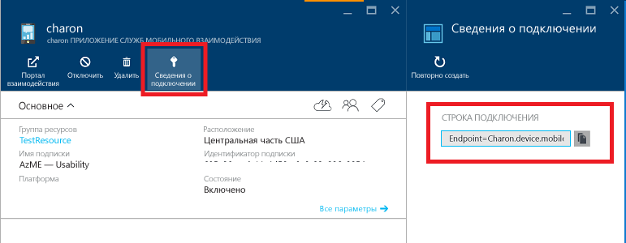

# Приступая к работе со Службами мобильного взаимодействия Azure для приложений Android
> [!IMPORTANT]
> Срок действия Служб мобильного взаимодействия истекает 31.03.2018. Вскоре после этого страница будет удалена.
> 

[!INCLUDE [Hero tutorial switcher](../../includes/mobile-engagement-hero-tutorial-switcher.md)]

В этой статье показано, как применять Службы мобильного взаимодействия Azure для анализа использования приложения и как отправлять push-уведомления сегментированным пользователям приложения Android.
В этом учебнике описывается простой сценарий вещания с использованием Служб мобильного взаимодействия. В рассматриваемом сценарии создается пустое приложение Android, которое собирает основные данные и получает push-уведомления с помощью службы Google Cloud Messaging (GCM).

## предварительным требованиям
Для прохождения этого учебника требуются [Средства разработчика Android](https://developer.android.com/sdk/index.html), которые включают в себя интегрированную среду разработки Android Studio и новейшую платформу Android.

Вам также понадобится [пакет SDK Android для Служб мобильного взаимодействия](https://aka.ms/vq9mfn).

> [!IMPORTANT]
> Для работы с этим руководством требуется активная учетная запись Azure. Если ее нет, можно создать бесплатную пробную учетную запись всего за несколько минут. Дополнительные сведения см. в разделе [Бесплатная пробная версия Azure](https://azure.microsoft.com/pricing/free-trial/?WT.mc_id=A0E0E5C02&amp;returnurl=http%3A%2F%2Fazure.microsoft.com%2Fen-us%2Fdocumentation%2Farticles%2Fmobile-engagement-android-get-started).
>
>

## Настройка Служб мобильного взаимодействия для вашего приложения Android
[!INCLUDE [Create Mobile Engagement App in Portal](../../includes/mobile-engagement-create-app-in-portal-new.md)]

## Подключение приложения к серверной части Служб мобильного взаимодействия
В этом руководстве описаны действия по базовой интеграции, т. е. минимум, необходимый для сбора данных и отправки push-уведомлений. Вы создадите основное приложение с помощью Android Studio, чтобы продемонстрировать интеграцию.

Документацию о полной интеграции можно найти в статье [Интеграция пакета Android SDK со Службами мобильного взаимодействия Azure](mobile-engagement-android-sdk-overview.md)в разделе об интеграции.

### Создание проекта Android
1. Запустите **Android Studio** и во всплывающем окне выберите элемент **Start a new Android Studio project** (Создать новый проект Android Studio).

    ![][1]
2. Укажите имя приложения и домен компании. Запишите указанные данные, они понадобятся вам в будущем. Нажмите кнопку **Далее**.

    ![][2]
3. Выберите целевой форм-фактор и уровень API, а затем нажмите кнопку **Next**(Далее).

   > [!NOTE]
   > Для Служб мобильного взаимодействия необходим уровень API минимум 10 (Android 2.3.3).
   >
   >

    ![][3]
4. Выберите экран **Blank Activity** (Пустое действие), который является единственным в этом приложении, и нажмите кнопку **Next** (Далее).

    ![][4]
5. В конце оставьте настройки по умолчанию и нажмите кнопку **Finish**(Готово).

    ![][5]

Android Studio создаст демонстрационное приложение, в которое мы интегрируем Службы мобильного взаимодействия.

### Включение библиотеки пакета SDK в проект
1. Скачайте [пакет SDK Android для Служб мобильного взаимодействия](https://aka.ms/vq9mfn).
2. Извлеките файл архива в папку на своем компьютере.
3. Определите библиотеку JAR-файлов для текущей версии этого пакета SDK и скопируйте ее в буфер обмена.

      ![][6]
4. Перейдите к разделу **Project** (Проект), обозначенному на рисунке цифрой 1, и вставьте JAR-файл в папку с библиотеками (обозначена цифрой 2).

      ![][7]
5. Чтобы скачать библиотеку, синхронизируйте проект.

      ![][8]

### Подключение приложения к серверной части Служб мобильного взаимодействия с помощью строки подключения
1. Скопируйте следующие строки кода в раздел создания действия (эта операция должна выполняться только в одном месте приложения, обычно в разделе основных действий). Для этого примера приложения откройте файл MainActivity в папке src > main -> java и добавьте следующий код.

        EngagementConfiguration engagementConfiguration = new EngagementConfiguration();
        engagementConfiguration.setConnectionString("Endpoint={appCollection}.{domain};AppId={appId};SdkKey={sdkKey}");
        EngagementAgent.getInstance(this).init(engagementConfiguration);
2. Добавьте ссылки, нажав сочетание клавиш ALT+ВВОД или добавив следующие операторы импорта.

        import com.microsoft.azure.engagement.EngagementAgent;
        import com.microsoft.azure.engagement.EngagementConfiguration;
3. Вернитесь на страницу **сведений о подключении** портала Azure для вашего приложения и скопируйте **строку подключения**.

      

4. Вставьте его в параметр `setConnectionString` (при этом нужно полностью заменить строку, показанную в следующем коде):

        engagementConfiguration.setConnectionString("Endpoint=my-company-name.device.mobileengagement.windows.net;SdkKey=********************;AppId=*********");

### Добавление разрешений и объявления службы
1. Добавьте эти разрешения в Manifest.xml проекта непосредственно перед тегом `<application>` или после него:

        <uses-permission android:name="android.permission.INTERNET"/>
        <uses-permission android:name="android.permission.ACCESS_NETWORK_STATE"/>
        <uses-permission android:name="android.permission.WRITE_EXTERNAL_STORAGE"/>
        <uses-permission android:name="android.permission.RECEIVE_BOOT_COMPLETED" />
        <uses-permission android:name="android.permission.VIBRATE" />
        <uses-permission android:name="android.permission.DOWNLOAD_WITHOUT_NOTIFICATION"/>
2. Чтобы объявить службу агента, добавьте следующий код между тегами `<application>` и `</application>`:

        <service
             android:name="com.microsoft.azure.engagement.service.EngagementService"
             android:exported="false"
             android:label="<Your application name>"
             android:process=":Engagement"/>
3. Во вставленном вами коде замените `"<Your application name>"` в метке, отображаемой в меню **Параметры** , в котором отображаются службы, запущенные на устройстве. Вы можете добавить в метку слово, например Service (служба).

### Отправка экрана в Службы мобильного взаимодействия
Чтобы начать отправку данных и убедиться, что пользователи активны, отправьте по крайней мере один экран (действие) в серверную часть Служб мобильного взаимодействия.

Откройте файл **MainActivity.java** и добавьте следующий код, чтобы заменить класс **MainActivity** классом **EngagementActivity**:

    public class MainActivity extends EngagementActivity {

> [!NOTE]
> Если базовый класс не является классом *Activity*, см. описание наследования из разных классов в разделе, посвященном [расширенной отчетности в Android](mobile-engagement-android-advanced-reporting.md).
>
>

Закомментируйте следующую строку этого простого примера сценария:

    // setSupportActionBar(toolbar);

Если хотите сохранить `ActionBar` в приложении, см. раздел [Изменение классов Activity](mobile-engagement-android-advanced-reporting.md).

## Подключение приложения с возможностью его отслеживания в режиме реального времени
[!INCLUDE [Connect app with real-time monitoring](../../includes/mobile-engagement-connect-app-with-monitor.md)]

## Включение push-уведомлений и обмена сообщениями в приложении
Во время кампаний Службы мобильного взаимодействия позволяют взаимодействовать с пользователями и ОХВАТЫВАТЬ АУДИТОРИЮ с помощью push-уведомлений и сообщений в приложении. На портале Служб мобильного взаимодействия этот модуль называется МОДУЛЕМ ОБРАБОТКИ РЕКЛАМНЫХ КАМПАНИЙ.
В следующем разделе показано, как настроить приложение для приема уведомлений и сообщений.

### Копирование ресурсов SDK в проект
1. Вернитесь к содержимому скачанного пакета SDK и скопируйте папку **res** .

    ![][10]
2. Вернитесь в Android Studio, выберите каталог **main** в файлах проекта и вставьте его, чтобы добавить ресурсы в проект.

    ![][11]

[!INCLUDE [Enable Google Cloud Messaging](../../includes/mobile-engagement-enable-google-cloud-messaging.md)]

[!INCLUDE [Enable in-app messaging](../../includes/mobile-engagement-android-send-push.md)]

[!INCLUDE [Send notification from portal](../../includes/mobile-engagement-android-send-push-from-portal.md)]

## Дополнительная информация
Подробные сведения об интеграции пакета SDK см. в статье [Интеграция пакета Android SDK с Azure Mobile Engagement](mobile-engagement-android-sdk-overview.md).

<!-- Images. -->
[1]: ./media/mobile-engagement-android-get-started/android-studio-new-project.png
[2]: ./media/mobile-engagement-android-get-started/android-studio-project-props.png
[3]: ./media/mobile-engagement-android-get-started/android-studio-project-props2.png
[4]: ./media/mobile-engagement-android-get-started/android-studio-add-activity.png
[5]: ./media/mobile-engagement-android-get-started/android-studio-activity-name.png
[6]: ./media/mobile-engagement-android-get-started/sdk-content.png
[7]: ./media/mobile-engagement-android-get-started/paste-jar.png
[8]: ./media/mobile-engagement-android-get-started/sync-project.png
[9]: ./media/mobile-engagement-android-get-started/app-connection-info-page.png
[10]: ./media/mobile-engagement-android-get-started/copy-resources.png
[11]: ./media/mobile-engagement-android-get-started/paste-resources.png
