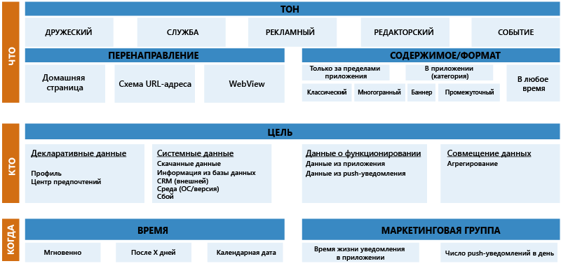
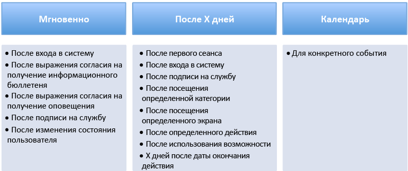

# Службы мобильного взаимодействия Azure. Руководство по началу работы и рекомендации
> [!IMPORTANT]
> Срок действия Служб мобильного взаимодействия истекает 31.03.2018. Вскоре после этого страница будет удалена.
> 

## Обзор
**На экранах мобильных устройств все меньше свободного места.** Согласно исследованию, проведенному в 2013 г., на одном мобильном устройстве установлено в среднем 27 приложений. На работу с мобильными приложениями пользователи обычно тратят 30 часов в месяц. Большая часть этого времени идет на социальные сети и игры (около 20 часов). В 2014 г. в магазине Android Market было около 1,5 млн приложений. Магазин Apple Store содержал примерно 1,2 млн приложений. Использование мобильных приложений продолжает расти, а разработчики конкурируют друг с другом на этом развивающемся рынке. 

Среднестатистический пользователь мобильного устройства очень часто устанавливает и удаляет приложения в зависимости от того, как меняются его интересы и работа в самом приложении. Чтобы определить успешность приложения, важно знать не только количество пользователей, установивших приложение, но и насколько полезно это приложение и изменяется ли тенденция его использования. Становятся важными следующие вопросы:

* Начинают ли пользователи считать ваше приложение неинтересным или устаревшим? 
* Сколько пользователей полностью перестали пользоваться приложением? 
* Повышается или понижается количество покупок из приложения?
* Пользователи не завершают рабочие процессы из-за проблем в приложении или из-за отсутствия интереса? 
* Можно ли сохранить полезность и актуальность приложения, добавив для контингента пользователей новое содержимое? 
* Будет ли это содержимое одинаковым для всех пользователей или оно будет предназначено для отдельных сегментов пользователей (которые будут выбраны на основании того, как они работают с приложением)? 

Ответы на подобные вопросы помогут продлить срок работы приложения и повысить вашу прибыль от него. Кроме того, они помогут вам определить базу пользователей и сохранить ее. 

Приложения, связанные с мультимедийными данными, имеют, как правило, более высокий показатель удержания. Одной из причин этого является то, что в таких приложениях всегда есть новое содержимое для пользователей. Раннее внедрение полезных push-уведомлений, направленных на определенный сегмент пользователей, имеет, как правило, большее влияние на удержание приложения. 

Службы мобильного взаимодействия Azure предназначены для того, чтобы помочь вам продлить срок работы и удержания приложения. Для этого они предоставляют способ сбора и анализа подробных сведений об использовании вашего приложения. Эта служба поможет классифицировать базу пользователей в соответствии с их поведением, а также создать целевые кампании по отправке push-уведомлений и сообщений в приложении для определенных сегментов пользователей. Ключевые показатели эффективности определяют, насколько активны пользователи в работе с различными аспектами приложения. Службы мобильного взаимодействия Azure предоставляют методы определения этих ключевых показателей эффективности. Она поможет повысить рентабельность инвестиций, создавая инфраструктуру, необходимую для того, чтобы увеличить продолжительность использования мобильного приложения. 

Для наиболее эффективного использования Служб мобильного взаимодействия Azure начинать необходимо с правильно составленного плана привлечения. Этот план поможет определить подробные данные, которые понадобятся для сегментирования базы пользователей. Он может основываться на поведении и работе пользователей в приложении. Чтобы ваш план принес хорошие результаты, мы рекомендуем четко определить ключевые показатели эффективности, по которым будет оцениваться достижение целей приложения. Если показатели эффективности определены четко, вы сможете легко внедрить необходимую логику в приложение, предназначенную для сбора подробных данных, которые будут использоваться для анализа и оценки ключевых показателей эффективности. Рекомендации в этой статье помогут вам задать ключевые показатели эффективности, которые будут использоваться в вашем плане привлечения. 

## Шаг 1. Определение ключевых показателей эффективности для соответствия модели БПТ
Правильно задать ключевые показатели эффективности может быть непросто. Приложения, разработанные для разных отраслей, имеют разные особенности и цели. Это может запутать вас и привести к ошибкам. Чтобы избежать этого, цели и ключевые показатели эффективности следует разделить на три основные категории: **бизнес**, **привлечение** и **техника**. Это называется **модель БПТ**.

Хороший план обычно имеет цели с ключевыми показателями эффективности, измеряющими показатели успешности в каждой из следующих категорий модели БПТ.

#### Ключевые показатели эффективности бизнеса
Ключевые показатели эффективности бизнеса создать проще всего. Вероятно, в определенном виде вы их уже обозначили, когда планировали свое мобильное приложение. Обычно эти ключевые показатели эффективности помогают определить доход приложения и рентабельность инвестиций в него. Ниже приведены примеры ключевых показателей эффективности бизнеса, которые помогут вам в определении показателей эффективности.

* Ключевые показатели эффективности бизнеса — мультимедиа:
  * количество рекламных объявлений, по которым осуществлены переходы;
  * количество посещений страницы на одного пользователя;
  * количество текущих подписок.
* Ключевые показатели эффективности бизнеса — игры:
  * количество покупок из приложений;
  * средний доход на одного пользователя;
  * время, потраченное на сеанс;
  * дни игр и текущий уровень в игре.
* Ключевые показатели эффективности бизнеса — электронная коммерция:
  * количество дней использования приложения;
  * средний доход на одного пользователя;
  * средняя сумма в корзине при оформлении заказа;
  * категория продукта для большинства просмотров и покупок.
* Ключевые показатели эффективности бизнеса — банки и страховые компании:
  * количество счетов;
  * активированные функции;
  * посещение страниц с предложениями;
  * переход по предупреждениям или их активация.       

#### Ключевые показатели эффективности привлечения
Ключевой показатель эффективности привлечения — это индикатор эффективности, показывающий привлечение пользователей. Тенденции в этой области помогают определить удержание приложения. Вот несколько примеров показателей эффективности для этого ключевого показателя эффективности:

* активные пользователи за последние 7 дней;
* количество неактивных пользователей за последние 7 дней;
* количество пользователей, которые не использовали приложение в течение 30 дней.  

Некоторые очевидные внешние факторы могут влиять на показатели в этой области. Например, вы считаете, что мобильное устройство постоянно находится у пользователя. Это может быть соответствовать действительности, а может и не соответствовать. Игровые приложения обычно используются чаще в период каникул или праздников, когда игроки проводят больше нерабочего или неучебного времени за играми.   

Правильно определенные ключевые показатели эффективности в этой категории должны помочь вам определить взаимодействие ваших клиентов с вашим приложением.

#### Технические ключевые показатели эффективности
Показатели эффективности в этой категории помогут определить, правильно ли работает ваше приложение, перестает ли оно отвечать или аварийно завершает работу. Эти показатели помогут измерить работоспособность приложения и определить проблемы, возникающие при использовании, из-за которых пользователи не используют приложение. Сведения, собранные для этой категории, могут содержать также информацию о производительности, полезную для маркетологов. Данные могут быть полезны ИТ-специалистам для устранения неполадок, а также службам поддержки для выявления недокументированных ошибок. 

Ниже приведены примеры технических ключевых показателей эффективности:

* сведения о необработанных или обработанных исключениях и их количество; 
* метка времени последнего сбоя;
* последняя нажатая кнопка или последняя посещенная страница;
* использование памяти приложением;
* частота кадров приложения;
* версия ОС, в которой используется приложение;
* версия приложения.

Определите эти ключевые показатели эффективности, чтобы узнать эффективность приложения и выявить потенциальные ошибки. Эти показатели должны сократить время, необходимое для выпуска исправления для клиентов. Кроме того, они могут помочь определить сегмент пользователей, которые столкнулись с определенной проблемой. Такое разделение пользователей на сегменты можно использовать для создания кампаний по доставке уведомлений о доступных исправлениях и возможных рекламных акций, чтобы восстановить удовлетворенность клиента. 

#### Тренировочное задание 1. Создание таблицы мониторинга ключевых показателей эффективности
Когда вы определяете маркетинговую стратегию, ваши ключевые показатели эффективности должны отображать каждую основную цель. Это должны быть четко определенные точки данных, которые позволят собирать важные сведения для мониторинга приложения и поведения конечного пользователя.

Создайте таблицу мониторинга ключевых показателей эффективности, которая содержит следующие данные:

1. Каковы ключевые показатели эффективности для приложения?
2. Какие точки данных будут использоваться для представления каждого ключевого показателя эффективности?
3. Где находятся эти данные в приложении (на экране, в параметрах, системе и т. д.)?
4. Можно ли воспроизвести последовательность привлечения для этого ключевого показателя эффективности?

Примеры и руководства можно найти в таблице **Конструктор ключевых показателей эффективности** в [шаблоне сборника тренировочных заданий для мультимедиа][Media Playbook link].

## Шаг 2. Программа привлечения
Хорошо спланированная программа привлечения должна являться ключевым компонентом вашего приложения. Она обязательно должна включать в себя правильно организованную программу приветствия, реализуемую для пользователя в первые дни использования приложения. Это оказывает положительное влияние на привлечение и удержание приложения. Исследования показывают, что большинство пользователей перестают пользоваться приложением в первые несколько дней после его установки. Вы должны стремиться удовлетворить ожидания клиента или превысить их, вызвав интерес с самого начала, пока пользователь заинтересован в вашем приложении. Обязательно продемонстрируйте клиентам ключевые преимущества и ценность приложения. 

Push-уведомления являются наилучшим подходом для раннего взаимодействия с пользователями мобильных устройств. Однако следует обратить особое внимание на разделение пользователей на сегменты для push-уведомлений. Ведь если пользователь почувствует, что он получает нежелательные или неинтересные уведомления, это может иметь серьезные последствия. Несколькими щелчками пользователь может удалить ваше приложение. Больше он никогда не вернется к нему. Пользователь должен получать в приложении персонализированные уведомления, а не однотипный спам.

Как только пользователи будут активно задействованы, ваша программа привлечения сможет продвигать другие аспекты приложения.

Например, вы сможете создать кампанию по оценке вашего приложения активными пользователями. Поскольку этот сегмент пользователей наиболее активен и имеет больше всего опыта использования вашего приложения, ожидается, что они дадут наиболее точную оценку. Когда у вашего приложения будет высокая оценка, это может стимулировать его загрузку, уменьшив ваши затраты на привлечение новых клиентов.

#### Последовательность привлечения
Глобальная программа привлечения включает в себя различные последовательности привлечения. Каждая последовательность предназначена для достижения нескольких целей.

###### Push-последовательность для разных сроков использования
Цели этой push-последовательности зависят от срока, в течение которого пользователь работает с приложением. Пользователь может быть новым, неактивным или очень активным. На различных этапах жизненного цикла привлечения пользователи могут получать преимущества от нового контента в виде подсказок или ссылок на документацию. 

Например, новому пользователю может понадобиться помощь для начала работы с приложением. Ему могут быть полезны также побудительные сообщения для новых пользователей, отображаемые при первом запуске приложения, наподобие приведенного ниже.

*«Рады видеть Вас среди наших пользователей! Войдите в систему, чтобы получить месяц бесплатного пользования».*

###### Поведенческая push-последовательность
Целью поведенческой push-последовательности является повышение использования приложения на основе данных о поведении пользователя, собранных для приложения.  

Например, очень активный пользователь приложения для игры в футбол может получить преимущества от следующих push-уведомлений.

*«Артем, Вы активный фанат футбола. Войдите в наш раздел о Национальной футбольной лиге и выиграйте бесплатный доступ к игре "Супер Боул"».*

###### Оповещающая push-последовательность
Пользователи оценят релевантные новости на интересующие их темы. Оповещающая push-последовательность повышает привлечение путем отправки уведомления на основе интересов, четко продемонстрированных пользователем. Это может происходить явно, когда пользователь выбирает свои интересы в приложении. Также интересы могут определяться косвенно на основе данных, собранных в процессе взаимодействия пользователя с приложением.

Например, пользователь приложения электронной коммерции может регулярно покупать кофе определенной торговой марки, что можно отследить с помощью ключевого показателя эффективности бизнеса. Следующее оповещение может повысить привлечение этого пользователя приложением.

*«Здравствуйте, Сергей! На одну из Ваших любимых торговых марок кофе будет скидка 25 % на первой неделе сентября 2015 г. Мы хотели сообщить Вам об этом, так как ценим то, что Вы являетесь нашим клиентом».*

###### Push-последовательность удержания
Цель этой последовательности заключается в сохранении пользователей с помощью повторяющихся кампаний push-уведомлений, которые помогают выработать у пользователей привычку регулярной работы с приложением. Это может увеличить степень удержания приложения, если пользователю нравится работать с ним. 

Например, пользователь спортивного приложения может каждую неделю получать следующие push-уведомления о своих любимых спортивных командах:

*«Получите шанс выиграть 200 баллов: угадайте, выиграет ли на этой неделе «Динамо» у «Челси».*

#### Подход «Кто, что, когда»
Освоение различных push-последовательностей поможет вам наладить контакт с конечными пользователями. Однако для персонализации уведомлений вам нужно будет воспользоваться подходом «Кто, что, когда». Этот подход учитывает ответы на вопросы «кто?», «что?» и «когда?» для каждого уведомления. Если вы четко ответите на эти три вопроса, ваши уведомления будут правильно сфокусированы при привлечении.

###### Кто — сегмент пользователей, получающих сообщения
Принудительная отправка уведомлений пользователям — это способ общения с ними, требующий особого внимания. Убедитесь, что уведомления, предназначенные для отправки сегменту пользователей, точно соответствуют интересам этого сегмента. Неправильное уведомление, скорее всего, произведет на пользователя неприятное впечатление. Это уведомление могут воспринять как нежелательное, что приведет к удалению приложения. 

Используйте сочетание определенных технических и поведенческих критериев при определении сегментов пользователей, которые будут получать уведомления. Простым примером определения сегмента пользователей может являться следующее утверждение:

«Все пользователи, запустившие мобильное приложение первый раз 3 дня назад и дважды посетившие страницу для входа, не выполнив вход».

Это утверждение помогает идентифицировать данные, которые необходимо собрать для поддержки конкретного сценария.

###### Что — отправляемое сообщение
**Тон**

Для привлечения используйте тон, который подходит для данного сегмента пользователей. Это однозначно хороший способ наладить взаимосвязь с конечными пользователями и повысить уровень заинтересованности пользователей в вашем приложении. 

**Перенаправление**

Push-уведомления можно использовать не только для открытия приложения. Если сообщение уведомления содержит контекст, например новости или рекламу товара, такое уведомление может содержать прямую ссылку непосредственно на нужное содержимое в приложении. Для этого необходимо создать схему URL-адресов, чтобы приложения управляли перенаправлением. При работе с последовательностями привлечения необходимо помнить об этом важном шаге.

Кроме того, вы можете управлять перенаправлением для других систем. Например, с помощью URL-адреса действия можно перенаправлять конечных пользователей на множество других систем, включая следующие:

* веб-сайт;
* почтовый ящик с уже настроенным адресом электронной почты;
* входящие SMS-сообщения;
* служба набора номеров;
* непосредственно в магазин приложения для его оценки. 

Это предоставляет множество возможностей для привлечения конечных пользователей и создания автоматических правил для повышения эффективности.

**Формат и содержимое**

Различные типы и форматы push-уведомлений:

1. **Объявления.** Позволяют отправлять пользователям рекламные сообщения в различные моменты (когда пользователь не в приложении, в приложении или в любое время).
2. **Опросы.** Позволяют собирать информацию от конечных пользователей, задавая им вопросы. Эти ответы будут доступны при создании условий для целевых конечных пользователей.
3. **Отправка данных.** Позволяет отправлять файлы двоичных данных и файлы данных Base64 для обновления приложения. Информация, содержащаяся в отправленных данных, отправляется в приложение для персонализации работы пользователей с вашим приложением. Приложение должно быть разработано так, чтобы оно поддерживало данные в отправленных данных.
4. **Плитки (только в Windows Phone).** Позволяют использовать службу push-уведомлений (Майкрософт) (MPNS) для отправки системных push-уведомлений с XML-данными. (Поддерживается начиная с пакета SDK версии 0.9.0. объем окончательных полезных данных в плитках не может превышать 32 КБ). Сообщение отображается непосредственно на плитке на начальном экране.
5. **Веб-представление.** Это всплывающее окно с веб-содержимым. Это всплывающее окно отображается при щелчке пользователя на push-уведомление. Веб-представление позволяет больше взаимодействовать с пользователем.

> [!NOTE]
> Убедитесь, что отправляемое в виде push-уведомлений содержимое соответствует руководствам по разработке приложений и отправке push-уведомлений для соответствующей платформы (iOS, Android, Windows).
> 
> 

###### Когда — время проведения кампании
Когда лучше всего начинать кампанию по отправке push-уведомлений? Как проводить кампанию — вручную или автоматически? Должна ли компания повторяться? Определение правильного времени или частоты позволяет привлекать пользователей максимально эффективно. Для каждой последовательности и сценария привлечения необходимо определить лучшее время для отправки push-уведомлений. Ниже приведено несколько примеров.

Если вы ежедневно отправляете множество уведомлений, следует тщательно подумать, не воспринимают ли пользователи такие уведомления как нежелательные. 

Службы мобильного взаимодействия Azure предлагают два способа, которые помогут избежать восприятия ваших сообщений как нежелательных. Во-первых, используйте детальную сегментацию, чтобы не нацеливаться на одних и тех же пользователей. Кроме того, Службы мобильного взаимодействия Azure дают возможность пользоваться функцией квот. Эта функция может ограничить количество уведомлений, отправляемых в рамках одной кампании. Например, если для квоты по умолчанию задать значение «5 в неделю», пользователь, входящий в сегмент пользователей кампании, получит не больше 5 уведомлений в течение этой недели.

#### Тренировочное задание 2. Создание собственной программы привлечения
Выделите время на постановку целей и определение кампаний, которые вы планируете провести с использованием конкретных последовательностей. Обязательно используйте для уведомлений в вашей кампании подход «Кто, что, когда». 

Используйте примеры и руководства из таблицы **Программа привлечения** в [шаблоне сборника тренировочных заданий для мультимедиа][Media Playbook link].

## Шаг 3. Интеграция приложения
#### Создание плана тегов
Для интеграции Служб мобильного взаимодействия Azure в веб-приложение необходимо создать план тегов. План тегов является ключевым элементом проекта. Он определяет взаимосвязь между маркетинговыми требованиями, рабочим процессом приложения и реальными данными тегов, собранными в приложении для определения ключевых показателей эффективности. Он указывает, какие аналитические данные вы увидите на портале. Кроме того, этот план помогает определять сегменты пользователей и отправлять конкретные push-уведомления для привлечения конечных пользователей. Создав план тегов, можно легко добавить код, чтобы интегрировать план в приложение. Для этого нужно воспользоваться пакетом SDK для Служб мобильного взаимодействия Azure.

План тегов не должен помечать тегами все данные в приложении. Он должен включать только те данные тегов, которые являются частью вашей стратегии мобильного привлечения. Скорее всего, он будет варьироваться в зависимости от приложения. [Шаблон сборника тренировочных заданий для мультимедиа][Media Playbook link], предоставляемый Службами мобильного взаимодействия Azure, помогает создать план тегов с помощью определенного метода. Используйте лист **План тегов** как руководство по созданию своего плана тегов.

Задавая раздел тегов в листе, необходимо быть очень точным. Это необходимо для того, чтобы не допустить путаницы. Для каждого тега подробно опишите ожидаемый сценарий, при возникновении которого этот тег будет отправлен. Укажите название действия, в которое внедряется каждый тег. Все эти сведения должны быть включены в раздел листа **Информативный** . Лист с планом тегов должна быть основным справочным материалом для тестирования. 

В разделе **Собираемые данные** группа разработчиков должна найти типы, имена, значения и пары раздел-значение для дополнительных сведений, необходимых для каждого тега, который будет внедрен в приложение.

Мы рекомендуем ознакомить с планом тегов всех участников команды, работающей над проектом. Внесите необходимые исправления и убедитесь, что группам маркетинга и разработки понятны все детали.

С помощью листа **Описание работы** вы можете руководить всеми участниками проекта.

#### Типы данных
Это общие типы данных, поддерживаемые Службами мобильного взаимодействия Azure.

###### Устройства и пользователи
Службы мобильного взаимодействия Azure идентифицируют пользователей, создавая уникальный идентификатор для каждого устройства. Этот идентификатор называется идентификатором устройства (или deviceid). Он создается таким образом, что все приложения, запущенные на одном устройстве, используют один идентификатор устройства.

###### Сеансы и действия
Сеанс — это один экземпляр приложения, запускаемый пользователем. Сеанс означает время с момента запуска приложения пользователем до момента его закрытия.

Действие — это логическое объединение набора операций, которые приложение может выполнять во время сеанса. Обычно это конкретный экран в приложении, но оно может быть любым элементом, определяемым логикой приложения. Как минимум следует обозначить тегом каждый экран или действие в приложении. Это позволит понять действия пользователя.

###### События
События используются для обозначения взаимодействия пользователя с приложением. Это может быть мгновенное действие (например, обмен содержимым) или запуск видео. Добавление тегов к событиям позволяет получить наборы данных, которые показывают, как пользователи взаимодействуют с приложением. 

###### Задания
Задания используются для создания отчетов о действиях, которые имеют длительность. Вот некоторые примеры:

* выполнение вызовов API;
* время отображения рекламы;
* длительность выполнения фоновых задач; 
* длительность процесса покупки;
* просмотр видео.

###### Errors
На основании ошибок создаются отчеты о проблемах, обнаруженных приложением, например о неправильных действиях пользователя или сбоях вызова API.

###### Сведения о приложении
Сведения о приложении используются для маркировки данных, связанных с работой пользователя с приложением. Они создаются путем взаимодействия пользователя с приложением. 

Для конкретного раздела сведений о приложении Службы мобильного взаимодействия Azure отслеживают только последнее значение (без журнала). Сведения о приложении показывают состояние приложения или конечных пользователей, например состояние входа или избранную группу продуктов пользователя.

###### Данные о сбоях
Данные о сбоях, автоматически собираемые пакетом SDK для Служб мобильного взаимодействия, — это сведения о сбоях, не обработанных приложением. Это, например, сведения о каком-нибудь необработанном исключении.

###### Дополнительные данные
События, ошибки, действия и задания могут дополняться данными о параметрах. Это дополнительные сведения, которые разработчик может предоставить в качестве определенных данных из приложения. Они важны для определения детальной сегментации. 

Например, значение тега «article» позволит разделить конечных пользователей на сегменты в зависимости от того, кто просматривал конкретную статью. Однако этого может быть недостаточно. Возможно, будет лучше, если тот же тег «article» в рамках действия также включал бы в себя дополнительные сведения, например «news_category». Это помогло бы динамически определить для пользователя избранные категории. 

Дополнительные сведения входят в отчет как пара «раздел — значение». В примере для этого мультимедийного приложения дополнительными сведениями «news_category» будет значение этой категории. Например, «спорт», «экономика» или «политика».

#### Тег и интеграция пакета SDK
Пошаговые инструкции для интеграции пакета SDK для Служб мобильного взаимодействия Azure в приложении см. в статье [Интеграция пакета SDK Engagement для универсальных приложений для Windows](mobile-engagement-windows-store-integrate-engagement.md) на веб-сайте Azure. Вверху страницы выберите ссылку для целевой платформы.

Мы рекомендуем создавать проекты двух приложений, разработанных на основе Служб мобильного взаимодействия Azure. Одно для стадии разработки и тестирования, а другое — для стадии производства. При успешном приемочном тестировании пользователями ваша ИТ-группа может перейти от этапа тестирования к производству.

#### Приемочное тестирование пользователями
Приемочное тестирование пользователями предназначено для того, чтобы проверить, что все работает как следует и  что рабочие процессы завершаются успешно и собирают все необходимые данные в соответствии с планом тегов.

* Маркировка информации тегами должна соответствовать задокументированным концепциям AZME.
* Собраны все необходимые сведения (включая значение дополнительных сведений и значение сведений о приложении).
* Номенклатура соответствует плану тегов.
* Дубликаты тегов не отправляются.

Тщательно проверьте поведение всех типов уведомлений, внедренных в приложение:

* объявления, опросы, отправка данных из приложения и в него;
* текстовые представления и веб-представления;
* обновление индикаторов событий, категории.

#### Настройка
Настройка решения Служб мобильного взаимодействия Azure очень проста. Вся документация, связанная с пользовательским интерфейсом, доступна на веб-сайте Служб мобильного взаимодействия Azure [Навигация по пользовательскому интерфейсу](mobile-engagement-user-interface-home.md).

Мы рекомендуем начать с настройки правильных ролей и членства в них для пользователей вашего проекта. Это поможет настроить необходимые права доступа к платформе для всех пользователей. Можно настроить такие роли:

* Администраторы
* Разработчики
* Наблюдатели 

Затем выполните следующие действия.

* Зарегистрируйте идентификатор устройства (deviceID), чтобы протестировать свое устройство.
* Перейдите на страницу параметров учетной записи и настройте часовой пояс, чтобы время в диаграммах и время доставки уведомлений совпадало с вашим часовым поясом.
* Перейдите на страницу параметров приложения и зарегистрируйте информацию о приложении, необходимую для выбора конечных пользователей в пределах охвата.

Дополнительные сведения о запуске первой кампании push-уведомлений см. в статье [Начало работы с push-уведомлениями и управление ими для взаимодействия с конечными пользователями](mobile-engagement-how-tos.md).

## Заключение
Программы привлечения — это повторяющиеся программы, поэтому, по мере того как вы выясняете и копируете самые подходящие аспекты и параметры для вашего приложения, вам нужно постоянно совершенствовать свою программу. 

Вначале, когда у вас еще нет опыта в разработке стратегий привлечения, не пытайтесь полностью выстроить всю глобальную стратегию. Определяя ключевые аспекты эффективности и способы их использования, действуйте поэтапно. Стратегия привлечения будет уникальна для каждого отдельного приложения.

Накопив опыт в разработке таких программ, попробуйте добавить в программы привлечения следующие компоненты:

* Отслеживание: вы приобретаете пользователей и, возможно, определяете источники сбора данных. Службу Azure Mobile Engagement можно связать с источниками сбора данных. Это позволяет отслеживать производительность каждого источника. Данная информация будет полезна для повышения инвестиций приобретения. 
* A/B-тестирование — это важная часть программы привлечения. Каждое приложение имеет свои собственные характеристики. Благодаря А/В-тестированию вы можете улучшить программу привлечения.
* Географическое расположение — это большие возможности для торговых марок. С помощью этой функции вы можете охватить пользователей в нужном месте и в нужное время. Мы рекомендуем перед началом использования географического расположения убедиться, что собрано достаточно данных о поведении конечных пользователей.
* Принудительная отправка данных — это фоновая отправка. Принудительная отправка данных позволяет настроить приложение в соответствии с поведением конечных пользователей. Например, если пользователи определенного сегмента часто просматривают информацию о высокотехнологичных продуктах, владелец приложения может принудительно отправить данные, которые добавят на домашнюю страницу пользователя содержимое, относящееся к таким продуктам.

## Дальнейшие действия
* [Создание учетной записи Служб мобильного взаимодействия Azure](mobile-engagement-create.md)
* Чтобы получить дополнительные сведения об определении стратегии Служб мобильного взаимодействия, посетите раздел [Определение стратегии Служб мобильного взаимодействия](mobile-engagement-define-your-mobile-engagement-strategy.md).

<!--Image references-->

<!--Link references-->
[Media Playbook link]: https://github.com/Azure/azure-mobile-engagement-samples/tree/master/Playbooks
