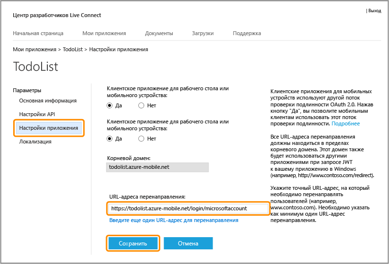

<properties 
	pageTitle="Регистрация для проверки подлинности Microsoft: мобильные службы" 
	description="Узнайте, как зарегистрироваться, чтобы использовать аутентификацию Майкрософт в приложении мобильных служб Azure." 
	authors="ggailey777" 
	services="mobile-services" 
	documentationCenter="Mobile" 
	manager="dwrede" 
	editor=""/>

<tags 
	ms.service="mobile-services" 
	ms.workload="mobile" 
	ms.tgt_pltfrm="NA" 
	ms.devlang="multiple" 
	ms.topic="article" 
	ms.date="05/07/2015" 
	ms.author="glenga"/>

# Регистрация приложения для использования учетной записи Майкрософт для проверки подлинности

В этом разделе показано, как зарегистрировать мобильное приложение для использования учетной записи Майкрософт в качестве поставщика удостоверений с мобильными службами Azure. Одни и те же действия применяются как для управляемой службой, так и управляемой клиентом проверки подлинности с помощью пакета Live SDK.

##Регистрация приложения Магазина Windows в Центре разработки для Windows

Приложения Магазина Windows сначала должны быть зарегистрированы в Центре разработки для Windows.

>[AZURE.NOTE]Информация в этом разделе неприменима к приложениям Windows Phone 8, Windows Phone 8.1 Silverlight, а также приложениям, отличным от Windows.

1. Если вы еще не зарегистрировали свое приложение, перейдите к разделу [Отправить страницу приложения] в центре разработчиков для приложений Магазина Windows, выполните вход с использованием вашей учетной записи Майкрософт и затем щелкните **Имя приложения**.

   	

2. Выберите **Создание нового приложения с резервированием уникального имени** и нажмите кнопку **Продолжить**, затем введите имя приложения в поле **Имя приложения**, щелкните **Зарезервировать имя приложения** и нажмите кнопку **Сохранить**.

   	

   	При этом создается новая регистрация в Магазине Windows для вашего приложения.

3. В Visual Studio откройте проект, который вы создали после завершения учебника [Приступая к работе с мобильными службами].

4. В обозревателе решений щелкните правой кнопкой мыши проект приложения Магазина Windows, щелкните **Магазин** и затем нажмите **Связать приложение с Магазином...**.

  	

   	Откроется мастер **Связь приложений с Магазином Windows**.

5. В окне мастера щелкните **Войти** и войдите в систему с помощью учетной записи Майкрософт, выберите имя приложения, зарезервированное на шаге 2, нажмите кнопку **Далее**, а затем щелкните **Связать**.

   	Это добавляет необходимые регистрационные данные Магазина Windows в манифест приложения.

6. (Необязательно.) Чтобы зарегистрировать универсальное приложение Windows, повторите шаги 4 и 5 для проекта Магазина Windows Phone.

6. На странице Центра разработчиков Windows для нового приложения щелкните **Службы**.

   	

7. На странице "Службы" щелкните по **узлу службы Live** в разделе **Мобильные службы Azure**.

	

Откроется страница учетной записи Майкрософт для вашего приложения.

## Настройка регистрации учетной записи Майкрософт и подключение к мобильным службам

Первый шаг в этом разделе касается только приложений Windows Phone 8, Windows Phone 8.1 Silverlight и приложений, отличных от Магазина Windows. Для этих приложений также можно игнорировать пакет идентификатора безопасности (SID), который доступен только для приложений Магазина Windows.

1. Для приложений, отличных от Магазина Windows, перейдите на страницу <a href="http://go.microsoft.com/fwlink/p/?LinkId=262039" target="_blank">Мои приложения</a> в центре по разработке учетной записи Майкрософт, войдите с помощью учетной записи Майкрософт (если требуется), щелкните **Создать приложения**, введите **имя приложения** и нажмите кнопку **Принимаю**.

   	Имя приложения резервируется для учетной записи Майкрософт, и отображается страница учетной записи Майкрософт для вашего приложения.

2. На странице учетной записи Майкрософт для вашего приложения, щелкните **Параметры API**, выберите включение **клиентского приложения для мобильных устройств или рабочего стола**, задайте URL-адрес мобильной службы как **Целевой домен**, укажите значение `https://<mobile_service>.azure-mobile.net/login/microsoftaccount/` в параметре **URL-адрес перенаправления**, затем нажмите кнопку **Сохранить**.

	 >[AZURE.NOTE]Для серверной мобильной службы .NET, опубликованной в Azure с помощью Visual Studio, URL-адресом перенаправления является URL вашей мобильной службы, дополненный путем _signin-microsoft_ мобильной службы как службы .NET, например `https://todolist.azure-mobile.net/signin-microsoft`.

    

	**Корневой домен** должен быть заполнен автоматически.

4. Щелкните **Параметры приложений** и запишите значения полей **Идентификатор клиента**, **Секрет клиента** и **Идентификатор безопасности пакета**.

   	

    > [AZURE.NOTE]Секрет клиента — это важные учетные данные безопасности. Не сообщайте никому этот секрет клиента и не распространяйте его вместе со своим приложением. Поле "Идентификатор безопасности пакета" отображается при регистрации только приложений Магазина Windows.

4. В [портале управления Azure] откройте вкладку **Идентификатор** мобильной службы, введите идентификатор клиента, секрет клиента и идентификатор безопасности пакета, полученные от поставщика удостоверений, а затем нажмите кнопку **Сохранить**.

 	
	
	>[AZURE.NOTE]Не требуется задавать значение идентификатора безопасности пакета для приложений Windows Phone 8, Windows Phone Store 8.1 Silverlight или приложений, отличных от Windows.
	
Мобильная служба и приложение теперь настроены для работы с учетной записью Майкрософт.

<!-- Anchors. -->

<!-- Images. -->

<!-- URLs. -->

[Отправить страницу приложения]: http://go.microsoft.com/fwlink/p/?LinkID=266582
[My Applications]: http://go.microsoft.com/fwlink/p/?LinkId=262039

[портале управления Azure]: https://manage.windowsazure.com/

<!--HONumber=54-->