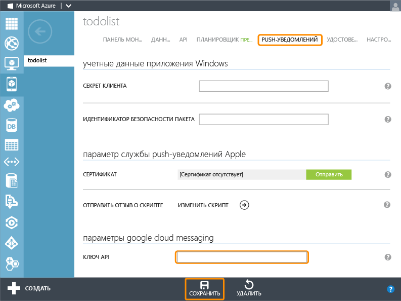

<properties urlDisplayName="Get Started with Push (JS)" pageTitle="Приступая к работе с push-уведомлениями (Android JavaScript) | Центр мобильных разработок" metaKeywords="" description="Learn how to use Azure Mobile Services to send push notifications to your Android JavaScript app." metaCanonical="http://www.windowsazure.com/ru-ru/develop/mobile/tutorials/get-started-with-push-dotnet/" services="mobile-services,notification-hubs" documentationCenter="Mobile" title="Get started with push notifications in Mobile Services " authors="ricksal"  solutions="" writer="ricksal" manager="dwrede" editor=""   />

<tags ms.service="mobile-services" ms.workload="mobile" ms.tgt_pltfrm="Mobile-Android" ms.devlang="Java" ms.topic="article" ms.date="10/16/2014" ms.author="ricksal" />

# Добавление push-уведомлений в приложение мобильной службы

[WACOM.INCLUDE [mobile-services-selector-get-started-push](../includes/mobile-services-selector-get-started-push.md)]

В этом разделе показано, как использовать мобильные службы Azure для отправки push-уведомлений в приложение Android с помощью Google Cloud Messaging (GCM). В этом учебнике вам предстоит использовать push-уведомления с помощью центров уведомлений Azure в проекте быстрого запуска. По завершении работы ваша мобильная служба будет отправлять push-уведомление каждый раз при вставке записи.

В этом учебнике рассматриваются следующие основные шаги для включения push-уведомлений:

1. [Включение Google Cloud Messaging](#register)
2. [Настройка мобильных служб](#configure)
3. [Добавление push-уведомлений в приложение](#add-push)
4. [Обновление сценариев для отправки push-уведомлений](#update-scripts)
5. [Вставка данных для получения уведомлений](#test)

>[AZURE.NOTE] Если вы хотите посмотреть исходный код готового приложения, перейдите <a href="https://github.com/RickSaling/mobile-services-samples/tree/futures/GettingStartedWithPush/Android" target="_blank">здесь</a>.

##Предварительные требования

[WACOM.INCLUDE [mobile-services-android-prerequisites](../includes/mobile-services-android-prerequisites.md)]

##Включение Google Cloud Messaging

>[WACOM.NOTE]Для выполнения этой процедуры необходима учетная запись Google с проверенным электронным адресом. Чтобы создать учетную запись Google, перейдите по ссылке <a href="http://go.microsoft.com/fwlink/p/?LinkId=268302" target="_blank">accounts.google.com</a>.

[WACOM.INCLUDE [Включение GCM](../includes/mobile-services-enable-Google-cloud-messaging.md)]

Далее вы будете использовать это значение ключа API, чтобы предоставить мобильным службам возможность выполнять аутентификацию с использованием GCM и отправлять push-уведомления от имени своего приложения.

##Настройка мобильных служб для отправки push-запросов

1. Войдите на [портал управления Azure], щелкните **Мобильные службы**, а затем щелкните свое приложение.

   	

2. Перейдите на вкладку **Push-уведомления**, введите значение параметра **Ключ API**, полученное от GCM при выполнении предыдущей процедуры, а затем нажмите кнопку **Сохранить**.

	>[WACOM.NOTE]При изучении этого учебника с использованием старой мобильной службы вы можете увидеть внизу вкладки **Push-уведомления** ссылку **Включение улучшенных push-уведомлений**. Щелкните по ней, чтобы обновить мобильную службу и интегрировать ее с центрами уведомлений. Это изменение нельзя будет отменить. Подробности включения улучшенных push-уведомлений в рабочей мобильной службе см. <a href="http://go.microsoft.com/fwlink/p/?LinkId=391951">в этом руководстве</a>.

   	

    
<b>Важно!</b>
	
При задании учетных данных GCM для улучшенных push-уведомлений на вкладке Push-уведомления портала эти сведения передаются в концентраторы уведомлений в целях настройки концентратора уведомлений с вашим приложением.

    

Мобильная служба и приложение теперь настроены для работы с GCM и центрами уведомлений.

##Добавление push-уведомлений в приложение

###Проверка версии Android SDK

[WACOM.INCLUDE [Проверка пакета SDK](../includes/mobile-services-verify-android-sdk-version.md)]

Далее следует установить службы Google Play. Google Cloud Messaging предъявляет некоторые требования к минимальному уровню API для разработки и тестирования, которым должно удовлетворять свойство **minSdkVersion** в манифесте. 

Если вы будете тестировать приложение на более старом устройстве, обратитесь к руководству [Set Up Google Play Services SDK] (Настройка пакета SDK служб Google Play), чтобы определить, насколько малым можно задать это значение.

###Добавление служб Google Play в проект

[WACOM.INCLUDE [Добавление служб Google Play](../includes/mobile-services-add-Google-play-services.md)]

###Добавление кода

[WACOM.INCLUDE [mobile-services-android-getting-started-with-push](../includes/mobile-services-android-getting-started-with-push.md)]

##Обновление зарегистрированных сценариев вставки на портале управления

1. На портале управления щелкните вкладку **Данные**, а затем щелкните таблицу **TodoItem**. 

   	

2. В **todoitem** перейдите на вкладку **Сценарий** и выберите **Вставка**.
   
  	

   	При этом отображается функция, вызываемая при выполнении вставки в таблице **TodoItem**.

3. Замените функцию вставки следующим кодом и нажмите кнопку **Сохранить**:

		function insert(item, user, request) {
		// Define a payload for the Google Cloud Messaging toast notification.
		var payload = {
		    data: {
		        message: item.text 
		    }
		};		
		request.execute({
		    success: function() {
		        // If the insert succeeds, send a notification.
		        push.gcm.send(null, payload, {
		            success: function(pushResponse) {
		                console.log("Sent push:", pushResponse, payload);
		                request.respond();
		                },              
		            error: function (pushResponse) {
		                console.log("Error Sending push:", pushResponse);
		                request.respond(500, { error: pushResponse });
		                }
		            });
		        },
		    error: function(err) {
		        console.log("request.execute error", err)
		        request.respond();
		    }
		  });
		}

   	При этом регистрируется новый сценарий вставки, в котором [объект gcm] используется для отправки push-уведомлений на все зарегистрированные устройства после успешной вставки данных. 

##Тестирование push-уведомлений в приложении

Приложение можно проверить, подключив телефон Android напрямую с помощью USB-кабеля или используя виртуальное устройство в эмуляторе.

###Настройка эмулятора для тестирования

При запуске этого приложения в эмуляторе убедитесь, что используется виртуальное устройство на платформе Android (AVD), поддерживающее API-интерфейсы Google.

1. Перезапустите Eclipse, в обозревателе пакетов щелкните правой кнопкой мыши проект, щелкните **Свойства**, выберите **Android**, установите флажок **API-интерфейсы Google**, а затем нажмите кнопку **ОК**.

	

  	Проект будет предназначен для API-интерфейсов Google.

2. В разделе **Window** (Окно) выберите **Android Virtual Device Manager** (Диспетчер виртуальных устройств Android), выберите ваше устройство и щелкните **Edit** (Изменить).

	

3. Выберите **Google APIs** (API-интерфейсы Google) в разделе **Target** (Цель), а затем нажмите кнопку ОК.

   	

	При этом виртуальное устройство на платформе Android будет предназначено для использования API-интерфейсов Google.

###Выполнение теста

1. В меню **Run** (Выполнить) в Eclipse щелкните **Run** (Выполнить) для запуска приложения.

2. В приложении введите содержательный текст (например, _Новая задача для мобильных служб_) и нажмите кнопку **Добавить**.

  	

3. Проведите пальцем вниз с верхней части экрана, чтобы открыть центр уведомлений для просмотра уведомления.

Вы успешно завершили ознакомление с данным учебником.

## Дальнейшие действия

<!---This tutorial demonstrated the basics of enabling an Android app to use Mobile Services and Notification Hubs to send push notifications. Next, consider completing the next tutorial, [Send push notifications to authenticated users], which shows how to use tags to send push notifications from a Mobile Service to only an authenticated user.

+ [Send push notifications to authenticated users]
	 Learn how to use tags to send push notifications from a Mobile Service to only an authenticated user.

+ [Send broadcast notifications to subscribers]
	 Learn how users can register and receive push notifications for categories they're interested in.

+ [Send template-based notifications to subscribers]
	 Learn how to use templates to send push notifications from a Mobile Service, without having to craft platform-specific payloads in your back-end.
-->

Дополнительные сведения о мобильных службах и концентраторах уведомлений см. в следующих разделах.

* [Приступая к работе с данными]
   Дополнительная информация о хранении данных и запросах к ним при помощи мобильных служб.

* [Приступая к работе с аутентификацией]
   Дополнительная информация об аутентификации учетных данных пользователей приложения с другими типами учетных записей с использованием мобильных служб.

* [Что такое центры уведомлений?]
   Дополнительные сведения о работе центров уведомлений по доставке уведомлений в приложения на всех основных клиентских платформах.

* [Отладочные приложения для центров уведомлений](http://go.microsoft.com/fwlink/p/?linkid=386630)
   Руководство по устранению неполадок и решения по отладке центров уведомлений. 

* [Использование клиентской библиотеки Android для мобильных служб]
   Дополнительная информация об использовании мобильных служб с Android.

* [Mobile Services server script reference]
   Дополнительная информация о реализации бизнес-логики в вашей мобильной службе.

<!-- Anchors. -->
[Регистрация приложения для push-уведомлений и конфигурация мобильных служб]: #register
[Обновление созданного кода push-уведомлений]: #update-scripts
[Вставка данных для получения уведомлений]: #test
[Дальнейшие действия]:#next-steps

<!-- Images. -->
[13]: ./media/mobile-services-windows-store-javascript-get-started-push/mobile-quickstart-push1.png
[14]: ./media/mobile-services-windows-store-javascript-get-started-push/mobile-quickstart-push2.png

<!-- URLs. -->
[Отправка страницы приложения]: http://go.microsoft.com/fwlink/p/?LinkID=266582
[Мои приложения]: http://go.microsoft.com/fwlink/p/?LinkId=262039
[Live SDK для Windows]: http://go.microsoft.com/fwlink/p/?LinkId=262253
[Приступая к работе с мобильными службами]: /ru-ru/documentation/articles/mobile-services-android-get-started/
[Приступая к работе с данными]: /ru-ru/documentation/articles/mobile-services-android-get-started-data/
[Приступая к работе с аутентификацией]: /ru-ru/documentation/articles/mobile-services-android-get-started-users
[Приступая к работе с push-уведомлениями]: /ru-ru/develop/mobile/tutorials/get-started-with-push-js
[Push-уведомлений для пользователей приложений]: /ru-ru/develop/mobile/tutorials/push-notifications-to-users-js
[Авторизация пользователей с помощью сценариев]: /ru-ru/develop/mobile/tutorials/authorize-users-in-scripts-js
[JavaScript и HTML]: /ru-ru/develop/mobile/tutorials/get-started-with-push-js
[Set Up Google Play Services SDK] (Настройка пакета SDK служб Google Play): http://go.microsoft.com/fwlink/?LinkId=389801
[Портал управления Azure]: https://manage.windowsazure.com/
[Использование клиентской библиотеки Android для мобильных служб]: /ru-ru/documentation/articles/mobile-services-android-how-to-use-client-library

[Объект gcm]: http://go.microsoft.com/fwlink/p/?LinkId=282645

[Справочник серверных сценариев мобильных служб]: http://go.microsoft.com/fwlink/?LinkId=262293

[Рассылка push-уведомлений проверенным пользователям]: /ru-ru/documentation/articles/mobile-services-javascript-backend-android-push-notifications-app-users/

[Что такое центры уведомлений?]: /ru-ru/documentation/articles/notification-hubs-overview/
[Рассылка уведомлений подписчикам]: /ru-ru/documentation/articles/notification-hubs-android-send-breaking-news/
[Рассылка уведомлений по шаблону подписчикам]: /ru-ru/documentation/articles/notification-hubs-android-send-localized-breaking-news/

<!--HONumber=35.1-->
