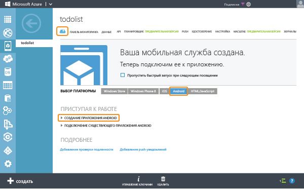

<properties 
	pageTitle="Начало работы с мобильными службами Azure для приложений Android" 
	description="Следуйте указаниям этого учебника, чтобы приступить к использованию мобильных служб Azure для разработки приложений Android." 
	services="mobile-services" 
	documentationCenter="android" 
	authors="RickSaling" 
	manager="dwrede" 
	editor=""/>

<tags 
	ms.service="mobile-services" 
	ms.workload="mobile" 
	ms.tgt_pltfrm="mobile-android" 
	ms.devlang="java" 
	ms.topic="hero-article" 
	ms.date="04/09/2015" 
	ms.author="ricksal"/>

# Приступая к работе с мобильными службами

[AZURE.INCLUDE [mobile-services-selector-get-started](../../includes/mobile-services-selector-get-started.md)]

В этом учебнике показано, как добавить облачную серверную службу в приложение Android с помощью мобильных служб Azure. В этом учебнике вы создадите новую мобильную службу и простое приложение <em>To do list</em>, хранящее данные приложения в новой мобильной службе.

Снимок экрана завершенного приложения приведен ниже:

<a href="http://channel9.msdn.com/Series/Windows-Azure-Mobile-Services/Android-Support-in-Windows-Azure-Mobile-Services" target="_blank" class="label">просмотр учебника</a> <a style="background-image: url('/media/devcenter/mobile/videos/mobile-get-started-android-180x120.png') !important;" href="http://channel9.msdn.com/Series/Windows-Azure-Mobile-Services/Android-Support-in-Windows-Azure-Mobile-Services" target="_blank" class="dev-onpage-video">Воспроизведение видео</a>7:26

## Предварительные требования

Для прохождения этого учебника требуются [Средства разработчика Android][Android Studio], которые включают в себя интегрированную среду разработки Android Studio и новейшую платформу Android. Требуется Android 4.2 или более поздняя версия. 

Загруженный проект быстрого запуска содержит пакет SDK мобильных служб Azure для платформы Android.

> [AZURE.IMPORTANT] Для работы с этим учебником требуется учетная запись Azure. Если ее нет, можно создать бесплатную пробную учетную запись всего за несколько минут. Дополнительные сведения см. в разделе [Бесплатная пробная версия Azure](http://azure.microsoft.com/pricing/free-trial/?WT.mc_id=AE564AB28).

## Создание мобильной службы

[AZURE.INCLUDE [mobile-services-create-new-service](../../includes/mobile-services-create-new-service.md)]

## Создание нового приложения для Android

После создания мобильной службы вы можете следовать простым шагам быстрого запуска на портале управления, чтобы создать новое приложение или изменить существующее приложение и подключить его к вашей мобильной службе. 

В этом разделе будет создано новое приложение на платформе Android, которое будет подключено к вашей мобильной службе.

1.  На портале управления щелкните **Мобильные службы**, а затем выберите только что созданную мобильную службу.

2. На вкладке быстрого запуска нажмите кнопку **Android** в разделе **Выбор платформы**, а затем разверните раздел **Создать новое приложение на Android**.

   	

   	Здесь показаны три простых шага для создания приложения на платформе Android, подключенного к вашей мобильной службе.

  	

3. Если это еще не было сделано, загрузите и установите [Средства разработчика Android][SDK Android] на своем локальном компьютере или виртуальной машине.

4. Чтобы создать таблицу для хранения данных приложения, нажмите кнопку **Создание таблицы TodoItem**.

5. Загрузите приложение:
	- В новейшей версии приложения используется пакет Android SDK для мобильных служб версии 2.0. Эту версию можно загрузить <a href="https://github.com/RickSaling/mobile-services-samples/tree/futures">здесь</a>. Нажмите кнопку **Download Zip** (Загрузить ZIP-файл), распакуйте архив. Проект находится в папке GettingStarted внутри папки Android.
	 
	- В более ранней версии используется предыдущая версия пакета SDK. Для ее использования в разделе **Загрузка и запуск приложения** щелкните **Загрузить**. При этом будут загружены файлы проекта для примера по созданию приложения _Список задач_, подключаемого к вашей мобильной службе. Файлы проекта будут сжаты, поэтому перейдите к их расположению и распакуйте файлы на вашем компьютере.

## Запуск приложения для Android

[AZURE.INCLUDE [mobile-services-run-your-app](mobile-services-android-get-started.md)]

### Просмотр кода (необязательно)

Если требуется просмотреть исходный код завершенного приложения, см. [здесь](https://github.com/RickSaling/mobile-services-samples/tree/androidStudio/GettingStarted/AndroidStudio).

Для просмотра версии этого учебника для Eclipse перейдите к пункту: [Начало работы (Eclipse)](mobile-services-android-get-started-EC.md).

## Дальнейшие действия
Теперь, когда вы закончили быстрый запуск, узнайте, как выполнять дополнительные важные задачи в мобильных службах: 

* [Приступая к работе с данными]
   Дополнительные сведения о хранении данных и запросах к ним с помощью мобильных служб.

* [Приступая к работе с аутентификацией]
   Дополнительные сведения о проверке подлинности пользователей приложения с использованием поставщика удостоверений.

* [Приступая к работе с push-уведомлениями] 
   Сведения об отправке в приложение простейших push-уведомлений.

<!-- Anchors. -->
[Приступая к работе с мобильными службами]:#getting-started
[Создание новой мобильной службы]:#create-new-service
[Определение экземпляра мобильной службы]:#define-mobile-service-instance
[Дальнейшие действия]:#next-steps

<!-- Images. -->
[0]: ./media/mobile-services-android-get-started/mobile-quickstart-completed-android.png
[6]: ./media/mobile-services-android-get-started/mobile-portal-quickstart-android.png
[7]: ./media/mobile-services-android-get-started/mobile-quickstart-steps-android-AS.png
[8]: ./media/mobile-services-android-get-started/mobile-eclipse-quickstart.png
[10]: ./media/mobile-services-android-get-started/mobile-quickstart-startup-android.png
[11]: ./media/mobile-services-android-get-started/mobile-data-tab.png
[12]: ./media/mobile-services-android-get-started/mobile-data-browse.png
[14]: ./media/mobile-services-android-get-started/mobile-services-import-android-workspace.png
[15]: ./media/mobile-services-android-get-started/mobile-services-import-android-project.png

<!-- URLs. -->
[Начало работы (Eclipse)]: mobile-services-android-get-started-EC.md
[Приступая к работе с данными]: mobile-services-android-get-started-data.md
[Приступая к работе с аутентификацией]: mobile-services-android-get-started-users.md
[Get started with push notifications]: mobile-services-javascript-backend-android-get-started-push.md
[Android SDK]: https://go.microsoft.com/fwLink/p/?LinkID=280125
[Android Studio]: https://developer.android.com/sdk/index.html
[Пакет Android SDK для мобильных служб]: https://go.microsoft.com/fwLink/p/?LinkID=266533

[Портал управления]: https://manage.windowsazure.com/

<!--HONumber=52--> 