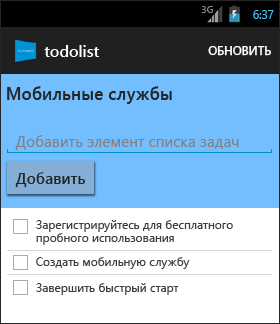

<properties
	pageTitle="Начало работы с мобильными службами Azure для приложений Android"
	description="Следуйте указаниям этого учебника, чтобы приступить к использованию мобильных служб Azure для разработки приложений Android."
	services="mobile-services"
	documentationCenter="android"
	authors="RickSaling"
	manager="dwrede"
	editor=""/>

<tags
	ms.service="mobile-services"
	ms.workload="mobile"
	ms.tgt_pltfrm="mobile-android"
	ms.devlang="java"
	ms.topic="get-started-article"
	ms.date="11/05/2015"
	ms.author="ricksal"/>

# Приступая к работе с мобильными службами

[AZURE.INCLUDE [mobile-service-note-mobile-apps](../../includes/mobile-services-note-mobile-apps.md)]

&nbsp;

[AZURE.INCLUDE [mobile-services-selector-get-started](../../includes/mobile-services-selector-get-started.md)]&nbsp;

[AZURE.INCLUDE [mobile-services-hero-slug](../../includes/mobile-services-hero-slug.md)]

В этом учебнике показано, как добавить облачную серверную службу в приложение Android с помощью мобильных служб Azure. В этом учебнике вы создадите новую мобильную службу и простое приложение _To do list_, хранящее данные приложения в новой мобильной службе. В создаваемой мобильной службе с помощью Visual Studio используются поддерживаемые языки .NET для серверной бизнес-логики, а также для управления мобильной службой. Сведения о создании мобильной службы, которая позволит создавать в JavaScript серверную бизнес-логику, см. в подразделе [Серверная версия JavaScript](mobile-services-android-get-started.md) этого раздела.

Снимок экрана завершенного приложения приведен ниже:

Для прохождения этого учебника требуются [Средства разработчика Android][Android Studio], которые включают в себя интегрированную среду разработки Android Studio и новейшую платформу Android. Требуется Android 4.2 или более поздняя версия.

Загруженный проект быстрого запуска содержит пакет SDK мобильных служб для платформы Android.

> [AZURE.IMPORTANT] Для работы с этим учебником требуется учетная запись Azure. Если у вас нет учетной записи, можно зарегистрироваться для получения бесплатной пробной версии Azure и получить до 10 бесплатных мобильных служб, которые можно использовать и после окончания пробного периода. Дополнительные сведения см. в разделе [Бесплатная пробная версия Azure](https://azure.microsoft.com/pricing/free-trial/?WT.mc_id=AE564AB28).

## Создание мобильной службы

[AZURE.INCLUDE [mobile-services-dotnet-backend-create-new-service](../../includes/mobile-services-dotnet-backend-create-new-service.md)]

## Скачивание мобильной службы на локальный компьютер

Теперь, когда мобильная служба создана, загрузите персональный проект мобильной службы, которая может выполняться на локальном компьютере или виртуальной машине.

1. Щелкните только что созданную мобильную службу, затем на вкладке быстрого запуска в разделе **Выберите платформу** выберите **Android** и разверните элемент **Создание нового приложения Android**.

	![][1]

2. Если вы еще не сделали этого, скачайте и установите [Visual Studio Professional 2013](https://go.microsoft.com/fwLink/p/?LinkID=391934) или более поздней версии.

3. На шаге 2 выберите **Загрузить** в разделе **Загрузка и публикация службы в облаке**.

	При этом загружается проект Visual Studio, реализующий мобильную службу. Сохраните сжатый файл проекта на локальный компьютер и запомните путь к нему.

## Тестирование мобильной службы

[AZURE.INCLUDE [mobile-services-dotnet-backend-test-local-service](../../includes/mobile-services-dotnet-backend-test-local-service.md)]

## Публикация мобильной службы

[AZURE.INCLUDE [mobile-services-dotnet-backend-publish-service](../../includes/mobile-services-dotnet-backend-publish-service.md)]

## Создание нового приложения для Android

В этом разделе будет создано новое приложение на платформе Android, которое будет подключено к вашей мобильной службе.

1. На [классическом портале Azure] щелкните **Мобильные службы** и выберите только что созданную мобильную службу.

2. На вкладке быстрого запуска нажмите кнопку **Android** в разделе **Выбор платформы**, а затем разверните раздел **Создать новое приложение на Android**.

	![][2]

3. Если вы еще не сделали этого, загрузите и установите [Средств разработчика Android][Android SDK] на ваш локальный компьютер или виртуальную машину.

4. В разделе **Загрузка и запуск приложения** щелкните **Загрузить**.

  	При этом будут загружены файлы проекта для примера по созданию приложения _To do list_, подключаемого к вашей мобильной службе. Сохраните сжатый файл проекта на локальном компьютере и запомните путь к нему.

## Запуск приложения для Android

[AZURE.INCLUDE [mobile-services-run-your-app](../../includes/mobile-services-android-get-started.md)]

## Дальнейшие действия
Теперь, когда вы закончили быстрый запуск, узнайте, как выполнять дополнительные важные задачи в мобильных службах:

* [Добавление push-уведомлений в приложение]  Узнайте, как отправлять в приложение простейшие push-уведомления.

* [Добавление проверки подлинности в приложение]  Узнайте, как предоставить доступ к серверным данным только определенным зарегистрированным пользователям приложения.

* [Устранение неполадок серверной части в мобильных службах .NET]  Узнайте, как определять и исправлять неполадки, которые могут возникнуть в серверной части мобильных служб для .NET.

<!-- Anchors. -->
[Getting started with Mobile Services]: #getting-started
[Create a new mobile service]: #create-new-service
[Define the mobile service instance]: #define-mobile-service-instance
[Next Steps]: #next-steps

<!-- Images. -->
[0]: ./media/mobile-services-dotnet-backend-android-get-started/mobile-quickstart-completed-android.png
[1]: ./media/mobile-services-dotnet-backend-android-get-started/mobile-quickstart-steps-vs-AS.png
[2]: ./media/mobile-services-dotnet-backend-android-get-started/mobile-quickstart-steps-android-AS.png

[6]: ./media/mobile-services-dotnet-backend-android-get-started/mobile-portal-quickstart-android.png
[7]: ./media/mobile-services-dotnet-backend-android-get-started/mobile-quickstart-steps-android.png
[8]: ./media/mobile-services-dotnet-backend-android-get-started/mobile-eclipse-quickstart.png

[10]: ./media/mobile-services-dotnet-backend-android-get-started/mobile-quickstart-startup-android.png
[11]: ./media/mobile-services-dotnet-backend-android-get-started/mobile-data-tab.png
[12]: ./media/mobile-services-dotnet-backend-android-get-started/mobile-data-browse.png

[14]: ./media/mobile-services-dotnet-backend-android-get-started/mobile-services-import-android-workspace.png
[15]: ./media/mobile-services-dotnet-backend-android-get-started/mobile-services-import-android-project.png

<!-- URLs. -->
[Get started (Eclipse)]: mobile-services-dotnet-backend-android-get-started-ec.md
[Добавление push-уведомлений в приложение]: mobile-services-dotnet-backend-android-get-started-push.md
[Добавление проверки подлинности в приложение]: mobile-services-dotnet-backend-android-get-started-auth.md
[Android SDK]: https://go.microsoft.com/fwLink/p/?LinkID=280125
[Android Studio]: https://developer.android.com/sdk/index.html
[Mobile Services Android SDK]: https://go.microsoft.com/fwLink/p/?LinkID=266533
[Устранение неполадок серверной части в мобильных службах .NET]: mobile-services-dotnet-backend-how-to-troubleshoot.md

[классическом портале Azure]: https://manage.windowsazure.com/

<!---HONumber=AcomDC_0128_2016-->