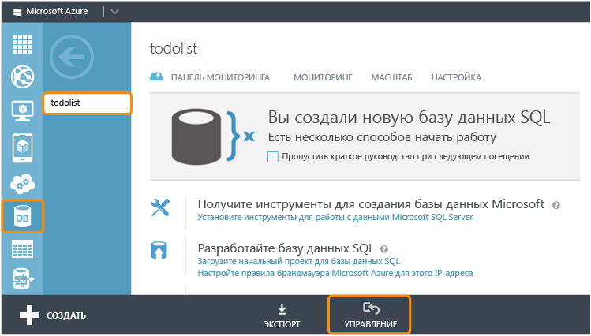

<properties 
	pageTitle="Добавление мобильных служб в существующее приложение (Windows Phone) | Центр разработчиков для мобильных устройств" 
	description="Узнайте, как приступить к работе с мобильными службами, чтобы использовать данные в приложении Windows Phone." 
	services="mobile-services" 
	documentationCenter="windows" 
	authors="wesmc7777" 
	manager="dwrede" 
	editor=""/>

<tags 
	ms.service="mobile-services" 
	ms.workload="mobile" 
	ms.tgt_pltfrm="mobile-windows-phone" 
	ms.devlang="dotnet" 
	ms.topic="article" 
	ms.date="05/12/2015" 
	ms.author="wesmc"/>

# Добавление мобильных служб к существующему приложению

##Обзор

[AZURE.INCLUDE [mobile-services-selector-get-started-data-legacy](../../includes/mobile-services-selector-get-started-data-legacy.md)]

В этом разделе показано, как добавить мобильные службы Azure в качестве серверного источника данных для приложения Windows Phone 8.1 Silverlight. В этом учебнике вам предстоит скачать проект Visual Studio для приложения, хранящего данные в памяти, создать новую мобильную службу, интегрировать мобильную службу с приложением и просмотреть изменения, внесенные в данные во время работы приложения. Сведения о добавлении мобильных служб для приложения магазина Windows Phone 8.1. см. в [данной версии учебника](mobile-services-dotnet-backend-windows-universal-dotnet-get-started-data.md).

Создаваемая в этом учебнике мобильная служба будет поддерживать среду выполнения .NET в компоненте мобильных служб. Это позволит использовать языки .NET и Visual Studio для серверной бизнес-логики в мобильной службе. Сведения о создании мобильной службы, которая позволит создавать в JavaScript серверную бизнес-логику, см. в подразделе [Серверная версия JavaScript](mobile-services-windows-phone-get-started-data.md) этого раздела.

##Предварительные требования

Для работы с данным учебником требуется следующее:

+ Visual Studio Professional 2013 с обновлением 2 или более поздней версии.
+ Учетная запись Microsoft Azure. Если ее нет, можно создать бесплатную пробную учетную запись всего за несколько минут. Дополнительные сведения см. в разделе <a href="http://azure.microsoft.com/pricing/free-trial/?WT.mc_id=AE564AB28&amp;returnurl=http%3A%2F%2Fazure.microsoft.com%2Fru-ru%2Fdocumentation%2Farticles%2Fmobile-services-dotnet-backend-windows-store-dotnet-get-started-data%2F" target="_blank">Бесплатная пробная версия Azure</a>. 

##Загрузка проекта GetStartedWithData

Этот учебник основан на приложении [GetStartedWithMobileServices](https://code.msdn.microsoft.com/Add-Azure-Mobile-to-a-8b906f72) — проекте приложения Windows Phone Silverlight 8.1 в Visual Studio 2013.

1. Загрузите версию примера приложения GetStartedWithMobileServices на C# с веб-сайта [Примеры кода для разработчиков](https://code.msdn.microsoft.com/Add-Azure-Mobile-to-a-8b906f72). 

	>[AZURE.NOTE]Чтобы создать приложение для Windows Phone Silverlght 8.1, в скачанном проекте приложения для Windows Phone Silverlight 8 измените целевую ОС на Windows Phone 8.1. Чтобы создать приложение для Магазина Windows Phone, при скачивании примера проекта приложения GetStartedWithData выберите версию [приложения для Магазина Windows Phone](http://go.microsoft.com/fwlink/p/?LinkId=397372).

2. Запустите Visual Studio с привилегиями администратора. Для этого щелкните правой кнопкой мыши Visual Studio и выберите **Запуск от имени администратора**.

3. В Visual Studio откройте скачанный проект и просмотрите файл MainPage.xaml.cs.

   	Обратите внимание, что добавленные объекты **TodoItem** хранятся во внутренней памяти в **ObservableCollection&lt;TodoItem&gt;**.

4. В Visual Studio выберите целевой объект развертывания для приложения. Можно выполнить развертывание на устройство Windows Phone или в один из эмуляторов, входящих в пакет Windows Phone SDK. В этом учебнике будет показано развертывание в эмуляторе.

5. Нажмите клавишу **F5**. При этом выполняется сборка, развертывание и запуск приложения для отладки.

6. В приложении введите любой текст в текстовом поле, а затем щелкните **Сохранить**, чтобы сохранить несколько элементов во внутренней памяти приложения.

   	

   	Заметьте, что для каждого элемента `TodoItem` текст отображается под кнопкой обновления вместе с флажком, который позволяет помечать завершенные элементы.

##Создание мобильной службы

[AZURE.INCLUDE [mobile-services-dotnet-backend-create-new-service](../../includes/mobile-services-dotnet-backend-create-new-service.md)]

##Загрузка проекта мобильной службы и его добавление в решение

1. Если вы еще не сделали этого, скачайте и установите [Visual Studio Professional 2013](https://go.microsoft.com/fwLink/p/?LinkID=391934) или более поздней версии.
 
2. На [портале управления Azure](https://manage.windowsazure.com/) щелкните новую мобильную службу и на странице быстрого запуска выберите платформу **Windows**. Затем в разделе **Приступая к работе** разверните область **Подключение существующего приложения Windows или Windows Phone**.

    

4. В разделе **Скачивание и публикация службы в облаке** щелкните элемент **Скачать**.

	При этом загружается проект Visual Studio, реализующий мобильную службу.

4. Распакуйте персонализированное стартовое решение службы, которые вы загрузили. Затем скопируйте папки, находившиеся в ZIP-файле, в тот же каталог **C#**, где размещен файл решения для начала работы с данными (SLN-файл). Так диспетчеру пакетов NuGet будет проще обеспечивать синхронизацию всех пакетов.

5. В обозревателе решений Visual Studio щелкните правой кнопкой мыши решение для начала работы с приложением для обработки данных для Магазина Windows. Щелкните **Добавить**, затем щелкните **Существующий проект**.

6. В диалоговом окне **Добавление существующего проекта** перейдите в папку проекта мобильной службы, которую вы переместили в каталог **C#**, выберите файл проекта C# (CSPROJ) в подкаталоге службы и нажмите кнопку **Открыть** для добавления проекта в решение.

7. В обозревателе решений Visual Studio щелкните правой кнопкой мыши только что добавленный проект службы и выберите **Сборка**, чтобы убедиться, что сборка выполняется без ошибок. Во время сборки диспетчеру пакетов NuGet может потребоваться восстановить некоторые пакеты NuGet, на которые имеются ссылки в проекте.

8. Еще раз щелкните правой кнопкой мыши проект службы. На этот раз выберите команду **Запустить новый экземпляр** в контекстном меню **Отладка**.

    В Visual Studio открывается веб-страница по умолчанию для вашей службы. Щелкните **Попробовать сейчас**, чтобы с веб-страницы по умолчанию протестировать методы в мобильной службе.

    

    Visual Studio по умолчанию размещает мобильную службу локально в IIS Express. Чтобы увидеть это, щелкните правой кнопкой мыши значок для IIS Express на панели задач.

##Изменение приложения для Windows Phone для использования мобильной службы

В этом разделе вы обновите приложение Windows Phone, чтобы использовать мобильную службу в качестве серверной службы для приложения.

1. В обозревателе решений Visual Studio щелкните правой кнопкой мыши проект приложения для Магазина Windows и выберите **Управление пакетами NuGet**.

2. В диалоговом окне «Управление пакетами NuGet» выполните поиск **WindowsAzure.MobileServices** в коллекции пакетов в Интернете и щелкните пакет Nuget для мобильных служб Azure, чтобы установить его. Затем закройте диалоговое окно.

    

3. Вернитесь на портал управления Azure и найдите шаг **Подключение приложения и хранение данных в службе**. Скопируйте фрагмент кода, который создает подключение `MobileServiceClient`.

    

4. В Visual Studio откройте файл App.xaml.cs. Вставьте фрагмент кода в начале определения класса `App`. Также добавьте следующую инструкцию `using` в верхнюю часть этого файла, затем сохраните файл.

		using Microsoft.WindowsAzure.MobileServices;

5. В Visual Studio откройте файл MainPage.xaml.cs и в верхней части файла добавьте следующую инструкцию using:

		using Microsoft.WindowsAzure.MobileServices;

6. В файле MainPage.xaml.cs, открытом в Visual Studio, замените определение класса `MainPage` приведенным ниже определением, после чего сохраните файл.

    Этот код использует пакет Mobile Services SDK, чтобы приложение могло хранить данные в таблице, предоставленной службой, а не размещать их локально в памяти. Три основных метода: `InsertTodoItem`, `RefreshTodoItems` и `UpdateCheckedTodoItem`. Эти три метода позволяют асинхронно вставлять, запрашивать и обновлять коллекцию данных в таблице в Azure.

        public sealed partial class MainPage : PhoneApplicationPage
        {
            private MobileServiceCollection<TodoItem, TodoItem> items;
            private IMobileServiceTable<TodoItem> todoTable = 
                App.MobileService.GetTable<TodoItem>();            
            public MainPage()
            {
                this.InitializeComponent();
            }
            private async void InsertTodoItem(TodoItem todoItem)
            {
                await todoTable.InsertAsync(todoItem); 
                items.Add(todoItem);
            }
            private async void RefreshTodoItems()
            {
                items = await todoTable 
                    .ToCollectionAsync(); 
                ListItems.ItemsSource = items;
            }
            private async void UpdateCheckedTodoItem(TodoItem item)
            {
                await todoTable.UpdateAsync(item);      
            }
            private void ButtonRefresh_Click(object sender, RoutedEventArgs e)
            {
                RefreshTodoItems();
            }
            private void ButtonSave_Click(object sender, RoutedEventArgs e)
            {
                var todoItem = new TodoItem { Text = InputText.Text };
                InsertTodoItem(todoItem);
            }
            private void CheckBoxComplete_Checked(object sender, RoutedEventArgs e)
            {
                CheckBox cb = (CheckBox)sender;
                TodoItem item = cb.DataContext as TodoItem;
                item.Complete = (bool)cb.IsChecked;
                UpdateCheckedTodoItem(item);
            }
            protected override void OnNavigatedTo(NavigationEventArgs e)
            {
                RefreshTodoItems();
            }
        }

##Тестирование приложения Windows Phone со службой, размещенной локально</h2>

В этом разделе вы будете использовать Visual Studio для локального тестирования приложения и мобильной службы на рабочей станции разработки. Чтобы протестировать мобильную службу, размещенную локально в IIS Express, с устройства Windows Phone или одного из эмуляторов Windows Phone, необходимо настроить IIS Express и рабочую станцию таким образом, чтобы разрешить подключения к IP-адресу и порту рабочей станции. Устройства и эмуляторы Windows Phone подключаются как нелокальные сетевые клиенты.

#### Настройка IIS Express для использования удаленных подключений

[AZURE.INCLUDE [mobile-services-how-to-configure-iis-express](../../includes/mobile-services-how-to-configure-iis-express.md)]

#### Тестирование приложения с мобильной службой в IIS Express

6. В Visual Studio откройте файл App.xaml.cs и закомментируйте определение `MobileService`, которое вы недавно вставили в файл. Добавьте новое определение для подключения на основе IP-адреса и порта, настроенных на рабочей станции. Затем сохраните файл. Код должен выглядеть следующим образом:

        public static MobileServiceClient MobileService = new MobileServiceClient(
            "http://192.168.111.11:54321");

        //public static MobileServiceClient MobileService = new MobileServiceClient(
        //    "https://todolist.azure-mobile.net/",
        //    "XXXXXXXXXXXXXXXXXXXXXXXXXXXXXXXX"
        //);        

7. В Visual Studio нажмите клавишу F7 или щелкните **Собрать решение** в меню «Сборка», чтобы создать приложение для Windows Phone и мобильную службу. В окне вывода Visual Studio убедитесь, что оба проекта создаются без ошибок.

8. В Visual Studio нажмите клавишу F5 или щелкните **Начать отладку** в меню «Отладка», чтобы запустить приложение и разместить мобильную службу локально в IIS Express.

    >[AZURE.NOTE]Запускайте Visual Studio с параметром **Запуск от имени администратора**. Иначе в IIS Express могут не загрузиться изменения applicationhost.config.

9. Введите новый текст элемента todoitem. Нажмите кнопку **Сохранить**. При этом новый элемент todoItem вставляется в базу данных, которая создается мобильной службой, размещенной локально в IIS Express. Установите флажок для одного из элементов, чтобы пометить его как завершенный.

10. В Visual Studio остановите отладку приложения. Чтобы посмотреть изменения в базе данных, созданной для серверной службы, откройте обозреватель сервера и разверните элемент "Подключения к данным". Щелкните правой кнопкой мыши таблицу TodoItems в разделе **MS_TableConnectionString** и выберите пункт **Показать таблицу данных**.

    

11. После завершения тестирования с размещенной локально мобильной службой удалите созданное вами правило брандмауэра Windows, открывающее порт на вашей рабочей станции.

##Публикация мобильной службы в Azure

[AZURE.INCLUDE [mobile-services-dotnet-backend-publish-service](../../includes/mobile-services-dotnet-backend-publish-service.md)]

##Проверка мобильной службы, опубликованной в Azure

1. В Visual Studio откройте файл App.xaml.cs. Закомментируйте код, который создает объект `MobileServiceClient`, подключающийся к локально размещенной мобильной службе. Раскомментируйте код, который создает объект `MobileServiceClient`, подключающийся к вашей службе в Azure. Сохраните изменения в файле.

        sealed partial class App : Application
        {
            //public static MobileServiceClient MobileService = new MobileServiceClient(
            //          "http://192.168.111.11:54321");

            // Use this constructor instead after publishing to the cloud
            public static MobileServiceClient MobileService = new MobileServiceClient(
                 "https://todolist.azure-mobile.net/",
                 "XXXXXXXXXXXXXXXXXXXXXXXXXXXXXXXX"
            );        
            ....

2. В Visual Studio нажмите клавишу F5 или щелкните **Начать отладку** в меню «Отладка». В результате перед запуском приложения для подключения к мобильной службе, размещенной удаленно в Azure, выполняется повторная сборка приложения с учетом предыдущего изменения.

3. Введите новые элементы todoitem и для каждого из них щелкните **Сохранить**. Установите флажок для завершения некоторых новых элементов. Каждый новый элемент todoItem будет храниться и обновляться в базе данных SQL, ранее настроенной вами для мобильной службы на портале управления Azure.

    Можно перезапустить приложение, чтобы убедиться, что изменения были сохранены в базе данных в Azure. Можно также проверить базу данных с помощью портала управления Azure или обозревателя объектов SQL Server в Visual Studio. В следующих двух действиях будет использоваться портал управления Azure для просмотра изменений в базе данных.

4. На портале управления щелкните управление для базы данных, связанной с вашей мобильной службой.

    

5. На портале управления выполните запрос для просмотра изменений, внесенных приложением. Ваш запрос будет аналогичен показанному ниже, но вместо `todolist` укажите имя вашей базы данных.

        SELECT * FROM [todolist].[todoitems]

    

Это заключительный шаг учебника **Приступая к работе с данными**.

##Дальнейшие действия

В этом учебнике показаны основы включения в приложении Windows Phone 8 возможностей работы с данными в мобильных службах, созданных с применением среды выполнения .NET. Далее изучите один из следующих учебников:

* [Приступая к работе с проверкой подлинности]  Дополнительные сведения о проверке подлинности пользователей приложения.

* [Добавление push-уведомлений в приложение]()  Узнайте, как отправлять в приложение простейшие push-уведомления.

* [Справочник принципов использования мобильных служб .NET]  Узнайте, как использовать мобильные службы в .NET.
  

<!-- Images. -->

<!-- URLs. -->
[Get started with Mobile Services]: ../mobile-services-dotnet-backend-windows-phone-get-started.md
[Get started with data]: mobile-services-dotnet-backend-windows-phone-get-started-data.md
[Приступая к работе с проверкой подлинности]: mobile-services-dotnet-backend-windows-phone-get-started-users.md
[Get started with push notifications]: mobile-services-dotnet-backend-windows-phone-get-started-push.md

[Windows Phone 8 SDK]: http://go.microsoft.com/fwlink/p/?linkid=268374
[Azure Management Portal]: https://manage.windowsazure.com/
[Management Portal]: https://manage.windowsazure.com/
[Mobile Services SDK]: http://go.microsoft.com/fwlink/p/?LinkId=257545
[веб-сайта с примерами кода для разработчиков]: https://code.msdn.microsoft.com/Add-Azure-Mobile-to-a-8b906f72
[Справочник принципов использования мобильных служб .NET]: mobile-services-windows-dotnet-how-to-use-client-library.md
[MobileServiceClient class]: http://go.microsoft.com/fwlink/p/?LinkId=302030
[How to add a new Windows Firewall port rule]: http://go.microsoft.com/fwlink/?LinkId=392240
   

<!---HONumber=August15_HO7-->