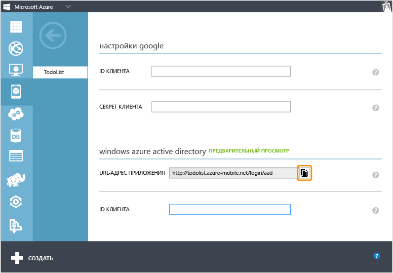
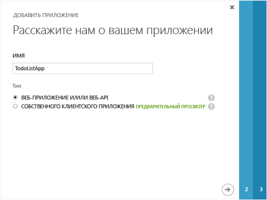
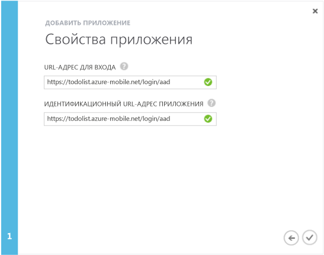
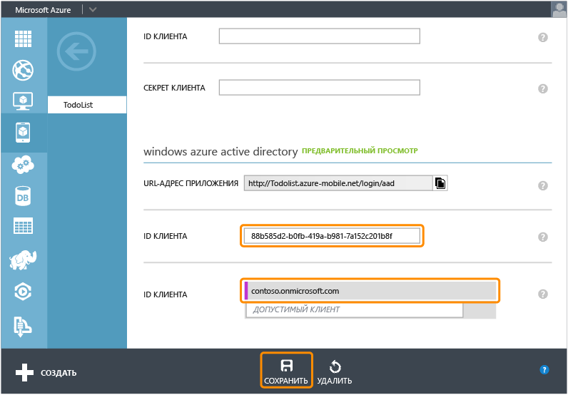

<properties 
	pageTitle="Регистрация для проверки подлинности Azure Active Directory | Microsoft Azure" 
	description="Узнайте, как зарегистрироваться для использования аутентификации Azure Active Directory в приложении мобильных служб." 
	authors="wesmc7777" 
	services="mobile-services" 
	documentationCenter="" 
	manager="dwrede" 
	editor=""/>

<tags 
	ms.service="mobile-services" 
	ms.workload="mobile" 
	ms.tgt_pltfrm="multiple" 
	ms.devlang="multiple" 
	ms.topic="article" 
	ms.date="06/15/2015" 
	ms.author="wesmc"/>

# Регистрация приложений для входа с использованием учетной записи Azure Active Directory

[AZURE.INCLUDE [mobile-services-selector-register-identity-provider](../../includes/mobile-services-selector-register-identity-provider.md)]

##Обзор

В этом разделе показано, как зарегистрировать приложения для использования Azure Active Directory в качестве поставщика проверки подлинности для мобильных служб.

##Регистрация приложения

>[AZURE.NOTE]Описанные в этом разделе действия предназначены для применения с учебником [Добавление проверки подлинности в приложение мобильных служб](../mobile-services-dotnet-backend-windows-store-dotnet-get-started-users.md), если нужно использовать [управляемые службой операции входа](http://msdn.microsoft.com/library/azure/dn283952.aspx) в вашем приложении. А если приложению требуются [управляемые клиентом операции входа](http://msdn.microsoft.com/library/azure/jj710106.aspx) для Azure Active Directory и серверной части .NET, нужно начать с учебника [Проверка подлинности приложения с помощью единого входа библиотеки проверки подлинности Active Directory](mobile-services-windows-store-dotnet-adal-sso-authentication.md).

1. Выполните вход на [портал управления Azure], перейдите к вашей мобильной службы, откройте вкладку **Идентификация**, прокрутите вниз до раздела поставщика удостоверений **Azure Active Directory** и скопируйте **URL-адрес приложения**.

    

2. Перейдите к **Active Directory** на портале управления, выберите каталог, затем щелкните **Домены** и запишите значение домена каталога по умолчанию.

3. Щелкните **Приложения** > **Добавить** > **Добавить приложение, разрабатываемое моей организацией**.

4. В мастере добавления приложения введите **Имя** для приложения и выберите тип **Веб-приложение и/или веб-API**.

    

5. В поле **URL-адрес входа** вставьте URL-адрес приложения, скопированный из мобильной службы. Введите то же уникальное значение в поле **URI идентификатора приложения**, а затем щелкните, чтобы продолжить.
 
    

6. После добавления приложения щелкните вкладку **Настройка** и скопируйте **идентификатор клиента** приложения.

    >[AZURE.NOTE]Для мобильной службы, которая использует серверную часть .NET, также измените **URL-адрес ответа** в разделе **Единый вход** на URL-адрес мобильной службы с добавлением пути _signin-aad_. Например, `https://todolist.azure-mobile.net/signin-aad`

7. Вернитесь на вкладку **Идентификация** вашей мобильной службы и вставьте скопированный **идентификатор клиента** для поставщика удостоверений Azure Active Directory.
 
    

8.  В списке **Разрешенные клиенты** введите домен каталога, в котором зарегистрировано приложение (например, `contoso.onmicrosoft.com`) и нажмите кнопку **Сохранить**.

Теперь вы готовы использовать Azure Active Directory для проверки подлинности в приложении.

<!-- Anchors. -->

<!-- Images. -->

<!-- URLs. -->
[портал управления Azure]: https://manage.windowsazure.com/

 

<!---HONumber=August15_HO7-->